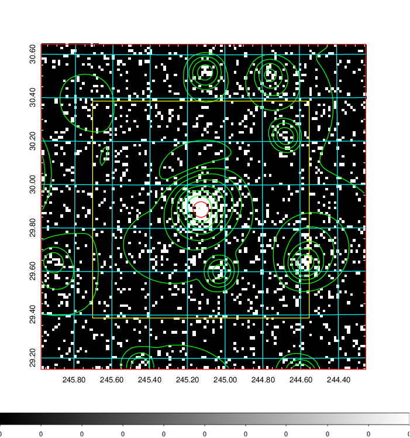
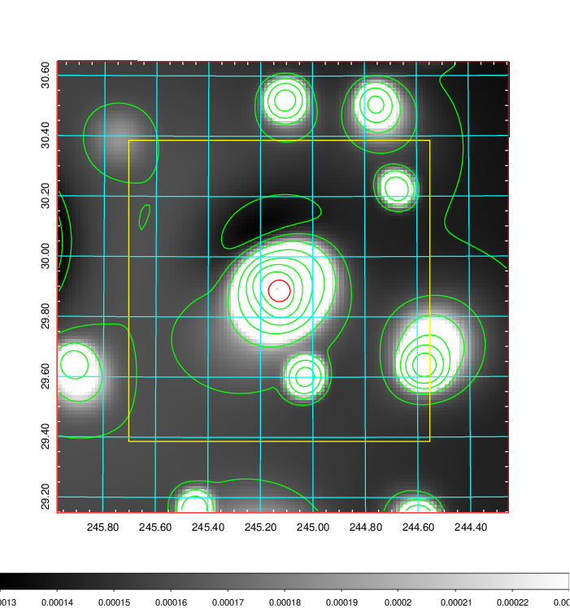
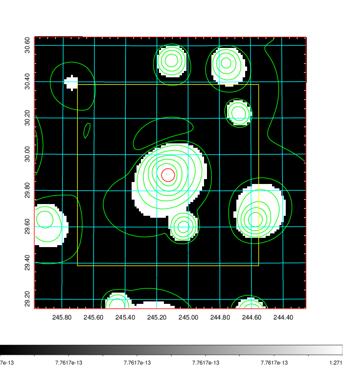
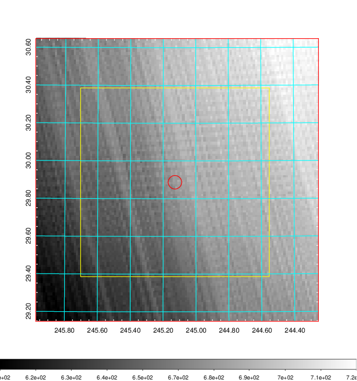
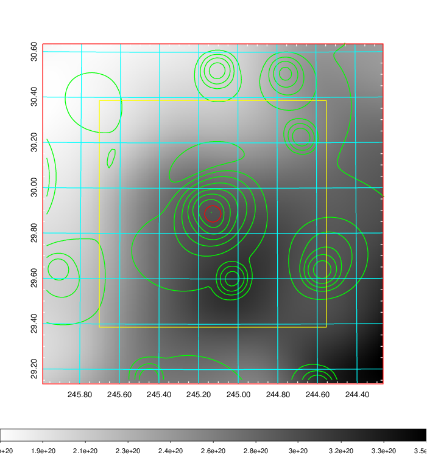
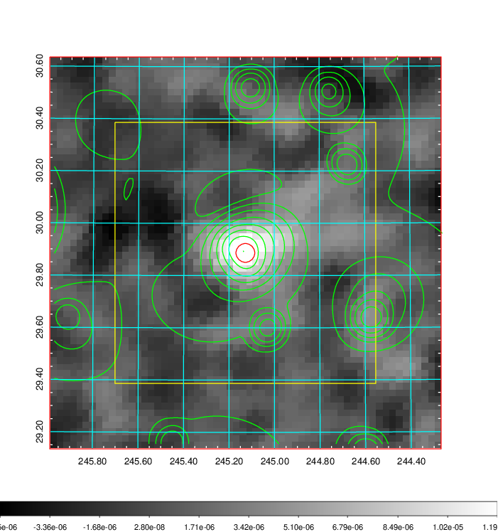
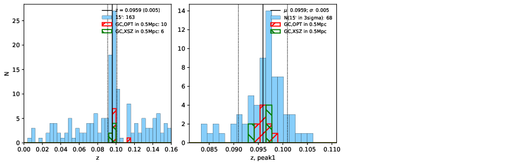
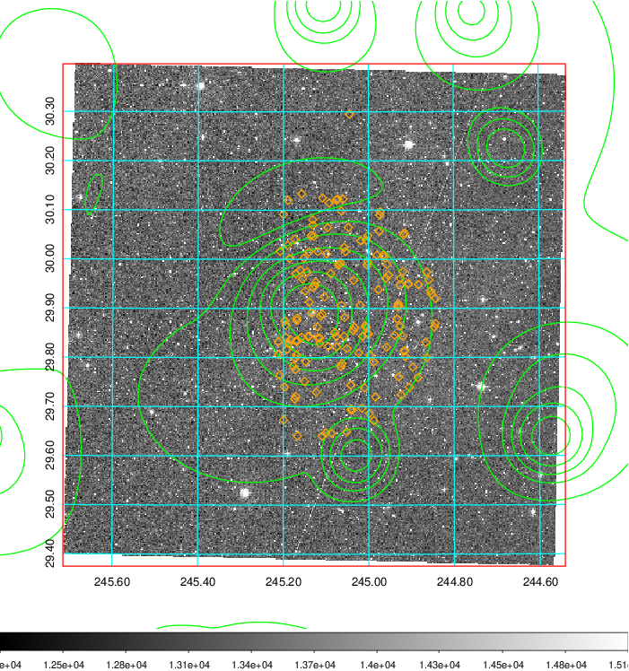
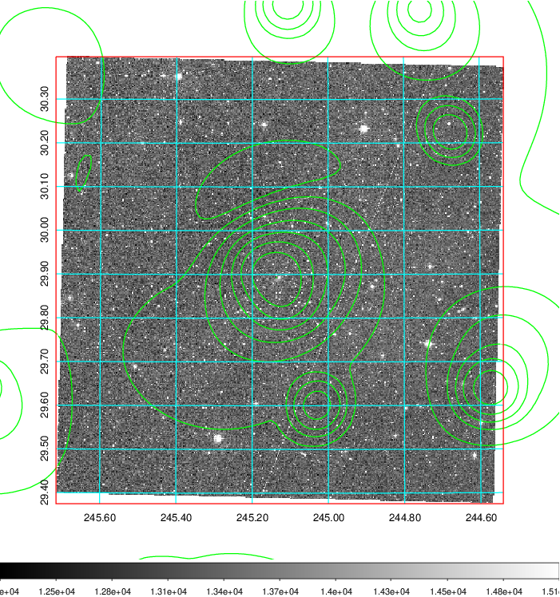
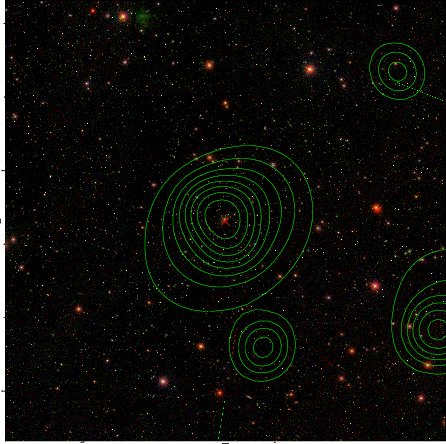

### 646

|Name|RAJ2000[deg]|DEJ2000[deg] |Ext[arcmin]| Ext,ml | z | z_src| C|GC(XSZ,Delta_z<0.01)| GC(OPT,Delta_z<0.01)|GC| R_sig[arcmin] | R500[arcmin] | R500[Mpc]| CRsig[c/s] | CR500[c/s] |L500[1E44 erg/s]|F500[1E-12 erg/s/cm^2]| M500[1E14 Msun]|Tx[keV]|Cnt_sig|Beta|Rc[arcmin]|Comment|Alias|
|---|---|---|---|---|---|------|---|--------|---------|----------|---|---|---|---|---|---|---|---|---|---|---|---|---|---|
|646| 245.128| 29.887| 2.16| 195.05| 0.0941(0.007)| z1, z_xsz| B| F20, MCXC, PSZ2, SPI, Tar, XB| A, N, RM, W| A, F20, MCXC, N, PSZ2, SPI, Tar, W, XB| 15.625| 9.492| 1.016| 0.417(0.034)| 0.392(0.032)| 1.739(0.070)| 7.433(0.299)| 3.27(0.06)| 4.58(0.06)| 265.8| 0.928(-0.081+0.051)| 4.867(-0.509+0.341)| -| k251|

|[RASS image](../image/646/646_img.pdf)|[filtered image](../image/646/646_fil.pdf)|[Segment image](../image/646/646_seg.pdf)|
|-------------------|--------------------|-------------------|
|   |    |   |

|[Exposure image](../image/646/646_mex.pdf)| [nH image](../image/646/646_nh.pdf)| [Planck image](../image/646/646_p.pdf)|
|-------------------|--------------------|-------------------|
|   |     |  |

|[Redshift Histogram](../image/646/646_zg.pdf) | [DSS image(z1)](../image/646/646_dss_z1.pdf)      |  [DSS image(z2)](../image/646/646_dss_z2.pdf)    |
|-------------------|--------------------|-------------------|
| |  Blue circle for optical clusters;  Magenta circle for XSZ clusters;  all with r=1Mpc;  Only GC with Delta_z<0.01 are shown. |  Blue circle for optical clusters;  Magenta circle for XSZ clusters;  all with r=1Mpc;  Only GC with Delta_z<0.01 are shown.  |

|[known Abell/XSZ clusters](../image/646/646_gc.pdf) | [2MASS image](../image/646/646_2mass.pdf)      |[SDSS image](../image/646/646_sdss.pdf)   |
|-------------------|-------------------|-------------------|
|  Magenta, blue and green circles  for optical, X-ray and SZ clusters  respectively, with redshift of clusters  labelled. The radius of circles  are 1Mpc.|  |   |

