

### 647

|Name|RAJ2000[deg]|DEJ2000[deg] |Ext[arcmin]| Ext,ml | z | z_src| C|GC(XSZ,Delta_z<0.01)| GC(OPT,Delta_z<0.01)|GC| R_sig[arcmin] | R500[arcmin] | R500[Mpc]| CRsig[c/s] | CR500[c/s] |L500[1E44 erg/s]|F500[1E-12 erg/s/cm^2]| M500[1E14 Msun]|Tx[keV]|Cnt_sig|Beta|Rc[arcmin]|Comment|Alias|
|---|---|---|---|---|---|------|---|--------|---------|----------|---|---|---|---|---|---|---|---|---|---|---|---|---|---|
|647| 245.189| 43.154| 12.33| 25.05| 0.1351(0.005)| z1, z_opt| S| -| C, W| C, F20, N, W| 46.045| 8.935| 1.284| 0.752(0.089)| 0.663(0.079)| 6.675(3.048)| 13.779(6.292)| 6.86(1.49)| 7.33(1.02)| 877.9| 0.501(-0.001+0.002)| 12.307(-0.169+0.861)| -| t498|

|[RASS image](../image/647/647_img.pdf)|[filtered image](../image/647/647_fil.pdf)|[Segment image](../image/647/647_seg.pdf)|
|-------------------|--------------------|-------------------|
| 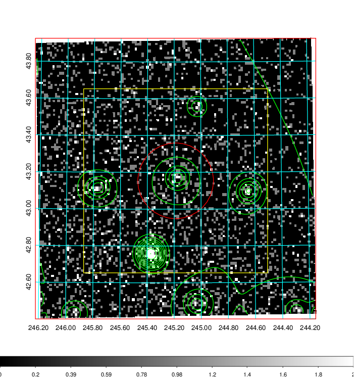  | 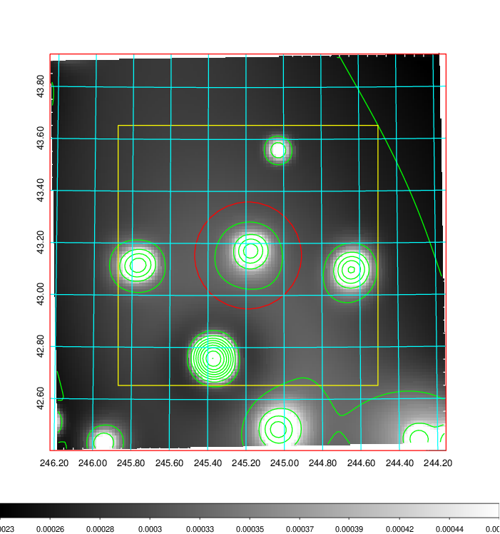   | 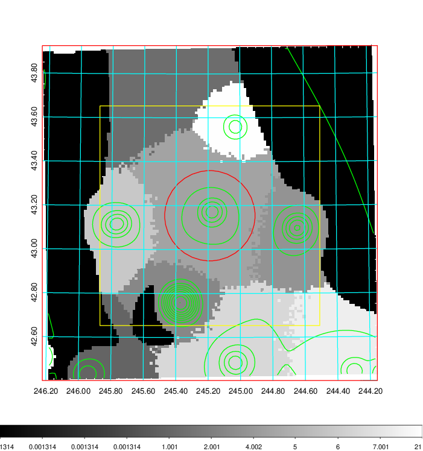  |

|[Exposure image](../image/647/647_mex.pdf)| [nH image](../image/647/647_nh.pdf)| [Planck image](../image/647/647_p.pdf)|
|-------------------|--------------------|-------------------|
|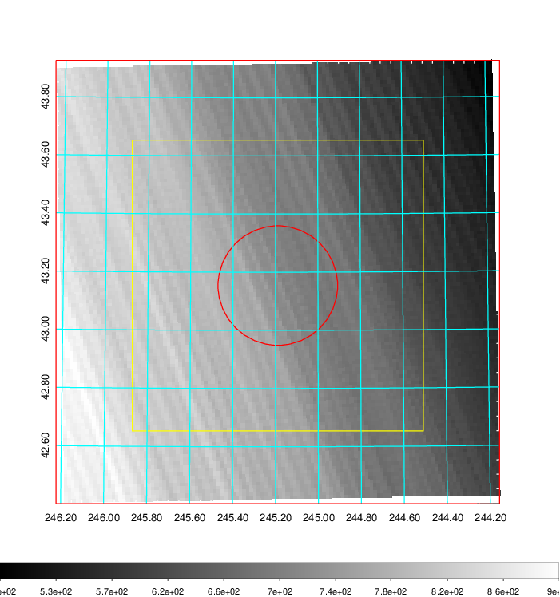   | 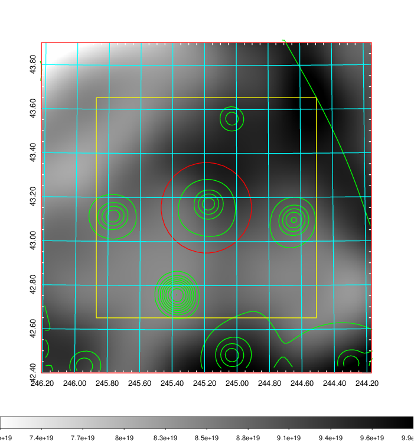    | 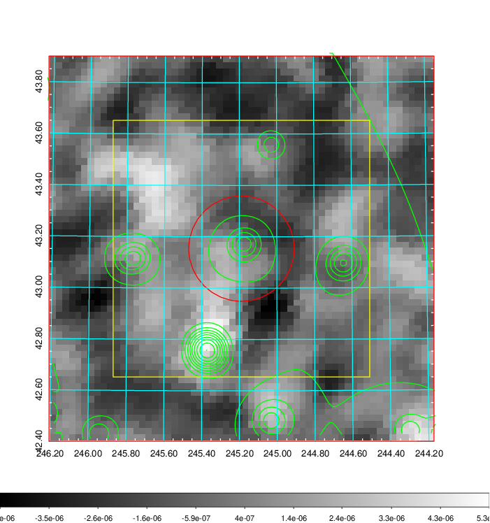 |

|[Redshift Histogram](../image/647/647_zg.pdf) | [DSS image(z1)](../image/647/647_dss_z1.pdf)      |  [DSS image(z2)](../image/647/647_dss_z2.pdf)    |
|-------------------|--------------------|-------------------|
|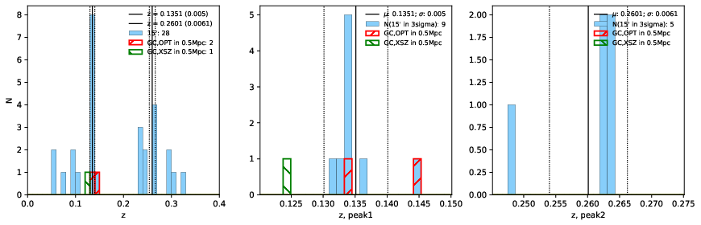 |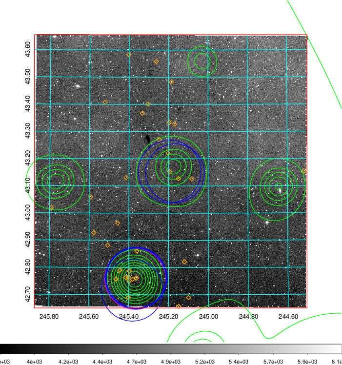  Blue circle for optical clusters;  Magenta circle for XSZ clusters;  all with r=1Mpc;  Only GC with Delta_z<0.01 are shown. | 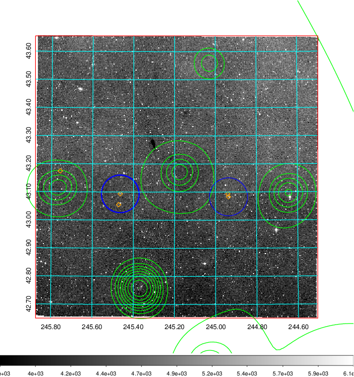 Blue circle for optical clusters;  Magenta circle for XSZ clusters;  all with r=1Mpc;  Only GC with Delta_z<0.01 are shown.  |

|[Previous-identified clusters](../image/647/647_gc.pdf) | [2MASS image](../image/647/647_2mass.pdf)      |[SDSS image](../image/647/647_sdss.pdf)   |
|-------------------|-------------------|-------------------|
|  Green, magenta, and blue circles  for optical, X-ray and SZ clusters  respectively, with redshift of clusters  labelled. The radius of circles  are 1Mpc.|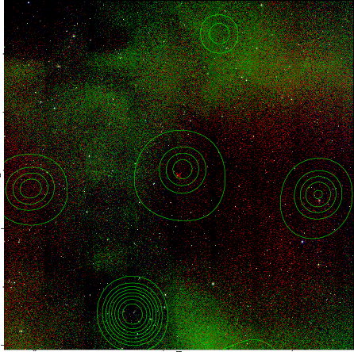  | 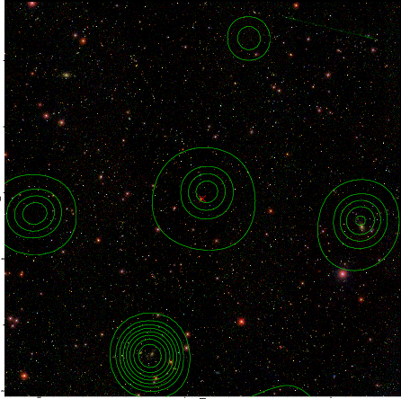  |

