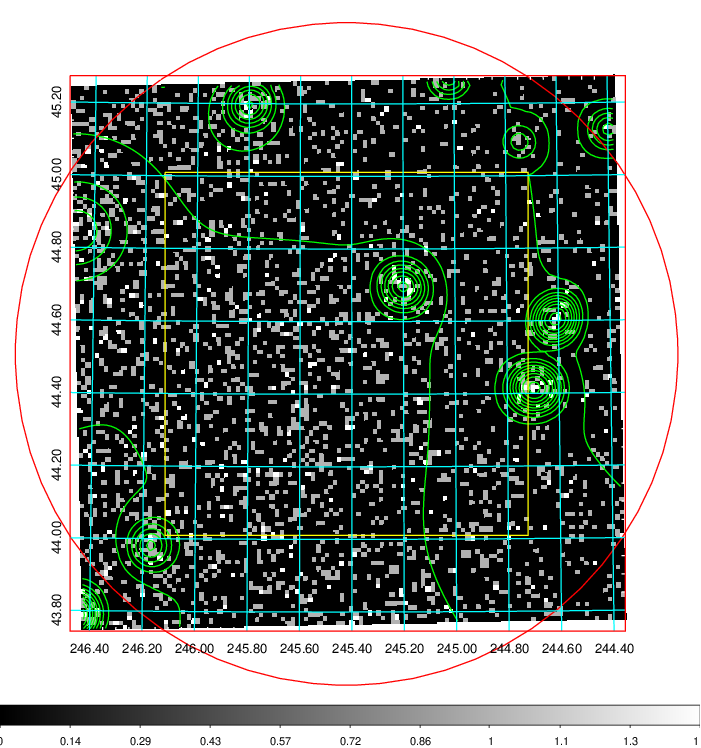
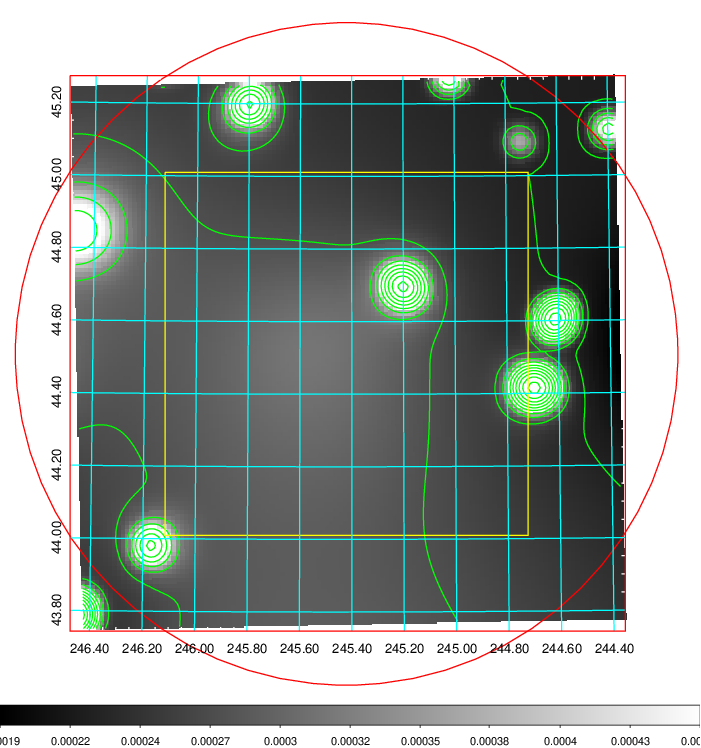
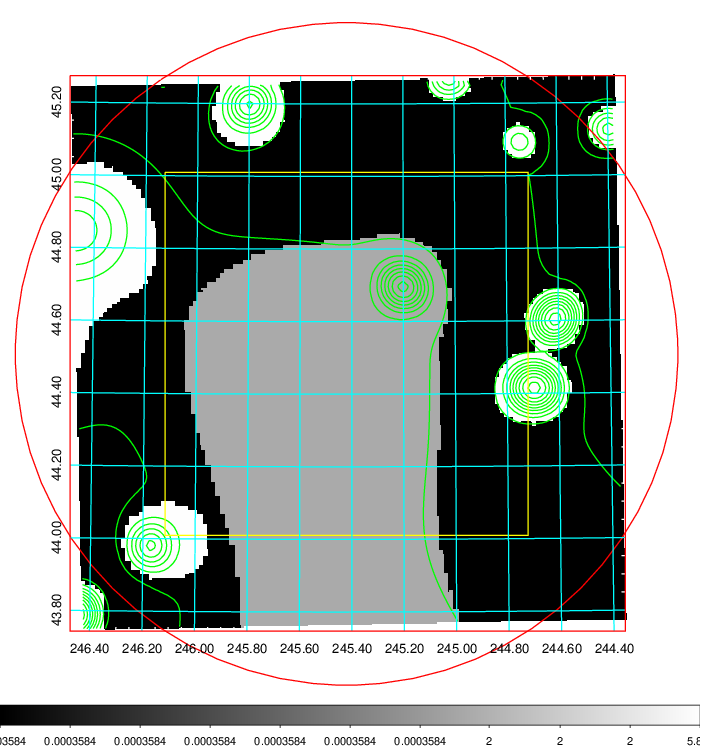
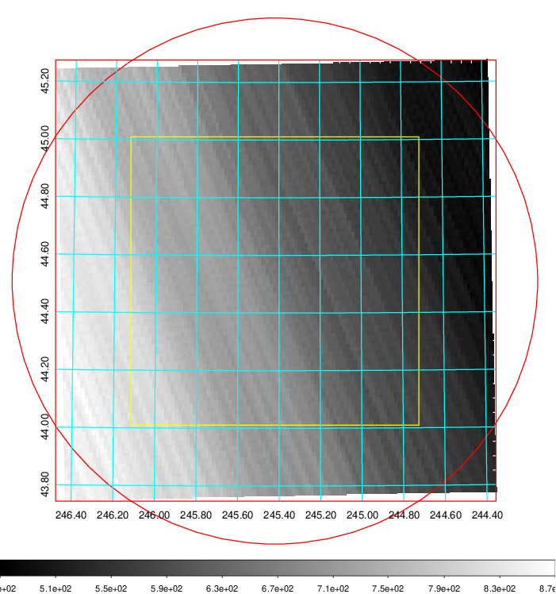
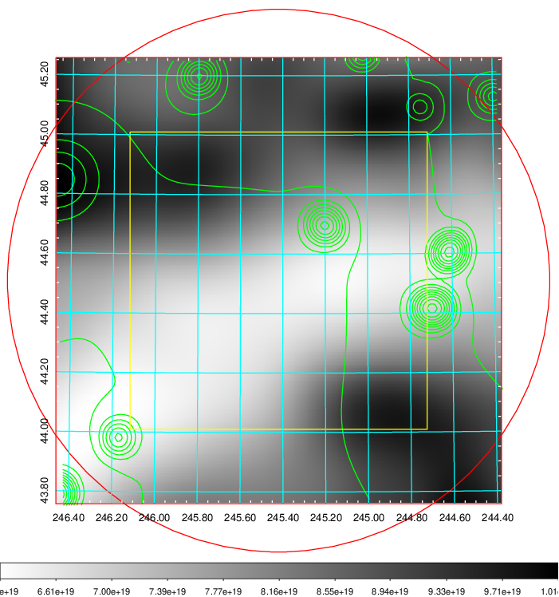
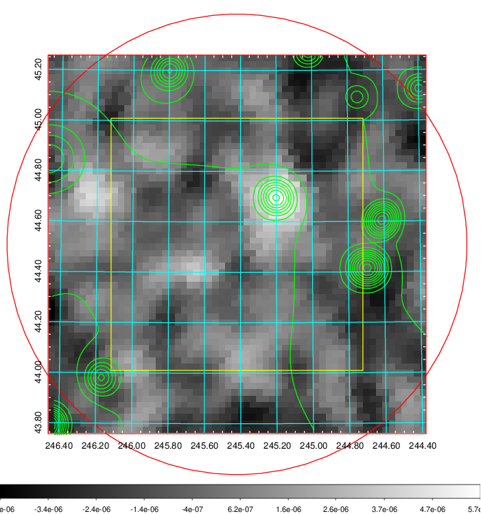
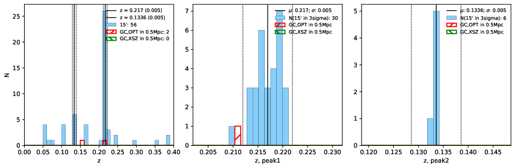
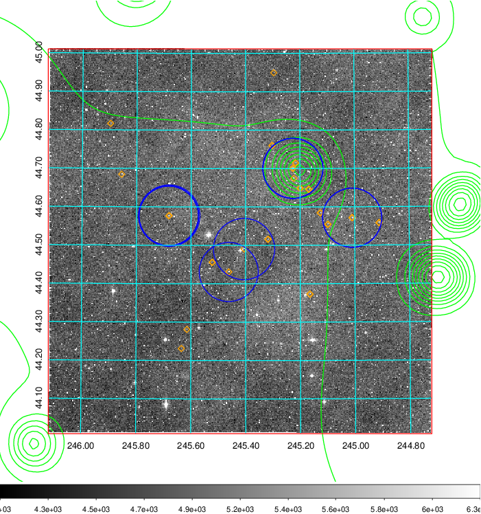
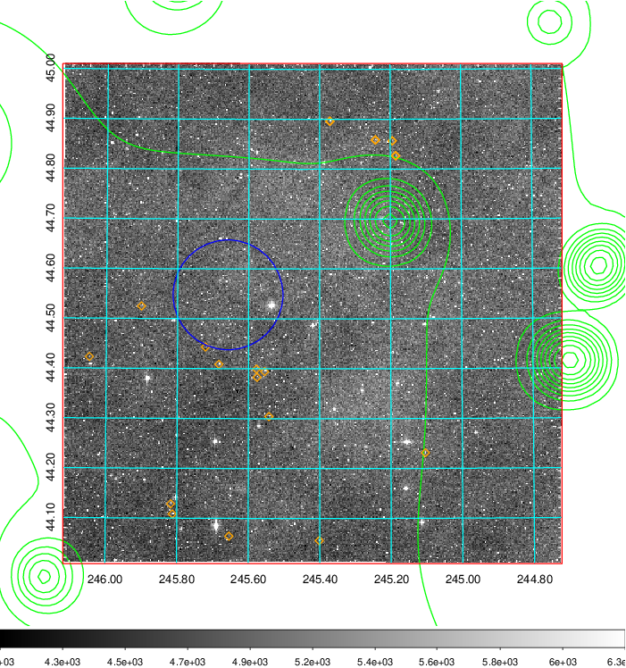
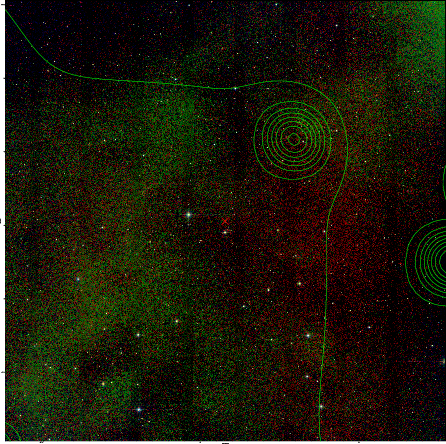

### 648

|Name|RAJ2000[deg]|DEJ2000[deg] |Ext[arcmin]| Ext,ml | z | z_src| C|GC(XSZ,Delta_z<0.01)| GC(OPT,Delta_z<0.01)|GC| R_sig[arcmin] | R500[arcmin] | R500[Mpc]| CRsig[c/s] | CR500[c/s] |L500[1E44 erg/s]|F500[1E-12 erg/s/cm^2]| M500[1E14 Msun]|Tx[keV]|Cnt_sig|Beta|Rc[arcmin]|Comment|Alias|
|---|---|---|---|---|---|------|---|--------|---------|----------|---|---|---|---|---|---|---|---|---|---|---|---|---|---|
|648| 245.420| 44.511| 54.76| 173.31| 0.2170(0.005)| z1, z_opt| S| -| N| C, F20, N, SPI, W| 29.144| 5.372| 1.133| 0.185(0.059)| 0.163(0.052)| 4.771(15.597)| 3.458(11.304)| 5.14(7.95)| 6.31(6.24)| 239.4| 0.504(-0.004+0.008)| 5.267(-0.215+0.412)| -| t703|

|[RASS image](../image/648/648_img.pdf)|[filtered image](../image/648/648_fil.pdf)|[Segment image](../image/648/648_seg.pdf)|
|-------------------|--------------------|-------------------|
|   |    |   |

|[Exposure image](../image/648/648_mex.pdf)| [nH image](../image/648/648_nh.pdf)| [Planck image](../image/648/648_p.pdf)|
|-------------------|--------------------|-------------------|
|   |     |  |

|[Redshift Histogram](../image/648/648_zg.pdf) | [DSS image(z1)](../image/648/648_dss_z1.pdf)      |  [DSS image(z2)](../image/648/648_dss_z2.pdf)    |
|-------------------|--------------------|-------------------|
| |  Blue circle for optical clusters;  Magenta circle for XSZ clusters;  all with r=1Mpc;  Only GC with Delta_z<0.01 are shown. |  Blue circle for optical clusters;  Magenta circle for XSZ clusters;  all with r=1Mpc;  Only GC with Delta_z<0.01 are shown.  |

|[known Abell/XSZ clusters](../image/648/648_gc.pdf) | [2MASS image](../image/648/648_2mass.pdf)      |
|-------------------|-------------------|
|  Magenta, blue and green circles  for optical, X-ray and SZ clusters  respectively, with redshift of clusters  labelled. The radius of circles  are 1Mpc.|  |

|[PS1 image](../image/648/648_ps1.pdf)            |
|-------------------|
|   |
