

### 649

|Name|RAJ2000[deg]|DEJ2000[deg] |Ext[arcmin]| Ext,ml | z | z_src| C|GC(XSZ,Delta_z<0.01)| GC(OPT,Delta_z<0.01)|GC| R_sig[arcmin] | R500[arcmin] | R500[Mpc]| CRsig[c/s] | CR500[c/s] |L500[1E44 erg/s]|F500[1E-12 erg/s/cm^2]| M500[1E14 Msun]|Tx[keV]|Cnt_sig|Beta|Rc[arcmin]|Comment|Alias|
|---|---|---|---|---|---|------|---|--------|---------|----------|---|---|---|---|---|---|---|---|---|---|---|---|---|---|
|649| 245.779| 37.959| 3.51| 55.04| 0.0312(0.005)| z1, z_opt| S| -| N| F20, N, SPI, W| 25.194| 15.390| 0.576| 0.267(0.045)| 0.250(0.042)| 0.095(0.016)| 4.259(0.720)| 0.56(0.05)| 1.51(0.08)| 245.1| 0.611(-0.048+0.063)| 6.041(-0.922+1.123)| -| t165|

|[RASS image](../image/649/649_img.pdf)|[filtered image](../image/649/649_fil.pdf)|[Segment image](../image/649/649_seg.pdf)|
|-------------------|--------------------|-------------------|
| 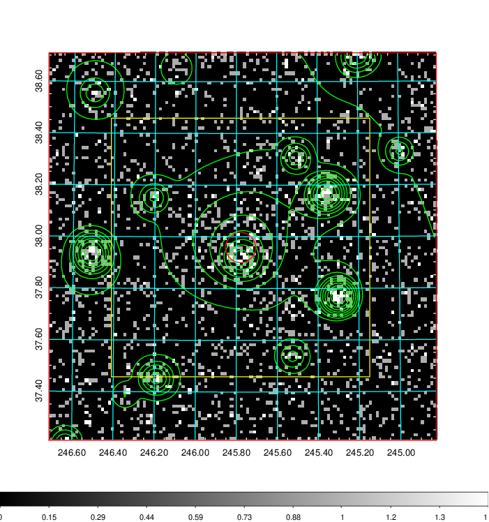  | 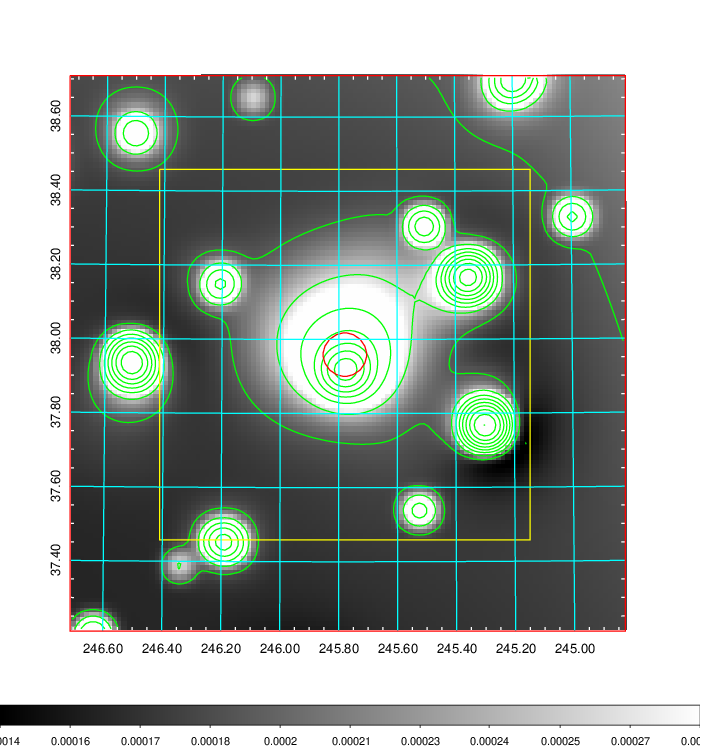   | 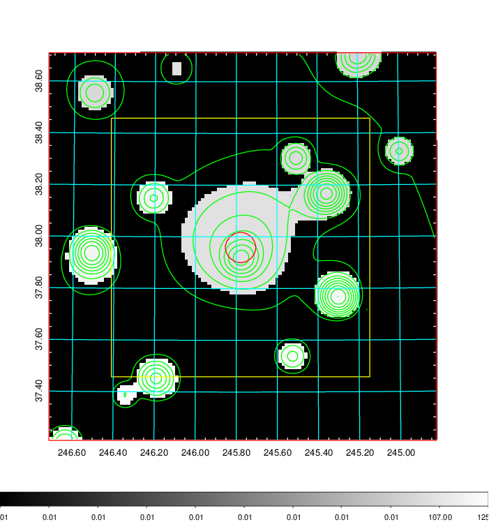  |

|[Exposure image](../image/649/649_mex.pdf)| [nH image](../image/649/649_nh.pdf)| [Planck image](../image/649/649_p.pdf)|
|-------------------|--------------------|-------------------|
|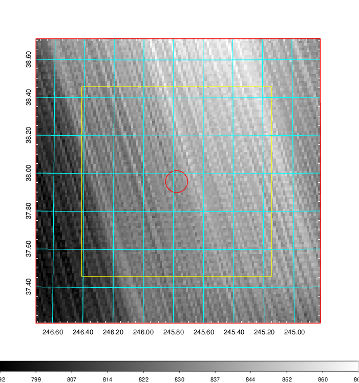   | 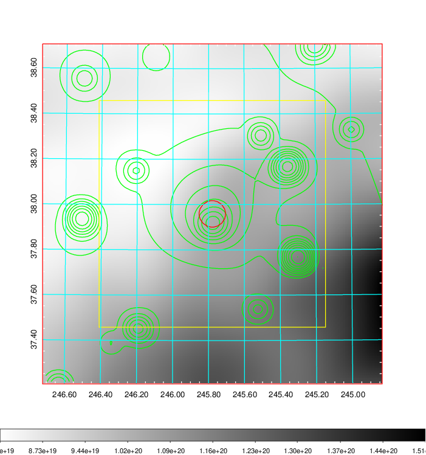    | 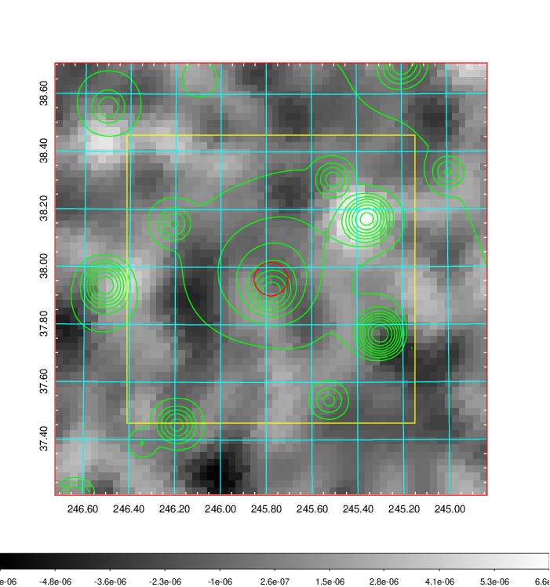 |

|[Redshift Histogram](../image/649/649_zg.pdf) | [DSS image(z1)](../image/649/649_dss_z1.pdf)      |  [DSS image(z2)](../image/649/649_dss_z2.pdf)    |
|-------------------|--------------------|-------------------|
|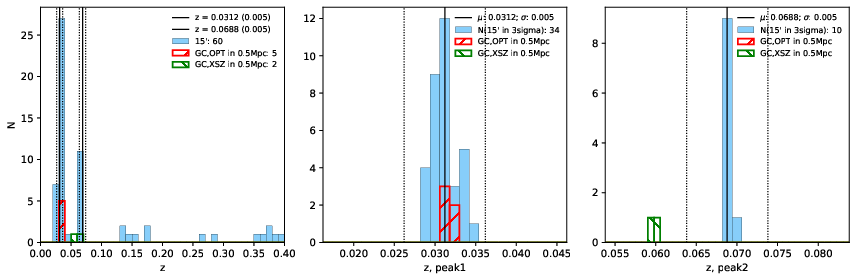 |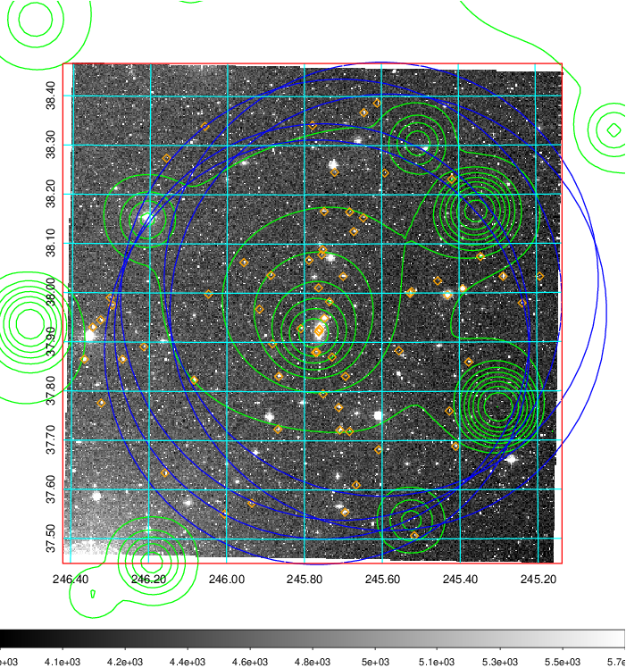  Blue circle for optical clusters;  Magenta circle for XSZ clusters;  all with r=1Mpc;  Only GC with Delta_z<0.01 are shown. | 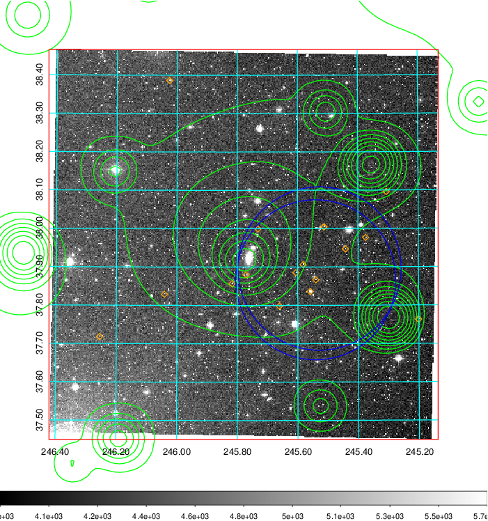 Blue circle for optical clusters;  Magenta circle for XSZ clusters;  all with r=1Mpc;  Only GC with Delta_z<0.01 are shown.  |

|[Previous-identified clusters](../image/649/649_gc.pdf) | [2MASS image](../image/649/649_2mass.pdf)      |[SDSS image](../image/649/649_sdss.pdf)   |
|-------------------|-------------------|-------------------|
|  Green, magenta, and blue circles  for optical, X-ray and SZ clusters  respectively, with redshift of clusters  labelled. The radius of circles  are 1Mpc.|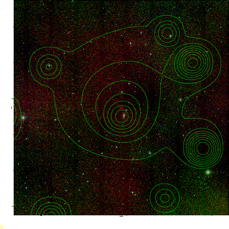  | 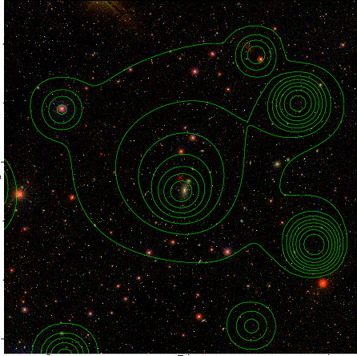  |

