

### 650

|Name|RAJ2000[deg]|DEJ2000[deg] |Ext[arcmin]| Ext,ml | z | z_src| C|GC(XSZ,Delta_z<0.01)| GC(OPT,Delta_z<0.01)|GC| R_sig[arcmin] | R500[arcmin] | R500[Mpc]| CRsig[c/s] | CR500[c/s] |L500[1E44 erg/s]|F500[1E-12 erg/s/cm^2]| M500[1E14 Msun]|Tx[keV]|Cnt_sig|Beta|Rc[arcmin]|Comment|Alias|
|---|---|---|---|---|---|------|---|--------|---------|----------|---|---|---|---|---|---|---|---|---|---|---|---|---|---|
|650| 246.052| 41.238| 1.35| 47.98| 0.1825(0.005)| z1, z_xsz| B| F20, MCXC, PSZ2, SPI, Tar| A, N, RM, W| A, C, F20, MCXC, N, PSZ2, SPI, Tar, W| 5.875| 5.673| 1.045| 0.148(0.020)| 0.147(0.020)| 2.899(0.206)| 3.093(0.220)| 3.88(0.13)| 5.24(0.11)| 132.0| 0.912(-0.104+0.063)| 3.194(-0.474+0.355)| -| k083|

|[RASS image](../image/650/650_img.pdf)|[filtered image](../image/650/650_fil.pdf)|[Segment image](../image/650/650_seg.pdf)|
|-------------------|--------------------|-------------------|
| 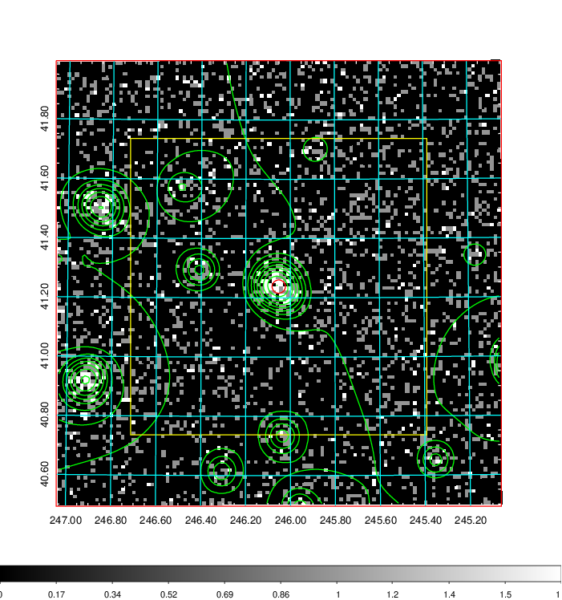  | 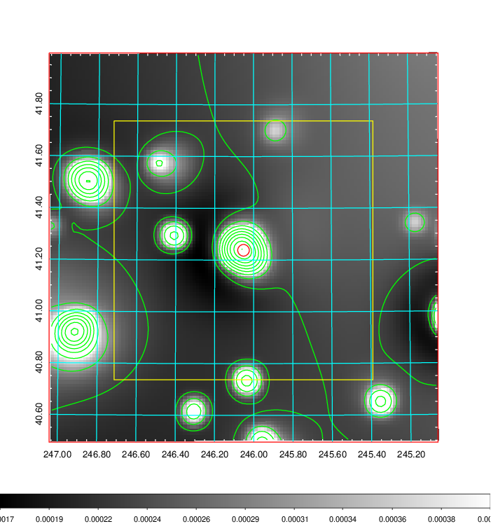   | 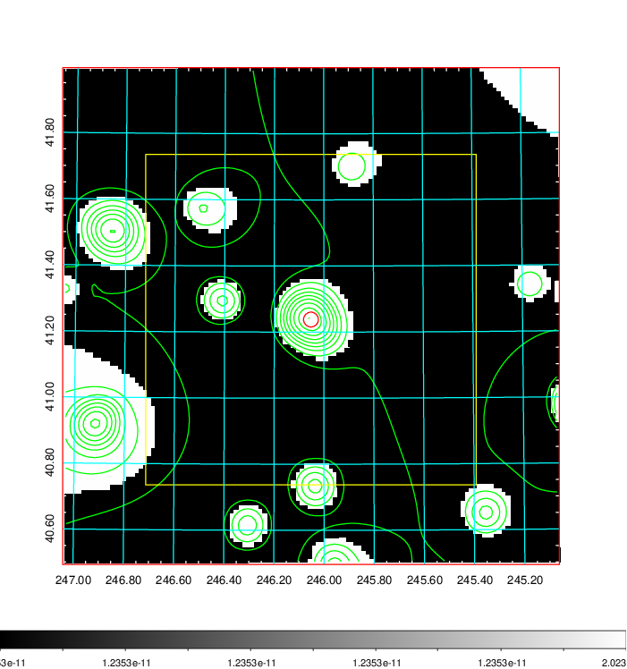  |

|[Exposure image](../image/650/650_mex.pdf)| [nH image](../image/650/650_nh.pdf)| [Planck image](../image/650/650_p.pdf)|
|-------------------|--------------------|-------------------|
|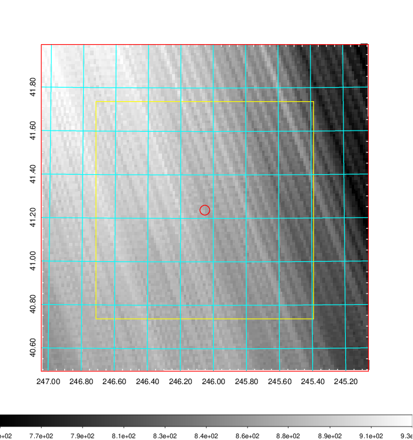   | 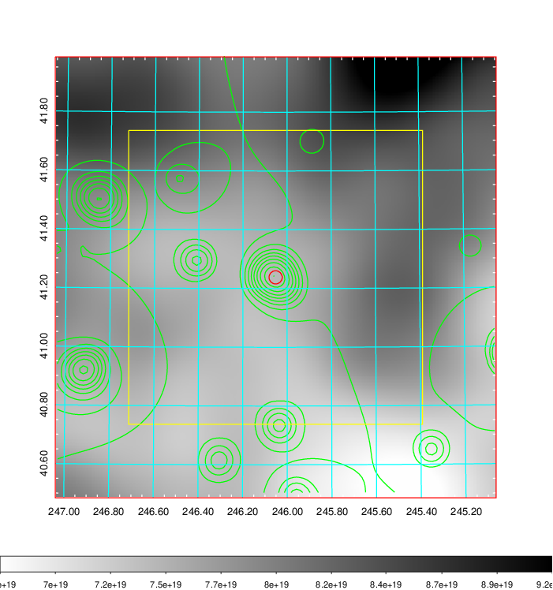    | 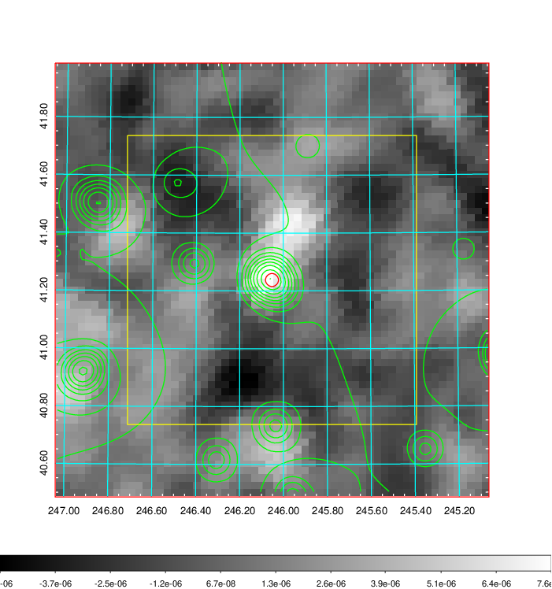 |

|[Redshift Histogram](../image/650/650_zg.pdf) | [DSS image(z1)](../image/650/650_dss_z1.pdf)      |  [DSS image(z2)](../image/650/650_dss_z2.pdf)    |
|-------------------|--------------------|-------------------|
|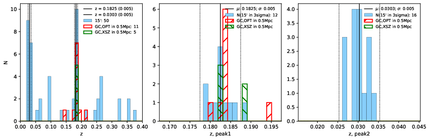 |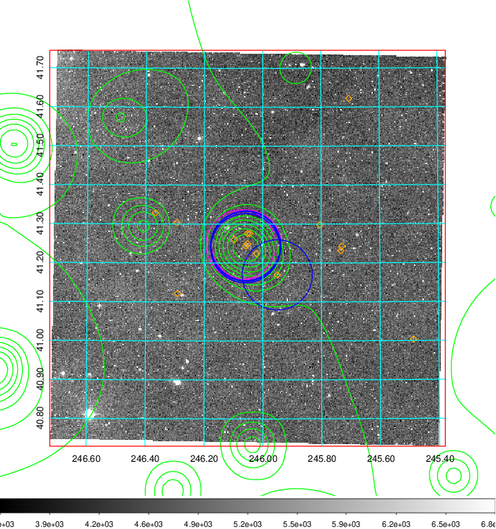  Blue circle for optical clusters;  Magenta circle for XSZ clusters;  all with r=1Mpc;  Only GC with Delta_z<0.01 are shown. | 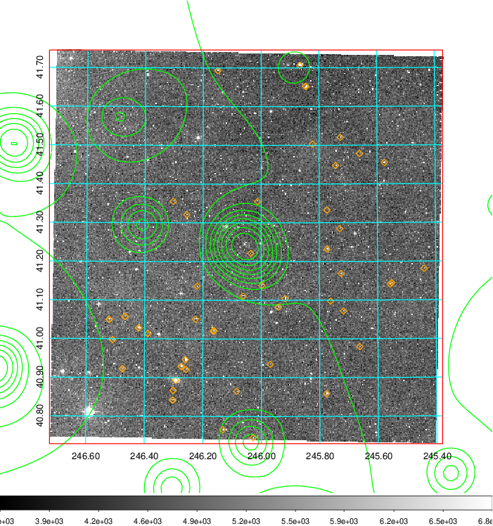 Blue circle for optical clusters;  Magenta circle for XSZ clusters;  all with r=1Mpc;  Only GC with Delta_z<0.01 are shown.  |

|[Previous-identified clusters](../image/650/650_gc.pdf) | [2MASS image](../image/650/650_2mass.pdf)      |[SDSS image](../image/650/650_sdss.pdf)   |
|-------------------|-------------------|-------------------|
|  Green, magenta, and blue circles  for optical, X-ray and SZ clusters  respectively, with redshift of clusters  labelled. The radius of circles  are 1Mpc.|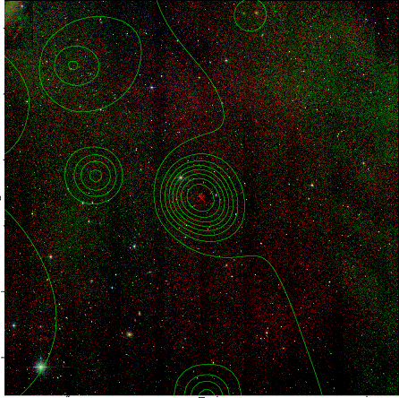  | 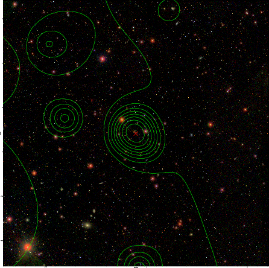  |

