

### 651

|Name|RAJ2000[deg]|DEJ2000[deg] |Ext[arcmin]| Ext,ml | z | z_src| C|GC(XSZ,Delta_z<0.01)| GC(OPT,Delta_z<0.01)|GC| R_sig[arcmin] | R500[arcmin] | R500[Mpc]| CRsig[c/s] | CR500[c/s] |L500[1E44 erg/s]|F500[1E-12 erg/s/cm^2]| M500[1E14 Msun]|Tx[keV]|Cnt_sig|Beta|Rc[arcmin]|Comment|Alias|
|---|---|---|---|---|---|------|---|--------|---------|----------|---|---|---|---|---|---|---|---|---|---|---|---|---|---|
|651| 246.746| 55.482| 1.87| 59.80| 0.1306(0.006)| z1, z_xsz| B| F20, MCXC, PSZ2, SPI, Tar| A, N, RM, W| A, C, F20, MCXC, N, PSZ2, SPI, SWXCS, Tar, W| 13.188| 7.037| 0.982| 0.211(0.025)| 0.196(0.023)| 1.802(0.154)| 4.004(0.342)| 3.06(0.13)| 4.45(0.12)| 267.3| 0.537(-0.027+0.050)| 2.085(-0.346+0.546)| -| k188|

|[RASS image](../image/651/651_img.pdf)|[filtered image](../image/651/651_fil.pdf)|[Segment image](../image/651/651_seg.pdf)|
|-------------------|--------------------|-------------------|
| 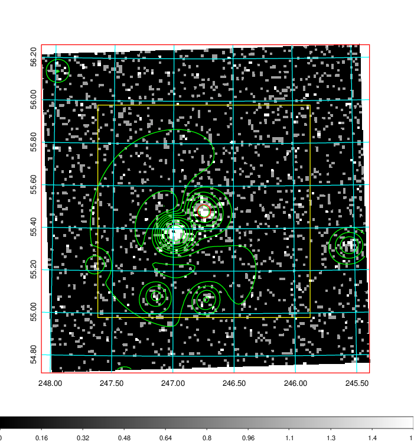  | 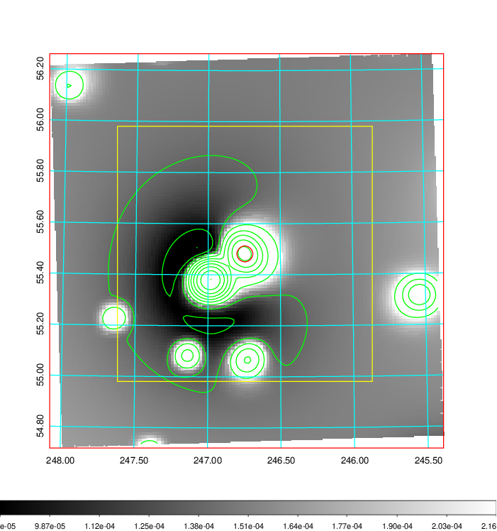   | 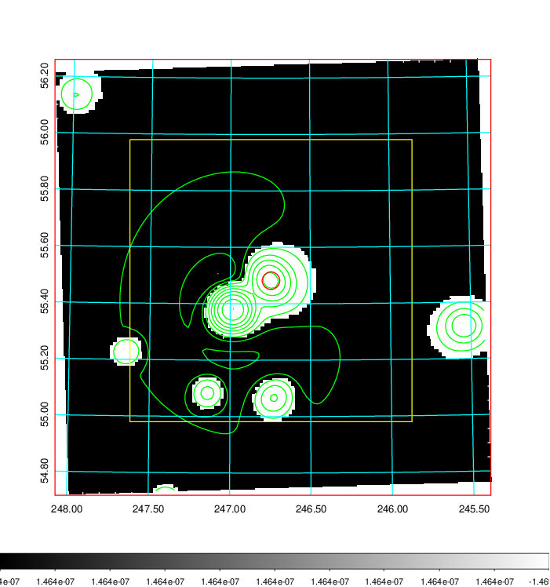  |

|[Exposure image](../image/651/651_mex.pdf)| [nH image](../image/651/651_nh.pdf)| [Planck image](../image/651/651_p.pdf)|
|-------------------|--------------------|-------------------|
|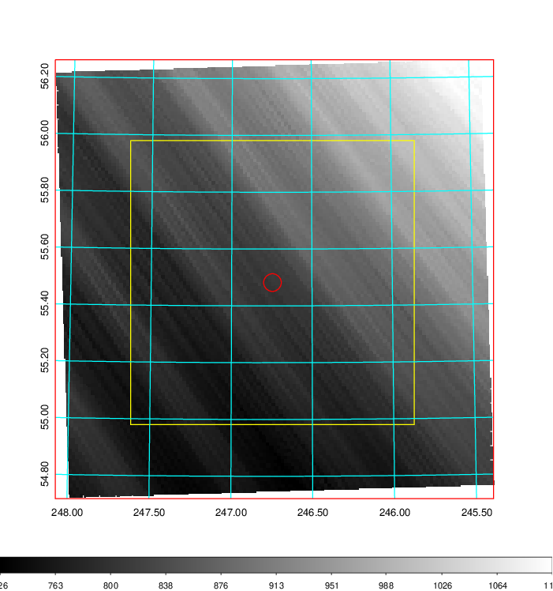   | 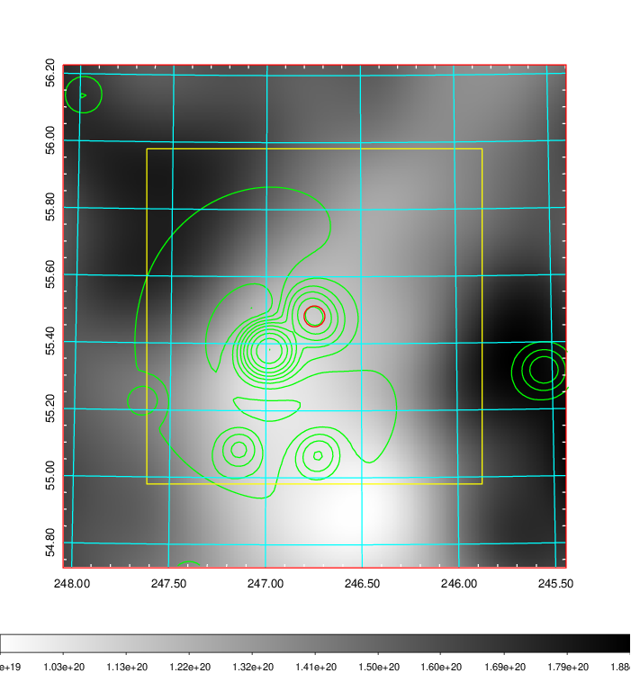    | 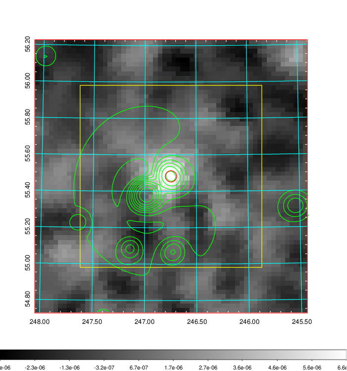 |

|[Redshift Histogram](../image/651/651_zg.pdf) | [DSS image(z1)](../image/651/651_dss_z1.pdf)      |  [DSS image(z2)](../image/651/651_dss_z2.pdf)    |
|-------------------|--------------------|-------------------|
|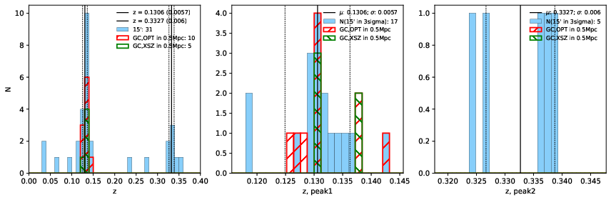 |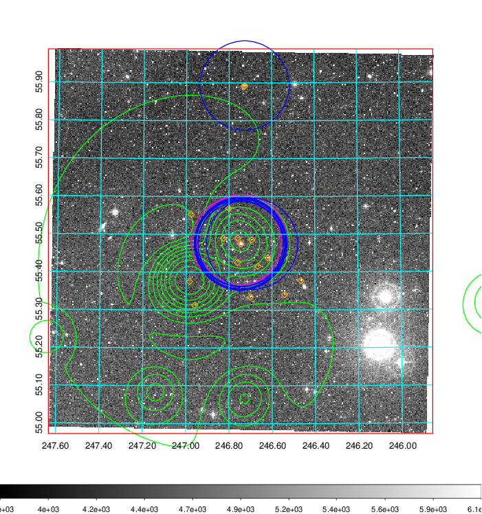  Blue circle for optical clusters;  Magenta circle for XSZ clusters;  all with r=1Mpc;  Only GC with Delta_z<0.01 are shown. | 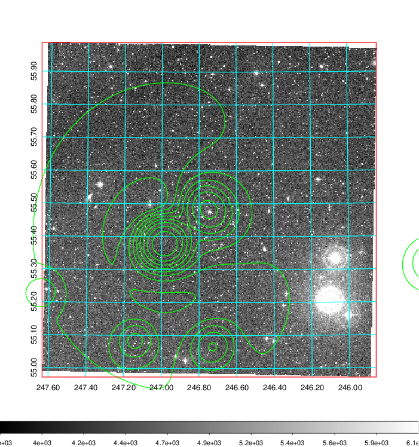 Blue circle for optical clusters;  Magenta circle for XSZ clusters;  all with r=1Mpc;  Only GC with Delta_z<0.01 are shown.  |

|[Previous-identified clusters](../image/651/651_gc.pdf) | [2MASS image](../image/651/651_2mass.pdf)      |[SDSS image](../image/651/651_sdss.pdf)   |
|-------------------|-------------------|-------------------|
|  Green, magenta, and blue circles  for optical, X-ray and SZ clusters  respectively, with redshift of clusters  labelled. The radius of circles  are 1Mpc.|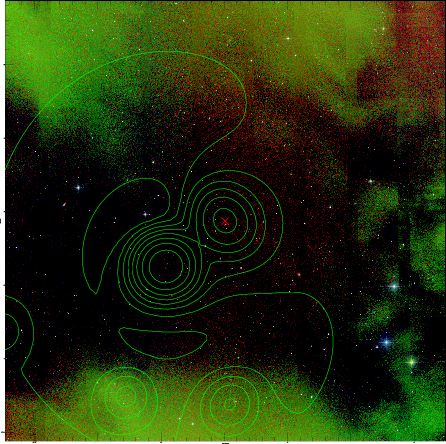  | 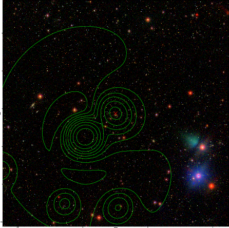  |

