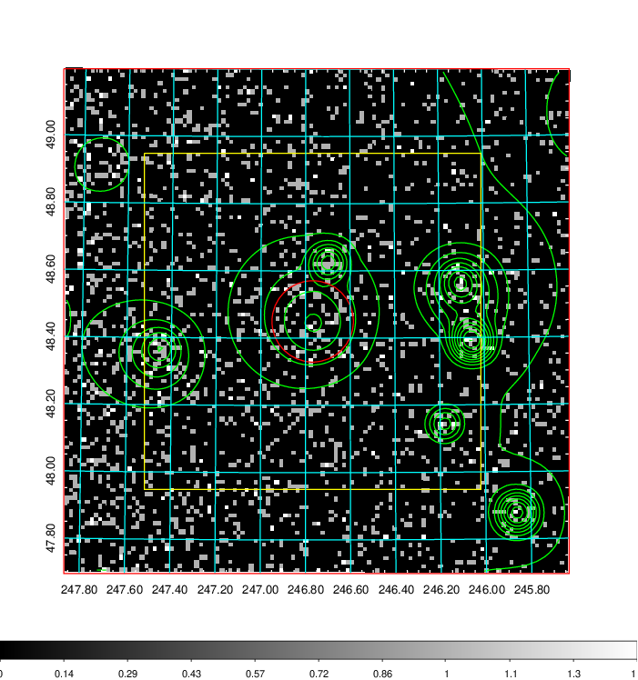
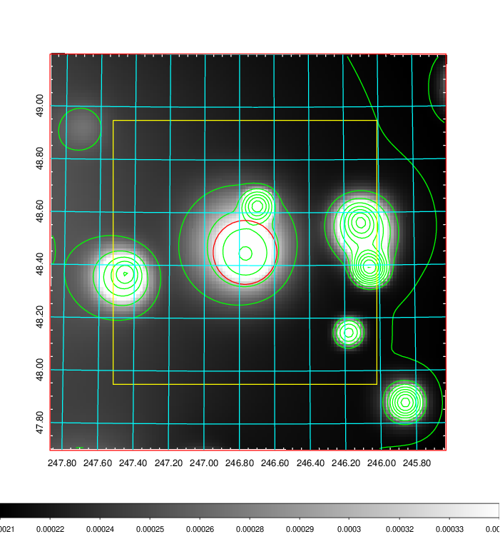
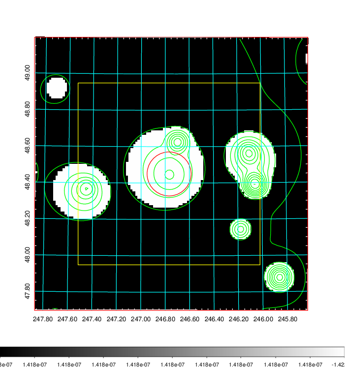
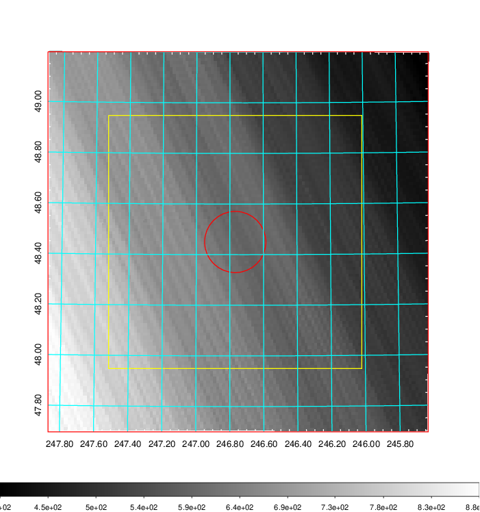
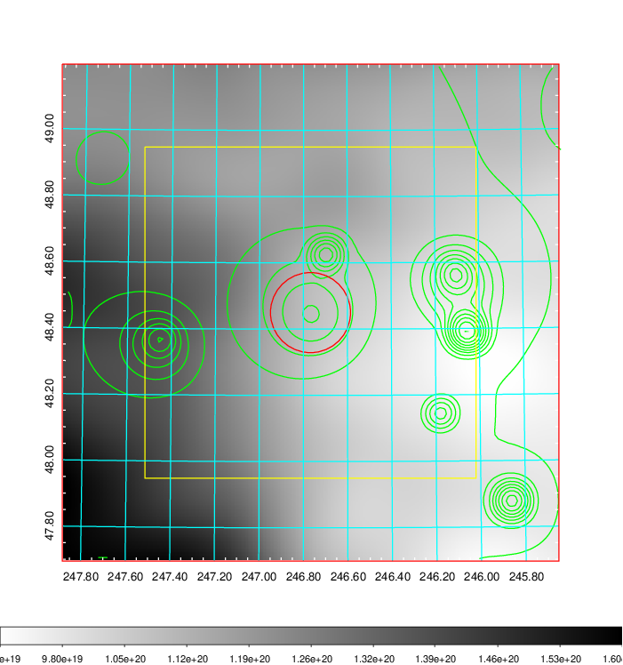
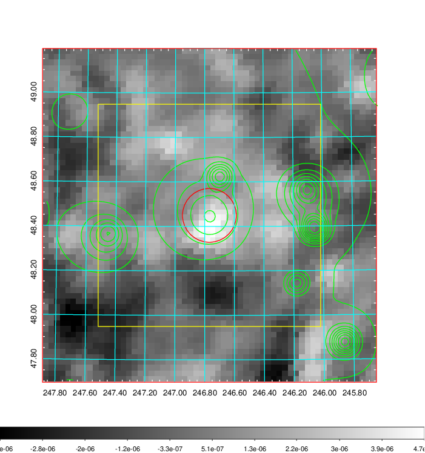
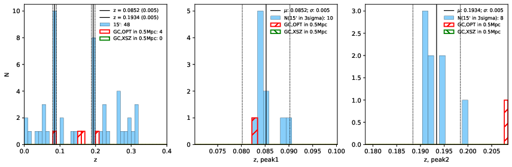
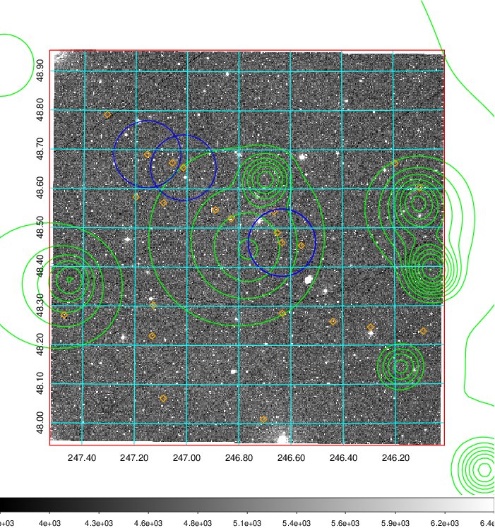
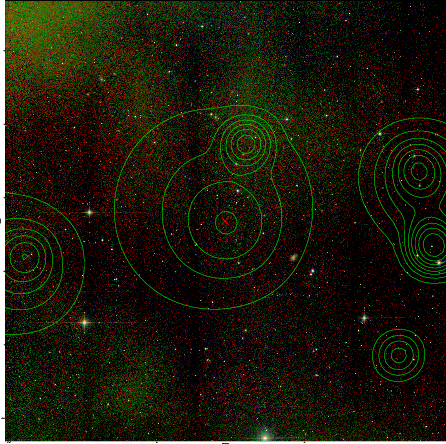
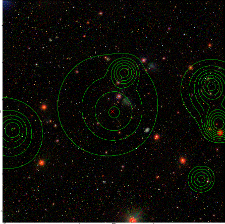

### 652

|Name|RAJ2000[deg]|DEJ2000[deg] |Ext[arcmin]| Ext,ml | z | z_src| C|GC(XSZ,Delta_z<0.01)| GC(OPT,Delta_z<0.01)|GC| R_sig[arcmin] | R500[arcmin] | R500[Mpc]| CRsig[c/s] | CR500[c/s] |L500[1E44 erg/s]|F500[1E-12 erg/s/cm^2]| M500[1E14 Msun]|Tx[keV]|Cnt_sig|Beta|Rc[arcmin]|Comment|Alias|
|---|---|---|---|---|---|------|---|--------|---------|----------|---|---|---|---|---|---|---|---|---|---|---|---|---|---|
|652| 246.768| 48.450| 7.26| 29.39| 0.0852(0.005)| z1, z_opt| S| -| N| A, C, F20, N, SPI, W| 7.338| 6.803| 0.652| 0.064(0.027)| 0.063(0.027)| 0.209(0.068)| 1.157(0.378)| 0.86(0.14)| 2.00(0.21)| 38.1| 0.875(-0.144+0.089)| 7.077(-1.258+0.963)| -| t365|

|[RASS image](../image/652/652_img.pdf)|[filtered image](../image/652/652_fil.pdf)|[Segment image](../image/652/652_seg.pdf)|
|-------------------|--------------------|-------------------|
|   |    |   |

|[Exposure image](../image/652/652_mex.pdf)| [nH image](../image/652/652_nh.pdf)| [Planck image](../image/652/652_p.pdf)|
|-------------------|--------------------|-------------------|
|   |     |  |

|[Redshift Histogram](../image/652/652_zg.pdf) | [DSS image(z1)](../image/652/652_dss_z1.pdf)      |  [DSS image(z2)](../image/652/652_dss_z2.pdf)    |
|-------------------|--------------------|-------------------|
| |  Blue circle for optical clusters;  Magenta circle for XSZ clusters;  all with r=1Mpc;  Only GC with Delta_z<0.01 are shown. |  Blue circle for optical clusters;  Magenta circle for XSZ clusters;  all with r=1Mpc;  Only GC with Delta_z<0.01 are shown.  |

|[Previous-identified clusters](../image/652/652_gc.pdf) | [2MASS image](../image/652/652_2mass.pdf)      |[SDSS image](../image/652/652_sdss.pdf)   |
|-------------------|-------------------|-------------------|
|  Green, magenta, and blue circles  for optical, X-ray and SZ clusters  respectively, with redshift of clusters  labelled. The radius of circles  are 1Mpc.|  |   |

