

### 654

|Name|RAJ2000[deg]|DEJ2000[deg] |Ext[arcmin]| Ext,ml | z | z_src| C|GC(XSZ,Delta_z<0.01)| GC(OPT,Delta_z<0.01)|GC| R_sig[arcmin] | R500[arcmin] | R500[Mpc]| CRsig[c/s] | CR500[c/s] |L500[1E44 erg/s]|F500[1E-12 erg/s/cm^2]| M500[1E14 Msun]|Tx[keV]|Cnt_sig|Beta|Rc[arcmin]|Comment|Alias|
|---|---|---|---|---|---|------|---|--------|---------|----------|---|---|---|---|---|---|---|---|---|---|---|---|---|---|
|654| 247.007| 46.810| 14.55| 79.46| 0.2701(0.000)| z_opt| S| -| C| C, F20, N, SPI, W| 8.800| 4.042| 1.003| 0.068(0.026)| 0.063(0.024)| 2.917(1.292)| 1.287(0.570)| 3.78(0.79)| 5.31(0.71)| 81.4| 0.810(-0.170+0.133)| 5.667(-1.504+1.211)| -| t527|

|[RASS image](../image/654/654_img.pdf)|[filtered image](../image/654/654_fil.pdf)|[Segment image](../image/654/654_seg.pdf)|
|-------------------|--------------------|-------------------|
| 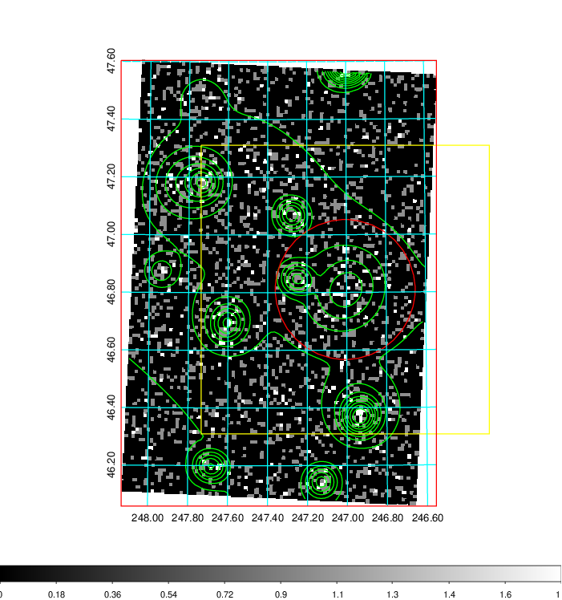  | 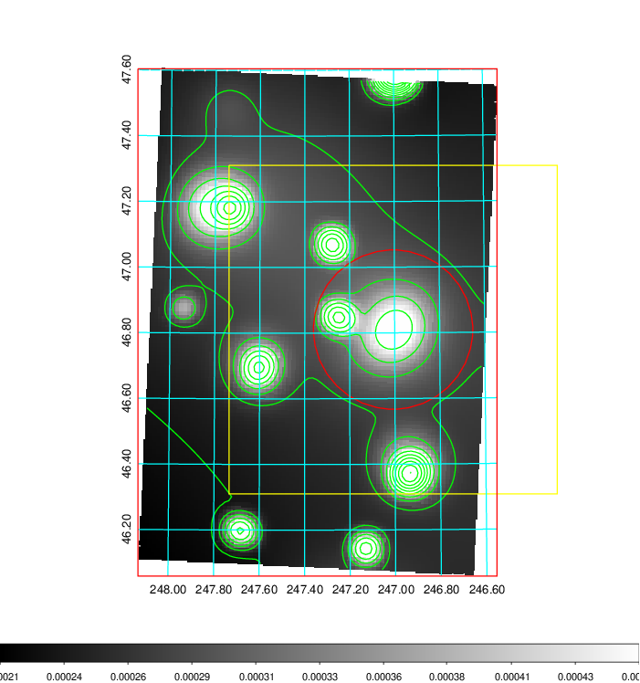   | 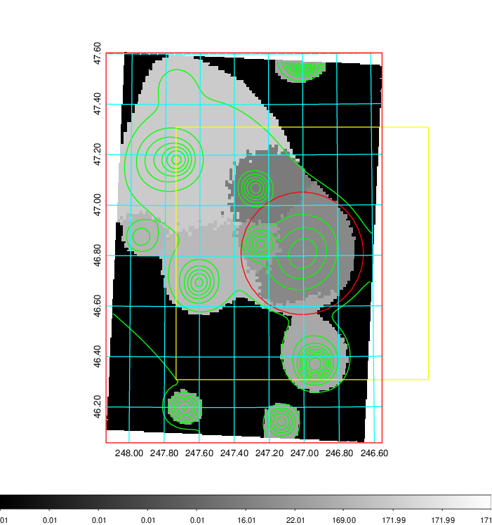  |

|[Exposure image](../image/654/654_mex.pdf)| [nH image](../image/654/654_nh.pdf)| [Planck image](../image/654/654_p.pdf)|
|-------------------|--------------------|-------------------|
|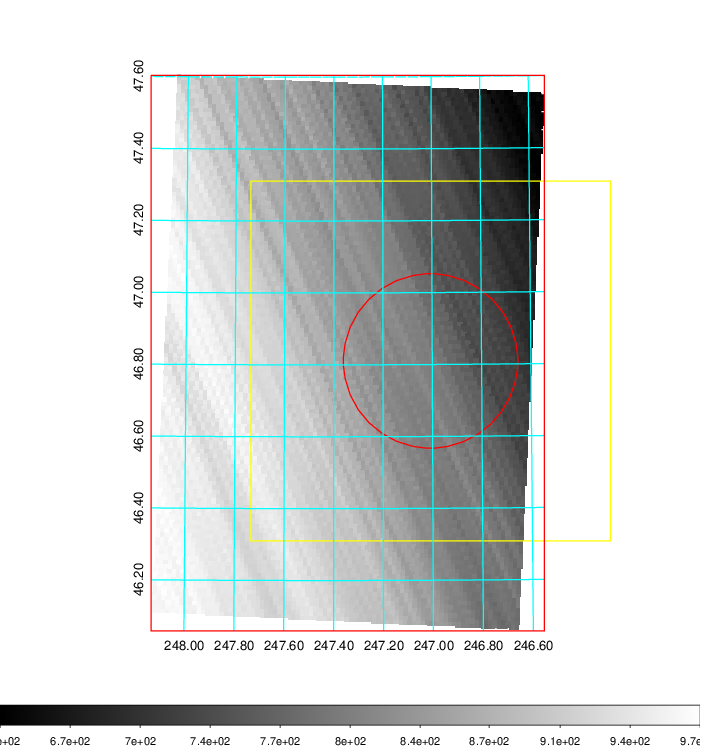   | 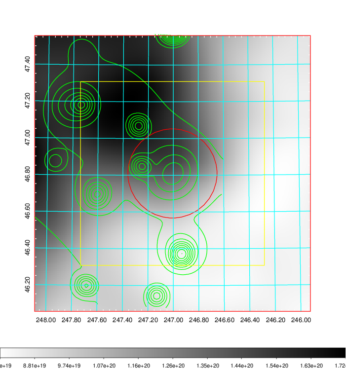    | 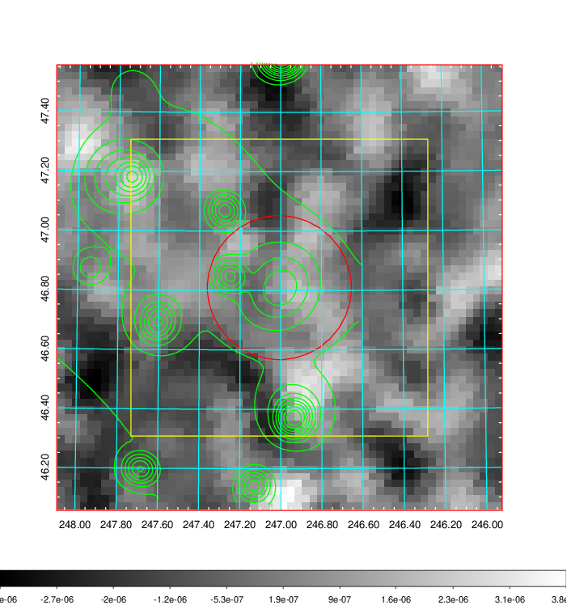 |

|[Redshift Histogram](../image/654/654_zg.pdf) | [DSS image(z1)](../image/654/654_dss_z1.pdf)      |  [DSS image(z2)](../image/654/654_dss_z2.pdf)    |
|-------------------|--------------------|-------------------|
|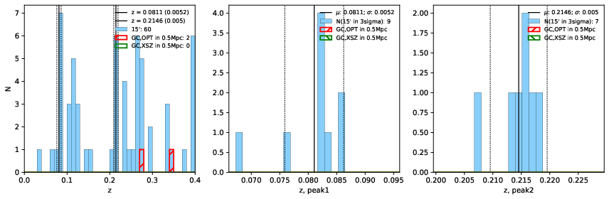 |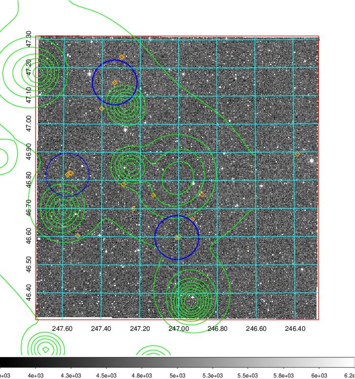  Blue circle for optical clusters;  Magenta circle for XSZ clusters;  all with r=1Mpc;  Only GC with Delta_z<0.01 are shown. | 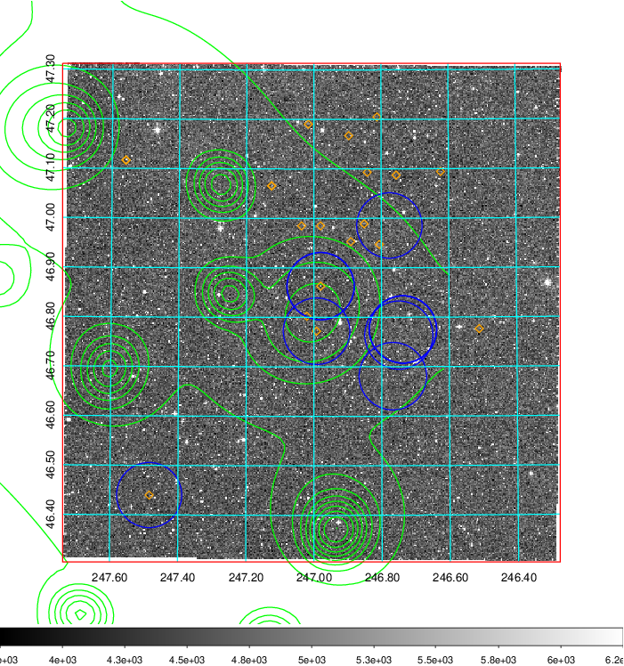 Blue circle for optical clusters;  Magenta circle for XSZ clusters;  all with r=1Mpc;  Only GC with Delta_z<0.01 are shown.  |

|[known Abell/XSZ clusters](../image/654/654_gc.pdf) | [2MASS image](../image/654/654_2mass.pdf)      |[SDSS image](../image/654/654_sdss.pdf)   |
|-------------------|-------------------|-------------------|
|  Magenta, blue and green circles  for optical, X-ray and SZ clusters  respectively, with redshift of clusters  labelled. The radius of circles  are 1Mpc.|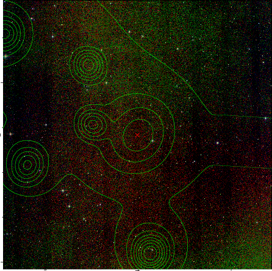  | 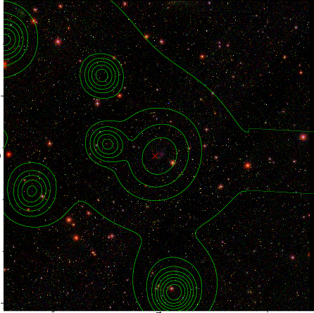  |

