

### 655

|Name|RAJ2000[deg]|DEJ2000[deg] |Ext[arcmin]| Ext,ml | z | z_src| C|GC(XSZ,Delta_z<0.01)| GC(OPT,Delta_z<0.01)|GC| R_sig[arcmin] | R500[arcmin] | R500[Mpc]| CRsig[c/s] | CR500[c/s] |L500[1E44 erg/s]|F500[1E-12 erg/s/cm^2]| M500[1E14 Msun]|Tx[keV]|Cnt_sig|Beta|Rc[arcmin]|Comment|Alias|
|---|---|---|---|---|---|------|---|--------|---------|----------|---|---|---|---|---|---|---|---|---|---|---|---|---|---|
|655| 247.162| 39.550| 2.38| 5251.02| 0.0307(0.005)| z1, z_xsz| B| L03, MCXC, PSZ2, Tar, XB| A, N| A, C, F20, L03, MCXC, N, PSZ2, SPI, Tar, W, XB| 46.045| 29.430| 1.084| 5.415(0.103)| 5.111(0.097)| 2.269(0.021)| 104.690(0.952)| 3.74(0.02)| 4.88(0.01)| 4222.4| 0.656(-0.006+0.006)| 3.140(-0.075+0.077)| -| k276|

|[RASS image](../image/655/655_img.pdf)|[filtered image](../image/655/655_fil.pdf)|[Segment image](../image/655/655_seg.pdf)|
|-------------------|--------------------|-------------------|
| 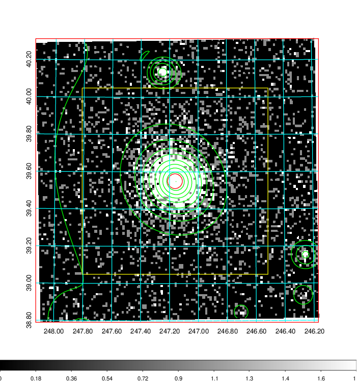  | 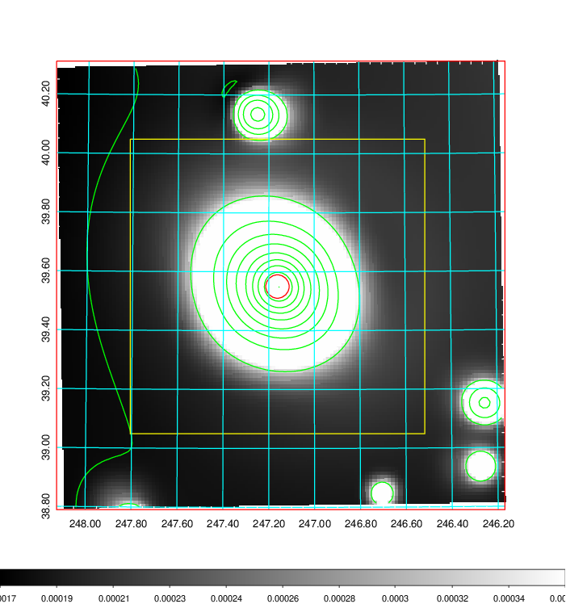   | 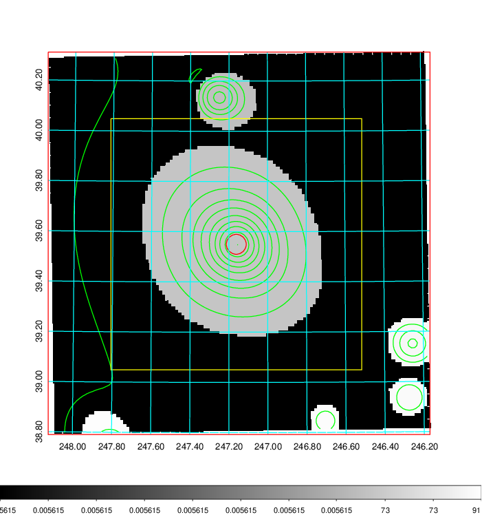  |

|[Exposure image](../image/655/655_mex.pdf)| [nH image](../image/655/655_nh.pdf)| [Planck image](../image/655/655_p.pdf)|
|-------------------|--------------------|-------------------|
|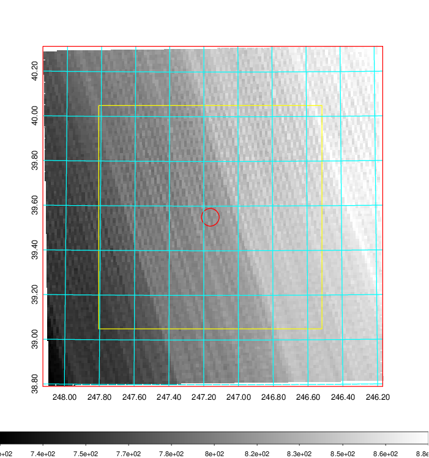   | 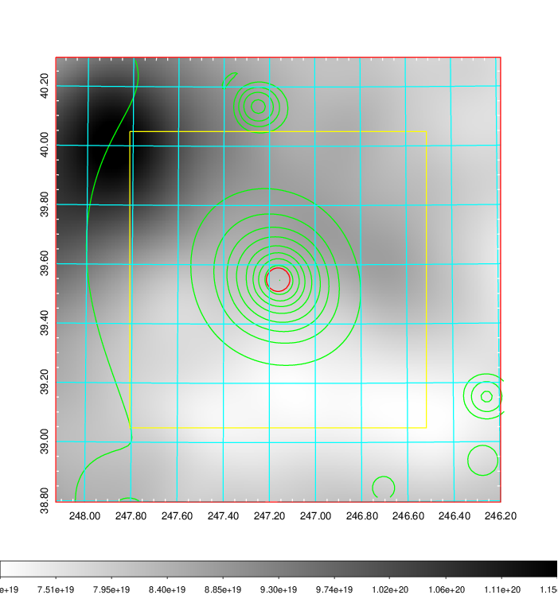    | 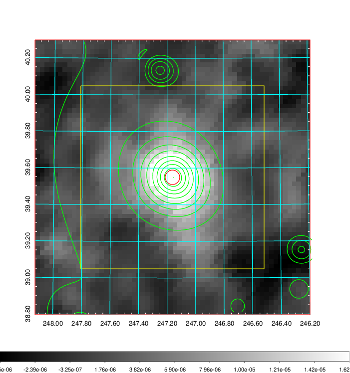 |

|[Redshift Histogram](../image/655/655_zg.pdf) | [DSS image(z1)](../image/655/655_dss_z1.pdf)      |  [DSS image(z2)](../image/655/655_dss_z2.pdf)    |
|-------------------|--------------------|-------------------|
|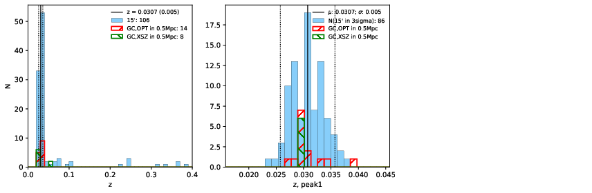 |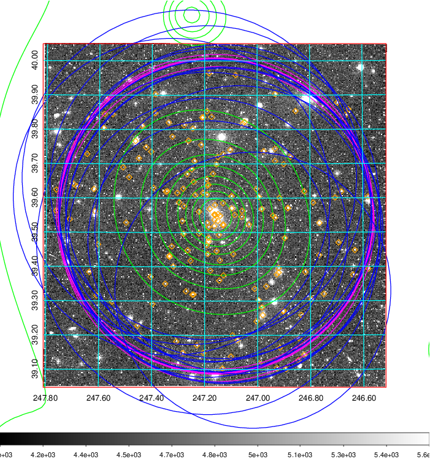  Blue circle for optical clusters;  Magenta circle for XSZ clusters;  all with r=1Mpc;  Only GC with Delta_z<0.01 are shown. | 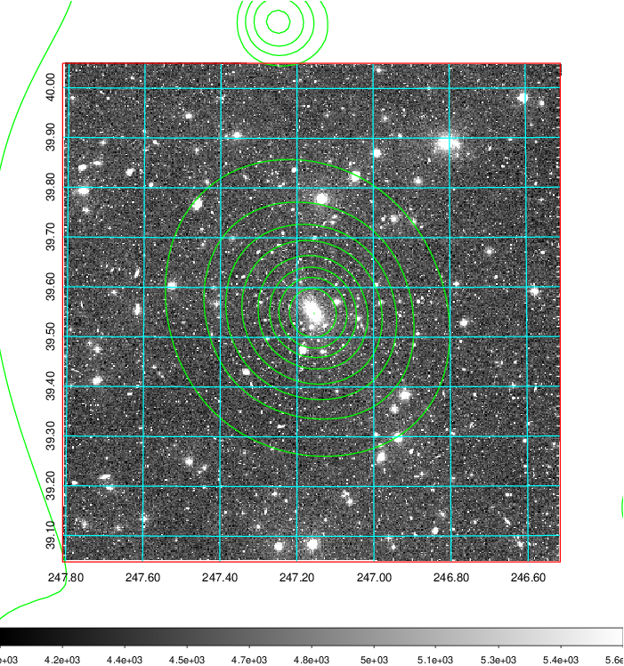 Blue circle for optical clusters;  Magenta circle for XSZ clusters;  all with r=1Mpc;  Only GC with Delta_z<0.01 are shown.  |

|[known Abell/XSZ clusters](../image/655/655_gc.pdf) | [2MASS image](../image/655/655_2mass.pdf)      |[SDSS image](../image/655/655_sdss.pdf)   |
|-------------------|-------------------|-------------------|
|  Magenta, blue and green circles  for optical, X-ray and SZ clusters  respectively, with redshift of clusters  labelled. The radius of circles  are 1Mpc.|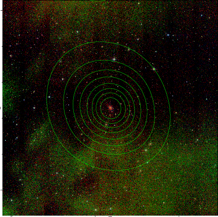  | 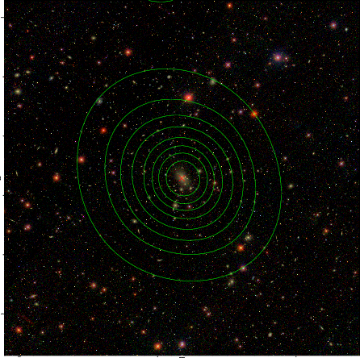  |

