

### 656

|Name|RAJ2000[deg]|DEJ2000[deg] |Ext[arcmin]| Ext,ml | z | z_src| C|GC(XSZ,Delta_z<0.01)| GC(OPT,Delta_z<0.01)|GC| R_sig[arcmin] | R500[arcmin] | R500[Mpc]| CRsig[c/s] | CR500[c/s] |L500[1E44 erg/s]|F500[1E-12 erg/s/cm^2]| M500[1E14 Msun]|Tx[keV]|Cnt_sig|Beta|Rc[arcmin]|Comment|Alias|
|---|---|---|---|---|---|------|---|--------|---------|----------|---|---|---|---|---|---|---|---|---|---|---|---|---|---|
|656| 247.407| 40.852| 7.52| 149.16| 0.0300(0.005)| z1, z_xsz| B| L03| A, N| A, F20, L03, N, SPI, W| 25.194| 17.884| 0.645| 0.461(0.048)| 0.440(0.046)| 0.174(0.019)| 8.403(0.942)| 0.78(0.05)| 1.86(0.07)| 517.5| 0.518(-0.014+0.032)| 8.004(-0.601+1.078)| -| t377|

|[RASS image](../image/656/656_img.pdf)|[filtered image](../image/656/656_fil.pdf)|[Segment image](../image/656/656_seg.pdf)|
|-------------------|--------------------|-------------------|
| 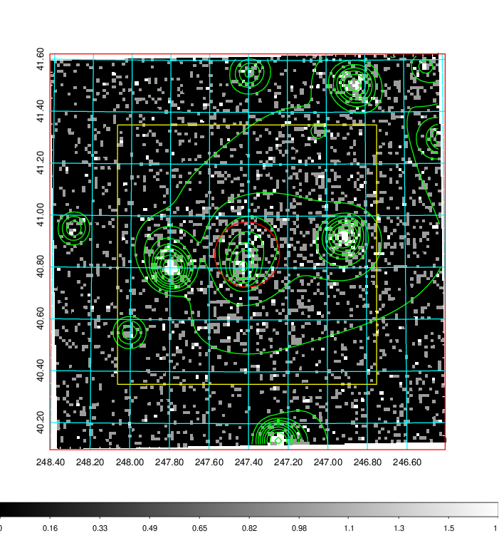  | 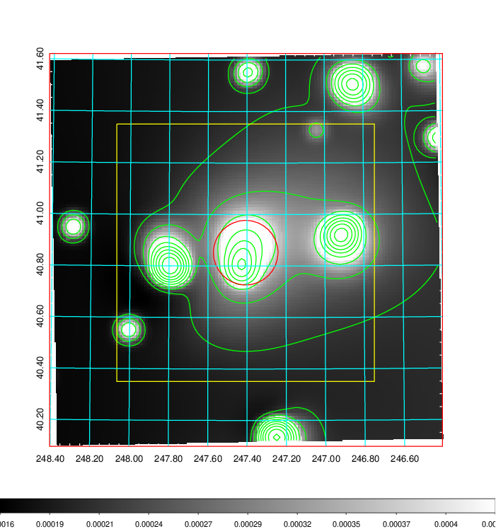   | 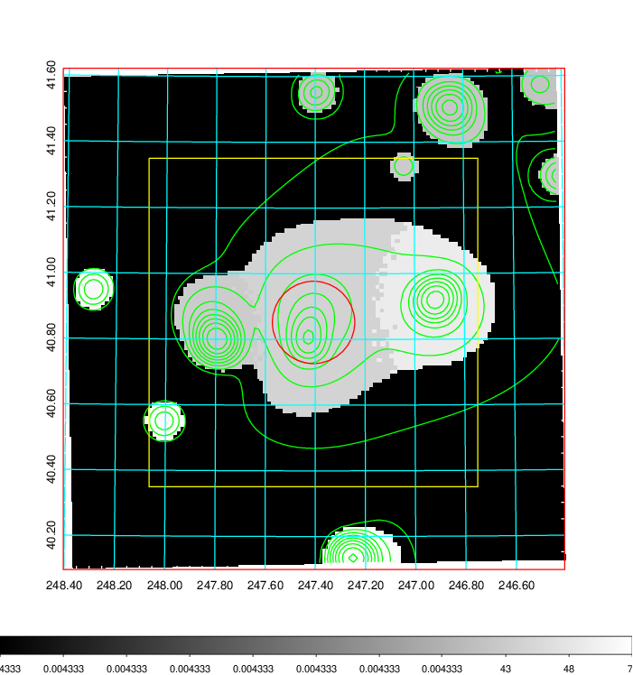  |

|[Exposure image](../image/656/656_mex.pdf)| [nH image](../image/656/656_nh.pdf)| [Planck image](../image/656/656_p.pdf)|
|-------------------|--------------------|-------------------|
|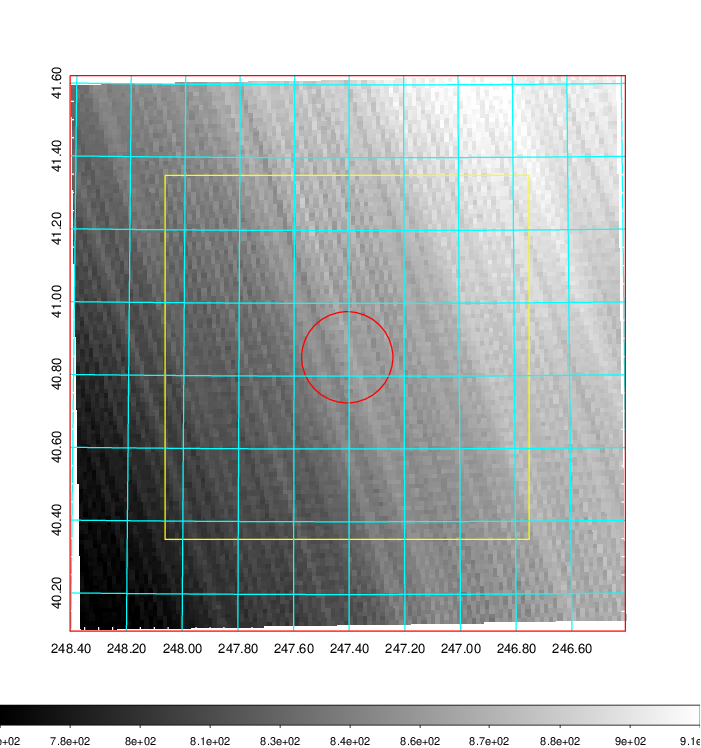   | 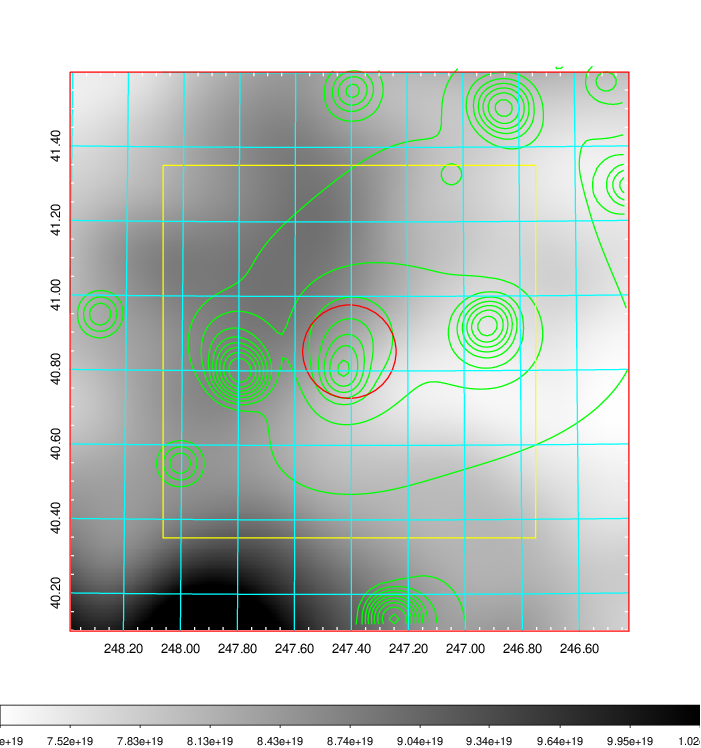    | 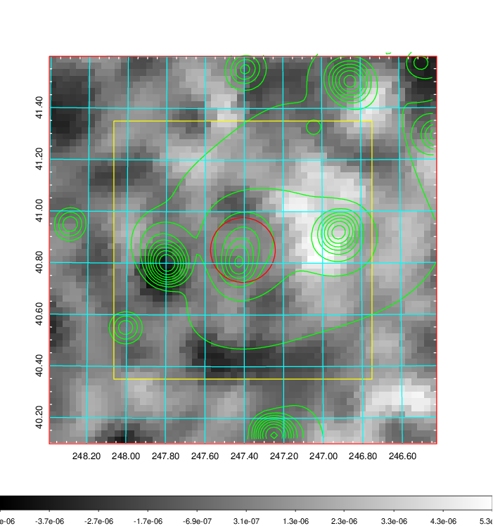 |

|[Redshift Histogram](../image/656/656_zg.pdf) | [DSS image(z1)](../image/656/656_dss_z1.pdf)      |  [DSS image(z2)](../image/656/656_dss_z2.pdf)    |
|-------------------|--------------------|-------------------|
|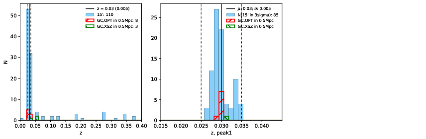 |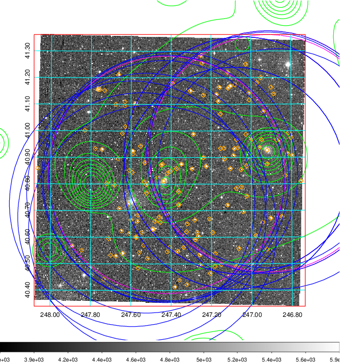  Blue circle for optical clusters;  Magenta circle for XSZ clusters;  all with r=1Mpc;  Only GC with Delta_z<0.01 are shown. | 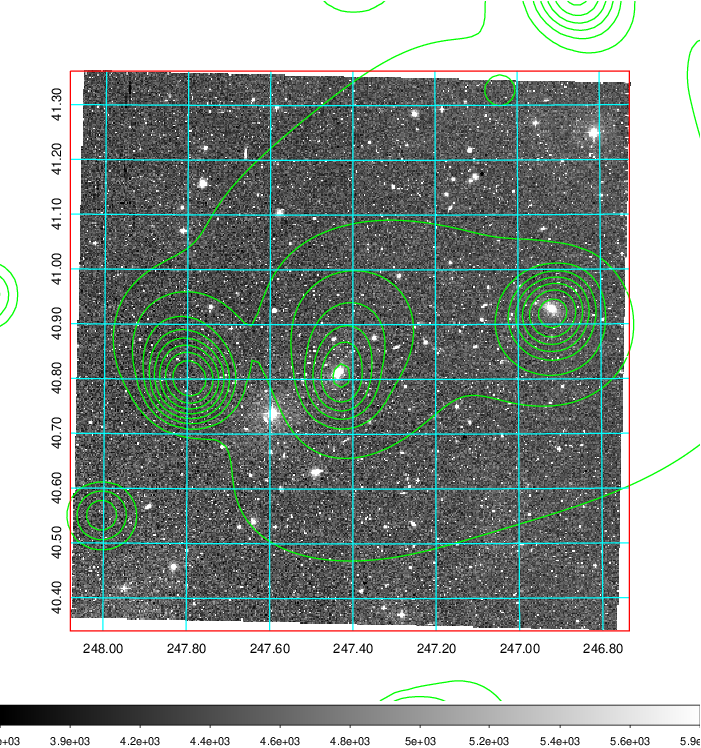 Blue circle for optical clusters;  Magenta circle for XSZ clusters;  all with r=1Mpc;  Only GC with Delta_z<0.01 are shown.  |

|[Previous-identified clusters](../image/656/656_gc.pdf) | [2MASS image](../image/656/656_2mass.pdf)      |[SDSS image](../image/656/656_sdss.pdf)   |
|-------------------|-------------------|-------------------|
|  Green, magenta, and blue circles  for optical, X-ray and SZ clusters  respectively, with redshift of clusters  labelled. The radius of circles  are 1Mpc.|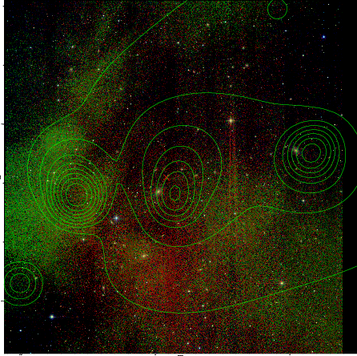  | 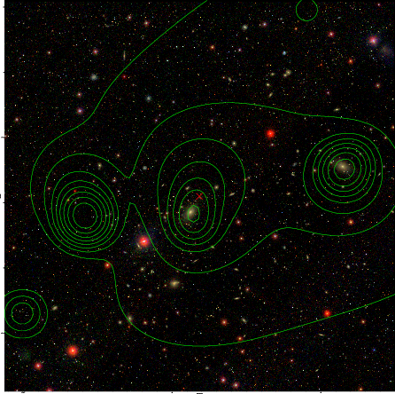  |

