

### 657

|Name|RAJ2000[deg]|DEJ2000[deg] |Ext[arcmin]| Ext,ml | z | z_src| C|GC(XSZ,Delta_z<0.01)| GC(OPT,Delta_z<0.01)|GC| R_sig[arcmin] | R500[arcmin] | R500[Mpc]| CRsig[c/s] | CR500[c/s] |L500[1E44 erg/s]|F500[1E-12 erg/s/cm^2]| M500[1E14 Msun]|Tx[keV]|Cnt_sig|Beta|Rc[arcmin]|Comment|Alias|
|---|---|---|---|---|---|------|---|--------|---------|----------|---|---|---|---|---|---|---|---|---|---|---|---|---|---|
|657| 247.426| 28.182| 1.35| 25.86| 0.1444(0.005)| z1, z_xsz| B| F20| C, N, RM, W| A, C, F20, N, W| 8.800| 6.561| 0.997| 0.173(0.030)| 0.166(0.029)| 1.749(0.139)| 3.124(0.248)| 3.24(0.13)| 4.63(0.11)| 94.6| 0.829(-0.133+0.116)| 3.353(-0.845+0.649)| -| t019|

|[RASS image](../image/657/657_img.pdf)|[filtered image](../image/657/657_fil.pdf)|[Segment image](../image/657/657_seg.pdf)|
|-------------------|--------------------|-------------------|
| 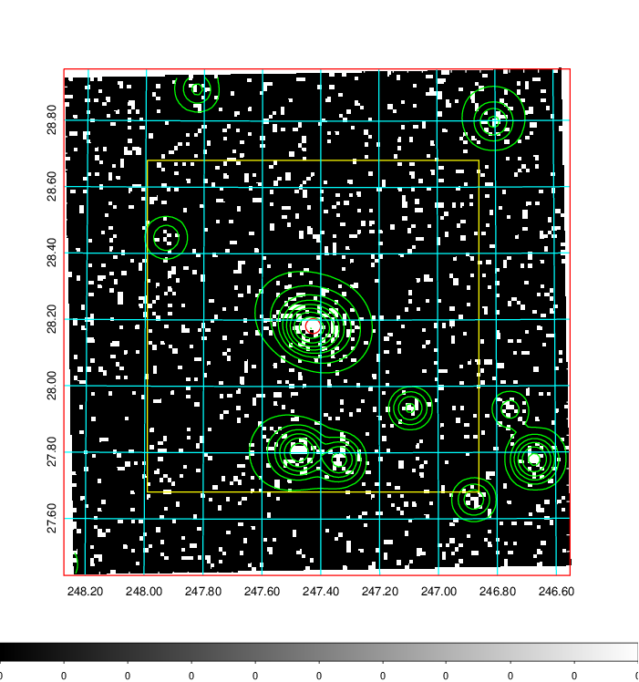  | 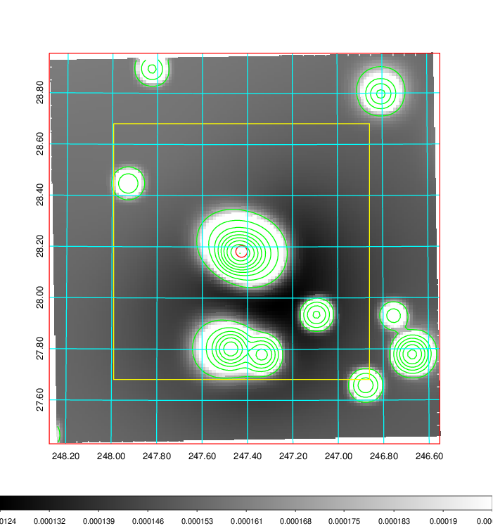   | 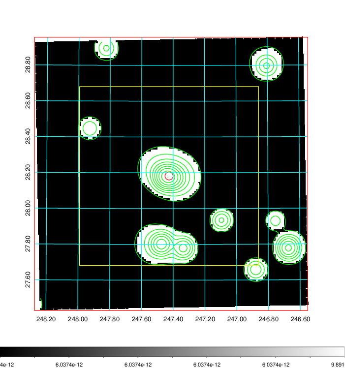  |

|[Exposure image](../image/657/657_mex.pdf)| [nH image](../image/657/657_nh.pdf)| [Planck image](../image/657/657_p.pdf)|
|-------------------|--------------------|-------------------|
|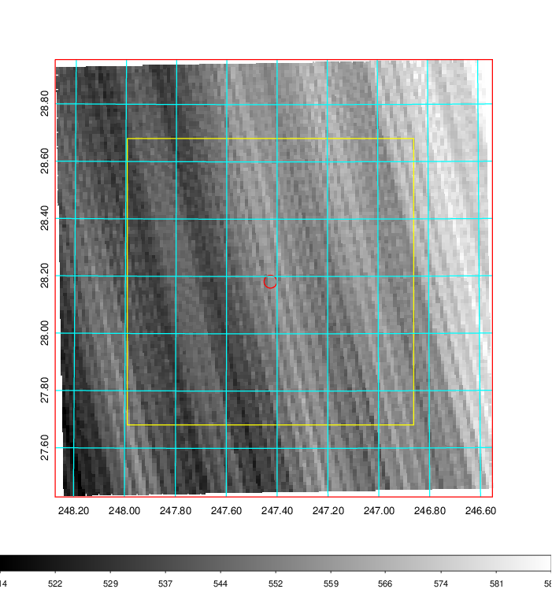   | 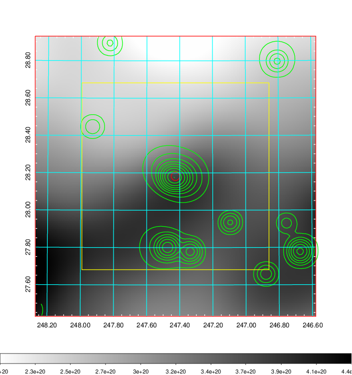    | 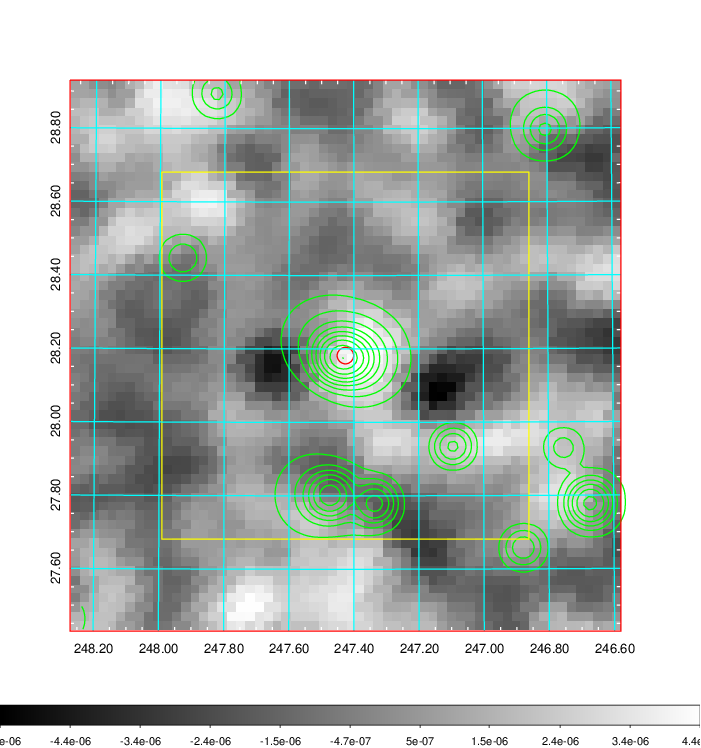 |

|[Redshift Histogram](../image/657/657_zg.pdf) | [DSS image(z1)](../image/657/657_dss_z1.pdf)      |  [DSS image(z2)](../image/657/657_dss_z2.pdf)    |
|-------------------|--------------------|-------------------|
|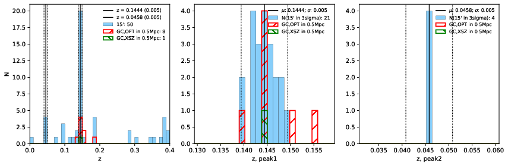 |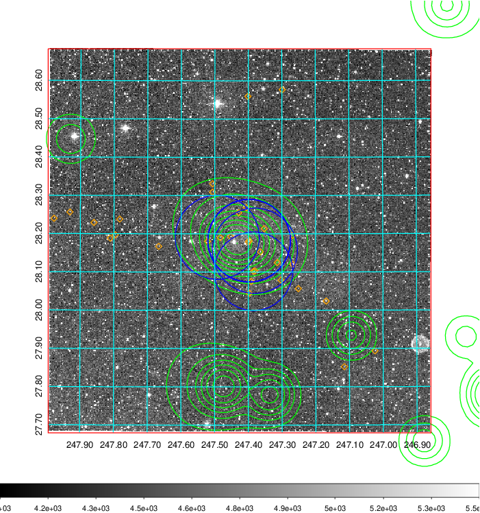  Blue circle for optical clusters;  Magenta circle for XSZ clusters;  all with r=1Mpc;  Only GC with Delta_z<0.01 are shown. | 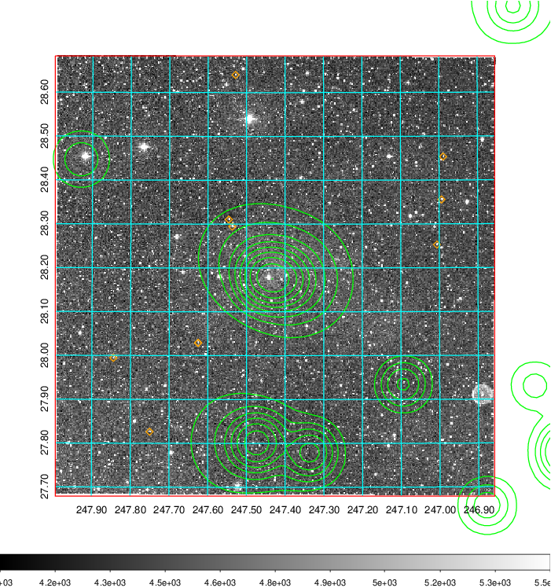 Blue circle for optical clusters;  Magenta circle for XSZ clusters;  all with r=1Mpc;  Only GC with Delta_z<0.01 are shown.  |

|[known Abell/XSZ clusters](../image/657/657_gc.pdf) | [2MASS image](../image/657/657_2mass.pdf)      |[SDSS image](../image/657/657_sdss.pdf)   |
|-------------------|-------------------|-------------------|
|  Magenta, blue and green circles  for optical, X-ray and SZ clusters  respectively, with redshift of clusters  labelled. The radius of circles  are 1Mpc.|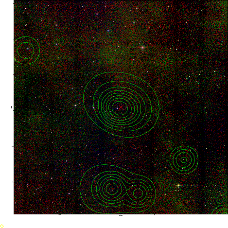  | 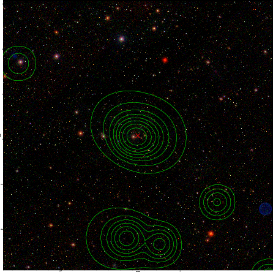  |

