

### 658

|Name|RAJ2000[deg]|DEJ2000[deg] |Ext[arcmin]| Ext,ml | z | z_src| C|GC(XSZ,Delta_z<0.01)| GC(OPT,Delta_z<0.01)|GC| R_sig[arcmin] | R500[arcmin] | R500[Mpc]| CRsig[c/s] | CR500[c/s] |L500[1E44 erg/s]|F500[1E-12 erg/s/cm^2]| M500[1E14 Msun]|Tx[keV]|Cnt_sig|Beta|Rc[arcmin]|Comment|Alias|
|---|---|---|---|---|---|------|---|--------|---------|----------|---|---|---|---|---|---|---|---|---|---|---|---|---|---|
|658| 247.427| 58.524| 0.88| 37.49| 0.1343(0.005)| z1, z_xsz| B| MCXC, PSZ2, Tar| A, N, W| A, MCXC, N, PSZ2, Tar, W| 5.388| 6.411| 0.916| 0.130(0.017)| 0.134(0.018)| 1.288(0.089)| 2.694(0.185)| 2.49(0.08)| 3.92(0.08)| 186.1| 0.946(-0.069+0.040)| 2.566(-0.278+0.219)| -| k023|

|[RASS image](../image/658/658_img.pdf)|[filtered image](../image/658/658_fil.pdf)|[Segment image](../image/658/658_seg.pdf)|
|-------------------|--------------------|-------------------|
| 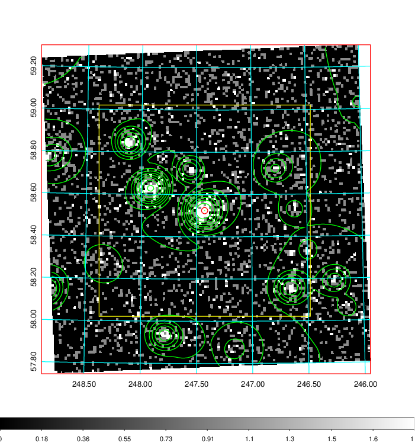  | 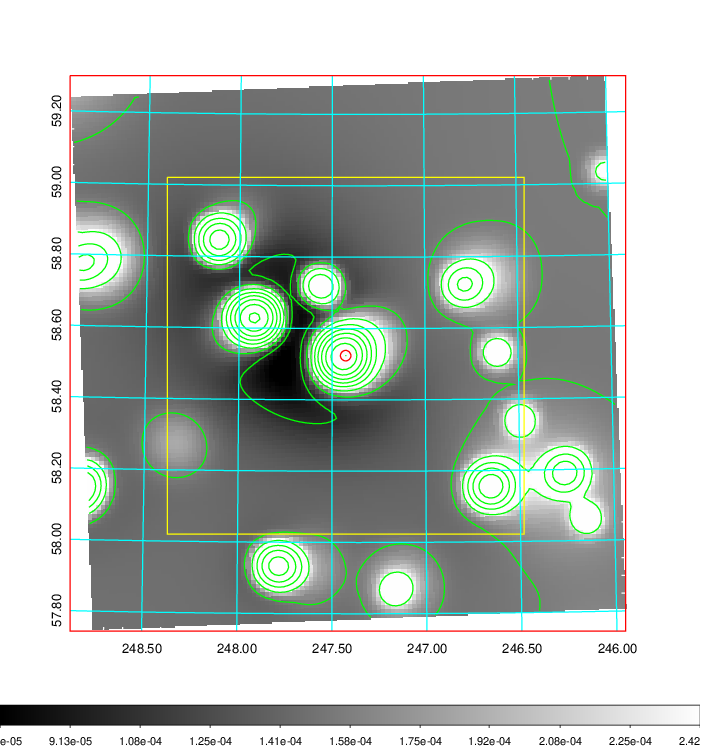   | 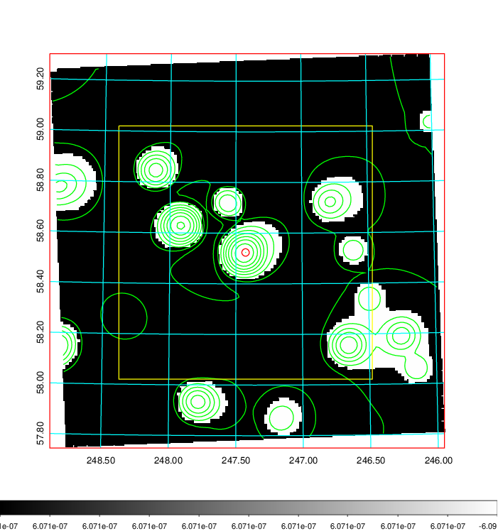  |

|[Exposure image](../image/658/658_mex.pdf)| [nH image](../image/658/658_nh.pdf)| [Planck image](../image/658/658_p.pdf)|
|-------------------|--------------------|-------------------|
|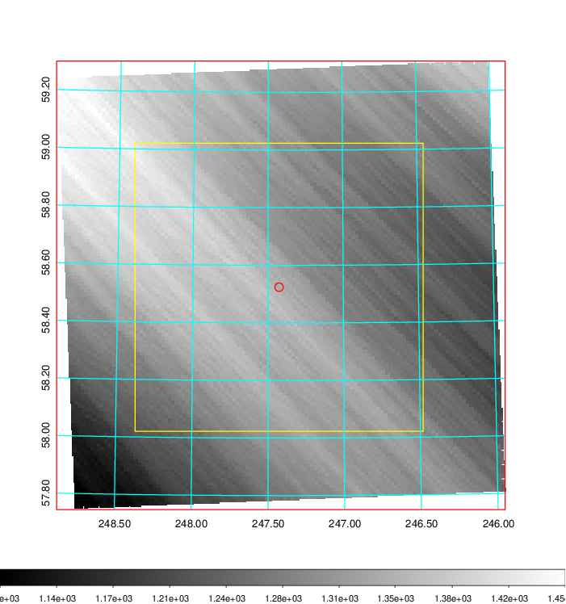   | 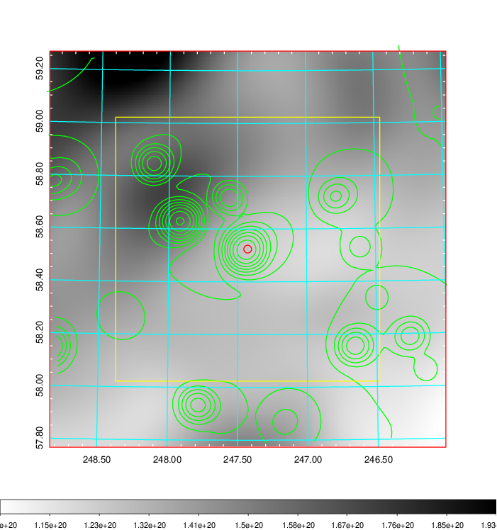    | 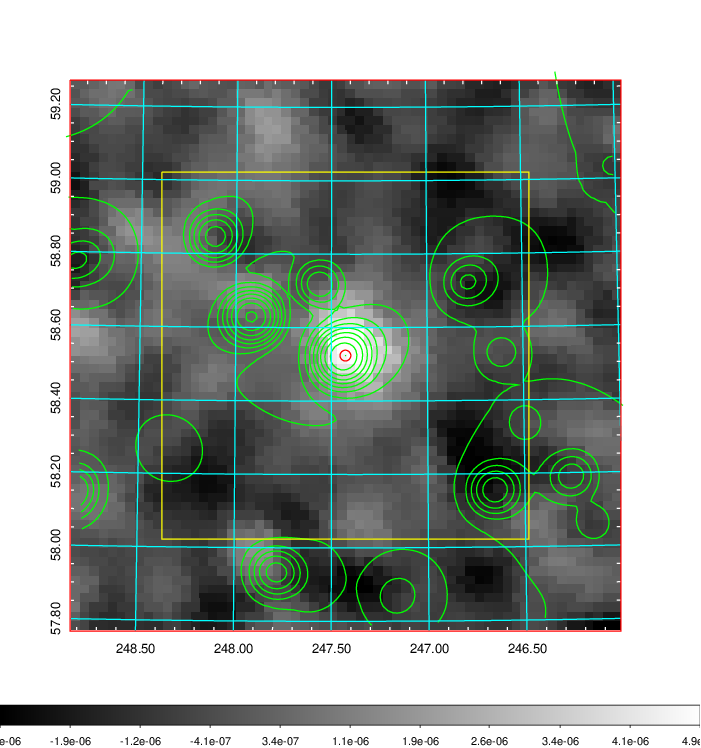 |

|[Redshift Histogram](../image/658/658_zg.pdf) | [DSS image(z1)](../image/658/658_dss_z1.pdf)      |  [DSS image(z2)](../image/658/658_dss_z2.pdf)    |
|-------------------|--------------------|-------------------|
|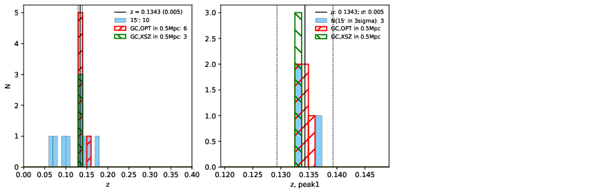 |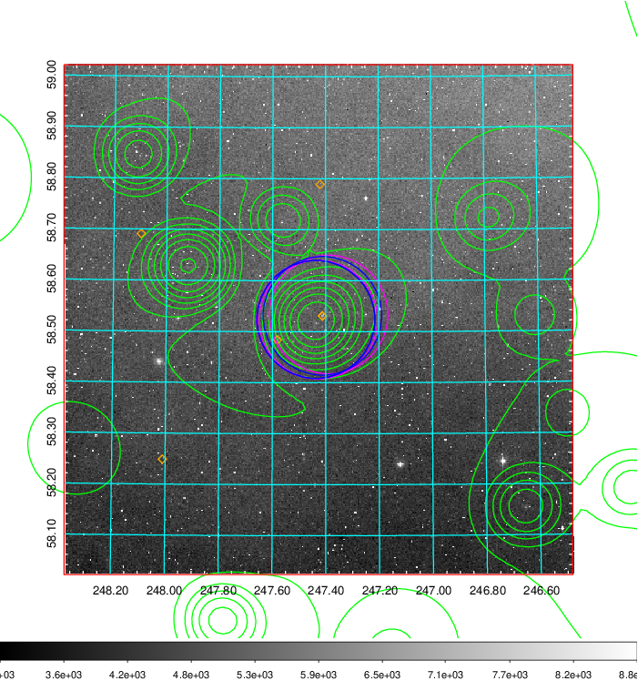  Blue circle for optical clusters;  Magenta circle for XSZ clusters;  all with r=1Mpc;  Only GC with Delta_z<0.01 are shown. | 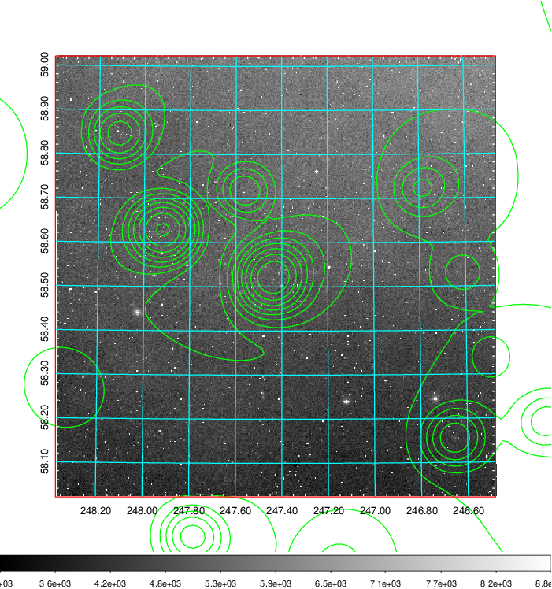 Blue circle for optical clusters;  Magenta circle for XSZ clusters;  all with r=1Mpc;  Only GC with Delta_z<0.01 are shown.  |

|[Previous-identified clusters](../image/658/658_gc.pdf) | [2MASS image](../image/658/658_2mass.pdf)      |
|-------------------|-------------------|
|  Green, magenta, and blue circles  for optical, X-ray and SZ clusters  respectively, with redshift of clusters  labelled. The radius of circles  are 1Mpc.|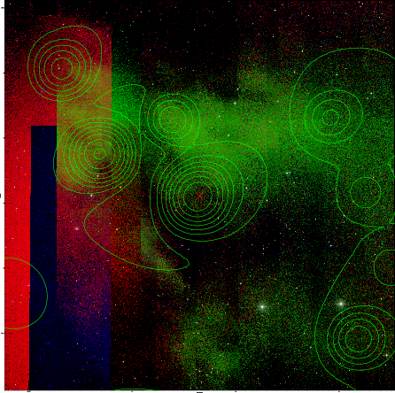  |

|[PS1 image](../image/658/658_ps1.pdf)            |
|-------------------|
| 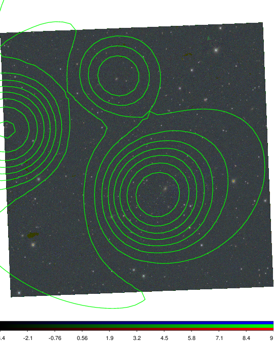  |
