

### 659

|Name|RAJ2000[deg]|DEJ2000[deg] |Ext[arcmin]| Ext,ml | z | z_src| C|GC(XSZ,Delta_z<0.01)| GC(OPT,Delta_z<0.01)|GC| R_sig[arcmin] | R500[arcmin] | R500[Mpc]| CRsig[c/s] | CR500[c/s] |L500[1E44 erg/s]|F500[1E-12 erg/s/cm^2]| M500[1E14 Msun]|Tx[keV]|Cnt_sig|Beta|Rc[arcmin]|Comment|Alias|
|---|---|---|---|---|---|------|---|--------|---------|----------|---|---|---|---|---|---|---|---|---|---|---|---|---|---|
|659| 247.566| 57.333| 4.00| 28.90| 0.2647(0.000)| z_xsz| B| F20, SPI| -| C, F20, N, SPI, W| 26.181| 3.907| 0.956| 0.057(0.035)| 0.050(0.030)| 2.176(1.475)| 1.005(0.681)| 3.25(1.05)| 4.83(1.00)| 40.8| 0.899(-0.115+0.073)| 5.135(-0.806+0.595)| -| t194|

|[RASS image](../image/659/659_img.pdf)|[filtered image](../image/659/659_fil.pdf)|[Segment image](../image/659/659_seg.pdf)|
|-------------------|--------------------|-------------------|
| 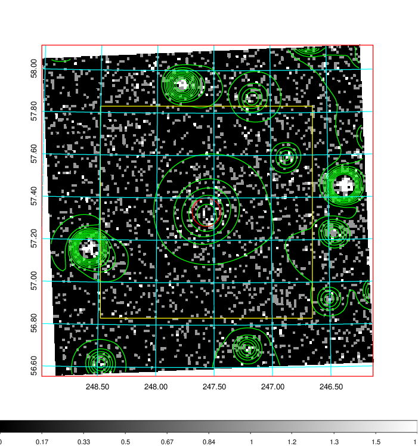  | 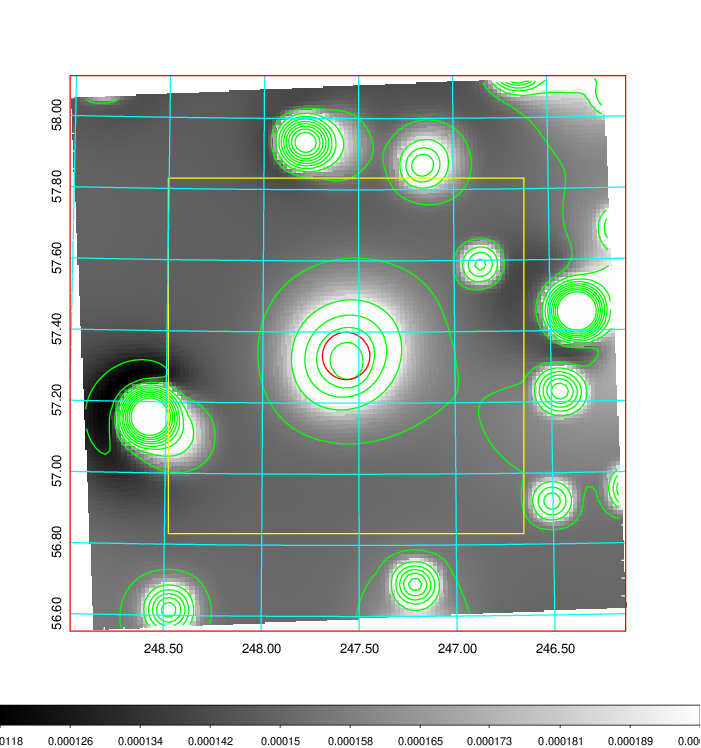   | 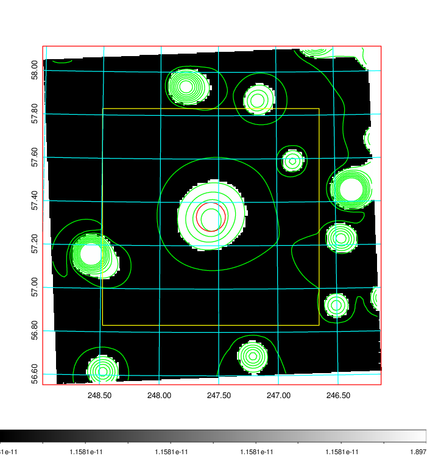  |

|[Exposure image](../image/659/659_mex.pdf)| [nH image](../image/659/659_nh.pdf)| [Planck image](../image/659/659_p.pdf)|
|-------------------|--------------------|-------------------|
|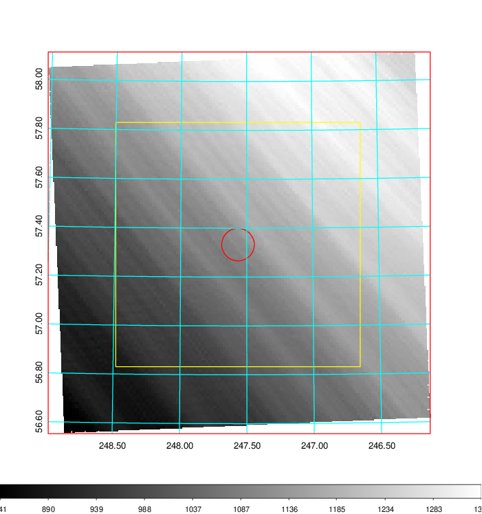   | 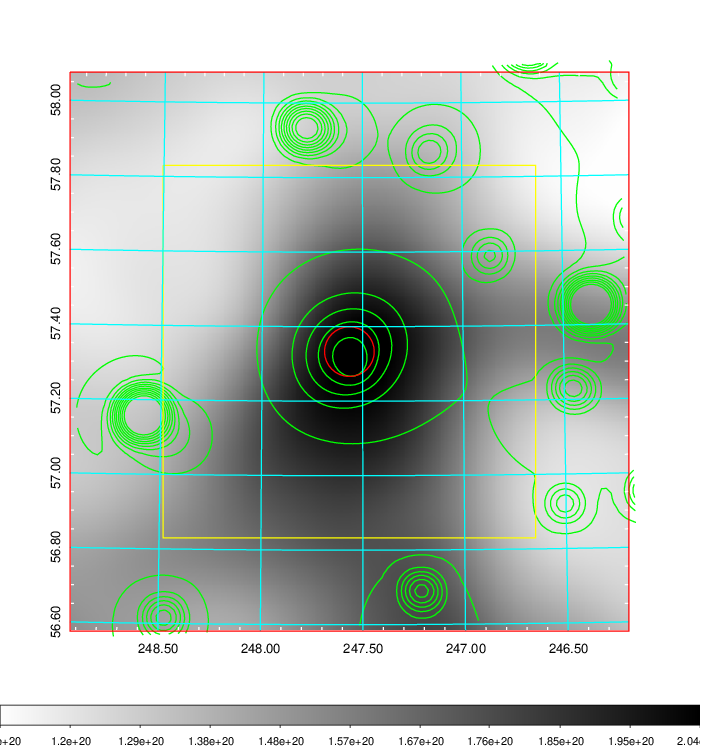    | 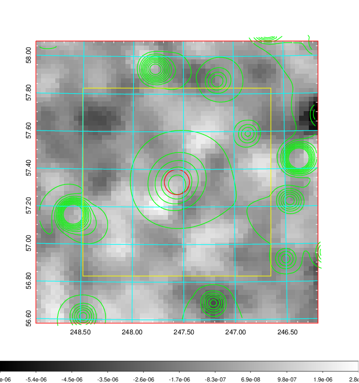 |

|[Redshift Histogram](../image/659/659_zg.pdf) | [DSS image(z1)](../image/659/659_dss_z1.pdf)      |  [DSS image(z2)](../image/659/659_dss_z2.pdf)    |
|-------------------|--------------------|-------------------|
|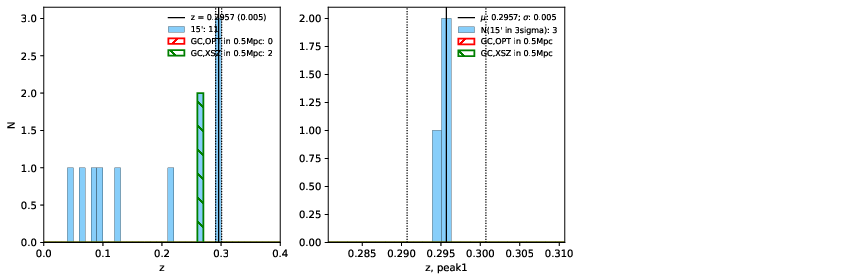 |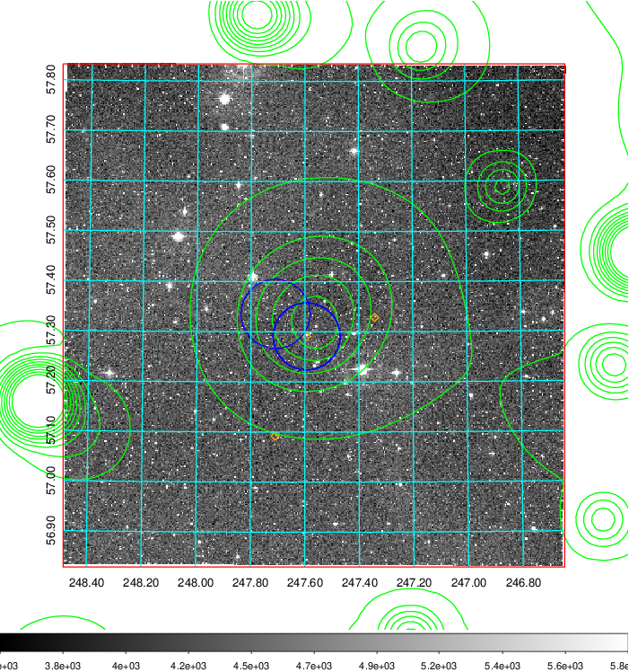  Blue circle for optical clusters;  Magenta circle for XSZ clusters;  all with r=1Mpc;  Only GC with Delta_z<0.01 are shown. | 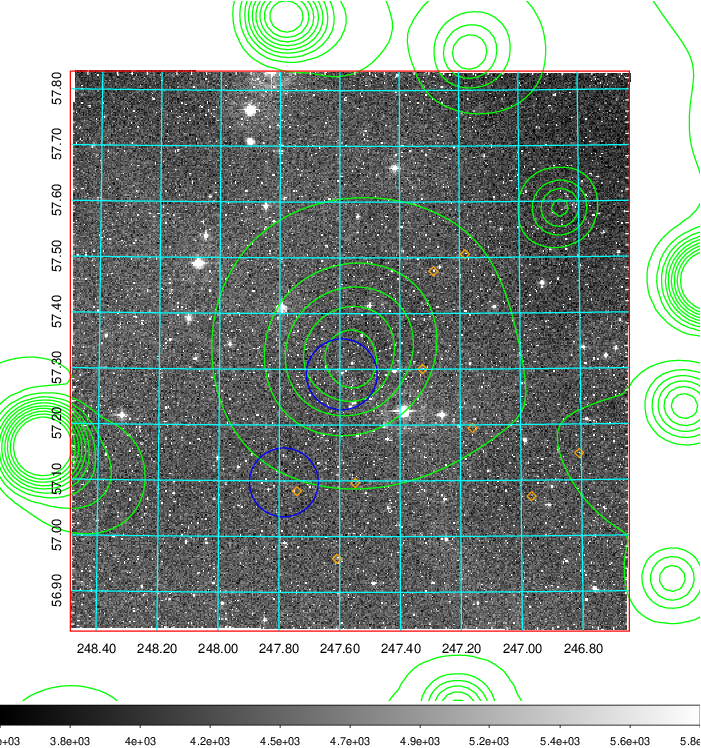 Blue circle for optical clusters;  Magenta circle for XSZ clusters;  all with r=1Mpc;  Only GC with Delta_z<0.01 are shown.  |

|[Previous-identified clusters](../image/659/659_gc.pdf) | [2MASS image](../image/659/659_2mass.pdf)      |[SDSS image](../image/659/659_sdss.pdf)   |
|-------------------|-------------------|-------------------|
|  Green, magenta, and blue circles  for optical, X-ray and SZ clusters  respectively, with redshift of clusters  labelled. The radius of circles  are 1Mpc.|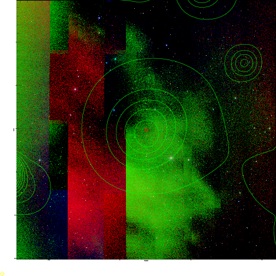  | 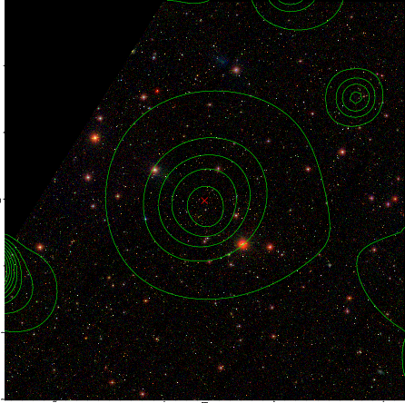  |

