

### 66

|Name|RAJ2000[deg]|DEJ2000[deg] |Ext[arcmin]| Ext,ml | z | z_src| C|GC(XSZ,Delta_z<0.01)| GC(OPT,Delta_z<0.01)|GC| R_sig[arcmin] | R500[arcmin] | R500[Mpc]| CRsig[c/s] | CR500[c/s] |L500[1E44 erg/s]|F500[1E-12 erg/s/cm^2]| M500[1E14 Msun]|Tx[keV]|Cnt_sig|Beta|Rc[arcmin]|Comment|Alias|
|---|---|---|---|---|---|------|---|--------|---------|----------|---|---|---|---|---|---|---|---|---|---|---|---|---|---|
|66| 19.545| 32.609| 4.60| 39.62| 0.1185(0.005)| z1,| G| -| -| F20, N, W| 7.825| 6.503| 0.835| 0.100(0.027)| 0.098(0.027)| 0.639(0.113)| 1.751(0.309)| 1.86(0.16)| 3.25(0.18)| 44.2| 0.854(-0.157+0.105)| 7.721(-1.569+1.284)| -| t234|

|[RASS image](../image/66/66_img.pdf)|[filtered image](../image/66/66_fil.pdf)|[Segment image](../image/66/66_seg.pdf)|
|-------------------|--------------------|-------------------|
| 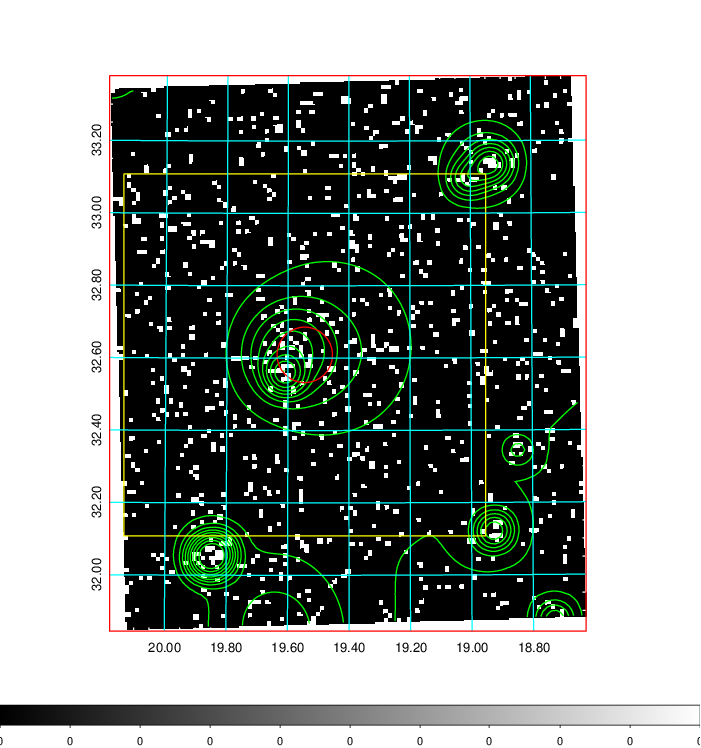  | 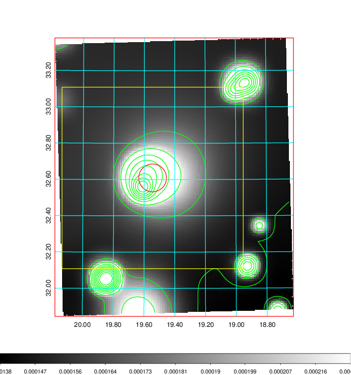   | 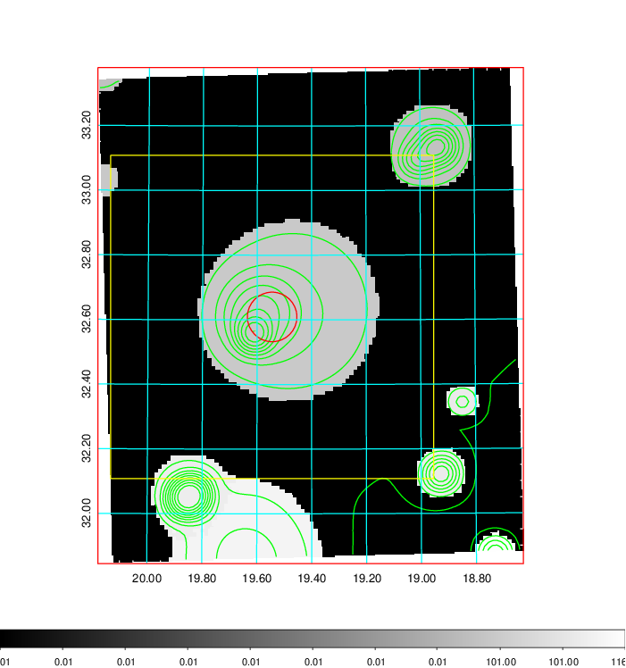  |

|[Exposure image](../image/66/66_mex.pdf)| [nH image](../image/66/66_nh.pdf)| [Planck image](../image/66/66_p.pdf)|
|-------------------|--------------------|-------------------|
|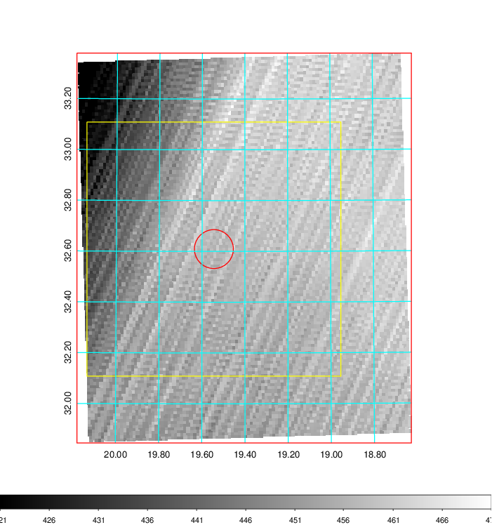   | 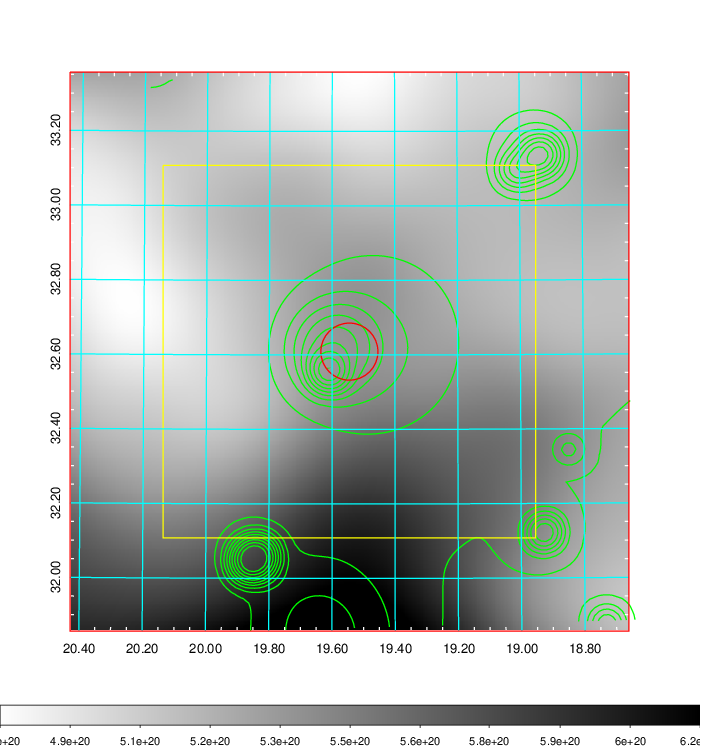    | 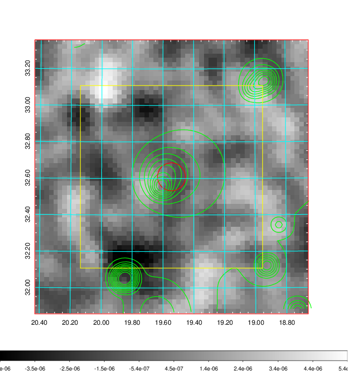 |

|[Redshift Histogram](../image/66/66_zg.pdf) | [DSS image(z1)](../image/66/66_dss_z1.pdf)      |  [DSS image(z2)](../image/66/66_dss_z2.pdf)    |
|-------------------|--------------------|-------------------|
|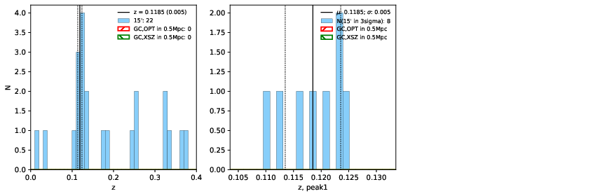 |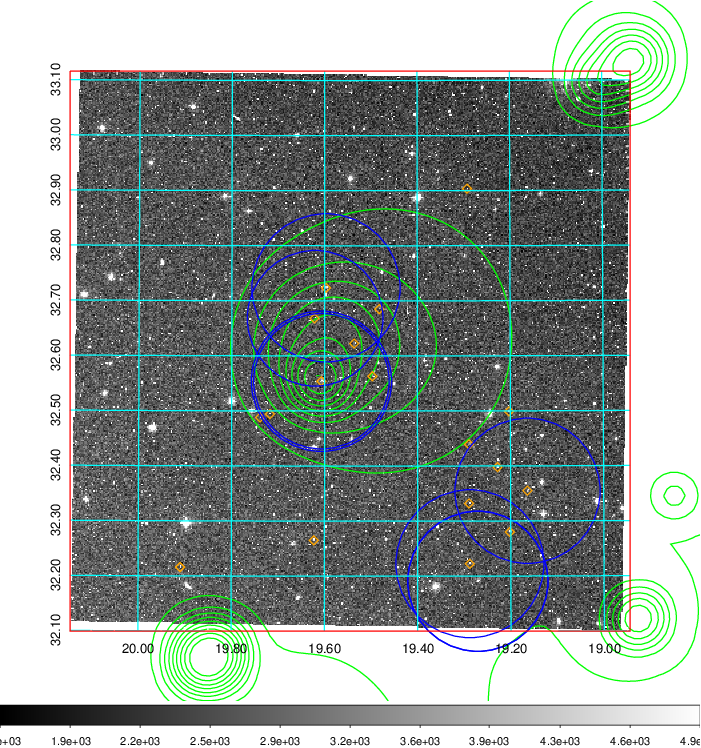  Blue circle for optical clusters;  Magenta circle for XSZ clusters;  all with r=1Mpc;  Only GC with Delta_z<0.01 are shown. | 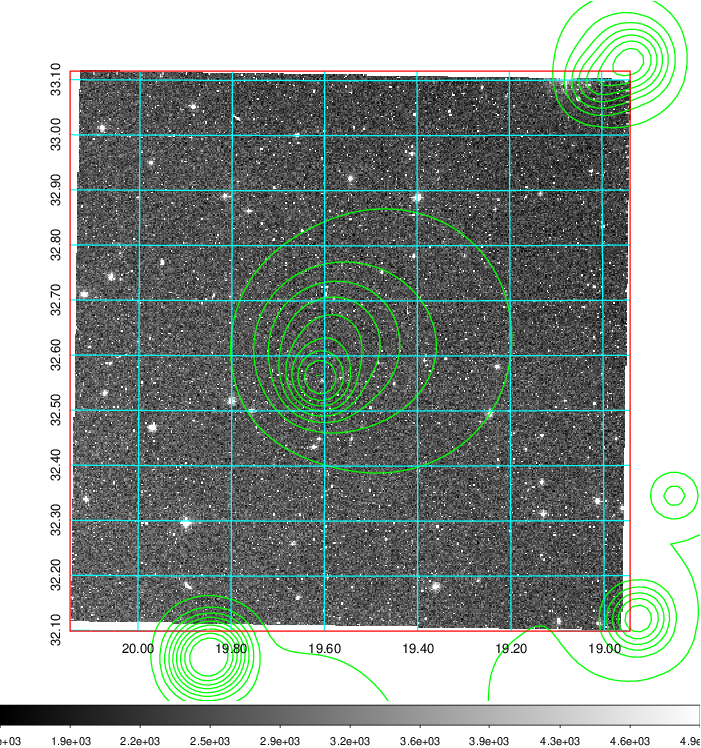 Blue circle for optical clusters;  Magenta circle for XSZ clusters;  all with r=1Mpc;  Only GC with Delta_z<0.01 are shown.  |

|[known Abell/XSZ clusters](../image/66/66_gc.pdf) | [2MASS image](../image/66/66_2mass.pdf)      |[SDSS image](../image/66/66_sdss.pdf)   |
|-------------------|-------------------|-------------------|
|  Magenta, blue and green circles  for optical, X-ray and SZ clusters  respectively, with redshift of clusters  labelled. The radius of circles  are 1Mpc.|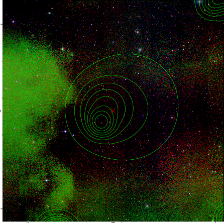  | 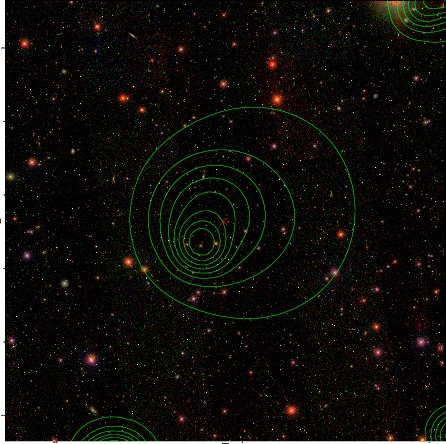  |

