

### 660

|Name|RAJ2000[deg]|DEJ2000[deg] |Ext[arcmin]| Ext,ml | z | z_src| C|GC(XSZ,Delta_z<0.01)| GC(OPT,Delta_z<0.01)|GC| R_sig[arcmin] | R500[arcmin] | R500[Mpc]| CRsig[c/s] | CR500[c/s] |L500[1E44 erg/s]|F500[1E-12 erg/s/cm^2]| M500[1E14 Msun]|Tx[keV]|Cnt_sig|Beta|Rc[arcmin]|Comment|Alias|
|---|---|---|---|---|---|------|---|--------|---------|----------|---|---|---|---|---|---|---|---|---|---|---|---|---|---|
|660| 248.236| 11.762| 5.56| 33.46| 0.0521(0.005)| z1, z_opt| S| -| N, W| C, F20, N, W| 32.600| 13.243| 0.807| 0.450(0.100)| 0.410(0.091)| 0.463(0.110)| 7.191(1.709)| 1.57(0.19)| 2.88(0.22)| 159.1| 0.521(-0.015+0.034)| 6.110(-0.679+0.978)| -| t283|

|[RASS image](../image/660/660_img.pdf)|[filtered image](../image/660/660_fil.pdf)|[Segment image](../image/660/660_seg.pdf)|
|-------------------|--------------------|-------------------|
| 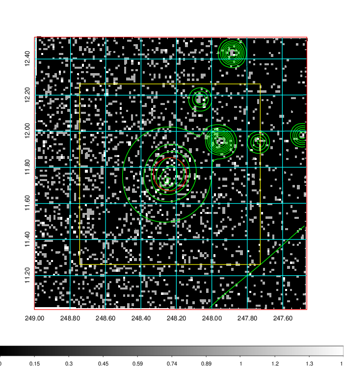  | 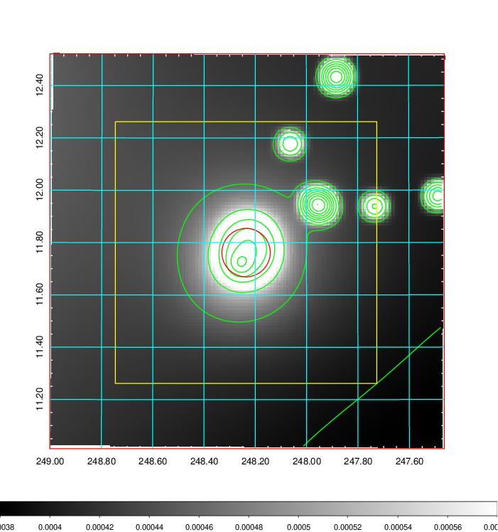   | 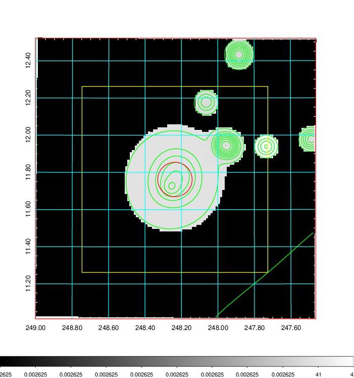  |

|[Exposure image](../image/660/660_mex.pdf)| [nH image](../image/660/660_nh.pdf)| [Planck image](../image/660/660_p.pdf)|
|-------------------|--------------------|-------------------|
|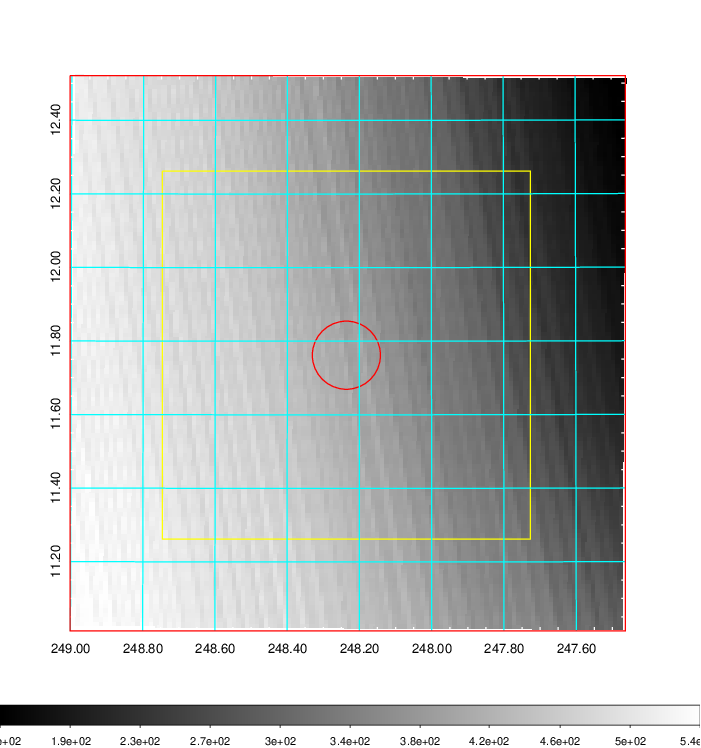   | 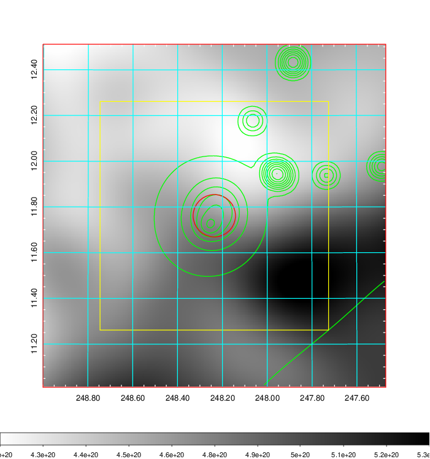    | 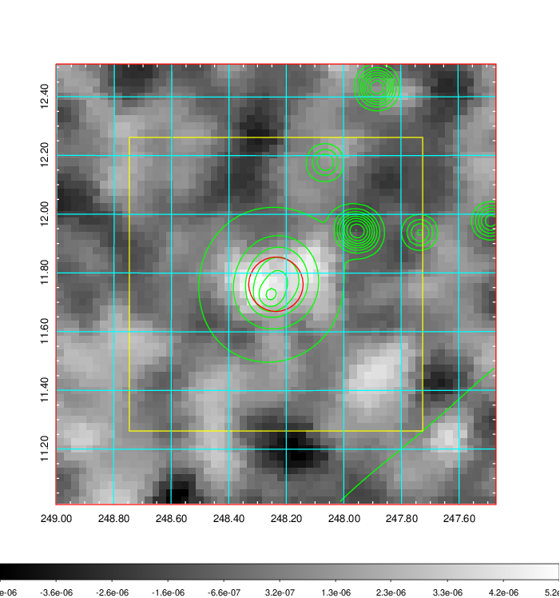 |

|[Redshift Histogram](../image/660/660_zg.pdf) | [DSS image(z1)](../image/660/660_dss_z1.pdf)      |  [DSS image(z2)](../image/660/660_dss_z2.pdf)    |
|-------------------|--------------------|-------------------|
|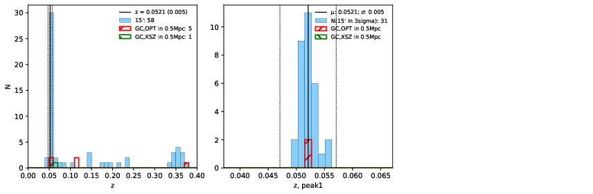 |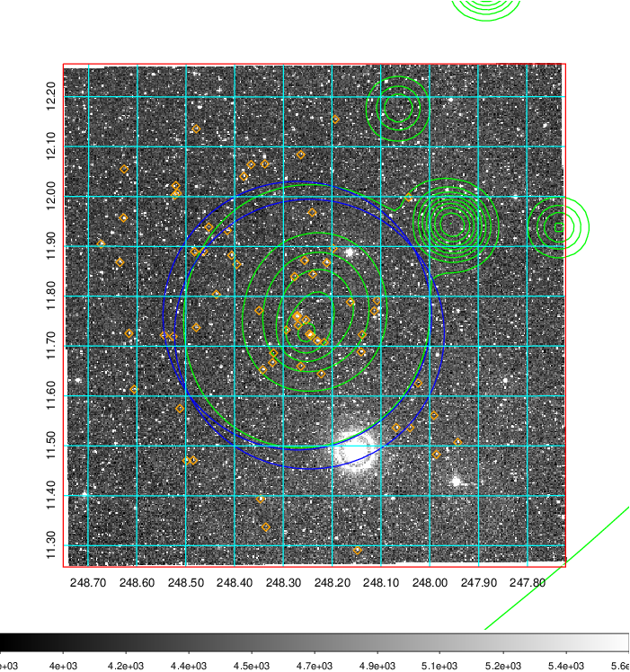  Blue circle for optical clusters;  Magenta circle for XSZ clusters;  all with r=1Mpc;  Only GC with Delta_z<0.01 are shown. | 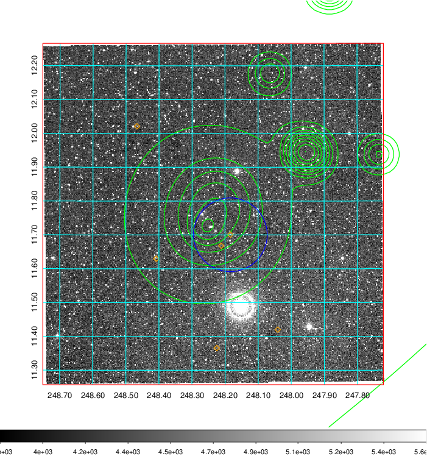 Blue circle for optical clusters;  Magenta circle for XSZ clusters;  all with r=1Mpc;  Only GC with Delta_z<0.01 are shown.  |

|[known Abell/XSZ clusters](../image/660/660_gc.pdf) | [2MASS image](../image/660/660_2mass.pdf)      |[SDSS image](../image/660/660_sdss.pdf)   |
|-------------------|-------------------|-------------------|
|  Magenta, blue and green circles  for optical, X-ray and SZ clusters  respectively, with redshift of clusters  labelled. The radius of circles  are 1Mpc.|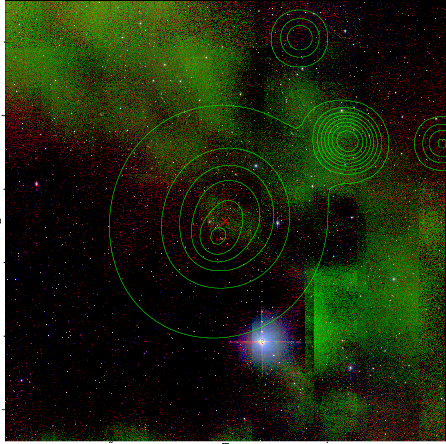  | 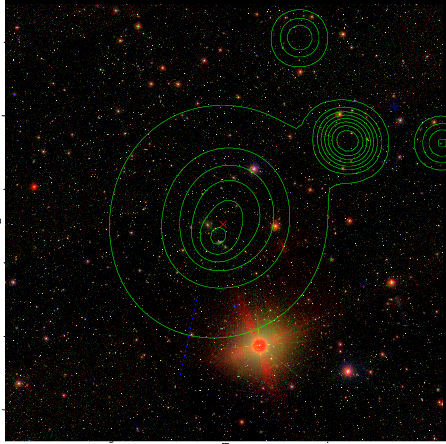  |

