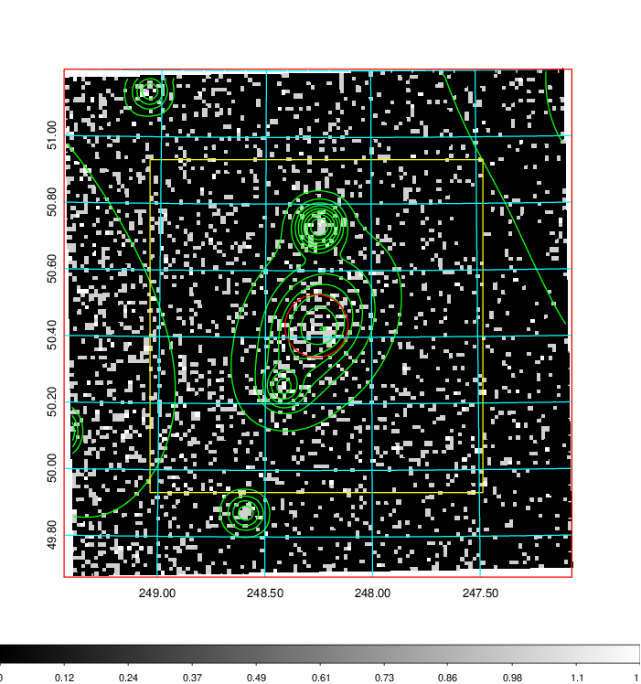
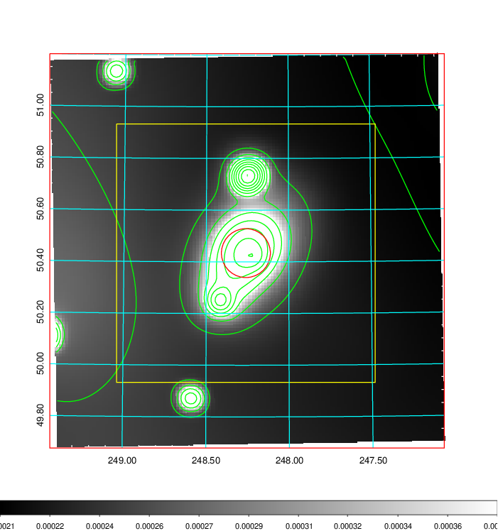
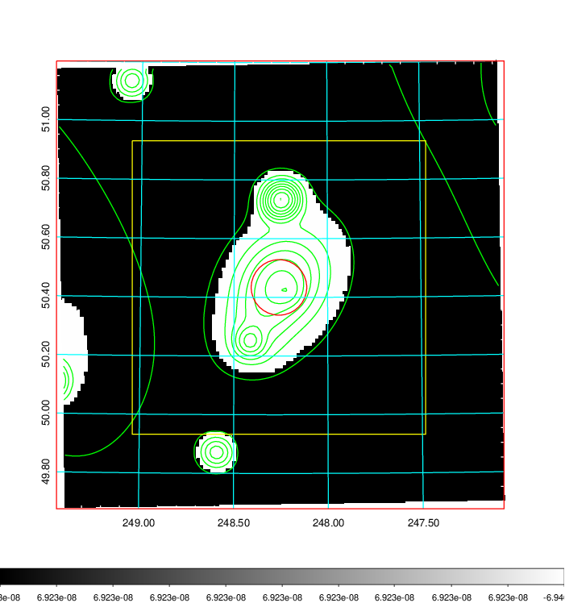
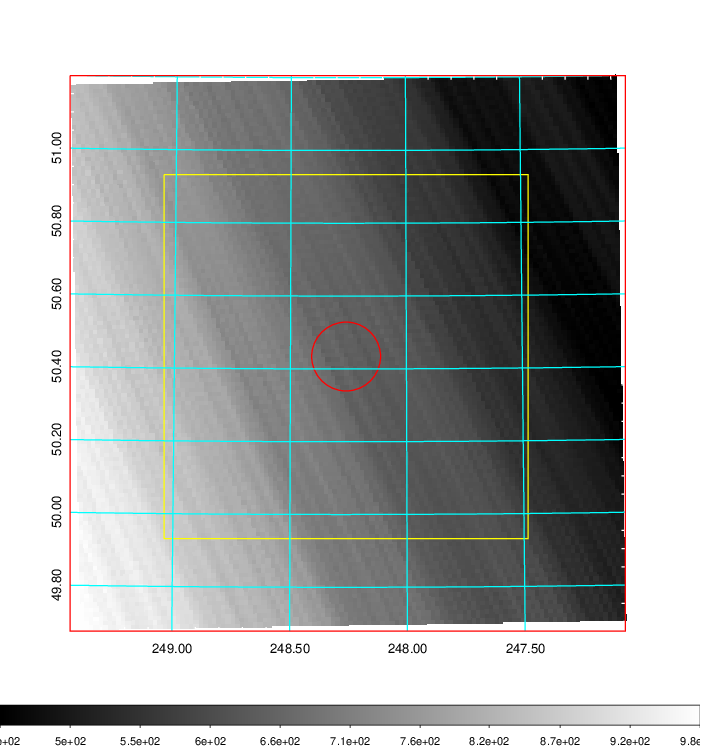
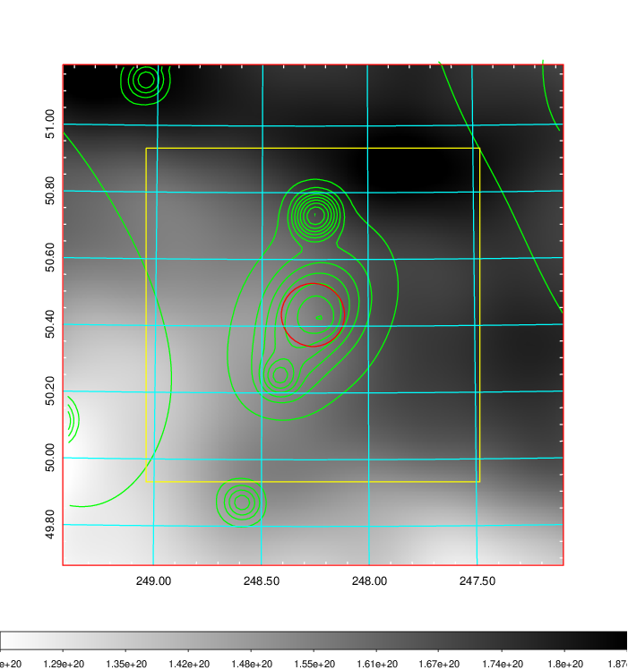
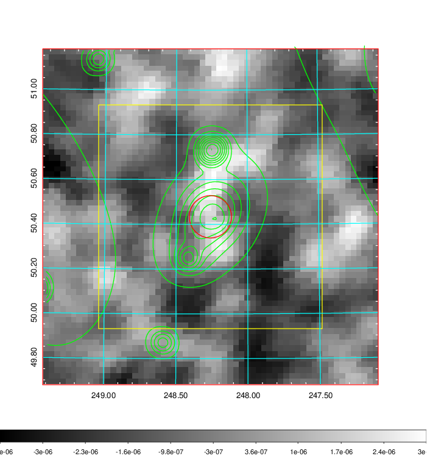
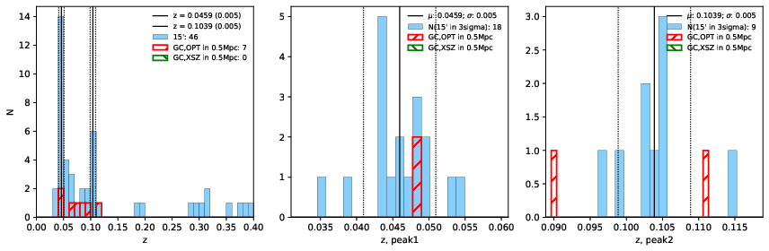
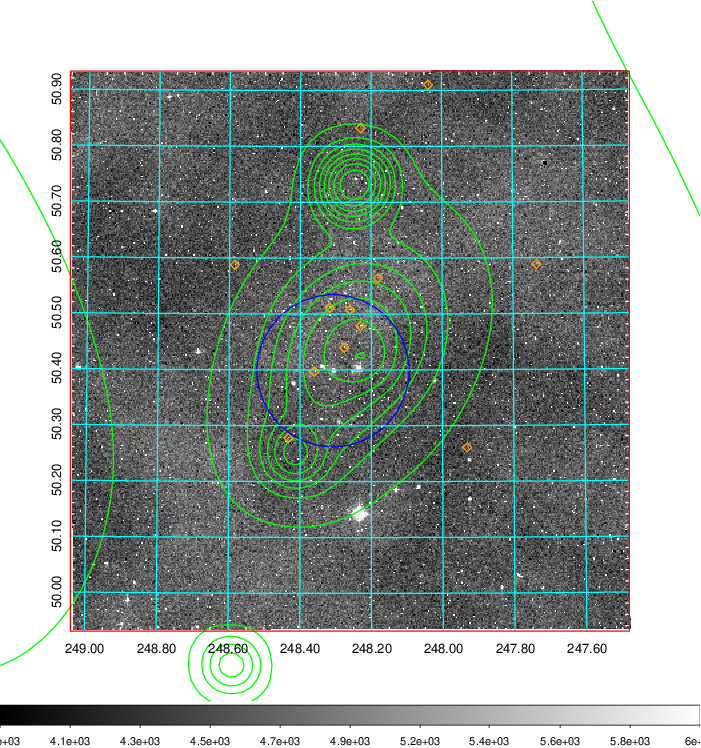
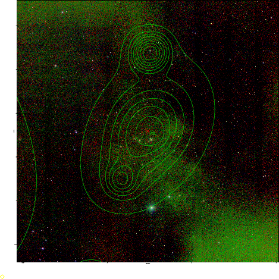
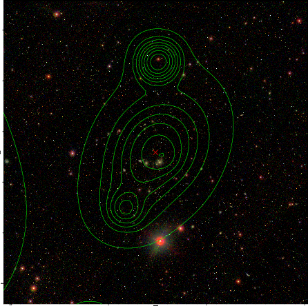

### 661

|Name|RAJ2000[deg]|DEJ2000[deg] |Ext[arcmin]| Ext,ml | z | z_src| C|GC(XSZ,Delta_z<0.01)| GC(OPT,Delta_z<0.01)|GC| R_sig[arcmin] | R500[arcmin] | R500[Mpc]| CRsig[c/s] | CR500[c/s] |L500[1E44 erg/s]|F500[1E-12 erg/s/cm^2]| M500[1E14 Msun]|Tx[keV]|Cnt_sig|Beta|Rc[arcmin]|Comment|Alias|
|---|---|---|---|---|---|------|---|--------|---------|----------|---|---|---|---|---|---|---|---|---|---|---|---|---|---|
|661| 248.260| 50.434| 5.68| 74.80| 0.0459(0.005)| z1, z_opt| S| -| N| C, N, W| 27.169| 12.725| 0.688| 0.279(0.058)| 0.256(0.053)| 0.238(0.051)| 4.812(1.032)| 0.97(0.11)| 2.13(0.15)| 256.9| 0.614(-0.062+0.091)| 6.040(-1.183+1.565)| -| t295|

|[RASS image](../image/661/661_img.pdf)|[filtered image](../image/661/661_fil.pdf)|[Segment image](../image/661/661_seg.pdf)|
|-------------------|--------------------|-------------------|
|   |    |   |

|[Exposure image](../image/661/661_mex.pdf)| [nH image](../image/661/661_nh.pdf)| [Planck image](../image/661/661_p.pdf)|
|-------------------|--------------------|-------------------|
|   |     |  |

|[Redshift Histogram](../image/661/661_zg.pdf) | [DSS image(z1)](../image/661/661_dss_z1.pdf)      |  [DSS image(z2)](../image/661/661_dss_z2.pdf)    |
|-------------------|--------------------|-------------------|
| |  Blue circle for optical clusters;  Magenta circle for XSZ clusters;  all with r=1Mpc;  Only GC with Delta_z<0.01 are shown. |  Blue circle for optical clusters;  Magenta circle for XSZ clusters;  all with r=1Mpc;  Only GC with Delta_z<0.01 are shown.  |

|[Previous-identified clusters](../image/661/661_gc.pdf) | [2MASS image](../image/661/661_2mass.pdf)      |[SDSS image](../image/661/661_sdss.pdf)   |
|-------------------|-------------------|-------------------|
|  Green, magenta, and blue circles  for optical, X-ray and SZ clusters  respectively, with redshift of clusters  labelled. The radius of circles  are 1Mpc.|  |   |

