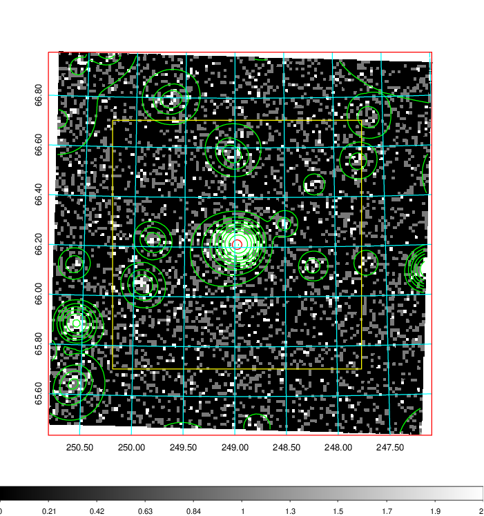
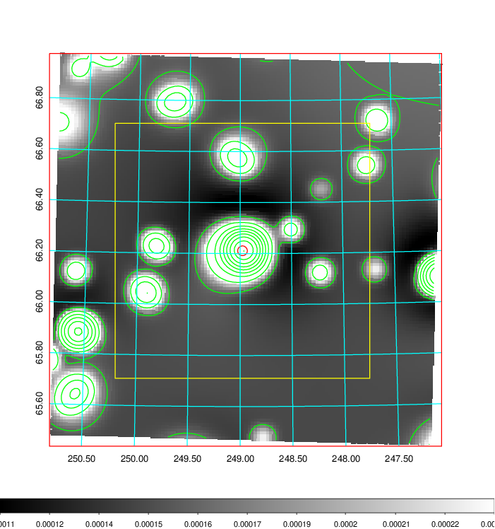
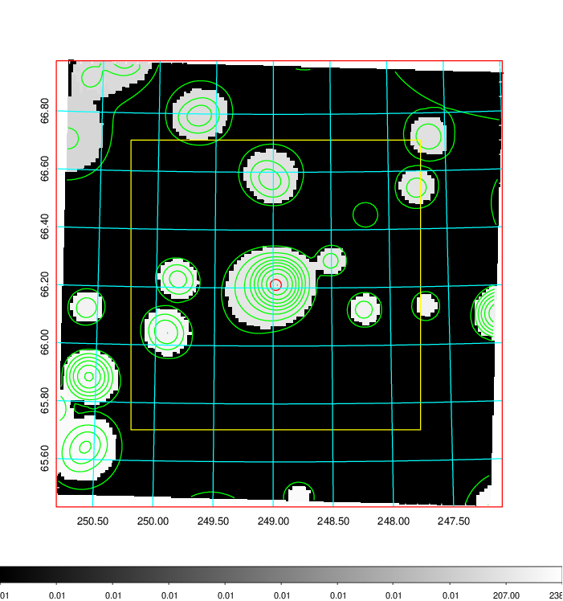
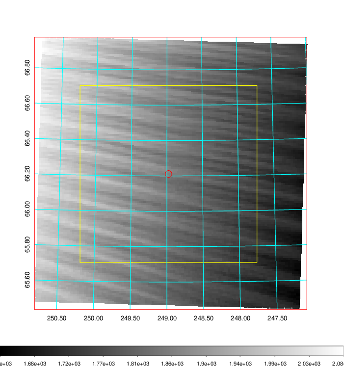
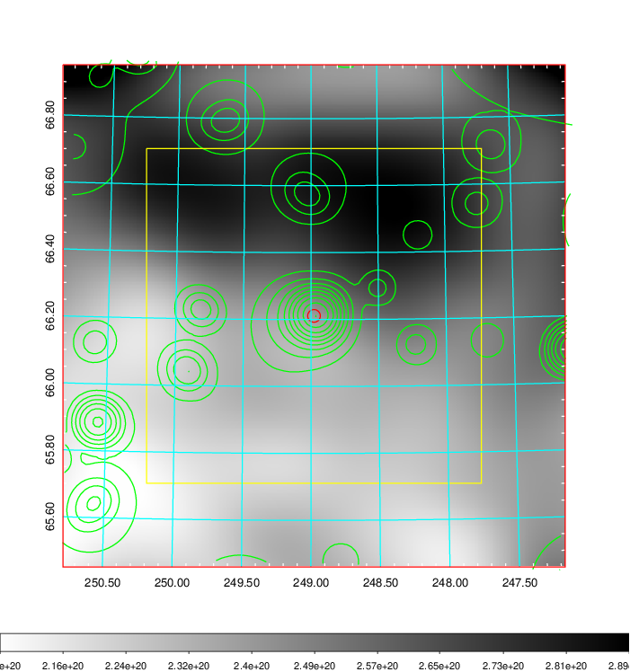
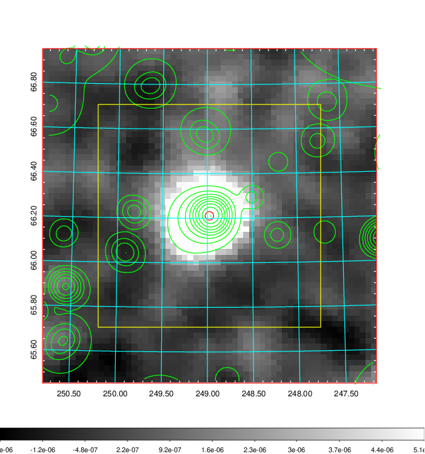
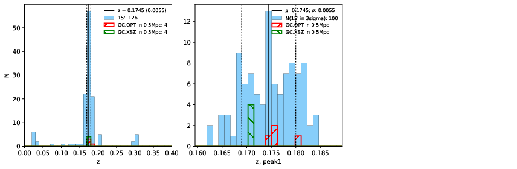
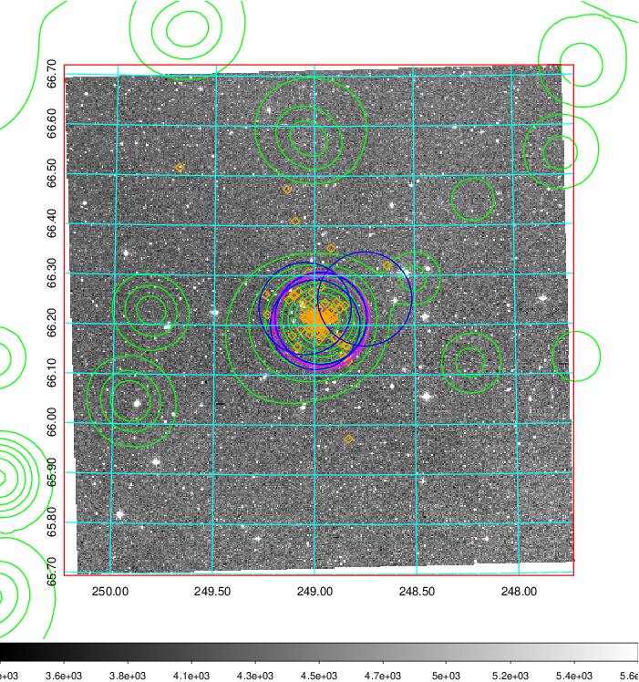
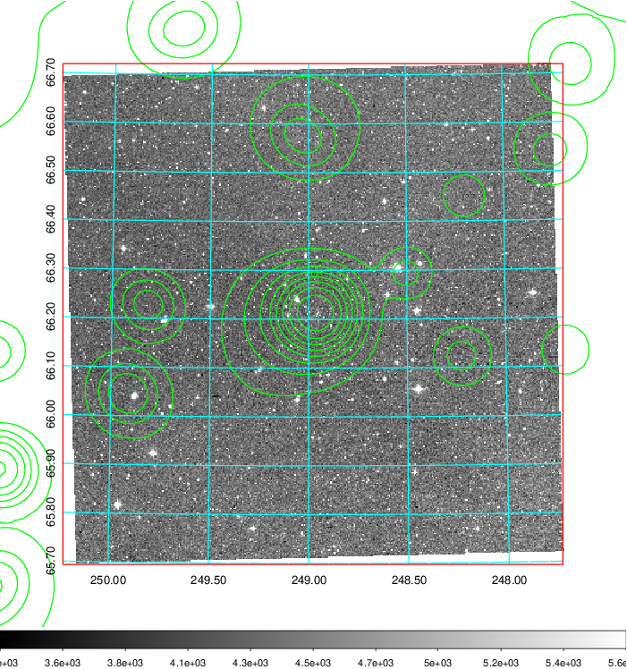
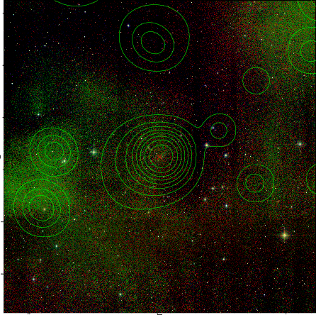

### 663

|Name|RAJ2000[deg]|DEJ2000[deg] |Ext[arcmin]| Ext,ml | z | z_src| C|GC(XSZ,Delta_z<0.01)| GC(OPT,Delta_z<0.01)|GC| R_sig[arcmin] | R500[arcmin] | R500[Mpc]| CRsig[c/s] | CR500[c/s] |L500[1E44 erg/s]|F500[1E-12 erg/s/cm^2]| M500[1E14 Msun]|Tx[keV]|Cnt_sig|Beta|Rc[arcmin]|Comment|Alias|
|---|---|---|---|---|---|------|---|--------|---------|----------|---|---|---|---|---|---|---|---|---|---|---|---|---|---|
|663| 248.978| 66.211| 1.14| 220.47| 0.1745(0.005)| z1, z_xsz| B| MCXC, PSZ2, Tar, XB| A, N, W| A, MCXC, N, PSZ2, Tar, W, XB| 11.238| 6.775| 1.203| 0.317(0.018)| 0.298(0.017)| 5.004(0.118)| 5.895(0.140)| 5.88(0.07)| 6.76(0.05)| 626.8| 0.842(-0.073+0.084)| 2.675(-0.375+0.386)| -| k052|

|[RASS image](../image/663/663_img.pdf)|[filtered image](../image/663/663_fil.pdf)|[Segment image](../image/663/663_seg.pdf)|
|-------------------|--------------------|-------------------|
|   |    |   |

|[Exposure image](../image/663/663_mex.pdf)| [nH image](../image/663/663_nh.pdf)| [Planck image](../image/663/663_p.pdf)|
|-------------------|--------------------|-------------------|
|   |     |  |

|[Redshift Histogram](../image/663/663_zg.pdf) | [DSS image(z1)](../image/663/663_dss_z1.pdf)      |  [DSS image(z2)](../image/663/663_dss_z2.pdf)    |
|-------------------|--------------------|-------------------|
| |  Blue circle for optical clusters;  Magenta circle for XSZ clusters;  all with r=1Mpc;  Only GC with Delta_z<0.01 are shown. |  Blue circle for optical clusters;  Magenta circle for XSZ clusters;  all with r=1Mpc;  Only GC with Delta_z<0.01 are shown.  |

|[known Abell/XSZ clusters](../image/663/663_gc.pdf) | [2MASS image](../image/663/663_2mass.pdf)      |
|-------------------|-------------------|
|  Magenta, blue and green circles  for optical, X-ray and SZ clusters  respectively, with redshift of clusters  labelled. The radius of circles  are 1Mpc.|  |

|[PS1 image](../image/663/663_ps1.pdf)            |
|-------------------|
|   |
