

### 665

|Name|RAJ2000[deg]|DEJ2000[deg] |Ext[arcmin]| Ext,ml | z | z_src| C|GC(XSZ,Delta_z<0.01)| GC(OPT,Delta_z<0.01)|GC| R_sig[arcmin] | R500[arcmin] | R500[Mpc]| CRsig[c/s] | CR500[c/s] |L500[1E44 erg/s]|F500[1E-12 erg/s/cm^2]| M500[1E14 Msun]|Tx[keV]|Cnt_sig|Beta|Rc[arcmin]|Comment|Alias|
|---|---|---|---|---|---|------|---|--------|---------|----------|---|---|---|---|---|---|---|---|---|---|---|---|---|---|
|665| 249.432| 55.470| 8.12| 36.75| 0.0298(0.005)| z1,| G| -| -| C, N, W| 12.700| 13.392| 0.480| 0.115(0.026)| 0.116(0.026)| 0.033(0.006)| 1.628(0.308)| 0.32(0.03)| 1.08(0.07)| 92.1| 0.728(-0.149+0.178)| 8.057(-1.813+1.785)| -| t396|

|[RASS image](../image/665/665_img.pdf)|[filtered image](../image/665/665_fil.pdf)|[Segment image](../image/665/665_seg.pdf)|
|-------------------|--------------------|-------------------|
| 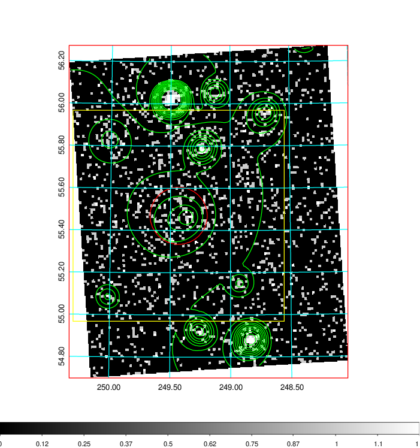  | 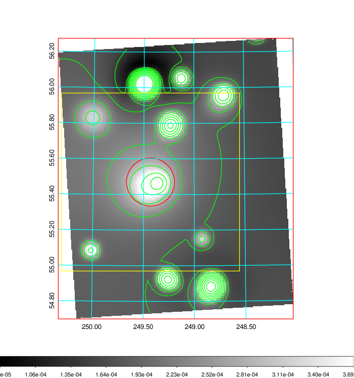   | 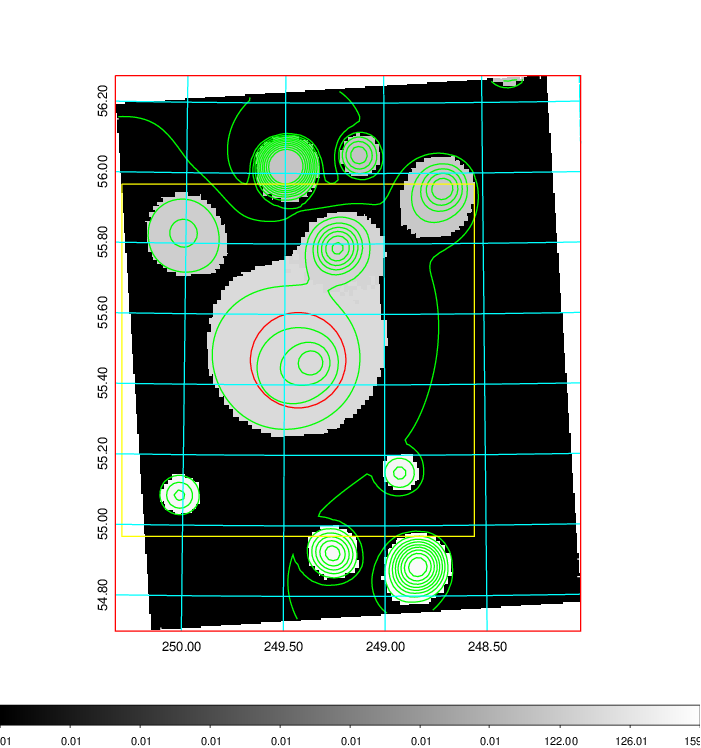  |

|[Exposure image](../image/665/665_mex.pdf)| [nH image](../image/665/665_nh.pdf)| [Planck image](../image/665/665_p.pdf)|
|-------------------|--------------------|-------------------|
|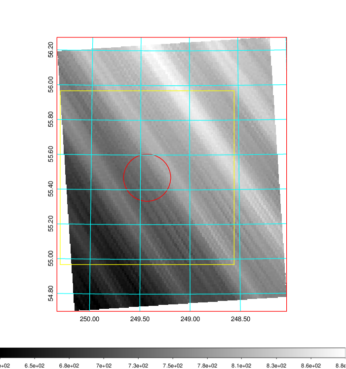   | 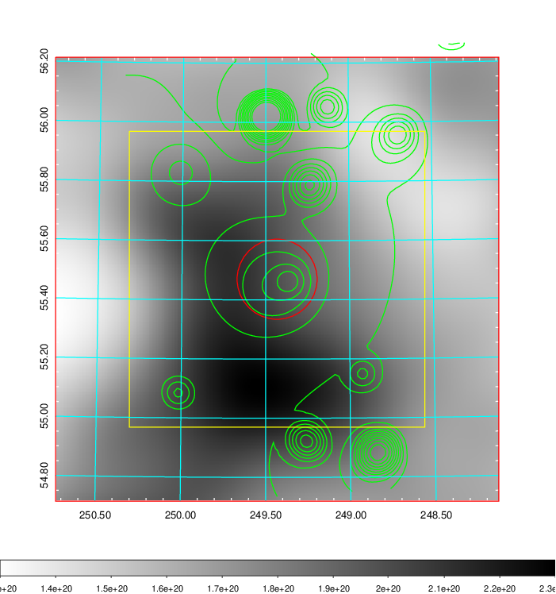    | 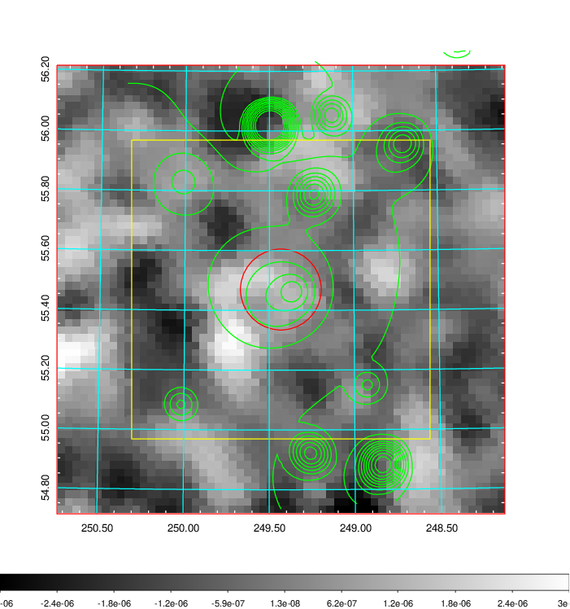 |

|[Redshift Histogram](../image/665/665_zg.pdf) | [DSS image(z1)](../image/665/665_dss_z1.pdf)      |  [DSS image(z2)](../image/665/665_dss_z2.pdf)    |
|-------------------|--------------------|-------------------|
|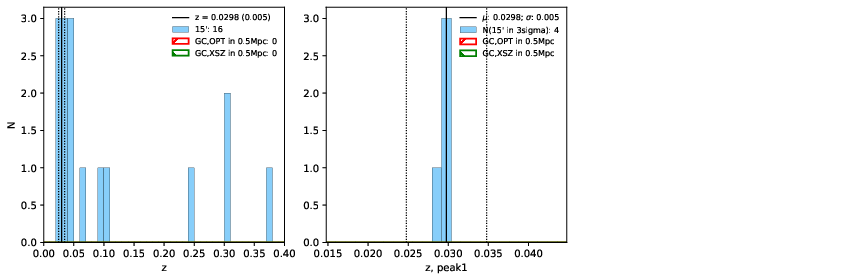 |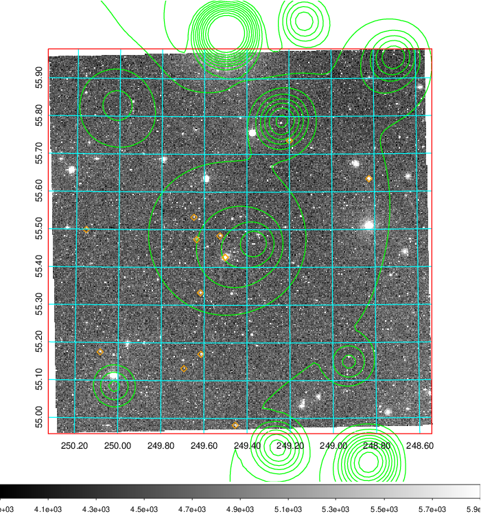  Blue circle for optical clusters;  Magenta circle for XSZ clusters;  all with r=1Mpc;  Only GC with Delta_z<0.01 are shown. | 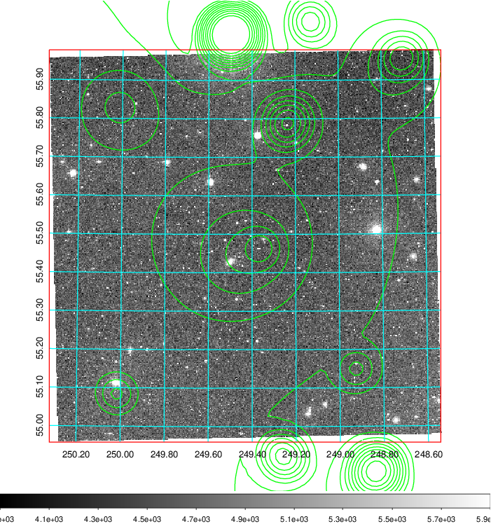 Blue circle for optical clusters;  Magenta circle for XSZ clusters;  all with r=1Mpc;  Only GC with Delta_z<0.01 are shown.  |

|[Previous-identified clusters](../image/665/665_gc.pdf) | [2MASS image](../image/665/665_2mass.pdf)      |[SDSS image](../image/665/665_sdss.pdf)   |
|-------------------|-------------------|-------------------|
|  Green, magenta, and blue circles  for optical, X-ray and SZ clusters  respectively, with redshift of clusters  labelled. The radius of circles  are 1Mpc.|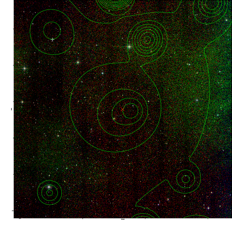  | 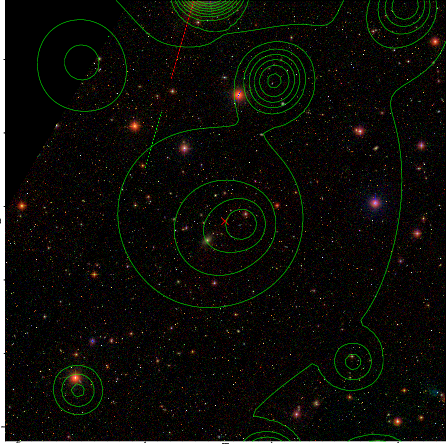  |

