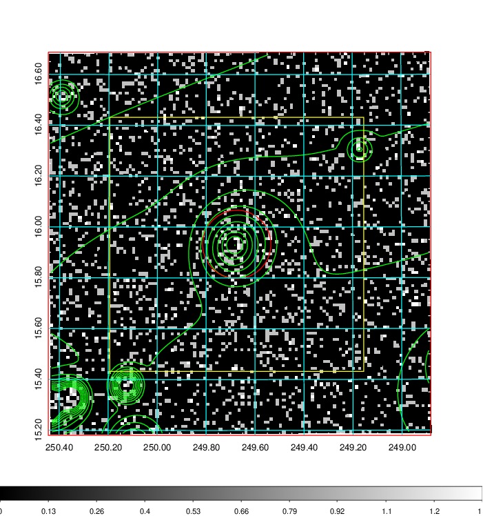
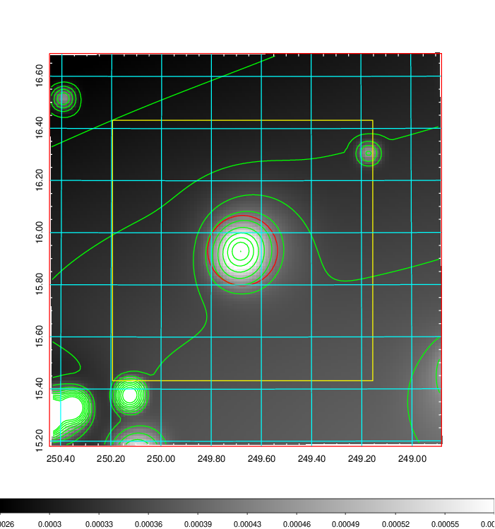
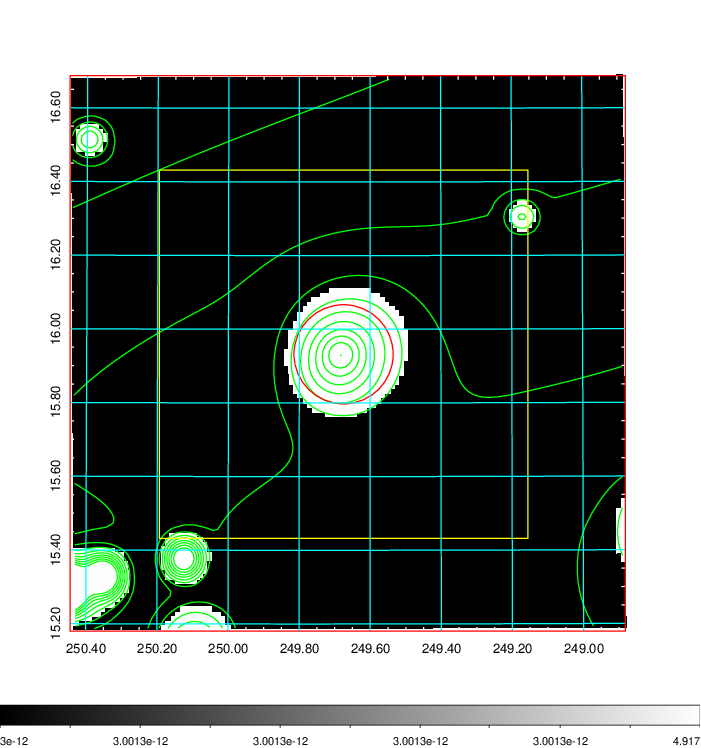
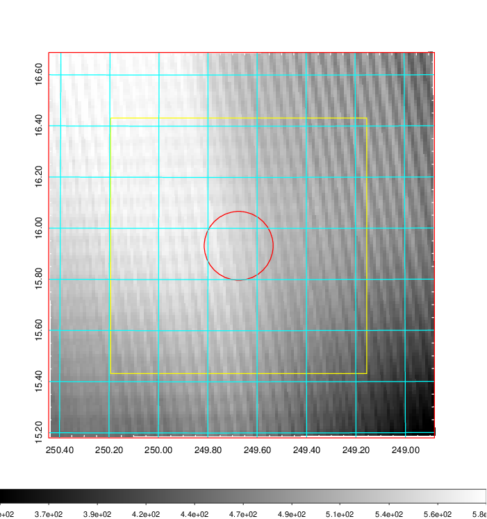
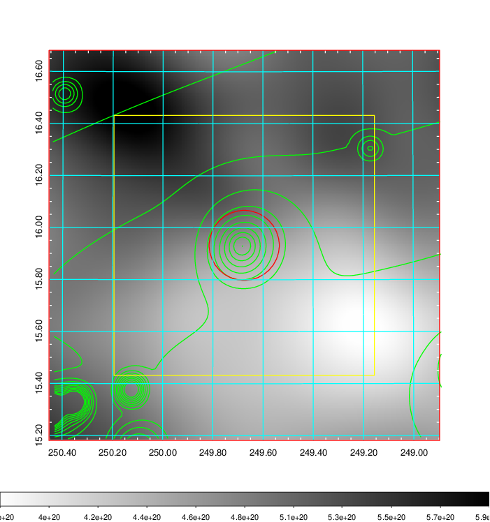
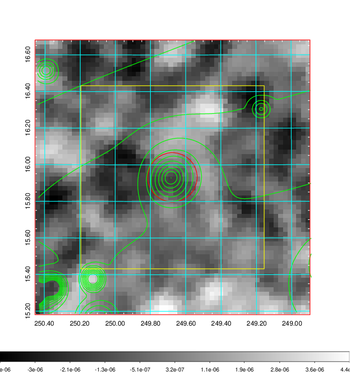
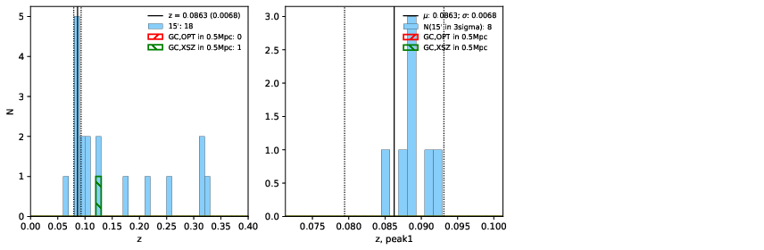
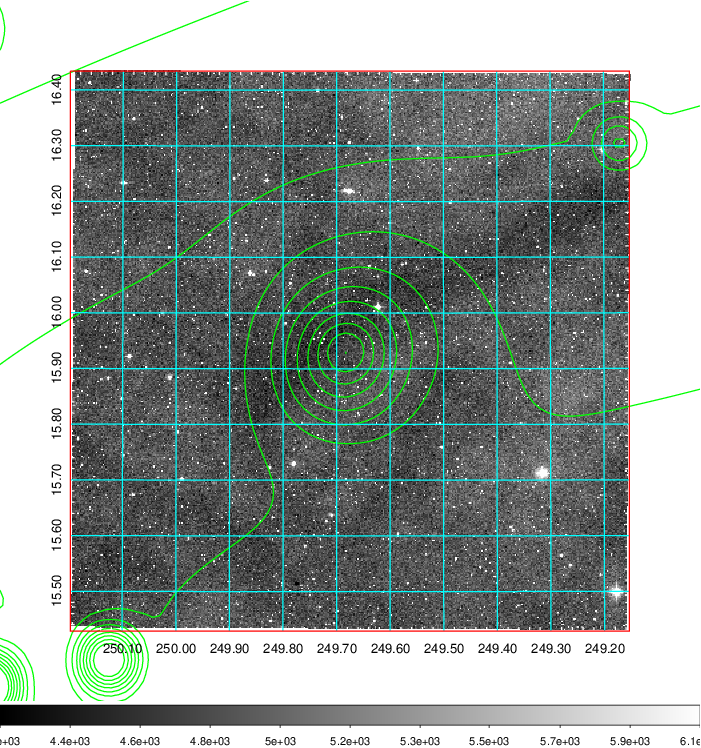
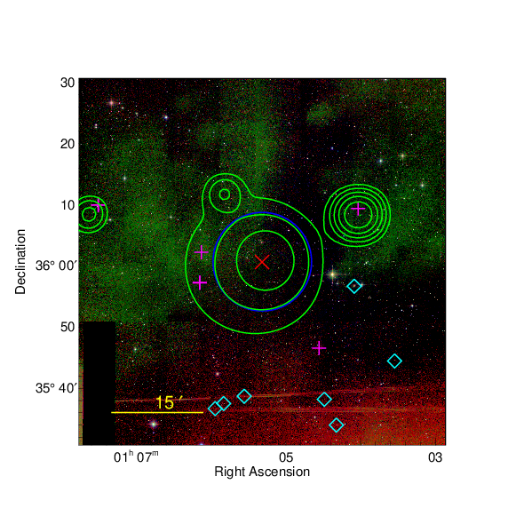
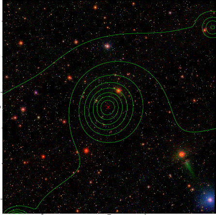

### 666

|Name|RAJ2000[deg]|DEJ2000[deg] |Ext[arcmin]| Ext,ml | z | z_src| C|GC(XSZ,Delta_z<0.01)| GC(OPT,Delta_z<0.01)|GC| R_sig[arcmin] | R500[arcmin] | R500[Mpc]| CRsig[c/s] | CR500[c/s] |L500[1E44 erg/s]|F500[1E-12 erg/s/cm^2]| M500[1E14 Msun]|Tx[keV]|Cnt_sig|Beta|Rc[arcmin]|Comment|Alias|
|---|---|---|---|---|---|------|---|--------|---------|----------|---|---|---|---|---|---|---|---|---|---|---|---|---|---|
|666| 249.675| 15.932| 8.08| 31.21| 0.0863(0.007)| z1,| G| -| -| C, F20, W| 14.650| 7.396| 0.718| 0.093(0.039)| 0.086(0.036)| 0.280(0.091)| 1.509(0.491)| 1.14(0.19)| 2.39(0.25)| 89.7| 0.818(-0.172+0.129)| 5.220(-1.517+1.235)| -| t394|

|[RASS image](../image/666/666_img.pdf)|[filtered image](../image/666/666_fil.pdf)|[Segment image](../image/666/666_seg.pdf)|
|-------------------|--------------------|-------------------|
|   |    |   |

|[Exposure image](../image/666/666_mex.pdf)| [nH image](../image/666/666_nh.pdf)| [Planck image](../image/666/666_p.pdf)|
|-------------------|--------------------|-------------------|
|   |     |  |

|[Redshift Histogram](../image/666/666_zg.pdf) | [DSS image(z1)](../image/666/666_dss_z1.pdf)      |  [DSS image(z2)](../image/666/666_dss_z2.pdf)    |
|-------------------|--------------------|-------------------|
| |  Blue circle for optical clusters;  Magenta circle for XSZ clusters;  all with r=1Mpc;  Only GC with Delta_z<0.01 are shown. |  Blue circle for optical clusters;  Magenta circle for XSZ clusters;  all with r=1Mpc;  Only GC with Delta_z<0.01 are shown.  |

|[Previous-identified clusters](../image/666/666_gc.pdf) | [2MASS image](../image/666/666_2mass.pdf)      |[SDSS image](../image/666/666_sdss.pdf)   |
|-------------------|-------------------|-------------------|
|  Green, magenta, and blue circles  for optical, X-ray and SZ clusters  respectively, with redshift of clusters  labelled. The radius of circles  are 1Mpc.|  |   |

