

### 668

|Name|RAJ2000[deg]|DEJ2000[deg] |Ext[arcmin]| Ext,ml | z | z_src| C|GC(XSZ,Delta_z<0.01)| GC(OPT,Delta_z<0.01)|GC| R_sig[arcmin] | R500[arcmin] | R500[Mpc]| CRsig[c/s] | CR500[c/s] |L500[1E44 erg/s]|F500[1E-12 erg/s/cm^2]| M500[1E14 Msun]|Tx[keV]|Cnt_sig|Beta|Rc[arcmin]|Comment|Alias|
|---|---|---|---|---|---|------|---|--------|---------|----------|---|---|---|---|---|---|---|---|---|---|---|---|---|---|
|668| 250.230| 82.564| 2.77| 45.62| 0.2060(0.000)| z_xsz| B| MCXC| N, Zw| MCXC, N, W| 26.675| 5.208| 1.055| 0.127(0.032)| 0.112(0.028)| 2.534(0.571)| 2.064(0.465)| 4.10(0.44)| 5.47(0.38)| 323.9| 0.522(-0.016+0.029)| 2.551(-0.322+0.485)| -| k346|

|[RASS image](../image/668/668_img.pdf)|[filtered image](../image/668/668_fil.pdf)|[Segment image](../image/668/668_seg.pdf)|
|-------------------|--------------------|-------------------|
| 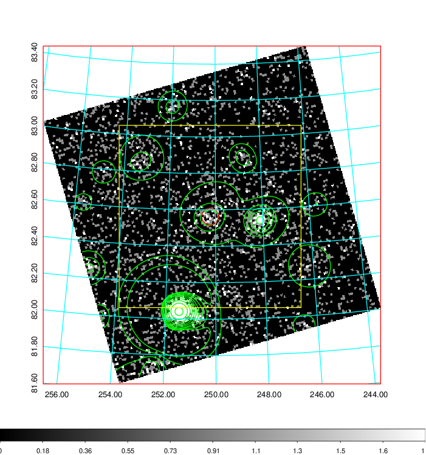  | 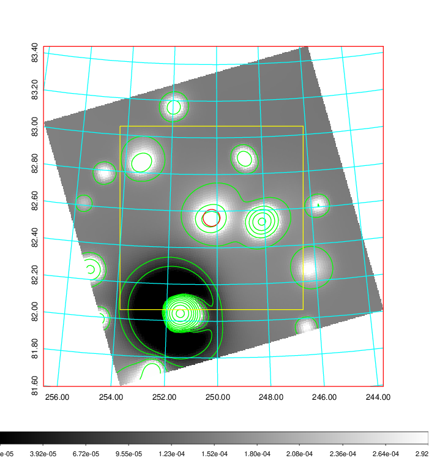   | 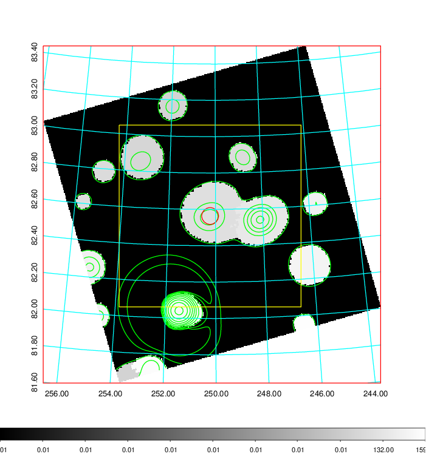  |

|[Exposure image](../image/668/668_mex.pdf)| [nH image](../image/668/668_nh.pdf)| [Planck image](../image/668/668_p.pdf)|
|-------------------|--------------------|-------------------|
|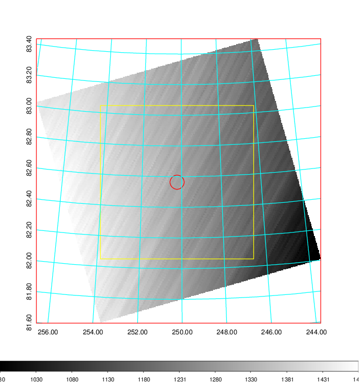   | 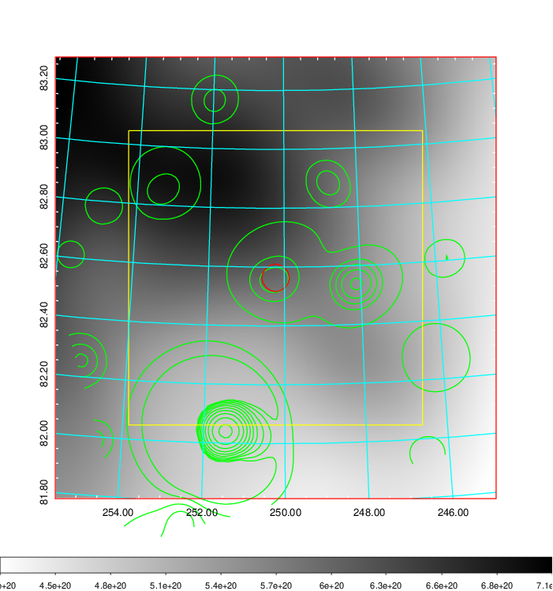    | 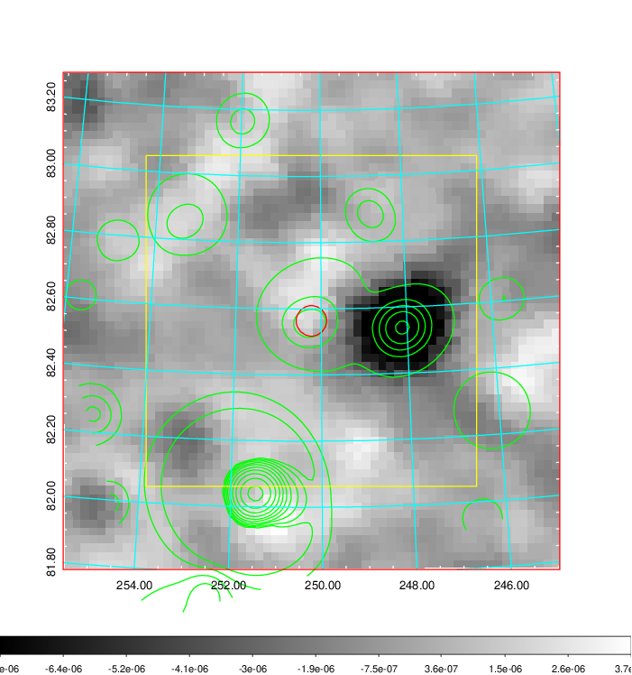 |

|[Redshift Histogram](../image/668/668_zg.pdf) | [DSS image(z1)](../image/668/668_dss_z1.pdf)      |  [DSS image(z2)](../image/668/668_dss_z2.pdf)    |
|-------------------|--------------------|-------------------|
|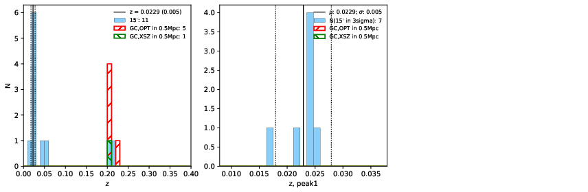 |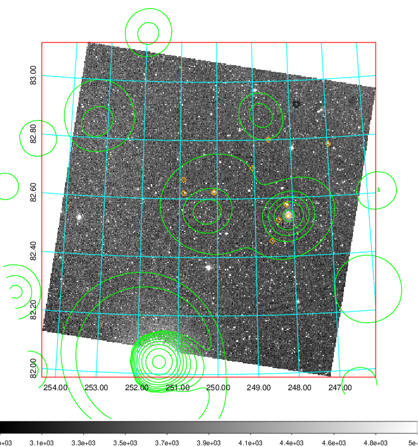  Blue circle for optical clusters;  Magenta circle for XSZ clusters;  all with r=1Mpc;  Only GC with Delta_z<0.01 are shown. | 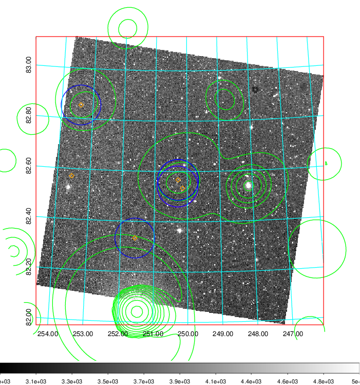 Blue circle for optical clusters;  Magenta circle for XSZ clusters;  all with r=1Mpc;  Only GC with Delta_z<0.01 are shown.  |

|[Previous-identified clusters](../image/668/668_gc.pdf) | [2MASS image](../image/668/668_2mass.pdf)      |
|-------------------|-------------------|
|  Green, magenta, and blue circles  for optical, X-ray and SZ clusters  respectively, with redshift of clusters  labelled. The radius of circles  are 1Mpc.|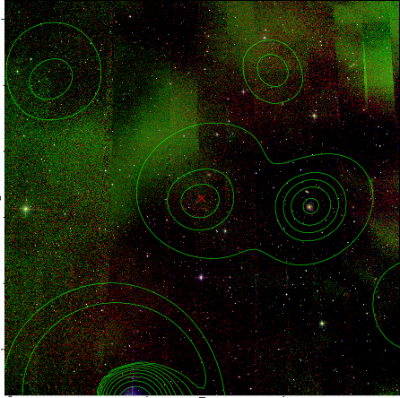  |

|[PS1 image](../image/668/668_ps1.pdf)            |
|-------------------|
| 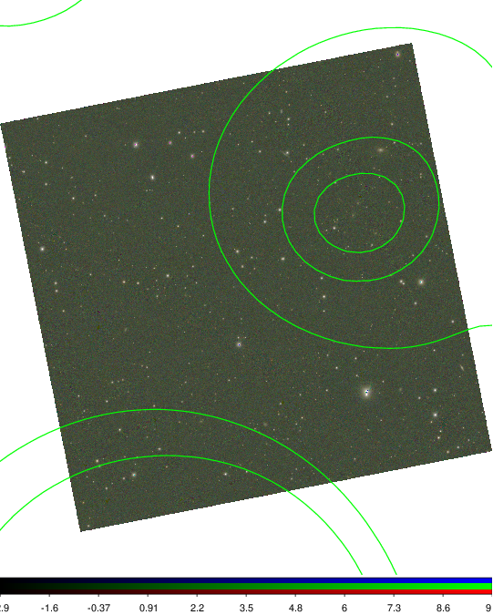  |
