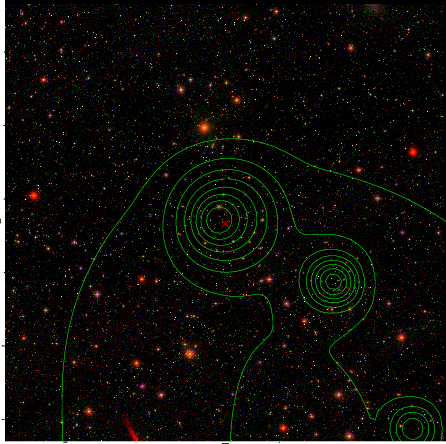

### 669

|Name|RAJ2000[deg]|DEJ2000[deg] |Ext[arcmin]| Ext,ml | z | z_src| C|GC(XSZ,Delta_z<0.01)| GC(OPT,Delta_z<0.01)|GC| R_sig[arcmin] | R500[arcmin] | R500[Mpc]| CRsig[c/s] | CR500[c/s] |L500[1E44 erg/s]|F500[1E-12 erg/s/cm^2]| M500[1E14 Msun]|Tx[keV]|Cnt_sig|Beta|Rc[arcmin]|Comment|Alias|
|---|---|---|---|---|---|------|---|--------|---------|----------|---|---|---|---|---|---|---|---|---|---|---|---|---|---|
|669| 251.126| 14.284| 4.65| 44.01| 0.0528(0.007)| z1, z_opt| S| -| W| F20, N, W| 30.700| 12.706| 0.784| 0.371(0.096)| 0.338(0.088)| 0.391(0.185)| 5.905(2.792)| 1.44(0.35)| 2.73(0.41)| 418.7| 0.508(-0.006+0.013)| 8.057(-0.609+0.508)| -| t239|

|[RASS image](../image/669/669_img.pdf)|[filtered image](../image/669/669_fil.pdf)|[Segment image](../image/669/669_seg.pdf)|
|-------------------|--------------------|-------------------|
|   |    |   |

|[Exposure image](../image/669/669_mex.pdf)| [nH image](../image/669/669_nh.pdf)| [Planck image](../image/669/669_p.pdf)|
|-------------------|--------------------|-------------------|
|   |     |  |

|[Redshift Histogram](../image/669/669_zg.pdf) | [DSS image(z1)](../image/669/669_dss_z1.pdf)      |  [DSS image(z2)](../image/669/669_dss_z2.pdf)    |
|-------------------|--------------------|-------------------|
| |  Blue circle for optical clusters;  Magenta circle for XSZ clusters;  all with r=1Mpc;  Only GC with Delta_z<0.01 are shown. |  Blue circle for optical clusters;  Magenta circle for XSZ clusters;  all with r=1Mpc;  Only GC with Delta_z<0.01 are shown.  |

|[Previous-identified clusters](../image/669/669_gc.pdf) | [2MASS image](../image/669/669_2mass.pdf)      |[SDSS image](../image/669/669_sdss.pdf)   |
|-------------------|-------------------|-------------------|
|  Green, magenta, and blue circles  for optical, X-ray and SZ clusters  respectively, with redshift of clusters  labelled. The radius of circles  are 1Mpc.|  |   |

