

### 67

|Name|RAJ2000[deg]|DEJ2000[deg] |Ext[arcmin]| Ext,ml | z | z_src| C|GC(XSZ,Delta_z<0.01)| GC(OPT,Delta_z<0.01)|GC| R_sig[arcmin] | R500[arcmin] | R500[Mpc]| CRsig[c/s] | CR500[c/s] |L500[1E44 erg/s]|F500[1E-12 erg/s/cm^2]| M500[1E14 Msun]|Tx[keV]|Cnt_sig|Beta|Rc[arcmin]|Comment|Alias|
|---|---|---|---|---|---|------|---|--------|---------|----------|---|---|---|---|---|---|---|---|---|---|---|---|---|---|
|67| 20.238| -13.852| 1.85| 134.48| 0.0540(0.005)| z1, z_xsz| B| MCXC, PSZ2, Tar| N, W| MCXC, N, PSZ2, Tar, W| 18.281| 13.683| 0.863| 0.584(0.058)| 0.561(0.055)| 0.750(0.038)| 10.810(0.545)| 1.92(0.05)| 3.26(0.05)| 248.4| 0.646(-0.039+0.048)| 2.642(-0.404+0.456)| -| k185|

|[RASS image](../image/67/67_img.pdf)|[filtered image](../image/67/67_fil.pdf)|[Segment image](../image/67/67_seg.pdf)|
|-------------------|--------------------|-------------------|
| 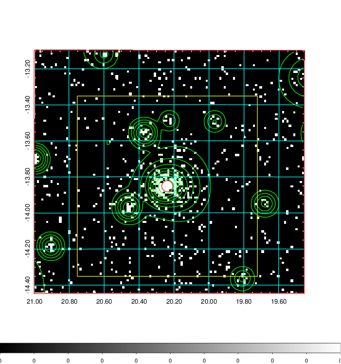  | 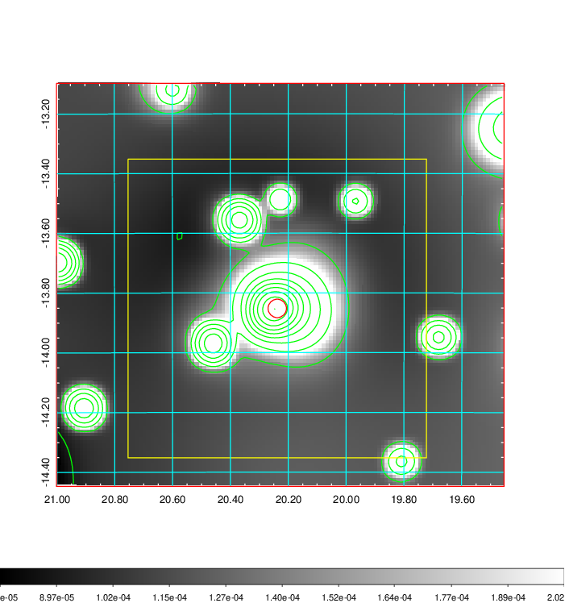   | 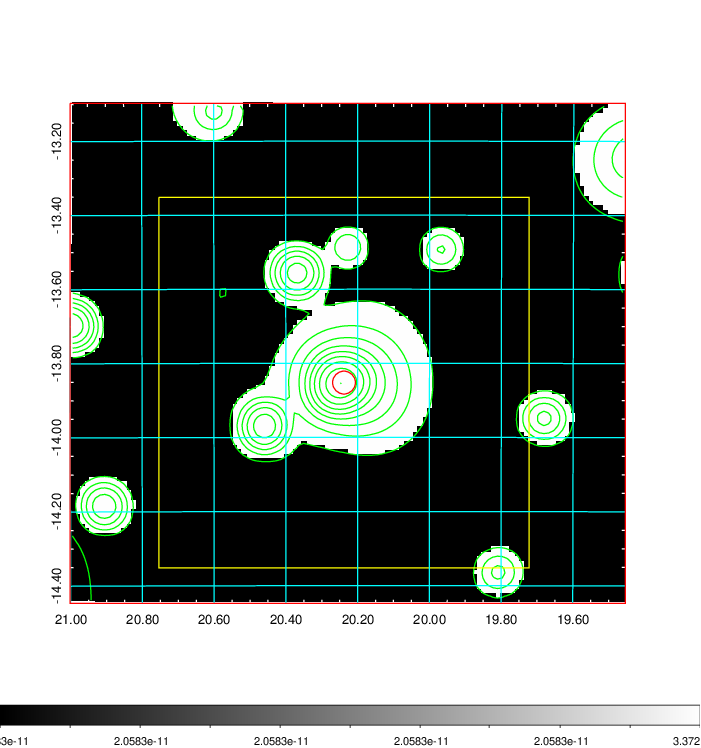  |

|[Exposure image](../image/67/67_mex.pdf)| [nH image](../image/67/67_nh.pdf)| [Planck image](../image/67/67_p.pdf)|
|-------------------|--------------------|-------------------|
|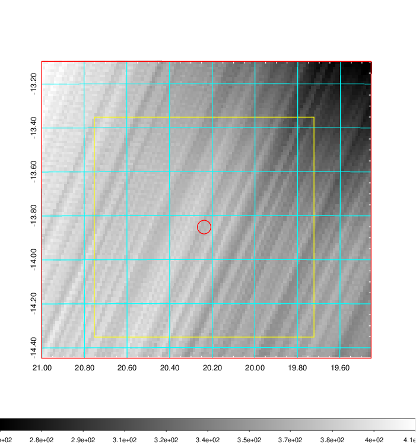   | 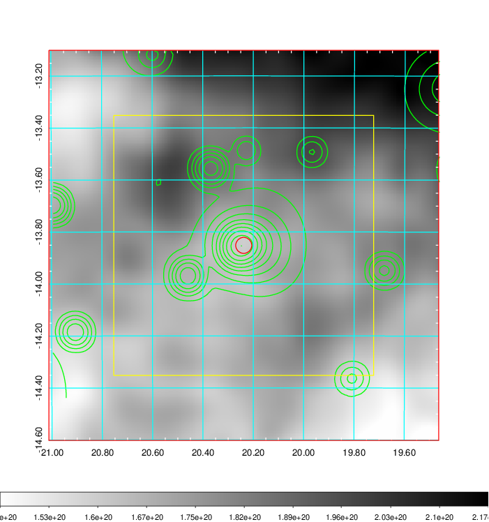    | 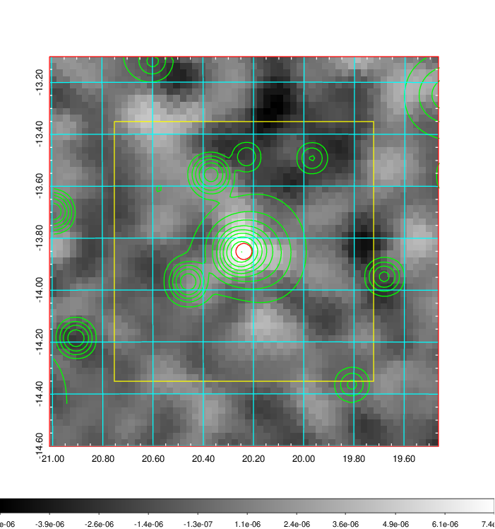 |

|[Redshift Histogram](../image/67/67_zg.pdf) | [DSS image(z1)](../image/67/67_dss_z1.pdf)      |  [DSS image(z2)](../image/67/67_dss_z2.pdf)    |
|-------------------|--------------------|-------------------|
|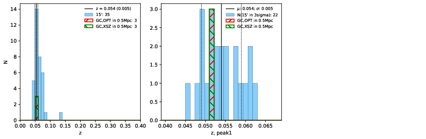 |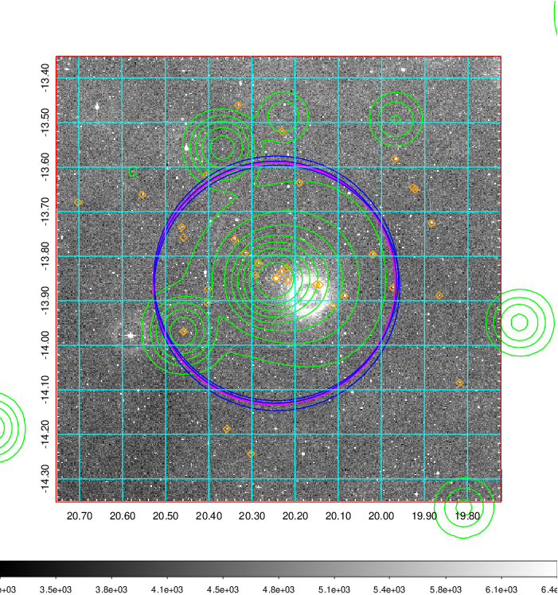  Blue circle for optical clusters;  Magenta circle for XSZ clusters;  all with r=1Mpc;  Only GC with Delta_z<0.01 are shown. | 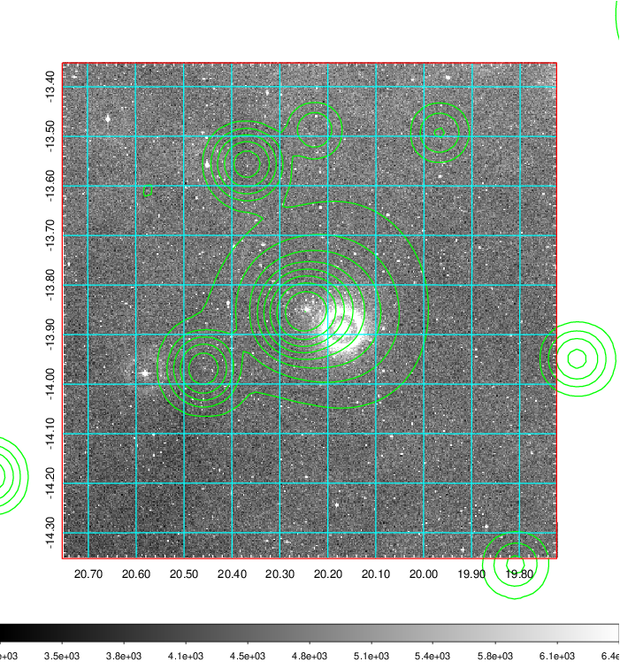 Blue circle for optical clusters;  Magenta circle for XSZ clusters;  all with r=1Mpc;  Only GC with Delta_z<0.01 are shown.  |

|[Previous-identified clusters](../image/67/67_gc.pdf) | [2MASS image](../image/67/67_2mass.pdf)      |
|-------------------|-------------------|
|  Green, magenta, and blue circles  for optical, X-ray and SZ clusters  respectively, with redshift of clusters  labelled. The radius of circles  are 1Mpc.|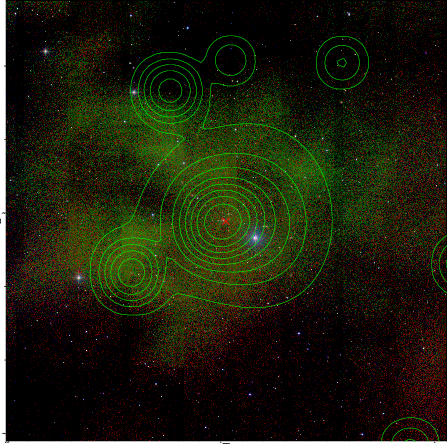  |

|[DES image](../image/67/67_des.pdf)   |[ATLAS image](../image/67/67_s.pdf)        |
|-------------------|-------------------|
| 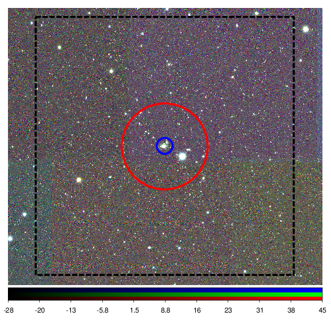  | 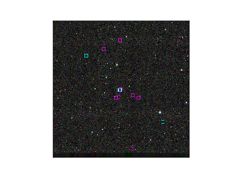  |
