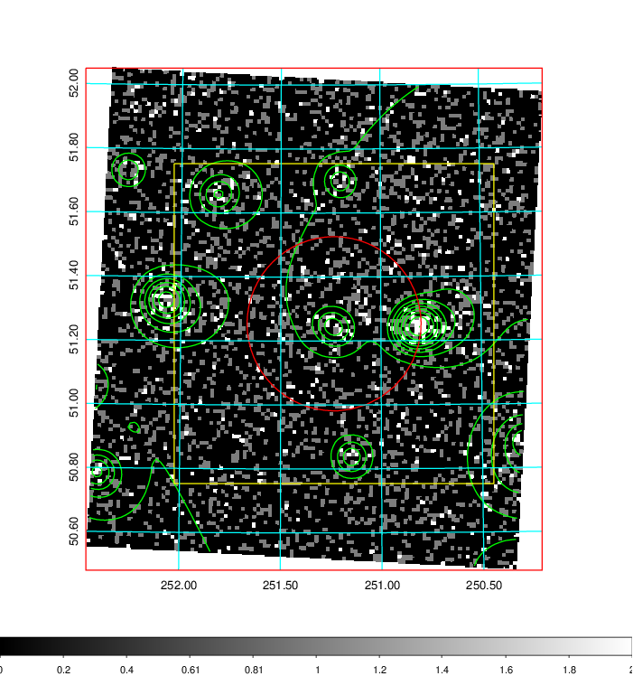
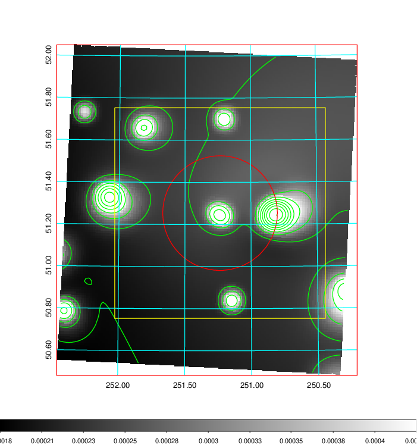
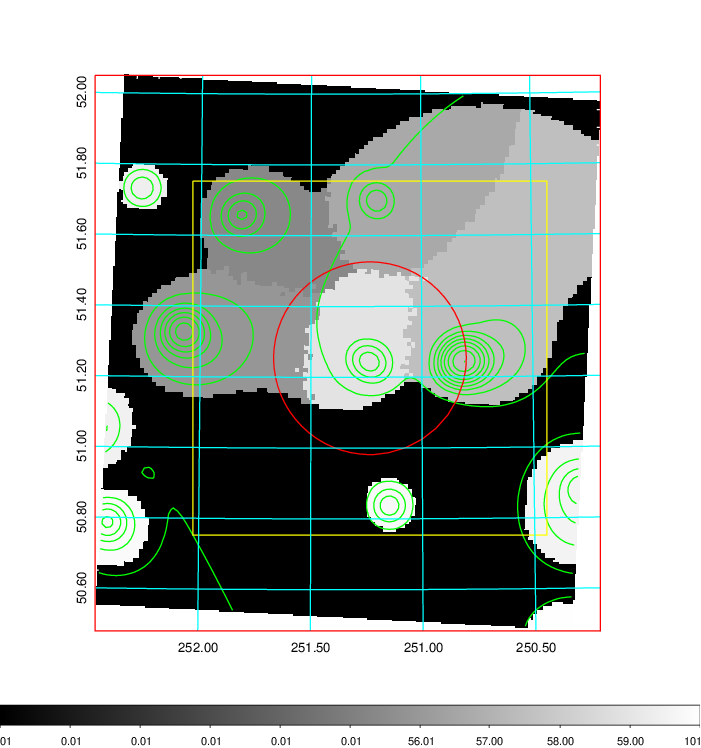
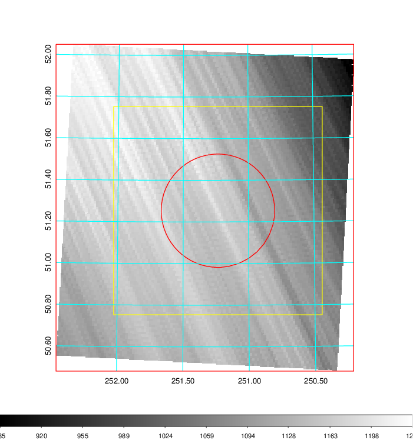
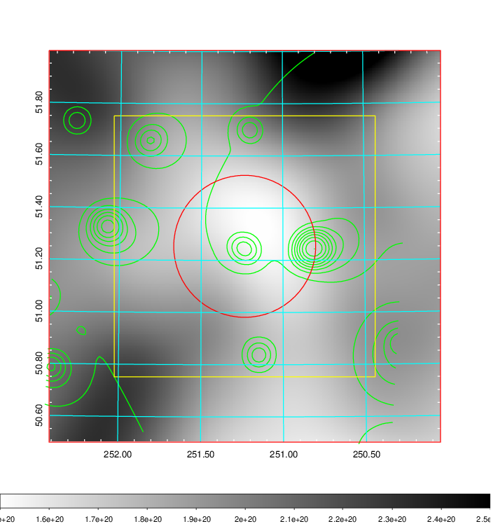
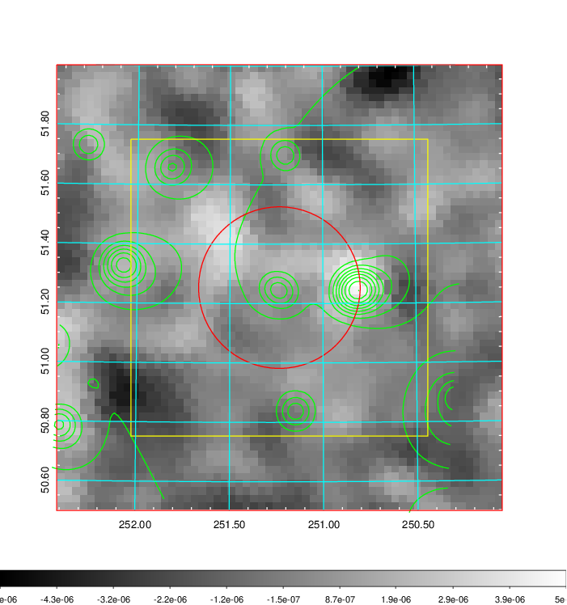
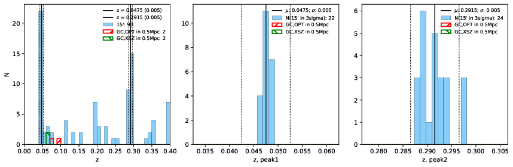
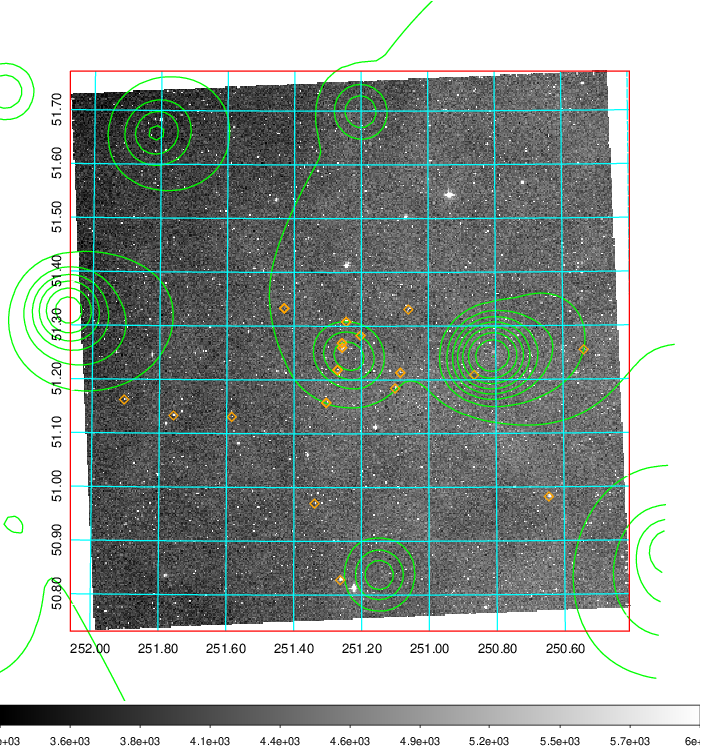
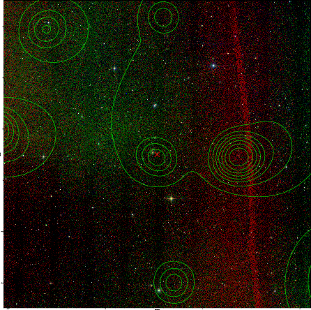
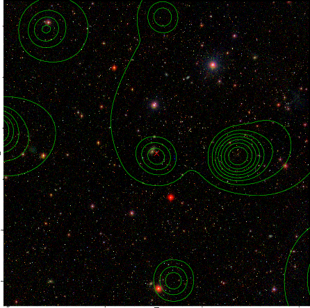

### 670

|Name|RAJ2000[deg]|DEJ2000[deg] |Ext[arcmin]| Ext,ml | z | z_src| C|GC(XSZ,Delta_z<0.01)| GC(OPT,Delta_z<0.01)|GC| R_sig[arcmin] | R500[arcmin] | R500[Mpc]| CRsig[c/s] | CR500[c/s] |L500[1E44 erg/s]|F500[1E-12 erg/s/cm^2]| M500[1E14 Msun]|Tx[keV]|Cnt_sig|Beta|Rc[arcmin]|Comment|Alias|
|---|---|---|---|---|---|------|---|--------|---------|----------|---|---|---|---|---|---|---|---|---|---|---|---|---|---|
|670| 251.234| 51.254| 16.33| 29.03| 0.0475(0.005)| z1,| G| -| -| C, F20, N, SPI, W| 29.144| 11.709| 0.654| 0.211(0.042)| 0.192(0.038)| 0.185(0.063)| 3.474(1.181)| 0.83(0.15)| 1.94(0.21)| 610.9| 0.503(-0.002+0.005)| 5.480(-0.152+0.184)| -| t556|

|[RASS image](../image/670/670_img.pdf)|[filtered image](../image/670/670_fil.pdf)|[Segment image](../image/670/670_seg.pdf)|
|-------------------|--------------------|-------------------|
|   |    |   |

|[Exposure image](../image/670/670_mex.pdf)| [nH image](../image/670/670_nh.pdf)| [Planck image](../image/670/670_p.pdf)|
|-------------------|--------------------|-------------------|
|   |     |  |

|[Redshift Histogram](../image/670/670_zg.pdf) | [DSS image(z1)](../image/670/670_dss_z1.pdf)      |  [DSS image(z2)](../image/670/670_dss_z2.pdf)    |
|-------------------|--------------------|-------------------|
| |  Blue circle for optical clusters;  Magenta circle for XSZ clusters;  all with r=1Mpc;  Only GC with Delta_z<0.01 are shown. |  Blue circle for optical clusters;  Magenta circle for XSZ clusters;  all with r=1Mpc;  Only GC with Delta_z<0.01 are shown.  |

|[known Abell/XSZ clusters](../image/670/670_gc.pdf) | [2MASS image](../image/670/670_2mass.pdf)      |[SDSS image](../image/670/670_sdss.pdf)   |
|-------------------|-------------------|-------------------|
|  Magenta, blue and green circles  for optical, X-ray and SZ clusters  respectively, with redshift of clusters  labelled. The radius of circles  are 1Mpc.|  |   |

