

### 671

|Name|RAJ2000[deg]|DEJ2000[deg] |Ext[arcmin]| Ext,ml | z | z_src| C|GC(XSZ,Delta_z<0.01)| GC(OPT,Delta_z<0.01)|GC| R_sig[arcmin] | R500[arcmin] | R500[Mpc]| CRsig[c/s] | CR500[c/s] |L500[1E44 erg/s]|F500[1E-12 erg/s/cm^2]| M500[1E14 Msun]|Tx[keV]|Cnt_sig|Beta|Rc[arcmin]|Comment|Alias|
|---|---|---|---|---|---|------|---|--------|---------|----------|---|---|---|---|---|---|---|---|---|---|---|---|---|---|
|671| 251.974| 29.942| 1.07| 41.17| 0.0971(0.007)| z1, z_xsz| B| F20, XB| A, N, RM, W| A, C, F20, N, W, XB| 22.725| 8.421| 0.908| 0.247(0.056)| 0.224(0.051)| 0.992(0.090)| 4.168(0.377)| 2.34(0.11)| 3.72(0.11)| 131.6| 0.966(-0.046+0.025)| 2.737(-0.226+0.197)| -| t012|

|[RASS image](../image/671/671_img.pdf)|[filtered image](../image/671/671_fil.pdf)|[Segment image](../image/671/671_seg.pdf)|
|-------------------|--------------------|-------------------|
| 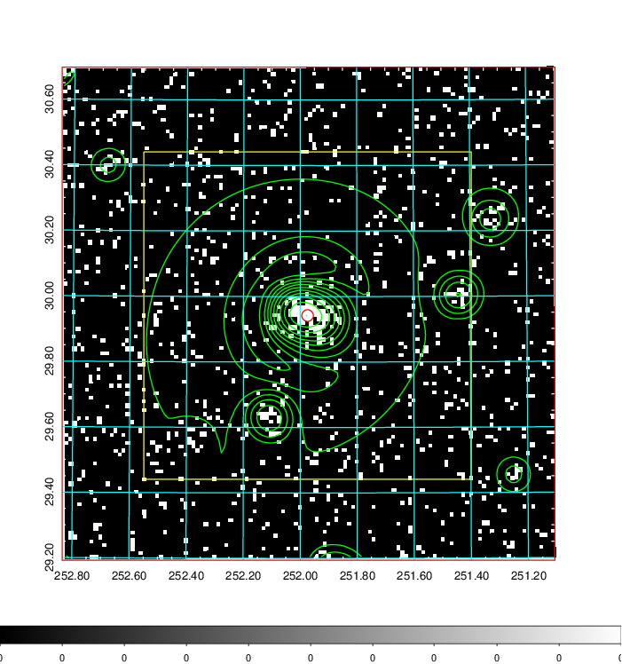  | 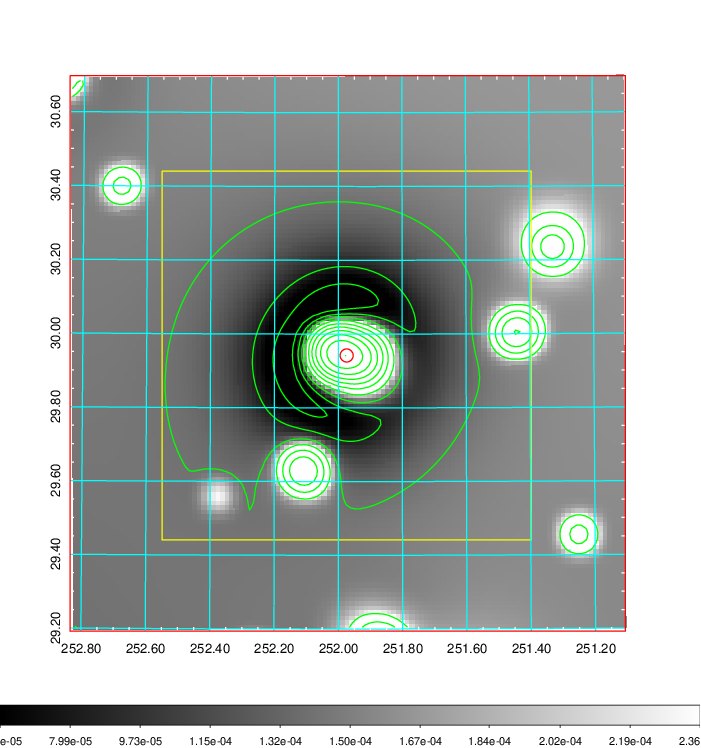   | 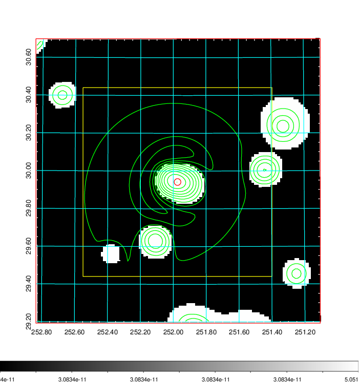  |

|[Exposure image](../image/671/671_mex.pdf)| [nH image](../image/671/671_nh.pdf)| [Planck image](../image/671/671_p.pdf)|
|-------------------|--------------------|-------------------|
|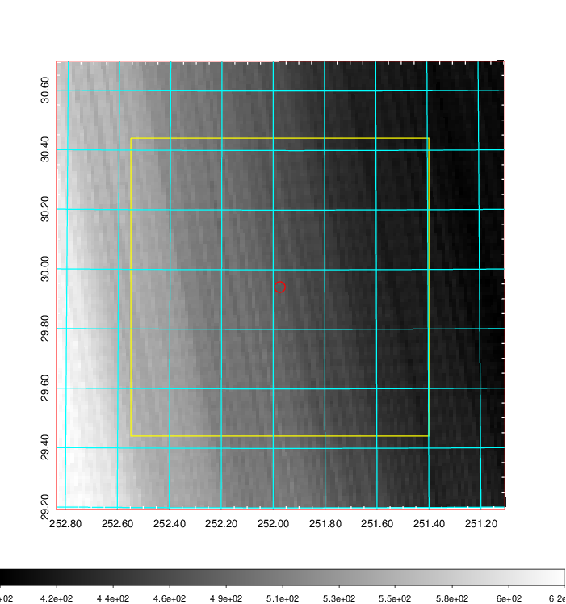   | 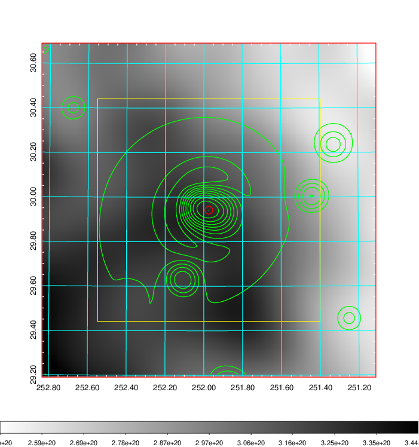    | 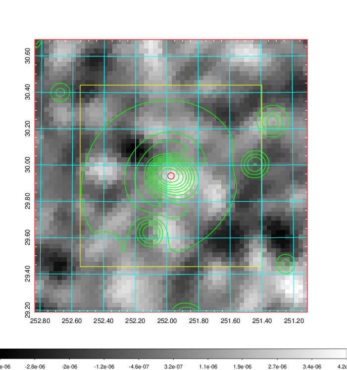 |

|[Redshift Histogram](../image/671/671_zg.pdf) | [DSS image(z1)](../image/671/671_dss_z1.pdf)      |  [DSS image(z2)](../image/671/671_dss_z2.pdf)    |
|-------------------|--------------------|-------------------|
|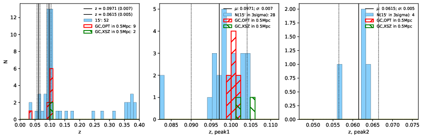 |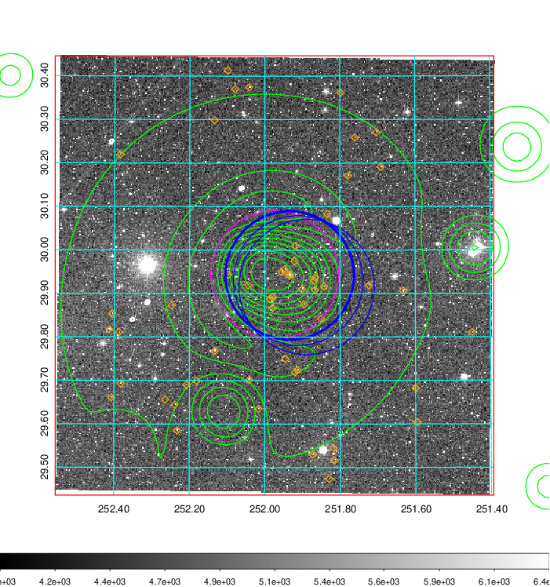  Blue circle for optical clusters;  Magenta circle for XSZ clusters;  all with r=1Mpc;  Only GC with Delta_z<0.01 are shown. | 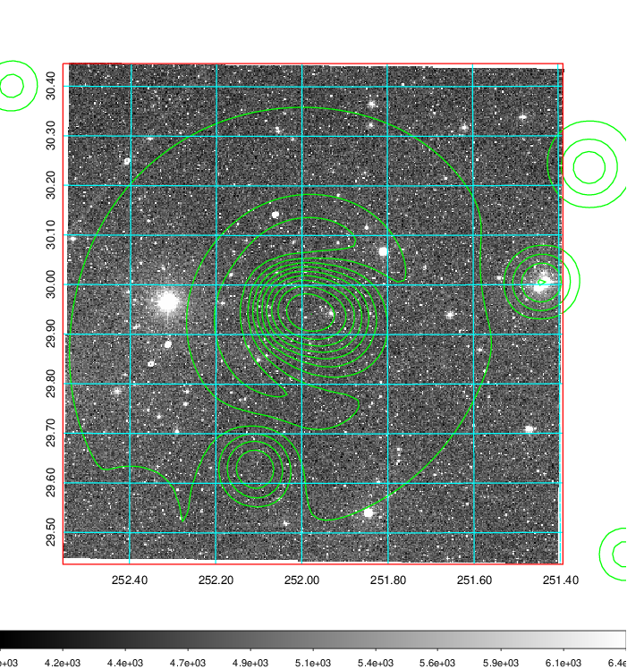 Blue circle for optical clusters;  Magenta circle for XSZ clusters;  all with r=1Mpc;  Only GC with Delta_z<0.01 are shown.  |

|[known Abell/XSZ clusters](../image/671/671_gc.pdf) | [2MASS image](../image/671/671_2mass.pdf)      |[SDSS image](../image/671/671_sdss.pdf)   |
|-------------------|-------------------|-------------------|
|  Magenta, blue and green circles  for optical, X-ray and SZ clusters  respectively, with redshift of clusters  labelled. The radius of circles  are 1Mpc.|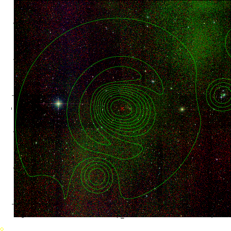  | 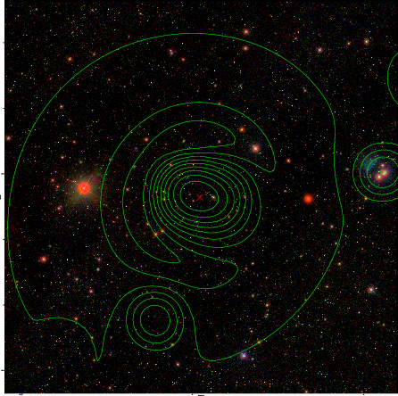  |

