

### 673

|Name|RAJ2000[deg]|DEJ2000[deg] |Ext[arcmin]| Ext,ml | z | z_src| C|GC(XSZ,Delta_z<0.01)| GC(OPT,Delta_z<0.01)|GC| R_sig[arcmin] | R500[arcmin] | R500[Mpc]| CRsig[c/s] | CR500[c/s] |L500[1E44 erg/s]|F500[1E-12 erg/s/cm^2]| M500[1E14 Msun]|Tx[keV]|Cnt_sig|Beta|Rc[arcmin]|Comment|Alias|
|---|---|---|---|---|---|------|---|--------|---------|----------|---|---|---|---|---|---|---|---|---|---|---|---|---|---|
|673| 252.332| 53.408| 11.24| 249.22| 0.0291(0.005)| z1, z_xsz| B| MCXC| N, Zw| MCXC, N| 26.675| 16.673| 0.583| 0.297(0.038)| 0.279(0.036)| 0.085(0.009)| 4.389(0.458)| 0.58(0.03)| 1.55(0.05)| 555.8| 0.541(-0.025+0.033)| 4.474(-0.532+0.669)| -| k573|

|[RASS image](../image/673/673_img.pdf)|[filtered image](../image/673/673_fil.pdf)|[Segment image](../image/673/673_seg.pdf)|
|-------------------|--------------------|-------------------|
| 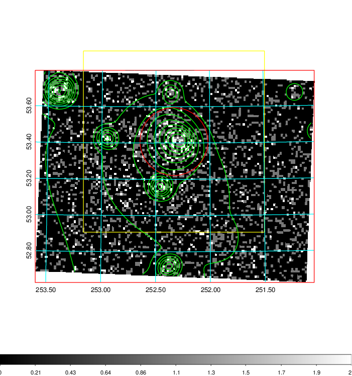  | 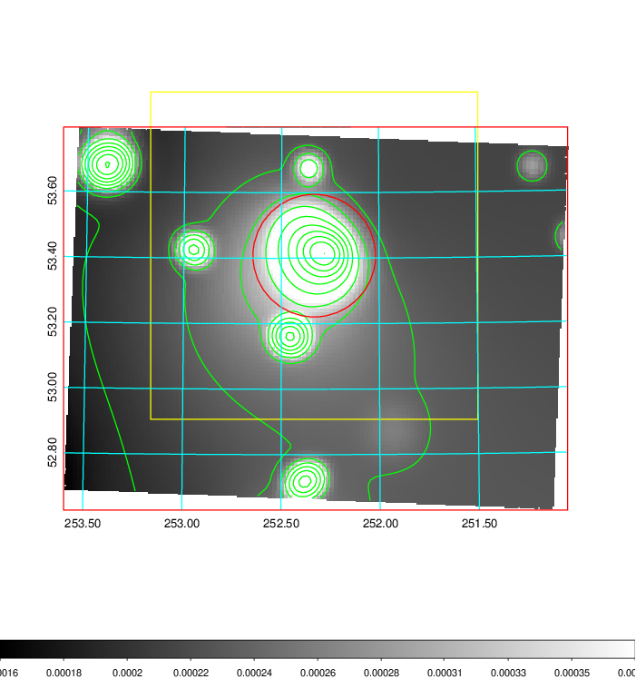   | 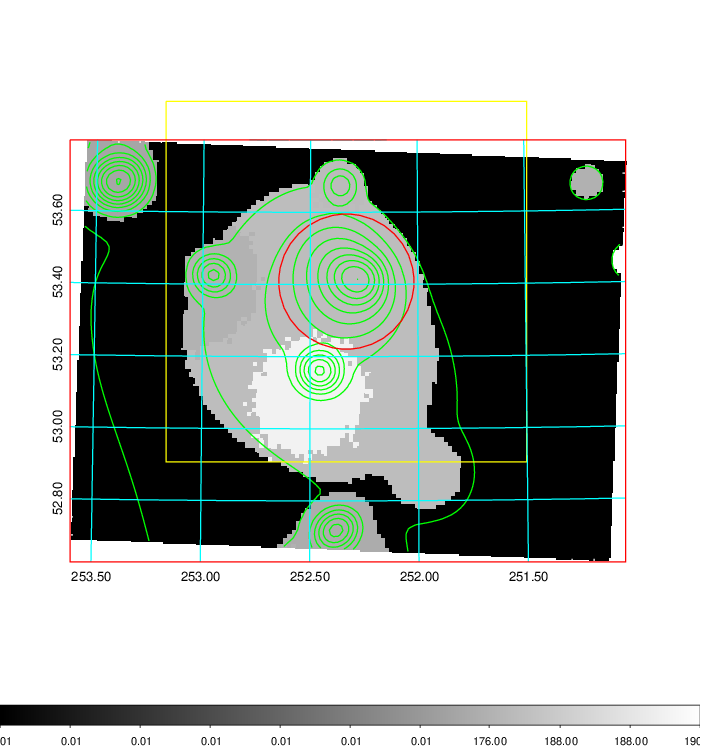  |

|[Exposure image](../image/673/673_mex.pdf)| [nH image](../image/673/673_nh.pdf)| [Planck image](../image/673/673_p.pdf)|
|-------------------|--------------------|-------------------|
|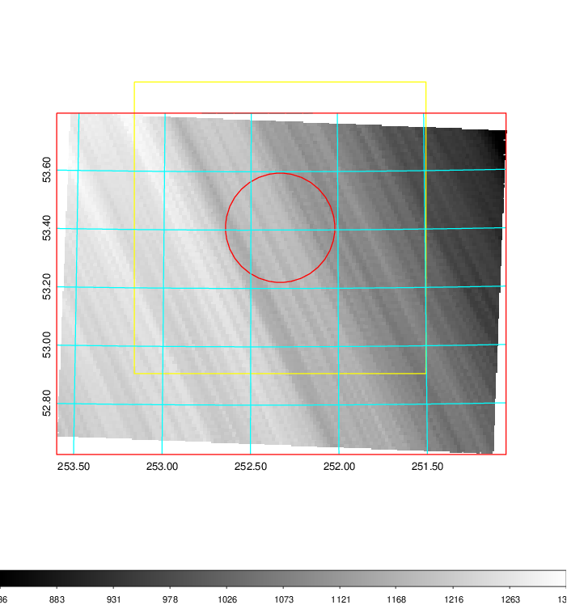   | 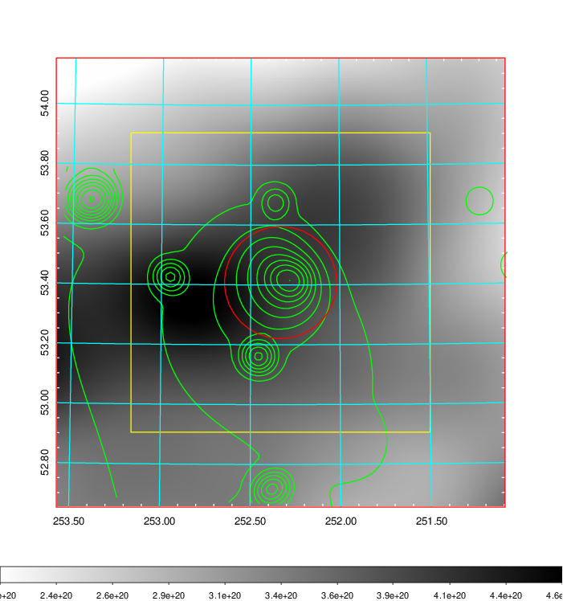    | 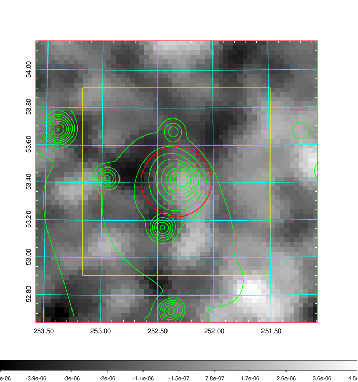 |

|[Redshift Histogram](../image/673/673_zg.pdf) | [DSS image(z1)](../image/673/673_dss_z1.pdf)      |  [DSS image(z2)](../image/673/673_dss_z2.pdf)    |
|-------------------|--------------------|-------------------|
|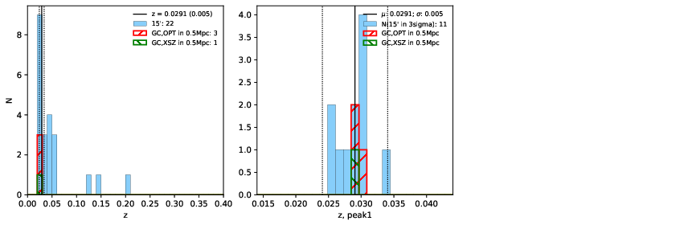 |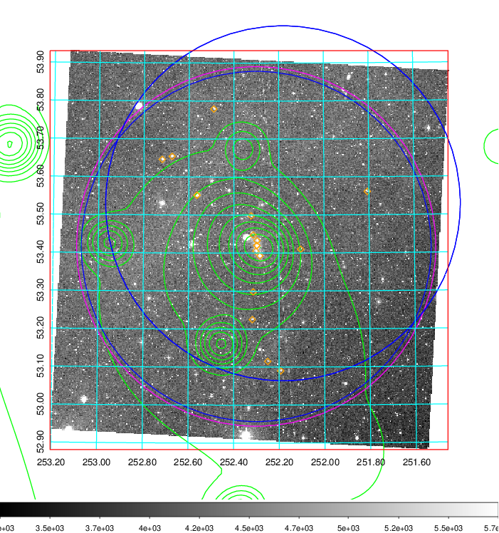  Blue circle for optical clusters;  Magenta circle for XSZ clusters;  all with r=1Mpc;  Only GC with Delta_z<0.01 are shown. | 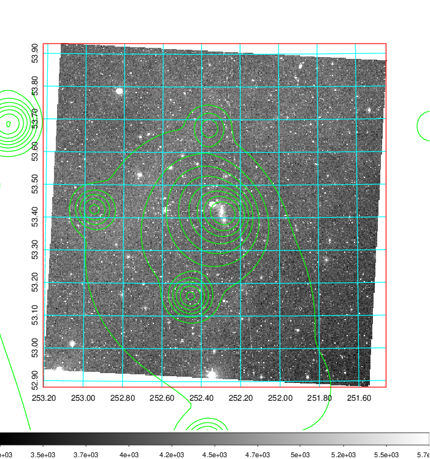 Blue circle for optical clusters;  Magenta circle for XSZ clusters;  all with r=1Mpc;  Only GC with Delta_z<0.01 are shown.  |

|[known Abell/XSZ clusters](../image/673/673_gc.pdf) | [2MASS image](../image/673/673_2mass.pdf)      |[SDSS image](../image/673/673_sdss.pdf)   |
|-------------------|-------------------|-------------------|
|  Magenta, blue and green circles  for optical, X-ray and SZ clusters  respectively, with redshift of clusters  labelled. The radius of circles  are 1Mpc.|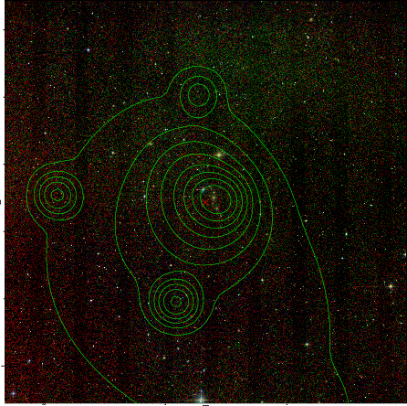  | 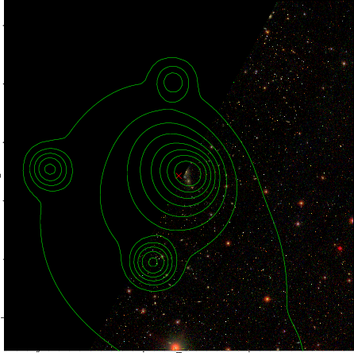  |

