

### 674

|Name|RAJ2000[deg]|DEJ2000[deg] |Ext[arcmin]| Ext,ml | z | z_src| C|GC(XSZ,Delta_z<0.01)| GC(OPT,Delta_z<0.01)|GC| R_sig[arcmin] | R500[arcmin] | R500[Mpc]| CRsig[c/s] | CR500[c/s] |L500[1E44 erg/s]|F500[1E-12 erg/s/cm^2]| M500[1E14 Msun]|Tx[keV]|Cnt_sig|Beta|Rc[arcmin]|Comment|Alias|
|---|---|---|---|---|---|------|---|--------|---------|----------|---|---|---|---|---|---|---|---|---|---|---|---|---|---|
|674| 252.593| 23.595| 15.37| 26.12| 0.0355(0.005)| z1, z_opt| S| -| N| C, N, W| 38.620| 14.816| 0.628| 0.295(0.064)| 0.274(0.059)| 0.130(0.061)| 4.448(2.086)| 0.73(0.18)| 1.78(0.27)| 229.3| 0.501(-0.001+0.003)| 6.258(-0.143+0.353)| -| t537|

|[RASS image](../image/674/674_img.pdf)|[filtered image](../image/674/674_fil.pdf)|[Segment image](../image/674/674_seg.pdf)|
|-------------------|--------------------|-------------------|
| 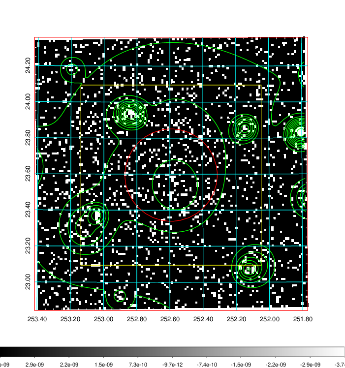  | 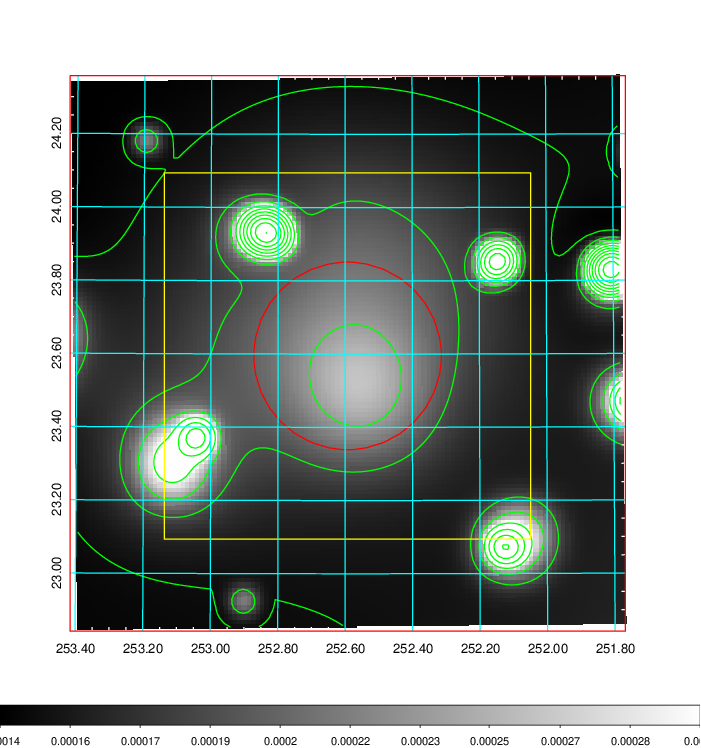   | 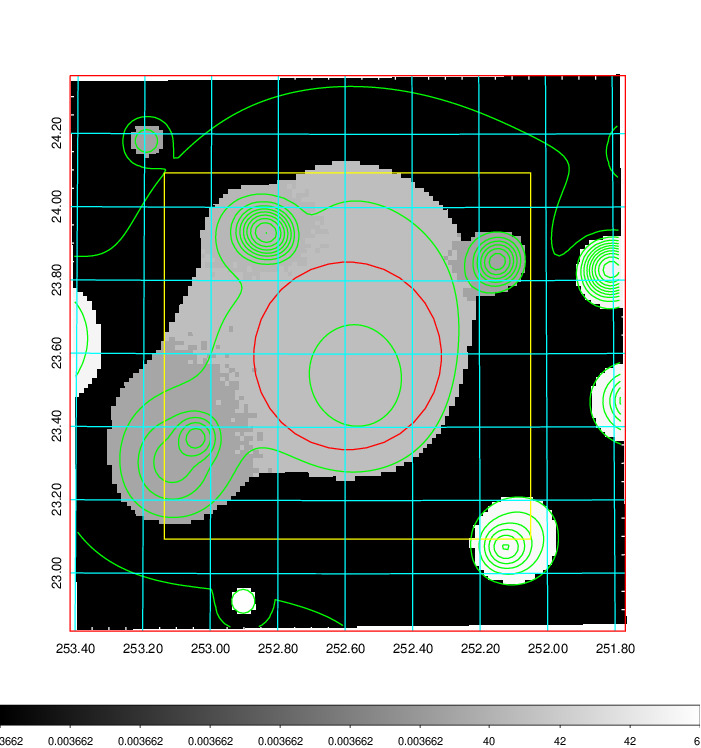  |

|[Exposure image](../image/674/674_mex.pdf)| [nH image](../image/674/674_nh.pdf)| [Planck image](../image/674/674_p.pdf)|
|-------------------|--------------------|-------------------|
|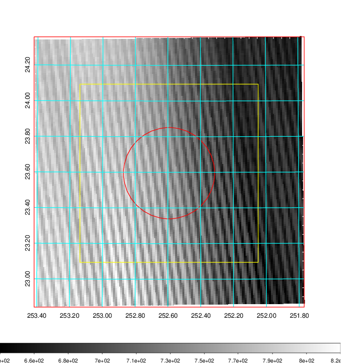   | 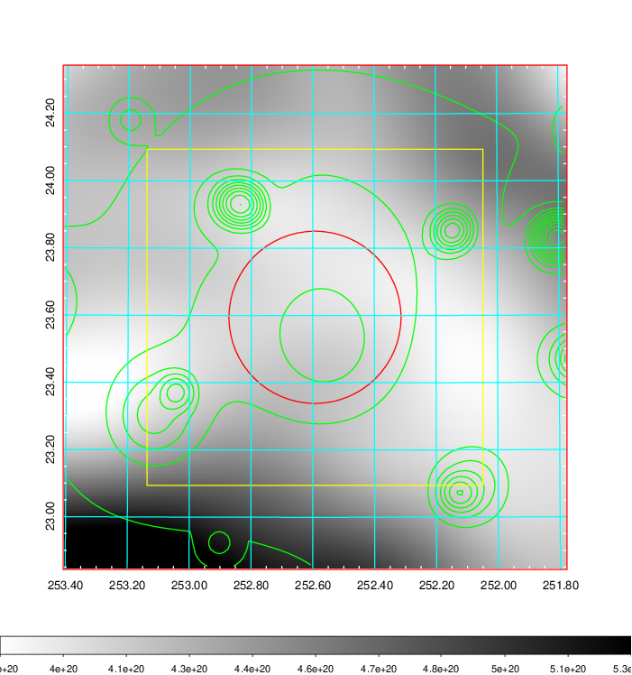    | 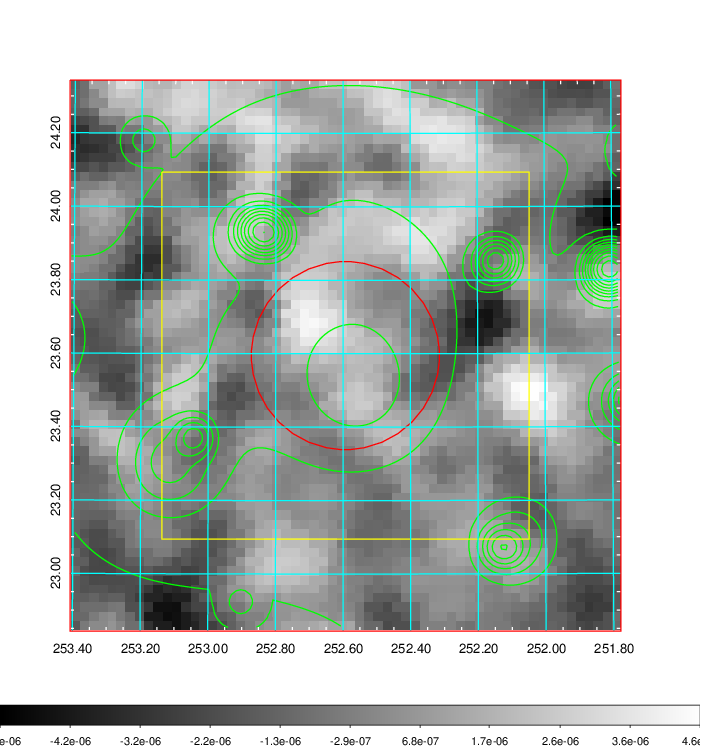 |

|[Redshift Histogram](../image/674/674_zg.pdf) | [DSS image(z1)](../image/674/674_dss_z1.pdf)      |  [DSS image(z2)](../image/674/674_dss_z2.pdf)    |
|-------------------|--------------------|-------------------|
|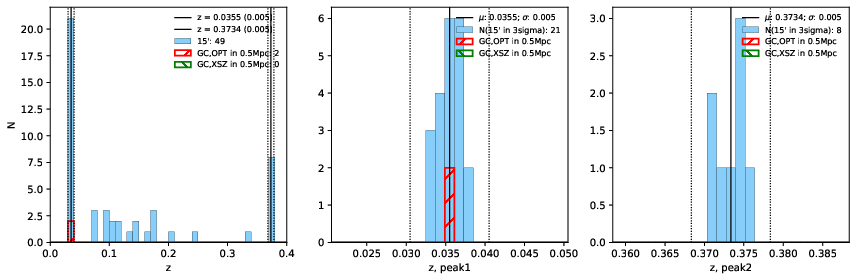 |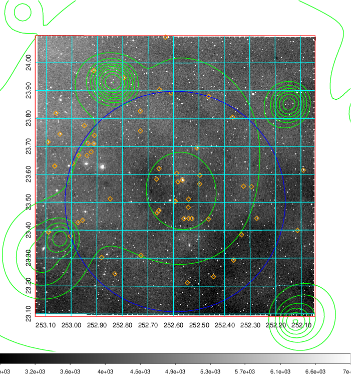  Blue circle for optical clusters;  Magenta circle for XSZ clusters;  all with r=1Mpc;  Only GC with Delta_z<0.01 are shown. | 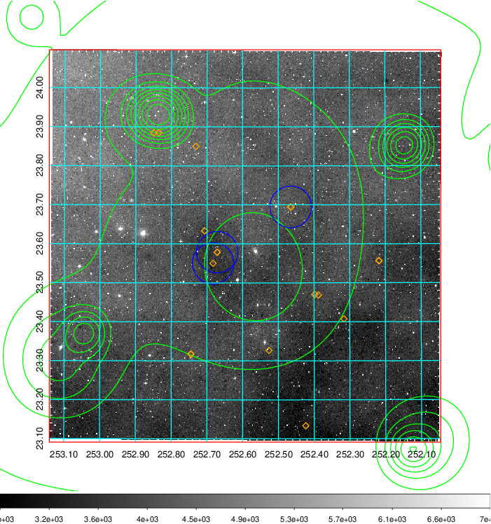 Blue circle for optical clusters;  Magenta circle for XSZ clusters;  all with r=1Mpc;  Only GC with Delta_z<0.01 are shown.  |

|[known Abell/XSZ clusters](../image/674/674_gc.pdf) | [2MASS image](../image/674/674_2mass.pdf)      |[SDSS image](../image/674/674_sdss.pdf)   |
|-------------------|-------------------|-------------------|
|  Magenta, blue and green circles  for optical, X-ray and SZ clusters  respectively, with redshift of clusters  labelled. The radius of circles  are 1Mpc.|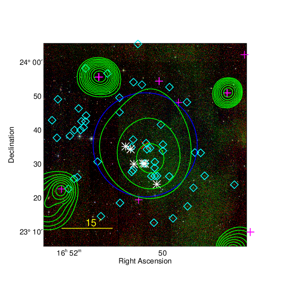  | 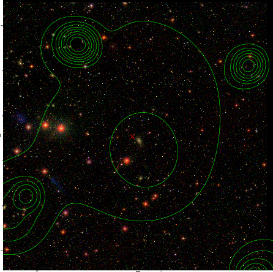  |

