

### 675

|Name|RAJ2000[deg]|DEJ2000[deg] |Ext[arcmin]| Ext,ml | z | z_src| C|GC(XSZ,Delta_z<0.01)| GC(OPT,Delta_z<0.01)|GC| R_sig[arcmin] | R500[arcmin] | R500[Mpc]| CRsig[c/s] | CR500[c/s] |L500[1E44 erg/s]|F500[1E-12 erg/s/cm^2]| M500[1E14 Msun]|Tx[keV]|Cnt_sig|Beta|Rc[arcmin]|Comment|Alias|
|---|---|---|---|---|---|------|---|--------|---------|----------|---|---|---|---|---|---|---|---|---|---|---|---|---|---|
|675| 252.723| 81.582| 5.23| 29.56| 0.0388(0.005)| z1, z_opt| S| -| A, N| A, N, W| 13.675| 11.172| 0.515| 0.096(0.017)| 0.093(0.017)| 0.044(0.006)| 1.269(0.166)| 0.40(0.03)| 1.24(0.05)| 145.9| 0.739(-0.153+0.171)| 7.219(-1.940+1.766)| -| t270|

|[RASS image](../image/675/675_img.pdf)|[filtered image](../image/675/675_fil.pdf)|[Segment image](../image/675/675_seg.pdf)|
|-------------------|--------------------|-------------------|
| 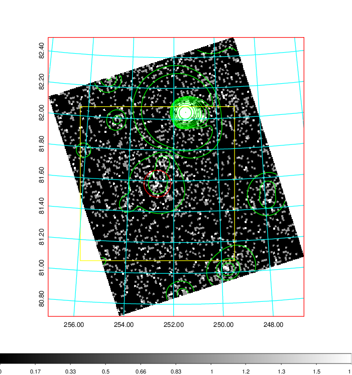  | 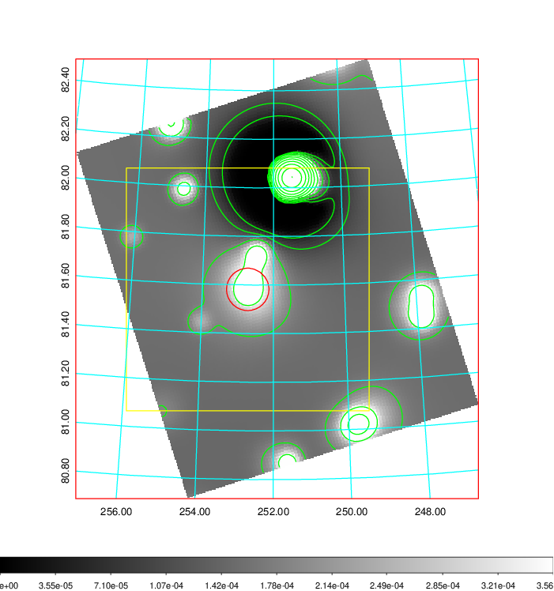   | 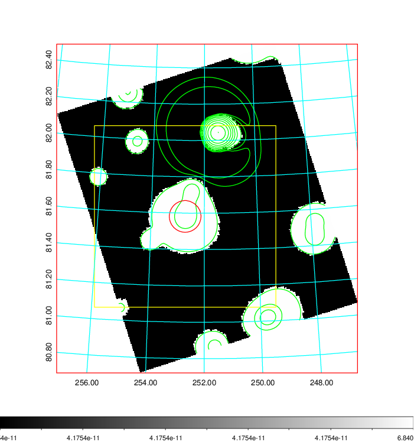  |

|[Exposure image](../image/675/675_mex.pdf)| [nH image](../image/675/675_nh.pdf)| [Planck image](../image/675/675_p.pdf)|
|-------------------|--------------------|-------------------|
|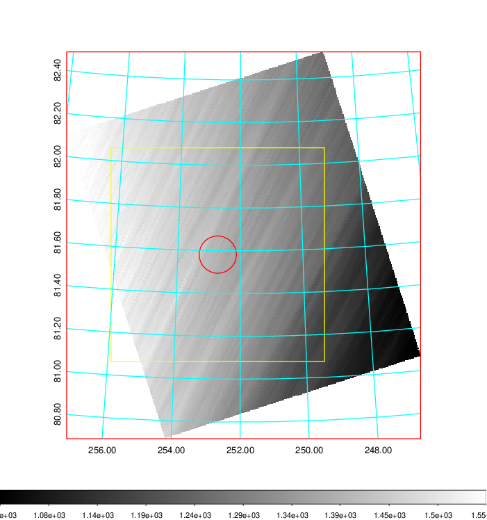   | 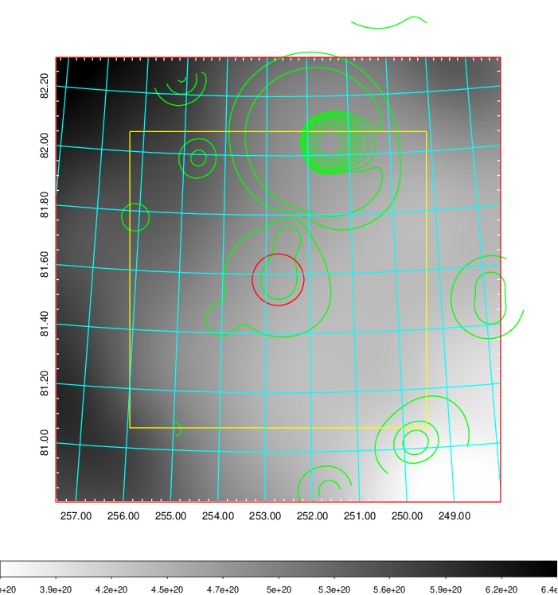    | 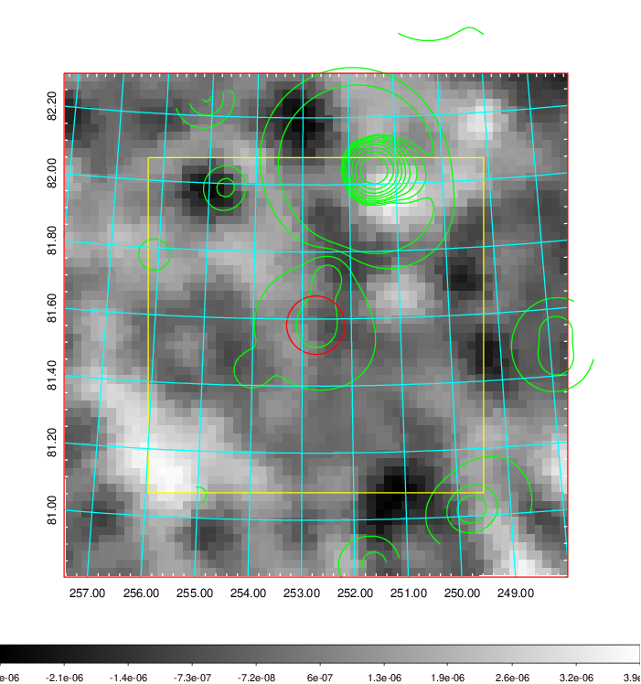 |

|[Redshift Histogram](../image/675/675_zg.pdf) | [DSS image(z1)](../image/675/675_dss_z1.pdf)      |  [DSS image(z2)](../image/675/675_dss_z2.pdf)    |
|-------------------|--------------------|-------------------|
|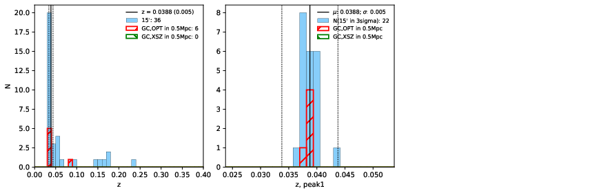 |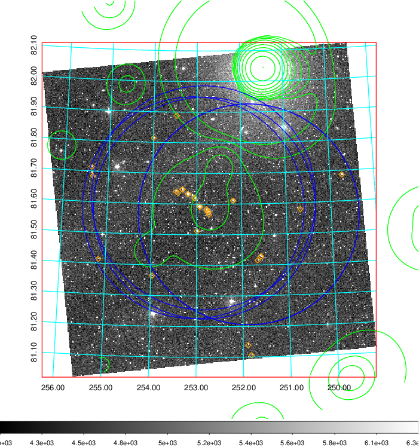  Blue circle for optical clusters;  Magenta circle for XSZ clusters;  all with r=1Mpc;  Only GC with Delta_z<0.01 are shown. | 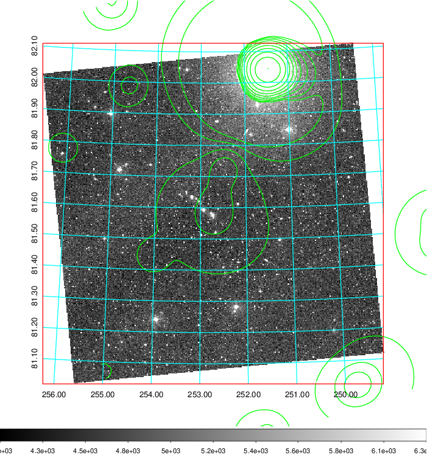 Blue circle for optical clusters;  Magenta circle for XSZ clusters;  all with r=1Mpc;  Only GC with Delta_z<0.01 are shown.  |

|[Previous-identified clusters](../image/675/675_gc.pdf) | [2MASS image](../image/675/675_2mass.pdf)      |
|-------------------|-------------------|
|  Green, magenta, and blue circles  for optical, X-ray and SZ clusters  respectively, with redshift of clusters  labelled. The radius of circles  are 1Mpc.|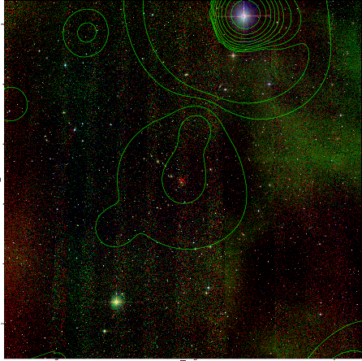  |

|[PS1 image](../image/675/675_ps1.pdf)            |
|-------------------|
| 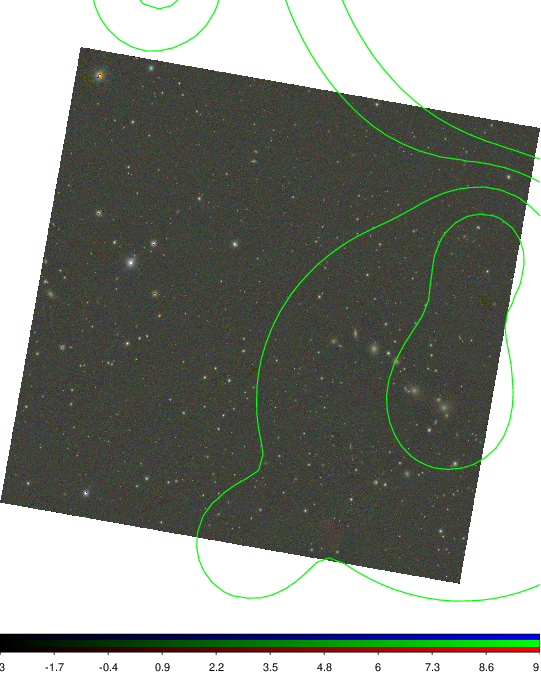  |
