

### 677

|Name|RAJ2000[deg]|DEJ2000[deg] |Ext[arcmin]| Ext,ml | z | z_src| C|GC(XSZ,Delta_z<0.01)| GC(OPT,Delta_z<0.01)|GC| R_sig[arcmin] | R500[arcmin] | R500[Mpc]| CRsig[c/s] | CR500[c/s] |L500[1E44 erg/s]|F500[1E-12 erg/s/cm^2]| M500[1E14 Msun]|Tx[keV]|Cnt_sig|Beta|Rc[arcmin]|Comment|Alias|
|---|---|---|---|---|---|------|---|--------|---------|----------|---|---|---|---|---|---|---|---|---|---|---|---|---|---|
|677| 253.040| 49.510| 2.40| 25.09| 0.2710(0.005)| z1,| G| -| -| C, F20, N, SPI, W| 26.181| 4.603| 1.145| 0.134(0.040)| 0.121(0.035)| 5.713(1.222)| 2.502(0.535)| 5.63(0.56)| 6.80(0.43)| 168.0| 0.876(-0.118+0.088)| 4.872(-0.831+0.603)| -| t087|

|[RASS image](../image/677/677_img.pdf)|[filtered image](../image/677/677_fil.pdf)|[Segment image](../image/677/677_seg.pdf)|
|-------------------|--------------------|-------------------|
| 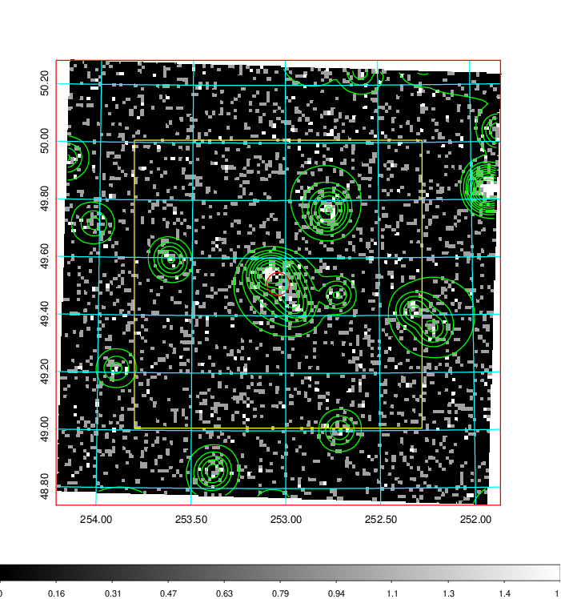  | 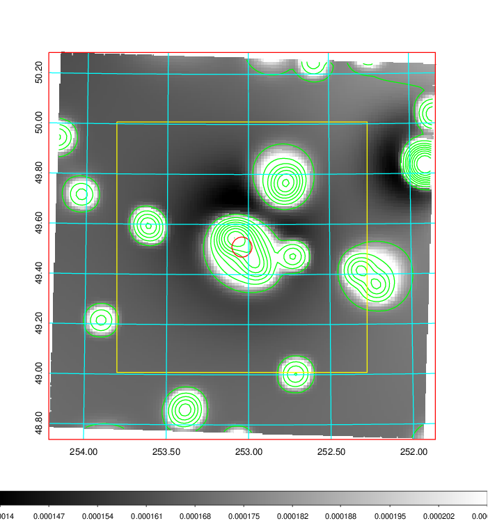   | 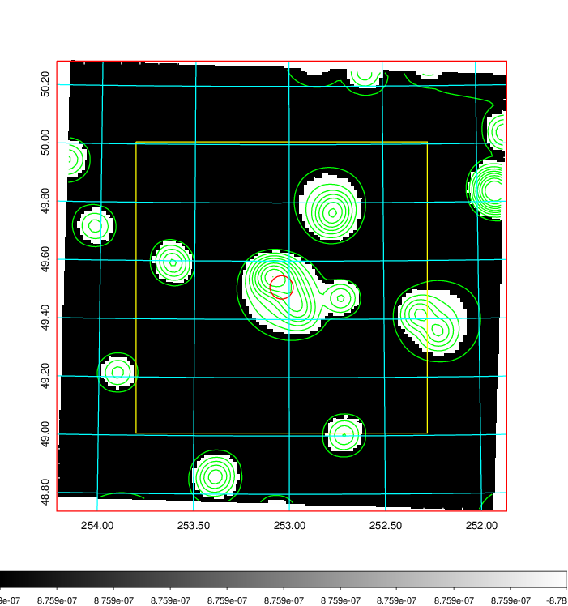  |

|[Exposure image](../image/677/677_mex.pdf)| [nH image](../image/677/677_nh.pdf)| [Planck image](../image/677/677_p.pdf)|
|-------------------|--------------------|-------------------|
|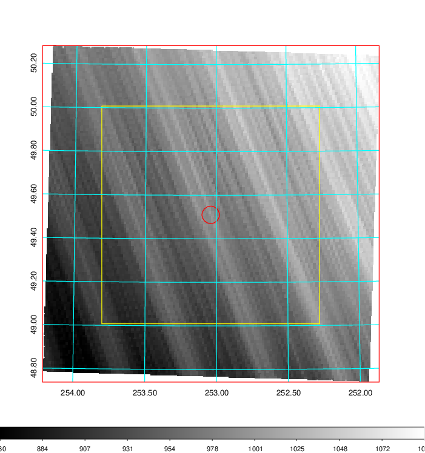   | 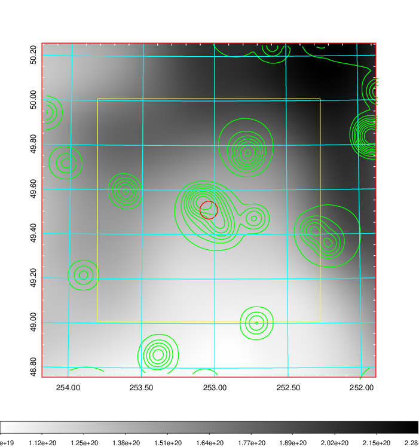    | 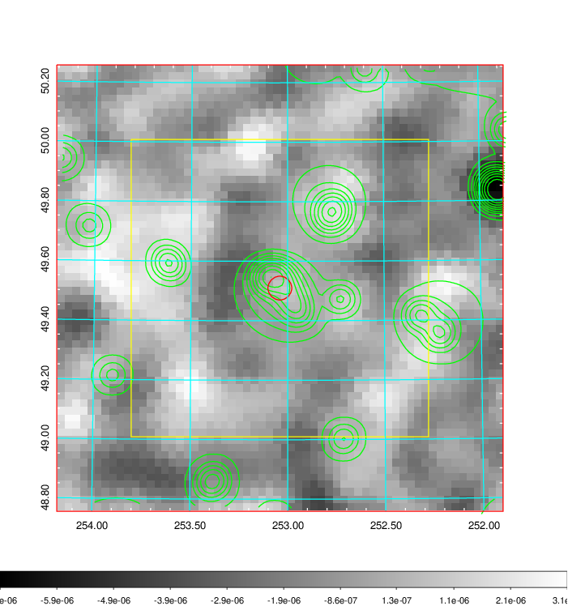 |

|[Redshift Histogram](../image/677/677_zg.pdf) | [DSS image(z1)](../image/677/677_dss_z1.pdf)      |  [DSS image(z2)](../image/677/677_dss_z2.pdf)    |
|-------------------|--------------------|-------------------|
|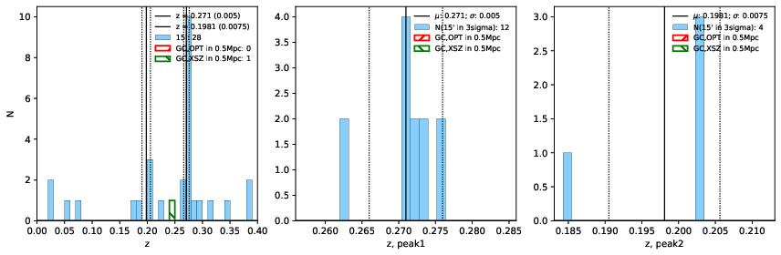 |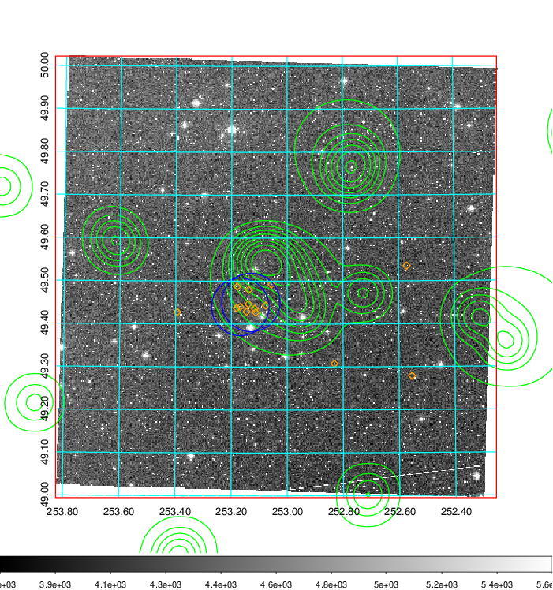  Blue circle for optical clusters;  Magenta circle for XSZ clusters;  all with r=1Mpc;  Only GC with Delta_z<0.01 are shown. | 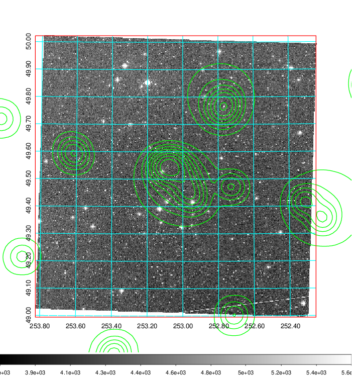 Blue circle for optical clusters;  Magenta circle for XSZ clusters;  all with r=1Mpc;  Only GC with Delta_z<0.01 are shown.  |

|[Previous-identified clusters](../image/677/677_gc.pdf) | [2MASS image](../image/677/677_2mass.pdf)      |[SDSS image](../image/677/677_sdss.pdf)   |
|-------------------|-------------------|-------------------|
|  Green, magenta, and blue circles  for optical, X-ray and SZ clusters  respectively, with redshift of clusters  labelled. The radius of circles  are 1Mpc.|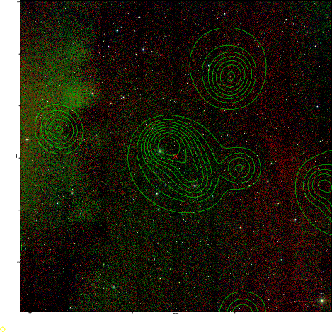  | 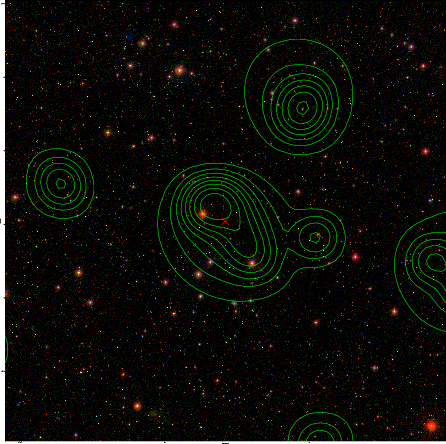  |

