

### 678

|Name|RAJ2000[deg]|DEJ2000[deg] |Ext[arcmin]| Ext,ml | z | z_src| C|GC(XSZ,Delta_z<0.01)| GC(OPT,Delta_z<0.01)|GC| R_sig[arcmin] | R500[arcmin] | R500[Mpc]| CRsig[c/s] | CR500[c/s] |L500[1E44 erg/s]|F500[1E-12 erg/s/cm^2]| M500[1E14 Msun]|Tx[keV]|Cnt_sig|Beta|Rc[arcmin]|Comment|Alias|
|---|---|---|---|---|---|------|---|--------|---------|----------|---|---|---|---|---|---|---|---|---|---|---|---|---|---|
|678| 253.083| 44.829| 2.61| 64.22| 0.1766(0.005)| z1, z_xsz| B| F20, MCXC, SPI| C, N, RM, W, Zw| C, F20, MCXC, N, SPI, W| 7.825| 5.765| 1.034| 0.153(0.024)| 0.147(0.023)| 2.619(0.252)| 3.005(0.289)| 3.74(0.17)| 5.11(0.15)| 99.4| 0.917(-0.103+0.060)| 5.247(-0.693+0.509)| -| k323|

|[RASS image](../image/678/678_img.pdf)|[filtered image](../image/678/678_fil.pdf)|[Segment image](../image/678/678_seg.pdf)|
|-------------------|--------------------|-------------------|
| 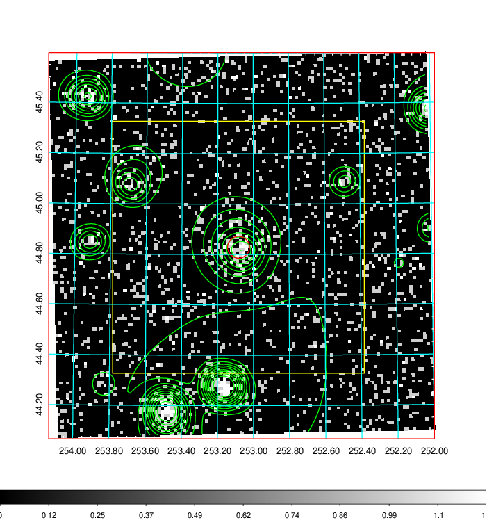  | 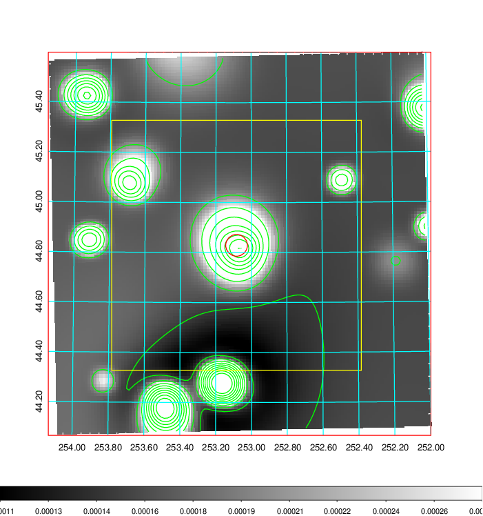   | 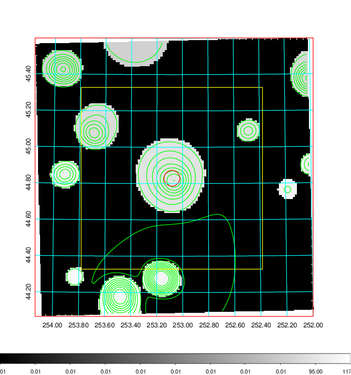  |

|[Exposure image](../image/678/678_mex.pdf)| [nH image](../image/678/678_nh.pdf)| [Planck image](../image/678/678_p.pdf)|
|-------------------|--------------------|-------------------|
|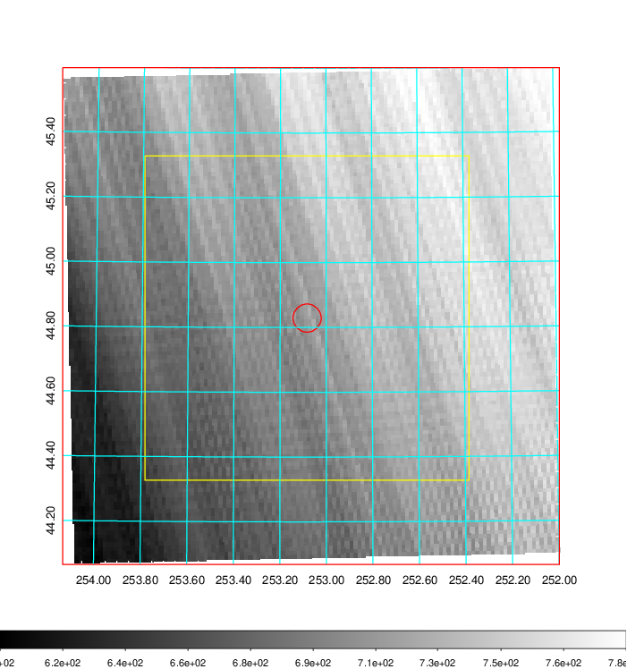   | 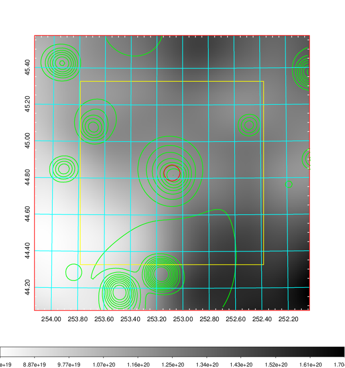    | 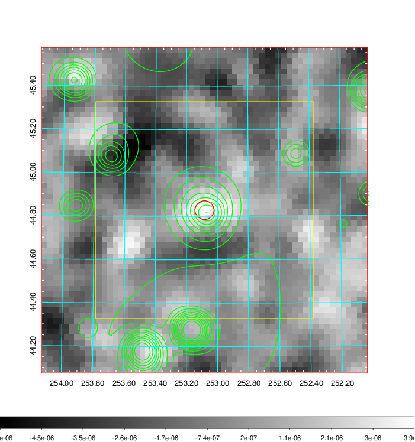 |

|[Redshift Histogram](../image/678/678_zg.pdf) | [DSS image(z1)](../image/678/678_dss_z1.pdf)      |  [DSS image(z2)](../image/678/678_dss_z2.pdf)    |
|-------------------|--------------------|-------------------|
|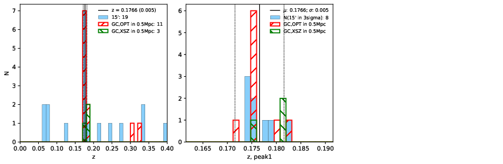 |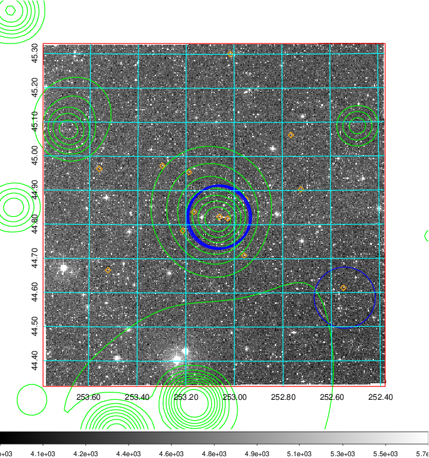  Blue circle for optical clusters;  Magenta circle for XSZ clusters;  all with r=1Mpc;  Only GC with Delta_z<0.01 are shown. | 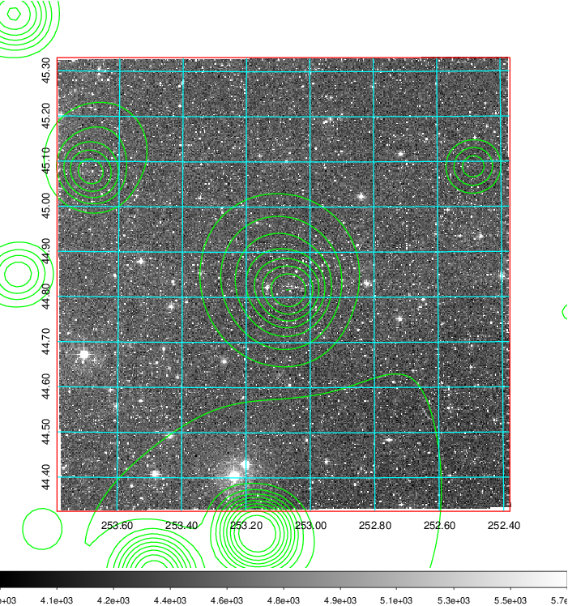 Blue circle for optical clusters;  Magenta circle for XSZ clusters;  all with r=1Mpc;  Only GC with Delta_z<0.01 are shown.  |

|[known Abell/XSZ clusters](../image/678/678_gc.pdf) | [2MASS image](../image/678/678_2mass.pdf)      |[SDSS image](../image/678/678_sdss.pdf)   |
|-------------------|-------------------|-------------------|
|  Magenta, blue and green circles  for optical, X-ray and SZ clusters  respectively, with redshift of clusters  labelled. The radius of circles  are 1Mpc.|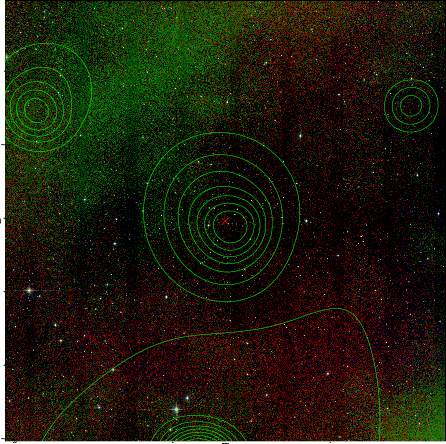  | 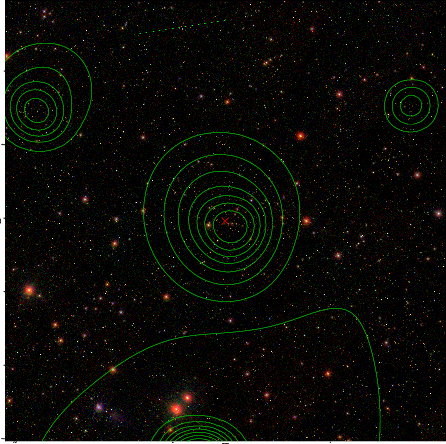  |

