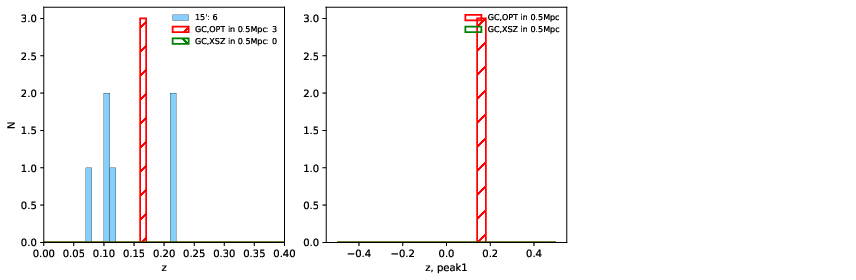

### 68

|Name|RAJ2000[deg]|DEJ2000[deg] |Ext[arcmin]| Ext,ml | z | z_src| C|GC(XSZ,Delta_z<0.01)| GC(OPT,Delta_z<0.01)|GC| R_sig[arcmin] | R500[arcmin] | R500[Mpc]| CRsig[c/s] | CR500[c/s] |L500[1E44 erg/s]|F500[1E-12 erg/s/cm^2]| M500[1E14 Msun]|Tx[keV]|Cnt_sig|Beta|Rc[arcmin]|Comment|Alias|
|---|---|---|---|---|---|------|---|--------|---------|----------|---|---|---|---|---|---|---|---|---|---|---|---|---|---|
|68| 20.525| -21.530| 3.90| 29.74| 0.1630(0.000)| z_opt| S| -| N, W| A, N, W| 11.725| 5.398| 0.907| 0.098(0.030)| 0.090(0.028)| 1.336(0.302)| 1.829(0.414)| 2.49(0.28)| 3.96(0.28)| 62.6| 0.849(-0.149+0.107)| 5.468(-1.216+0.977)| -| t188|

|[RASS image](../image/68/68_img.pdf)|[filtered image](../image/68/68_fil.pdf)|[Segment image](../image/68/68_seg.pdf)|
|-------------------|--------------------|-------------------|
|   |    |   |

|[Exposure image](../image/68/68_mex.pdf)| [nH image](../image/68/68_nh.pdf)| [Planck image](../image/68/68_p.pdf)|
|-------------------|--------------------|-------------------|
|   |     |  |

|[Redshift Histogram](../image/68/68_zg.pdf) | [DSS image(z1)](../image/68/68_dss_z1.pdf)      |  [DSS image(z2)](../image/68/68_dss_z2.pdf)    |
|-------------------|--------------------|-------------------|
| |  Blue circle for optical clusters;  Magenta circle for XSZ clusters;  all with r=1Mpc;  Only GC with Delta_z<0.01 are shown. |  Blue circle for optical clusters;  Magenta circle for XSZ clusters;  all with r=1Mpc;  Only GC with Delta_z<0.01 are shown.  |

|[Previous-identified clusters](../image/68/68_gc.pdf) | [2MASS image](../image/68/68_2mass.pdf)      |[SDSS image](../image/68/68_sdss.pdf)   |
|-------------------|-------------------|-------------------|
|  Green, magenta, and blue circles  for optical, X-ray and SZ clusters  respectively, with redshift of clusters  labelled. The radius of circles  are 1Mpc.|  |   |

|[DES image](../image/68/68_des.pdf)   |[ATLAS image](../image/68/68_s.pdf)        |
|-------------------|-------------------|
|   |   |
