

### 680

|Name|RAJ2000[deg]|DEJ2000[deg] |Ext[arcmin]| Ext,ml | z | z_src| C|GC(XSZ,Delta_z<0.01)| GC(OPT,Delta_z<0.01)|GC| R_sig[arcmin] | R500[arcmin] | R500[Mpc]| CRsig[c/s] | CR500[c/s] |L500[1E44 erg/s]|F500[1E-12 erg/s/cm^2]| M500[1E14 Msun]|Tx[keV]|Cnt_sig|Beta|Rc[arcmin]|Comment|Alias|
|---|---|---|---|---|---|------|---|--------|---------|----------|---|---|---|---|---|---|---|---|---|---|---|---|---|---|
|680| 253.569| 23.592| 2.51| 36.15| 0.0537(0.005)| z1, z_xsz| B| F20, MCXC| N, W| C, F20, MCXC, N, W| 8.312| 10.370| 0.650| 0.132(0.024)| 0.138(0.025)| 0.159(0.018)| 2.318(0.266)| 0.82(0.05)| 1.93(0.07)| 95.4| 0.916(-0.100+0.061)| 5.691(-0.738+0.555)| -| k297|

|[RASS image](../image/680/680_img.pdf)|[filtered image](../image/680/680_fil.pdf)|[Segment image](../image/680/680_seg.pdf)|
|-------------------|--------------------|-------------------|
| 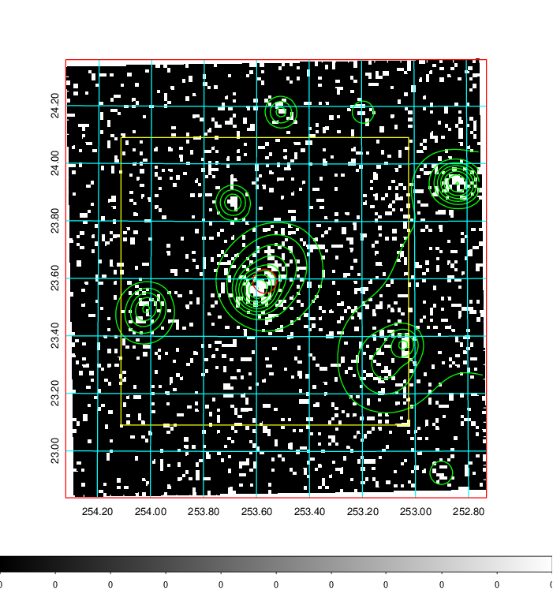  | 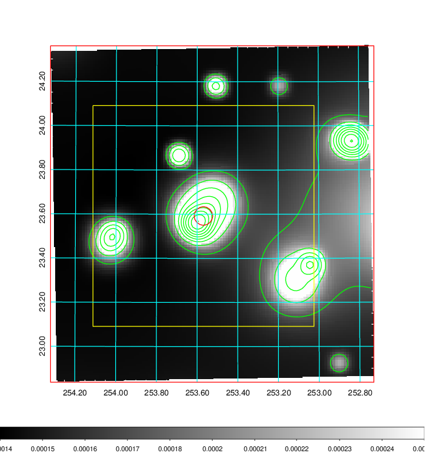   | 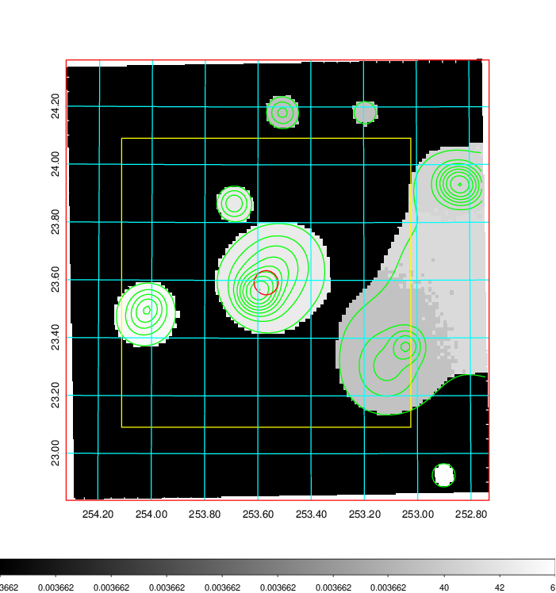  |

|[Exposure image](../image/680/680_mex.pdf)| [nH image](../image/680/680_nh.pdf)| [Planck image](../image/680/680_p.pdf)|
|-------------------|--------------------|-------------------|
|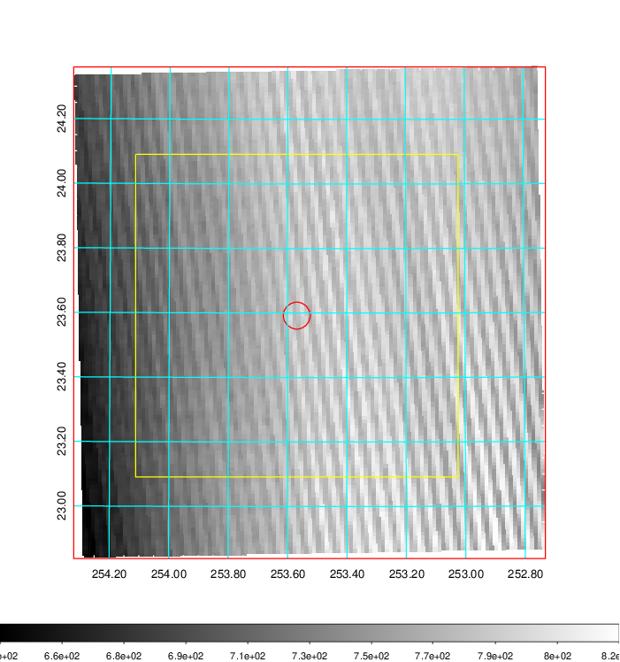   | 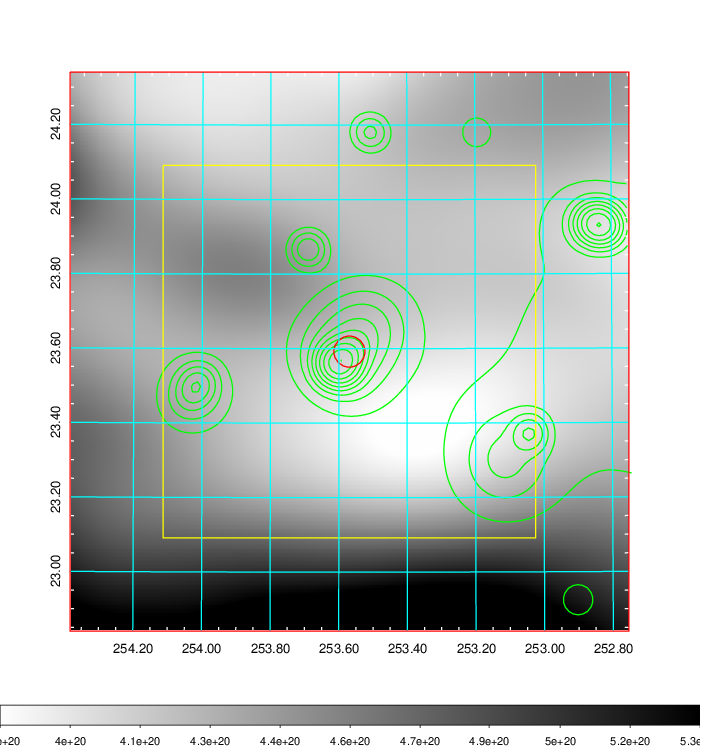    | 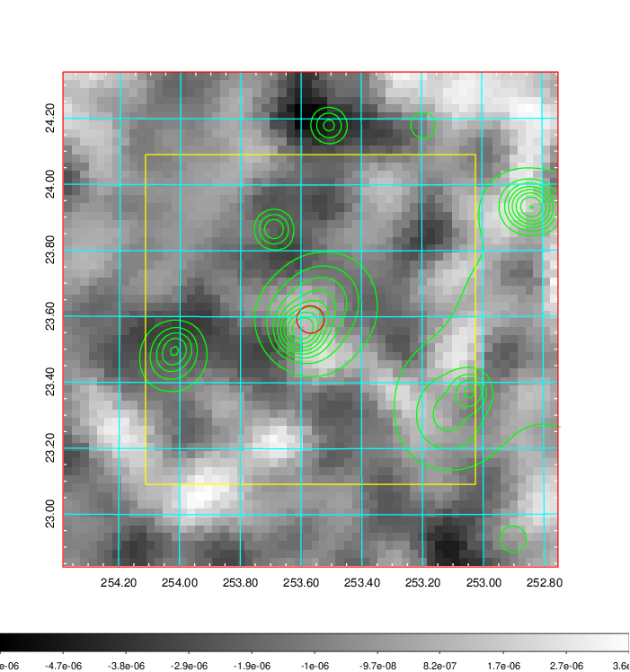 |

|[Redshift Histogram](../image/680/680_zg.pdf) | [DSS image(z1)](../image/680/680_dss_z1.pdf)      |  [DSS image(z2)](../image/680/680_dss_z2.pdf)    |
|-------------------|--------------------|-------------------|
|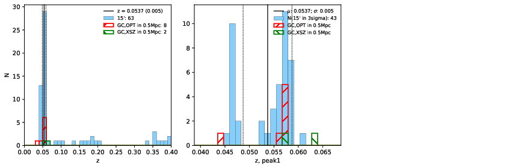 |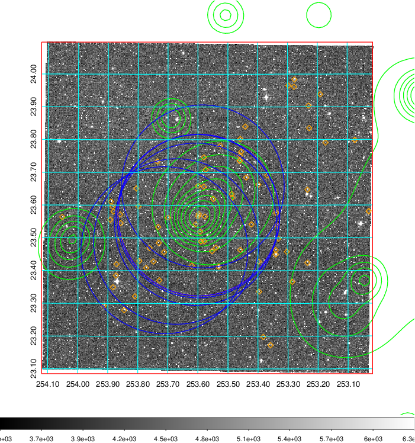  Blue circle for optical clusters;  Magenta circle for XSZ clusters;  all with r=1Mpc;  Only GC with Delta_z<0.01 are shown. | 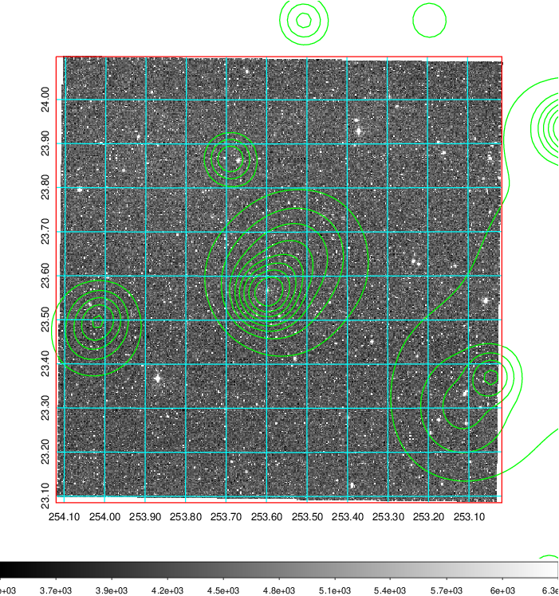 Blue circle for optical clusters;  Magenta circle for XSZ clusters;  all with r=1Mpc;  Only GC with Delta_z<0.01 are shown.  |

|[known Abell/XSZ clusters](../image/680/680_gc.pdf) | [2MASS image](../image/680/680_2mass.pdf)      |[SDSS image](../image/680/680_sdss.pdf)   |
|-------------------|-------------------|-------------------|
|  Magenta, blue and green circles  for optical, X-ray and SZ clusters  respectively, with redshift of clusters  labelled. The radius of circles  are 1Mpc.|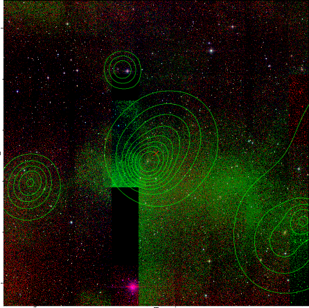  | 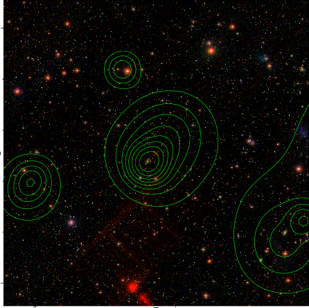  |

