

### 681

|Name|RAJ2000[deg]|DEJ2000[deg] |Ext[arcmin]| Ext,ml | z | z_src| C|GC(XSZ,Delta_z<0.01)| GC(OPT,Delta_z<0.01)|GC| R_sig[arcmin] | R500[arcmin] | R500[Mpc]| CRsig[c/s] | CR500[c/s] |L500[1E44 erg/s]|F500[1E-12 erg/s/cm^2]| M500[1E14 Msun]|Tx[keV]|Cnt_sig|Beta|Rc[arcmin]|Comment|Alias|
|---|---|---|---|---|---|------|---|--------|---------|----------|---|---|---|---|---|---|---|---|---|---|---|---|---|---|
|681| 253.694| 40.053| 2.08| 38.28| 0.1484(0.005)| z1, z_xsz| B| F20, SPI, Tar| A, C, N, RM, W| A, C, F20, N, SPI, Tar, W| 5.388| 5.895| 0.917| 0.109(0.029)| 0.111(0.029)| 1.286(0.168)| 2.164(0.283)| 2.53(0.16)| 3.98(0.16)| 60.0| 0.900(-0.112+0.071)| 3.457(-0.613+0.484)| -| t066|

|[RASS image](../image/681/681_img.pdf)|[filtered image](../image/681/681_fil.pdf)|[Segment image](../image/681/681_seg.pdf)|
|-------------------|--------------------|-------------------|
| 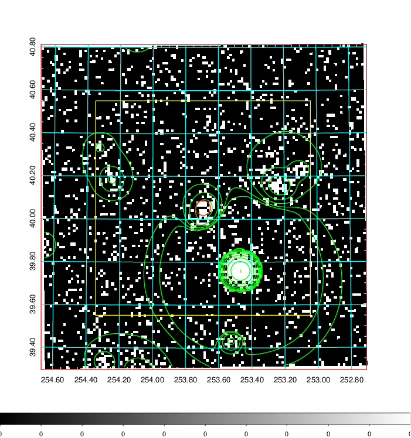  | 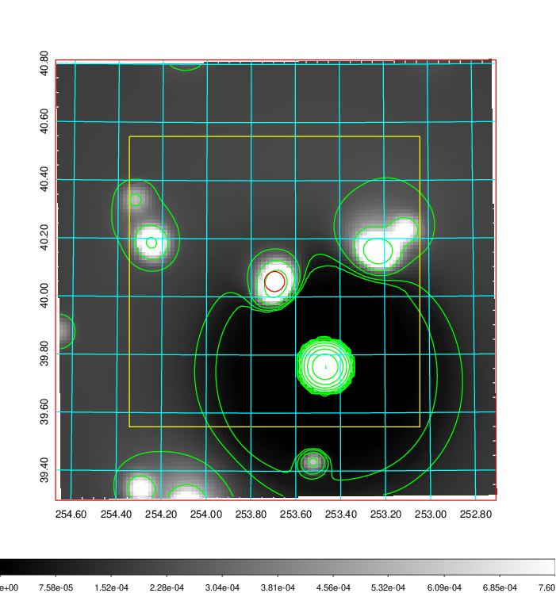   | 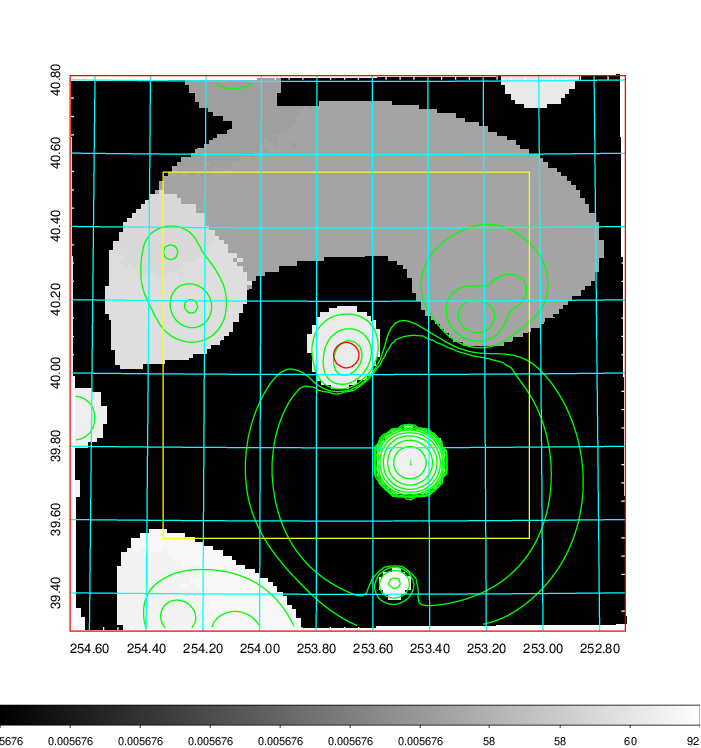  |

|[Exposure image](../image/681/681_mex.pdf)| [nH image](../image/681/681_nh.pdf)| [Planck image](../image/681/681_p.pdf)|
|-------------------|--------------------|-------------------|
|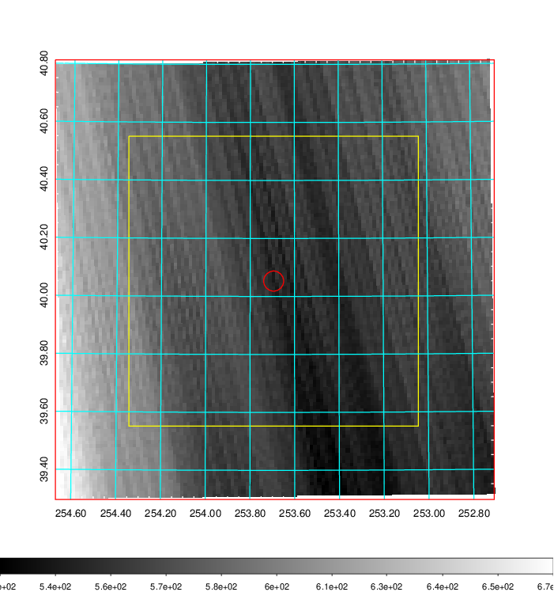   | 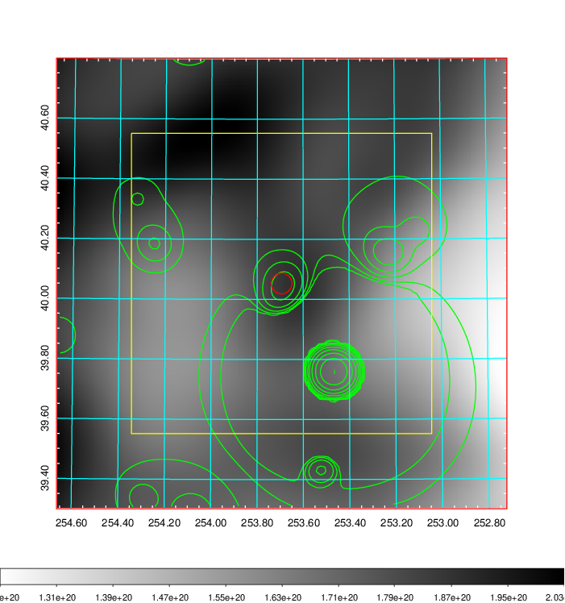    | 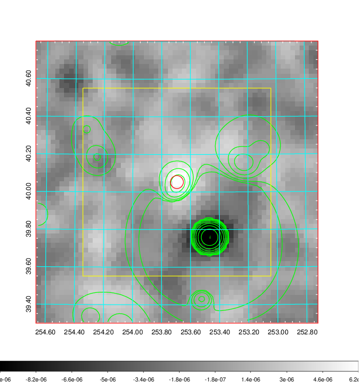 |

|[Redshift Histogram](../image/681/681_zg.pdf) | [DSS image(z1)](../image/681/681_dss_z1.pdf)      |  [DSS image(z2)](../image/681/681_dss_z2.pdf)    |
|-------------------|--------------------|-------------------|
|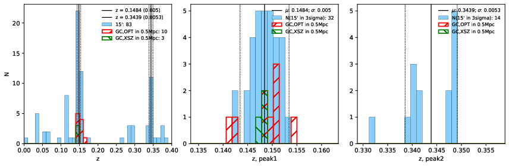 |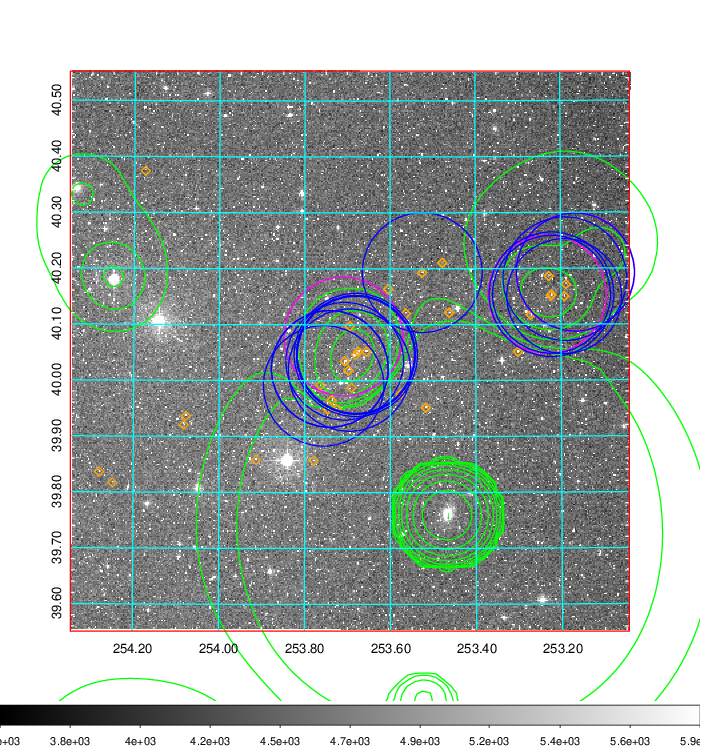  Blue circle for optical clusters;  Magenta circle for XSZ clusters;  all with r=1Mpc;  Only GC with Delta_z<0.01 are shown. | 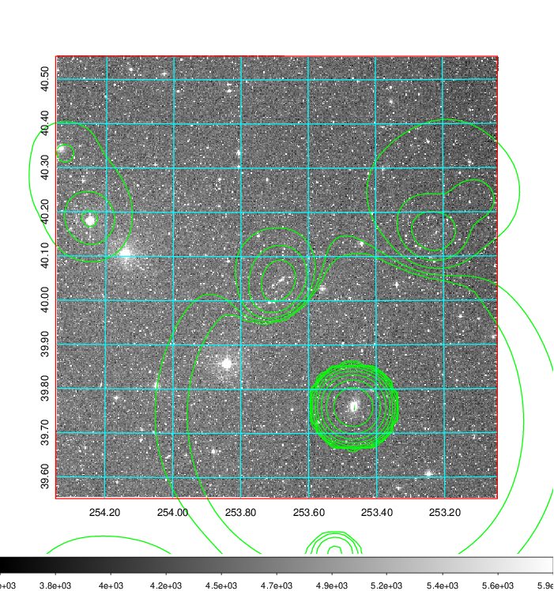 Blue circle for optical clusters;  Magenta circle for XSZ clusters;  all with r=1Mpc;  Only GC with Delta_z<0.01 are shown.  |

|[Previous-identified clusters](../image/681/681_gc.pdf) | [2MASS image](../image/681/681_2mass.pdf)      |[SDSS image](../image/681/681_sdss.pdf)   |
|-------------------|-------------------|-------------------|
|  Green, magenta, and blue circles  for optical, X-ray and SZ clusters  respectively, with redshift of clusters  labelled. The radius of circles  are 1Mpc.|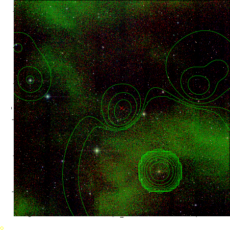  | 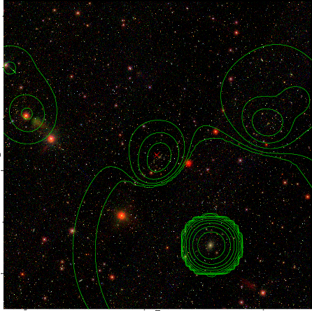  |

