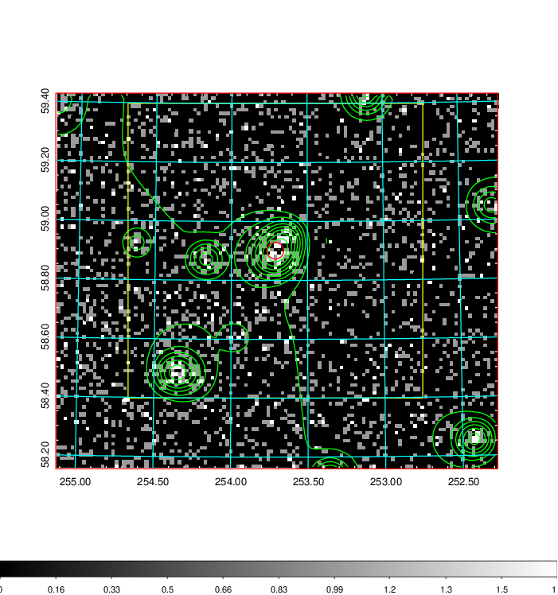
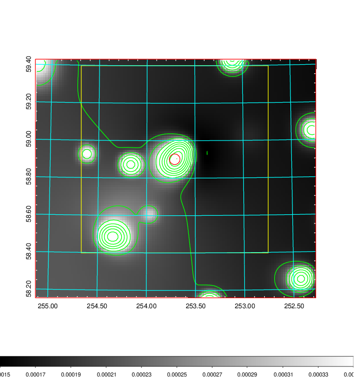
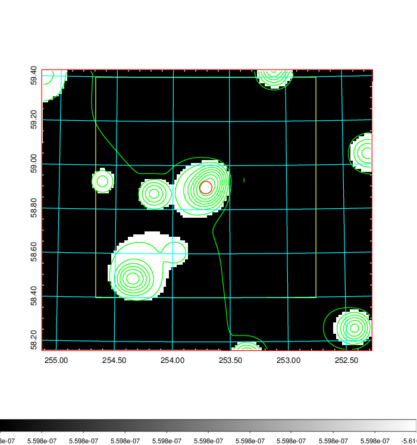
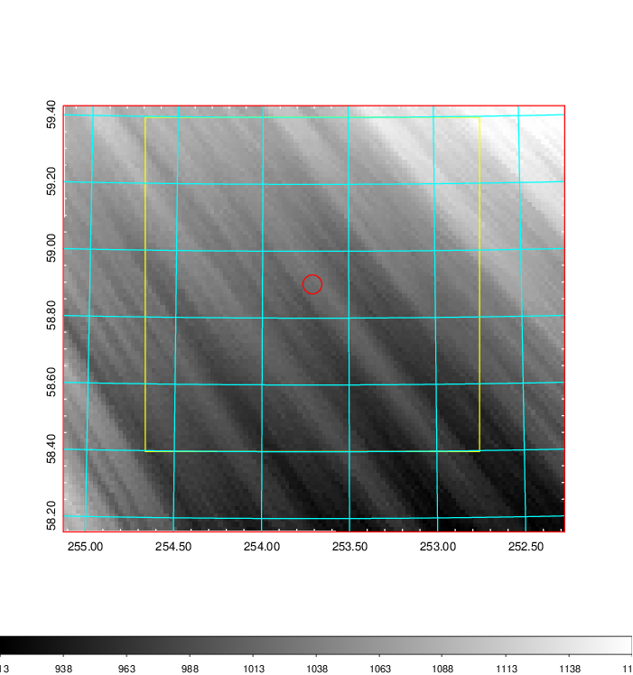
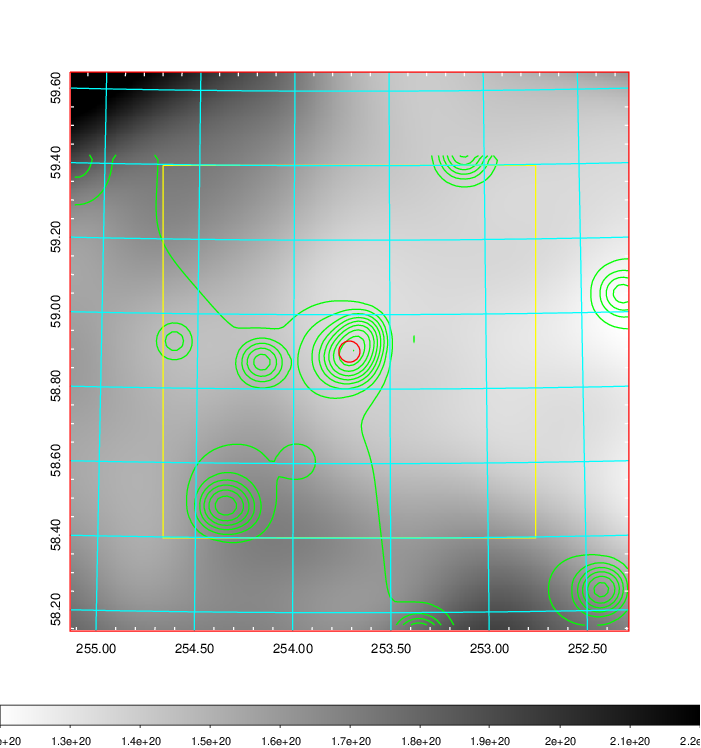
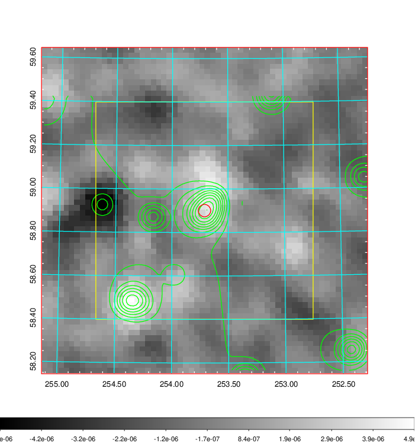
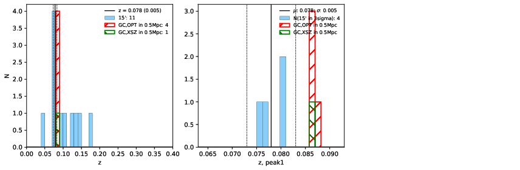
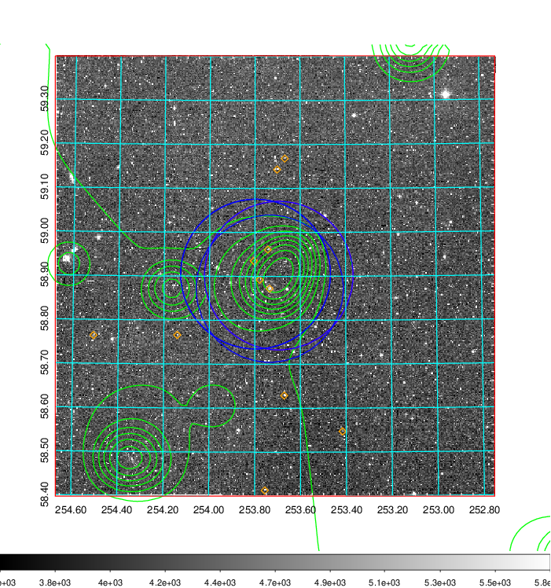
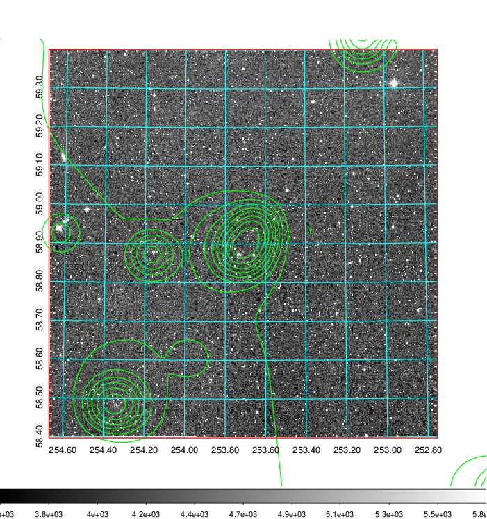
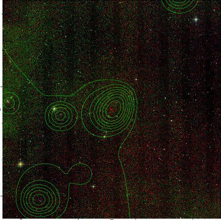

### 682

|Name|RAJ2000[deg]|DEJ2000[deg] |Ext[arcmin]| Ext,ml | z | z_src| C|GC(XSZ,Delta_z<0.01)| GC(OPT,Delta_z<0.01)|GC| R_sig[arcmin] | R500[arcmin] | R500[Mpc]| CRsig[c/s] | CR500[c/s] |L500[1E44 erg/s]|F500[1E-12 erg/s/cm^2]| M500[1E14 Msun]|Tx[keV]|Cnt_sig|Beta|Rc[arcmin]|Comment|Alias|
|---|---|---|---|---|---|------|---|--------|---------|----------|---|---|---|---|---|---|---|---|---|---|---|---|---|---|
|682| 253.711| 58.901| 1.71| 54.44| 0.0780(0.005)| z1, z_xsz| B| MCXC| A, N, W| A, MCXC, N, W| 10.262| 7.833| 0.694| 0.101(0.022)| 0.097(0.021)| 0.273(0.036)| 1.823(0.243)| 1.02(0.07)| 2.22(0.10)| 106.3| 0.956(-0.060+0.032)| 3.860(-0.329+0.292)| -| k159|

|[RASS image](../image/682/682_img.pdf)|[filtered image](../image/682/682_fil.pdf)|[Segment image](../image/682/682_seg.pdf)|
|-------------------|--------------------|-------------------|
|   |    |   |

|[Exposure image](../image/682/682_mex.pdf)| [nH image](../image/682/682_nh.pdf)| [Planck image](../image/682/682_p.pdf)|
|-------------------|--------------------|-------------------|
|   |     |  |

|[Redshift Histogram](../image/682/682_zg.pdf) | [DSS image(z1)](../image/682/682_dss_z1.pdf)      |  [DSS image(z2)](../image/682/682_dss_z2.pdf)    |
|-------------------|--------------------|-------------------|
| |  Blue circle for optical clusters;  Magenta circle for XSZ clusters;  all with r=1Mpc;  Only GC with Delta_z<0.01 are shown. |  Blue circle for optical clusters;  Magenta circle for XSZ clusters;  all with r=1Mpc;  Only GC with Delta_z<0.01 are shown.  |

|[known Abell/XSZ clusters](../image/682/682_gc.pdf) | [2MASS image](../image/682/682_2mass.pdf)      |
|-------------------|-------------------|
|  Magenta, blue and green circles  for optical, X-ray and SZ clusters  respectively, with redshift of clusters  labelled. The radius of circles  are 1Mpc.|  |

|[PS1 image](../image/682/682_ps1.pdf)            |
|-------------------|
|   |
