

### 683

|Name|RAJ2000[deg]|DEJ2000[deg] |Ext[arcmin]| Ext,ml | z | z_src| C|GC(XSZ,Delta_z<0.01)| GC(OPT,Delta_z<0.01)|GC| R_sig[arcmin] | R500[arcmin] | R500[Mpc]| CRsig[c/s] | CR500[c/s] |L500[1E44 erg/s]|F500[1E-12 erg/s/cm^2]| M500[1E14 Msun]|Tx[keV]|Cnt_sig|Beta|Rc[arcmin]|Comment|Alias|
|---|---|---|---|---|---|------|---|--------|---------|----------|---|---|---|---|---|---|---|---|---|---|---|---|---|---|
|683| 254.080| 39.282| 3.94| 38.27| 0.0622(0.005)| z1, z_xsz| B| F20| N, W| F20, N, SPI, W| 11.725| 9.314| 0.670| 0.128(0.029)| 0.124(0.028)| 0.214(0.041)| 2.299(0.436)| 0.91(0.09)| 2.05(0.13)| 97.1| 0.736(-0.148+0.170)| 4.617(-1.472+1.380)| -| t190|

|[RASS image](../image/683/683_img.pdf)|[filtered image](../image/683/683_fil.pdf)|[Segment image](../image/683/683_seg.pdf)|
|-------------------|--------------------|-------------------|
| 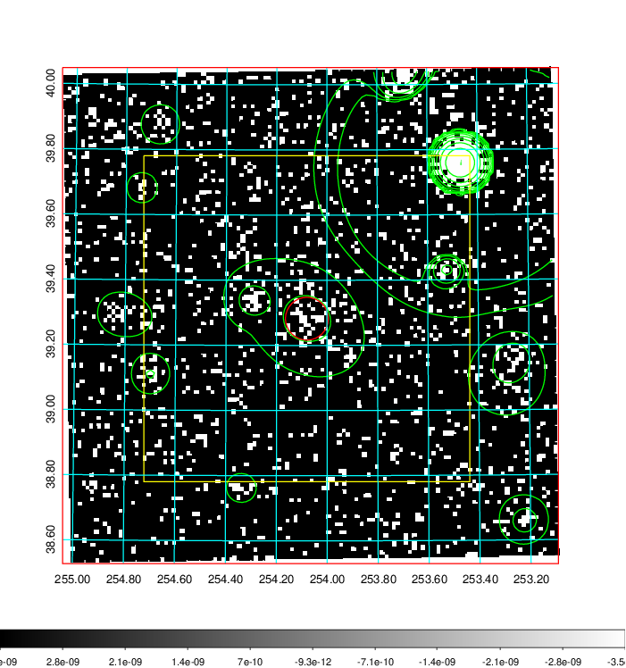  | 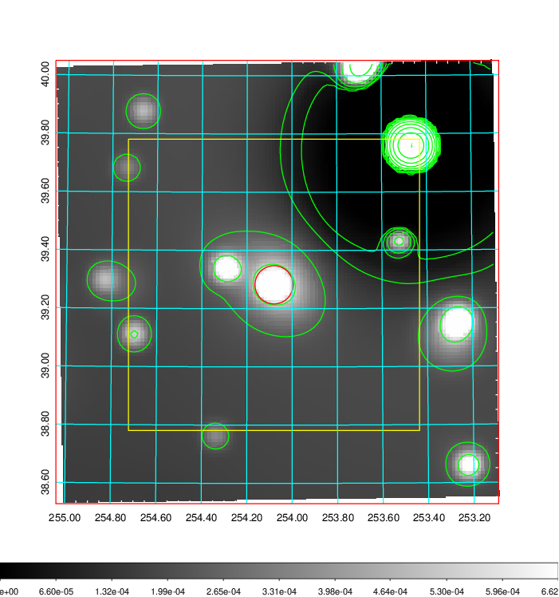   | 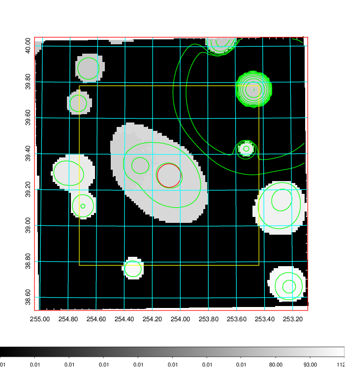  |

|[Exposure image](../image/683/683_mex.pdf)| [nH image](../image/683/683_nh.pdf)| [Planck image](../image/683/683_p.pdf)|
|-------------------|--------------------|-------------------|
|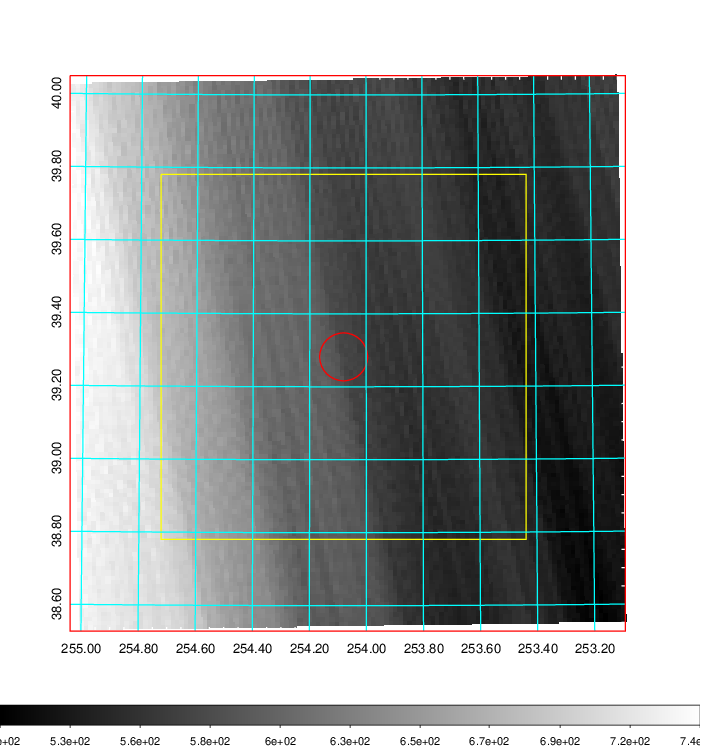   | 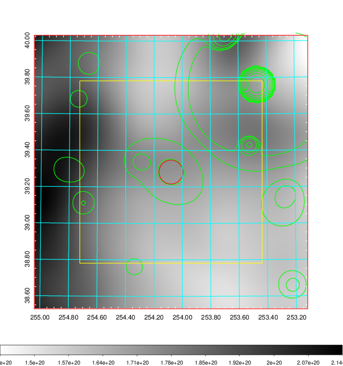    | 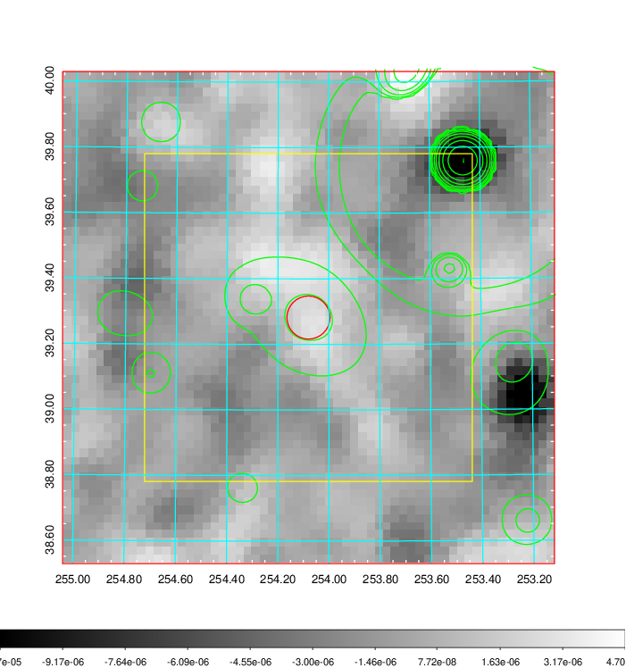 |

|[Redshift Histogram](../image/683/683_zg.pdf) | [DSS image(z1)](../image/683/683_dss_z1.pdf)      |  [DSS image(z2)](../image/683/683_dss_z2.pdf)    |
|-------------------|--------------------|-------------------|
|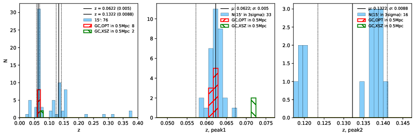 |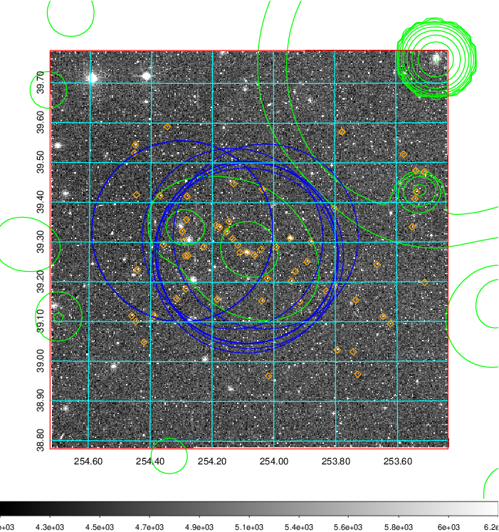  Blue circle for optical clusters;  Magenta circle for XSZ clusters;  all with r=1Mpc;  Only GC with Delta_z<0.01 are shown. | 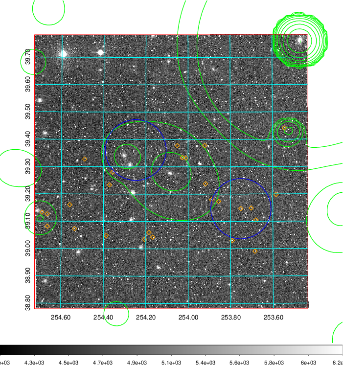 Blue circle for optical clusters;  Magenta circle for XSZ clusters;  all with r=1Mpc;  Only GC with Delta_z<0.01 are shown.  |

|[known Abell/XSZ clusters](../image/683/683_gc.pdf) | [2MASS image](../image/683/683_2mass.pdf)      |[SDSS image](../image/683/683_sdss.pdf)   |
|-------------------|-------------------|-------------------|
|  Magenta, blue and green circles  for optical, X-ray and SZ clusters  respectively, with redshift of clusters  labelled. The radius of circles  are 1Mpc.|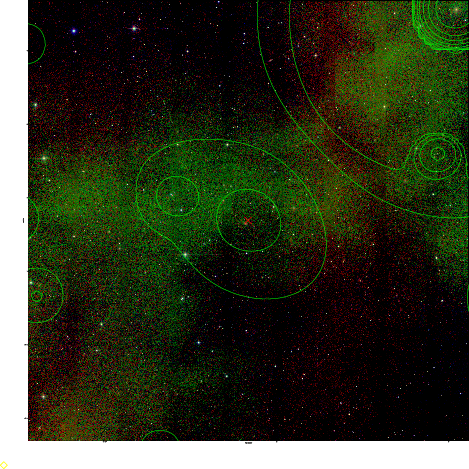  | 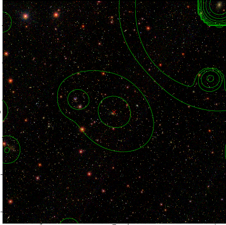  |

