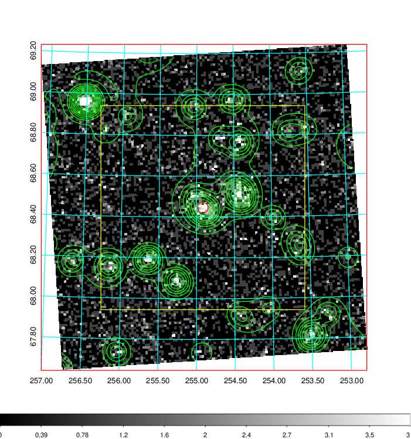
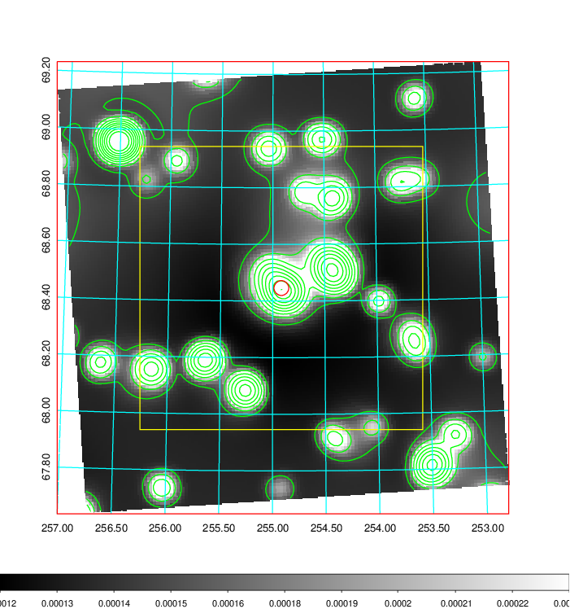
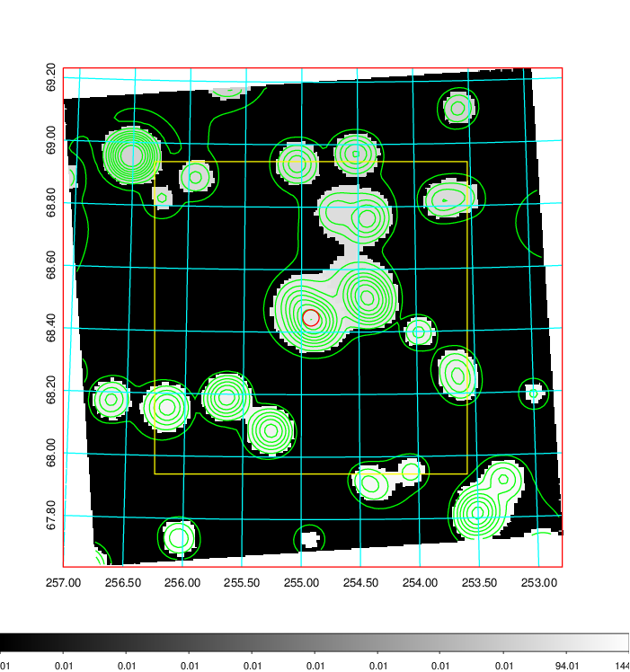
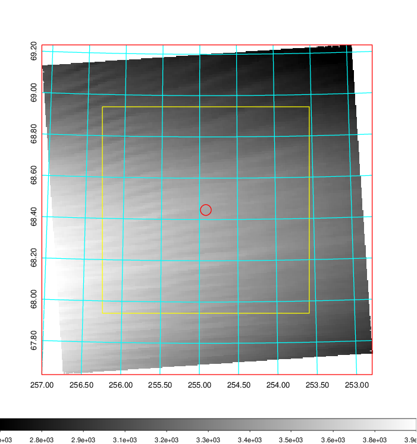
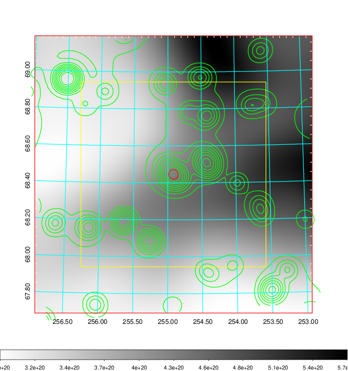
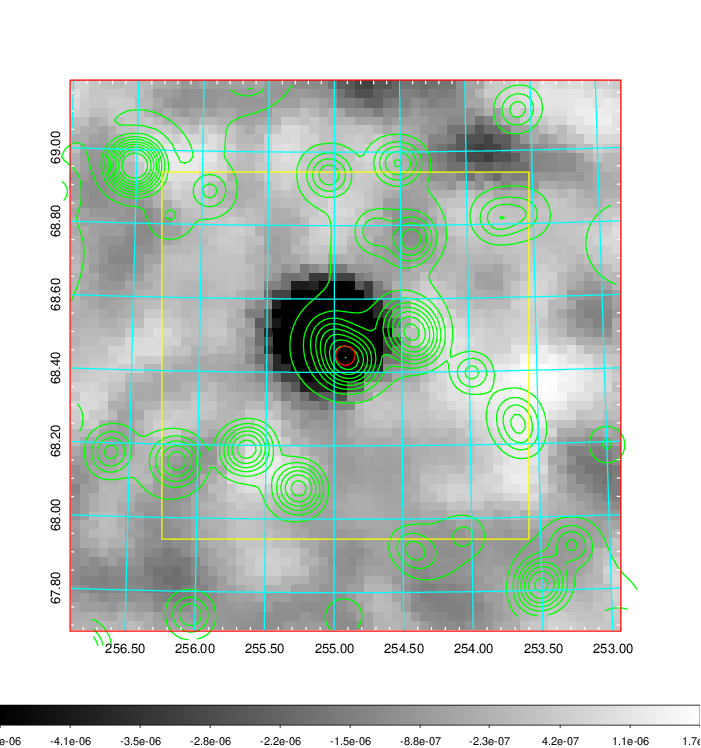
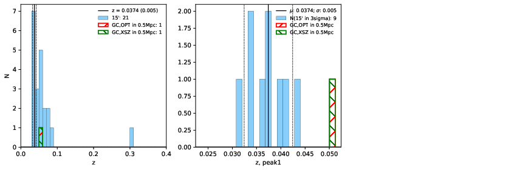
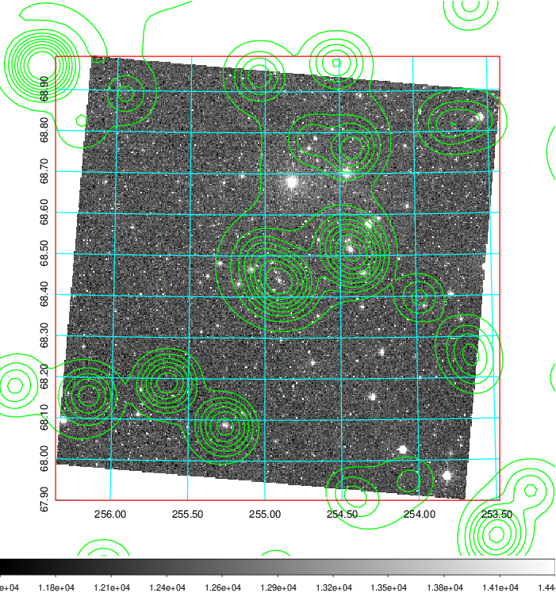
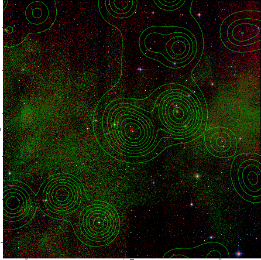
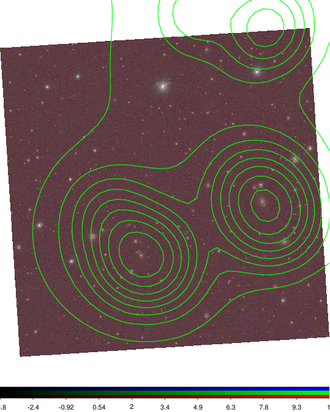

### 685

|Name|RAJ2000[deg]|DEJ2000[deg] |Ext[arcmin]| Ext,ml | z | z_src| C|GC(XSZ,Delta_z<0.01)| GC(OPT,Delta_z<0.01)|GC| R_sig[arcmin] | R500[arcmin] | R500[Mpc]| CRsig[c/s] | CR500[c/s] |L500[1E44 erg/s]|F500[1E-12 erg/s/cm^2]| M500[1E14 Msun]|Tx[keV]|Cnt_sig|Beta|Rc[arcmin]|Comment|Alias|
|---|---|---|---|---|---|------|---|--------|---------|----------|---|---|---|---|---|---|---|---|---|---|---|---|---|---|
|685| 254.917| 68.446| 1.57| 63.58| 0.0374(0.005)| z1,| G| -| -| MCXC, N| 14.162| 11.397| 0.508| 0.093(0.011)| 0.090(0.010)| 0.041(0.004)| 1.273(0.111)| 0.39(0.02)| 1.20(0.03)| 433.8| 0.526(-0.019+0.036)| 1.732(-0.250+0.397)| An X-ray cluster with $z$ = 0.0504 and offset = 0.03 Mpc| k130|

|[RASS image](../image/685/685_img.pdf)|[filtered image](../image/685/685_fil.pdf)|[Segment image](../image/685/685_seg.pdf)|
|-------------------|--------------------|-------------------|
|   |    |   |

|[Exposure image](../image/685/685_mex.pdf)| [nH image](../image/685/685_nh.pdf)| [Planck image](../image/685/685_p.pdf)|
|-------------------|--------------------|-------------------|
|   |     |  |

|[Redshift Histogram](../image/685/685_zg.pdf) | [DSS image(z1)](../image/685/685_dss_z1.pdf)      |  [DSS image(z2)](../image/685/685_dss_z2.pdf)    |
|-------------------|--------------------|-------------------|
| |  Blue circle for optical clusters;  Magenta circle for XSZ clusters;  all with r=1Mpc;  Only GC with Delta_z<0.01 are shown. |  Blue circle for optical clusters;  Magenta circle for XSZ clusters;  all with r=1Mpc;  Only GC with Delta_z<0.01 are shown.  |

|[Previous-identified clusters](../image/685/685_gc.pdf) | [2MASS image](../image/685/685_2mass.pdf)      |
|-------------------|-------------------|
|  Green, magenta, and blue circles  for optical, X-ray and SZ clusters  respectively, with redshift of clusters  labelled. The radius of circles  are 1Mpc.|  |

|[PS1 image](../image/685/685_ps1.pdf)            |
|-------------------|
|   |
