

### 686

|Name|RAJ2000[deg]|DEJ2000[deg] |Ext[arcmin]| Ext,ml | z | z_src| C|GC(XSZ,Delta_z<0.01)| GC(OPT,Delta_z<0.01)|GC| R_sig[arcmin] | R500[arcmin] | R500[Mpc]| CRsig[c/s] | CR500[c/s] |L500[1E44 erg/s]|F500[1E-12 erg/s/cm^2]| M500[1E14 Msun]|Tx[keV]|Cnt_sig|Beta|Rc[arcmin]|Comment|Alias|
|---|---|---|---|---|---|------|---|--------|---------|----------|---|---|---|---|---|---|---|---|---|---|---|---|---|---|
|686| 254.928| 32.616| 1.10| 57.09| 0.0972(0.005)| z1, z_xsz| B| MCXC, Tar| C, N, RM, W| A, C, F20, L03, MCXC, N, SPI, Tar, W| 8.312| 8.470| 0.914| 0.237(0.024)| 0.238(0.024)| 1.101(0.058)| 4.615(0.244)| 2.38(0.06)| 3.77(0.06)| 202.5| 0.816(-0.117+0.115)| 2.714(-0.653+0.544)| -| k043|

|[RASS image](../image/686/686_img.pdf)|[filtered image](../image/686/686_fil.pdf)|[Segment image](../image/686/686_seg.pdf)|
|-------------------|--------------------|-------------------|
| 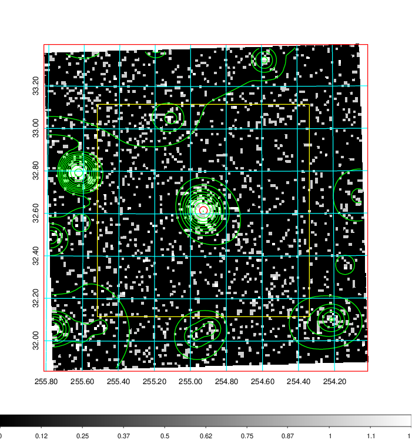  | 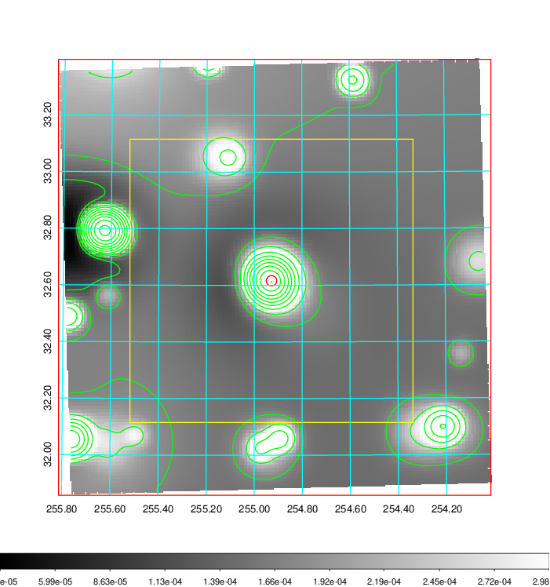   | 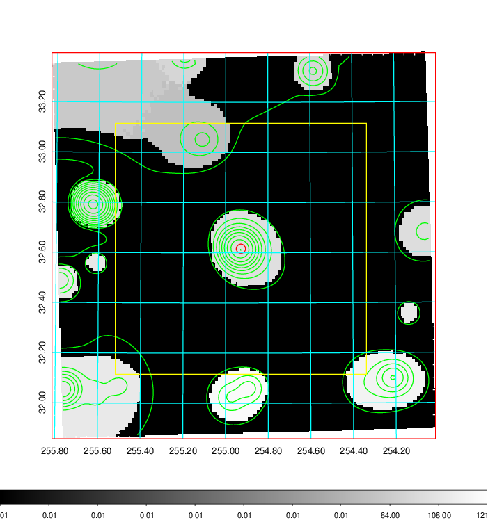  |

|[Exposure image](../image/686/686_mex.pdf)| [nH image](../image/686/686_nh.pdf)| [Planck image](../image/686/686_p.pdf)|
|-------------------|--------------------|-------------------|
|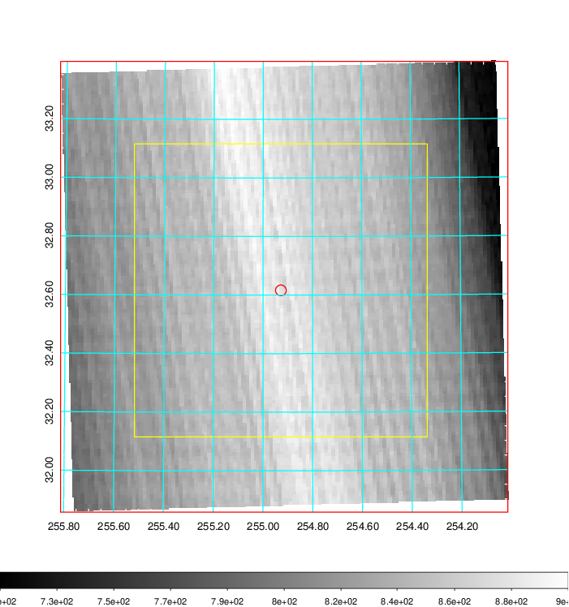   | 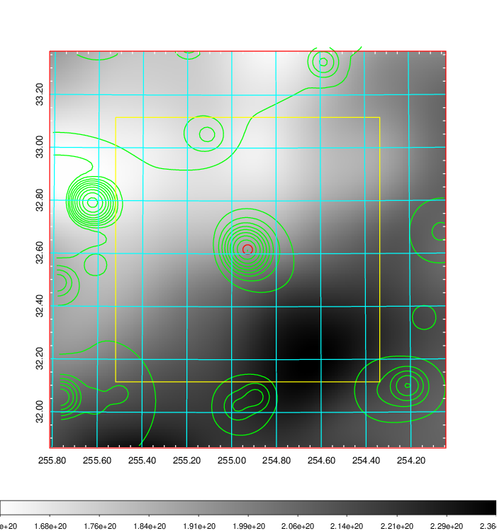    | 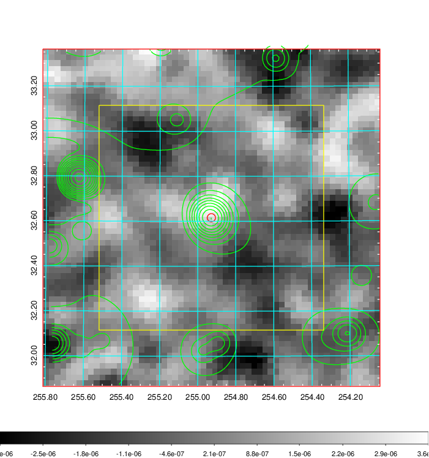 |

|[Redshift Histogram](../image/686/686_zg.pdf) | [DSS image(z1)](../image/686/686_dss_z1.pdf)      |  [DSS image(z2)](../image/686/686_dss_z2.pdf)    |
|-------------------|--------------------|-------------------|
|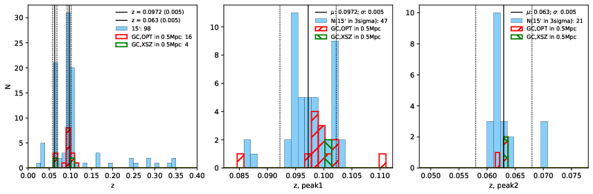 |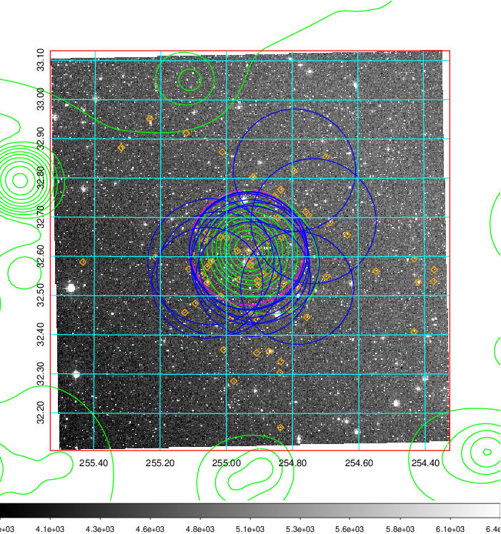  Blue circle for optical clusters;  Magenta circle for XSZ clusters;  all with r=1Mpc;  Only GC with Delta_z<0.01 are shown. | 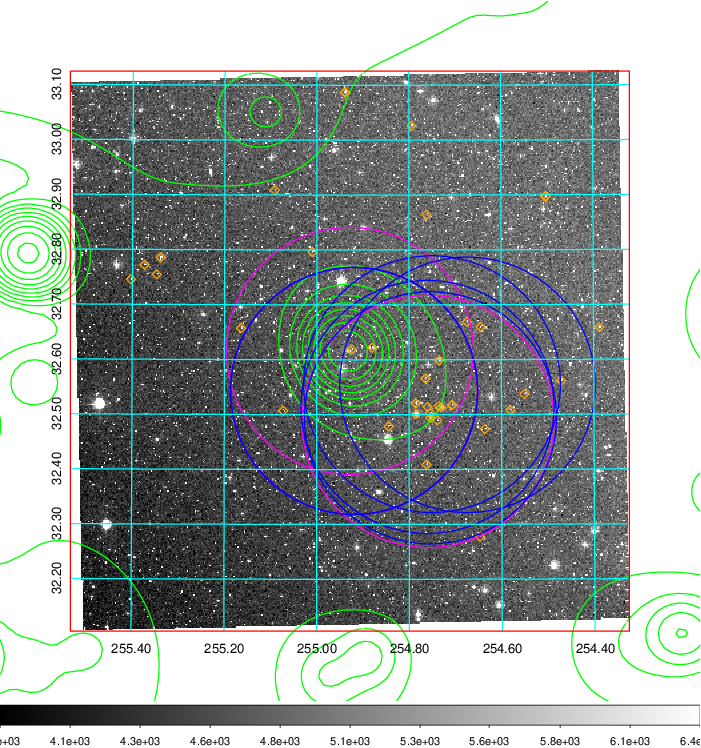 Blue circle for optical clusters;  Magenta circle for XSZ clusters;  all with r=1Mpc;  Only GC with Delta_z<0.01 are shown.  |

|[Previous-identified clusters](../image/686/686_gc.pdf) | [2MASS image](../image/686/686_2mass.pdf)      |[SDSS image](../image/686/686_sdss.pdf)   |
|-------------------|-------------------|-------------------|
|  Green, magenta, and blue circles  for optical, X-ray and SZ clusters  respectively, with redshift of clusters  labelled. The radius of circles  are 1Mpc.|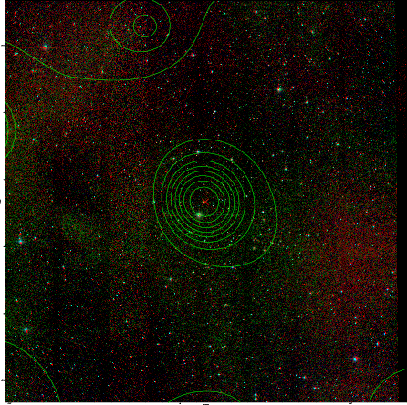  | 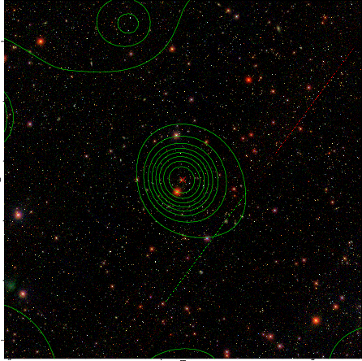  |

