

### 687

|Name|RAJ2000[deg]|DEJ2000[deg] |Ext[arcmin]| Ext,ml | z | z_src| C|GC(XSZ,Delta_z<0.01)| GC(OPT,Delta_z<0.01)|GC| R_sig[arcmin] | R500[arcmin] | R500[Mpc]| CRsig[c/s] | CR500[c/s] |L500[1E44 erg/s]|F500[1E-12 erg/s/cm^2]| M500[1E14 Msun]|Tx[keV]|Cnt_sig|Beta|Rc[arcmin]|Comment|Alias|
|---|---|---|---|---|---|------|---|--------|---------|----------|---|---|---|---|---|---|---|---|---|---|---|---|---|---|
|687| 255.255| 64.220| 1.43| 61.66| 0.2388(0.005)| z2, z_xsz| B| Tak, XCS| C, W| A, C, MCXC, N, PSZ2, SWXCS, Tak, Tar, W, XCS| 9.775| 4.419| 1.002| 0.081(0.010)| 0.074(0.010)| 2.536(0.184)| 1.481(0.107)| 3.64(0.13)| 5.14(0.11)| 240.5| 0.933(-0.077+0.048)| 3.940(-0.402+0.289)| -| k101|

|[RASS image](../image/687/687_img.pdf)|[filtered image](../image/687/687_fil.pdf)|[Segment image](../image/687/687_seg.pdf)|
|-------------------|--------------------|-------------------|
| 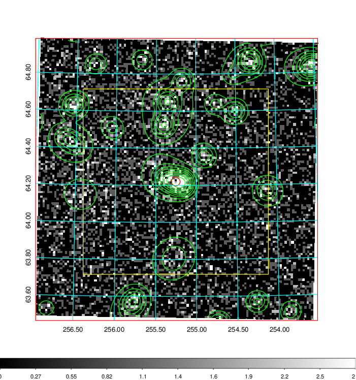  | 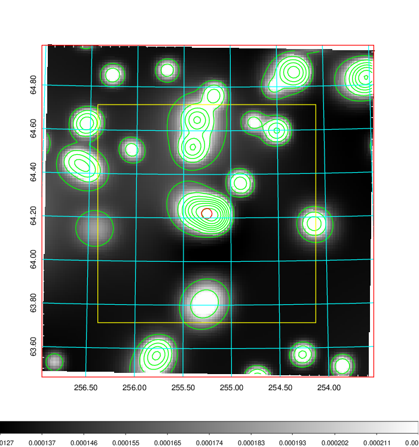   | 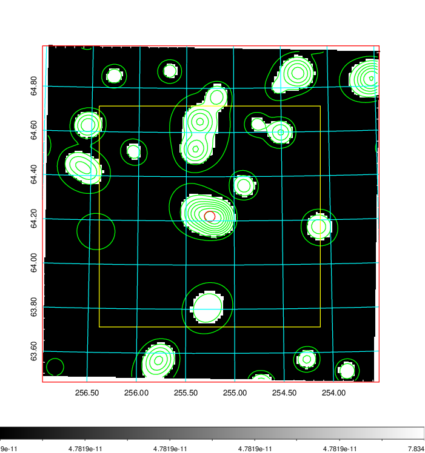  |

|[Exposure image](../image/687/687_mex.pdf)| [nH image](../image/687/687_nh.pdf)| [Planck image](../image/687/687_p.pdf)|
|-------------------|--------------------|-------------------|
|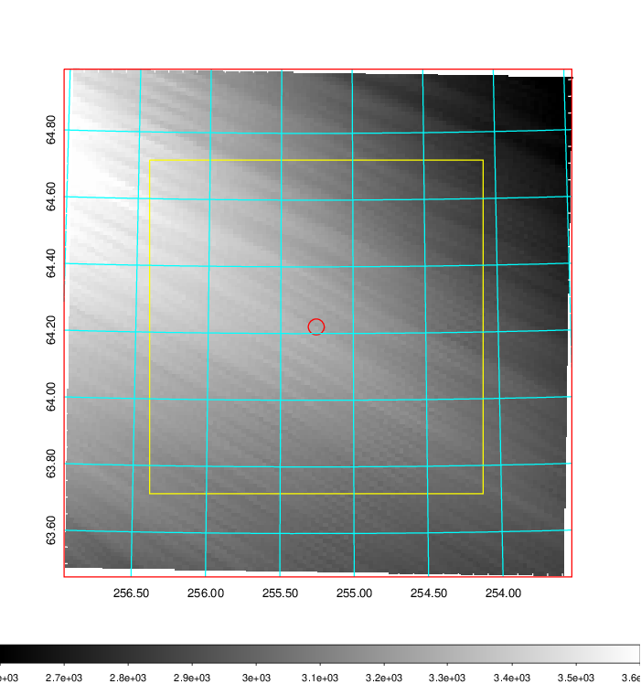   | 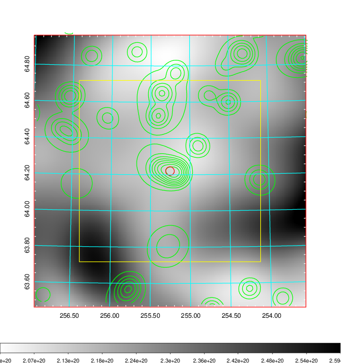    | 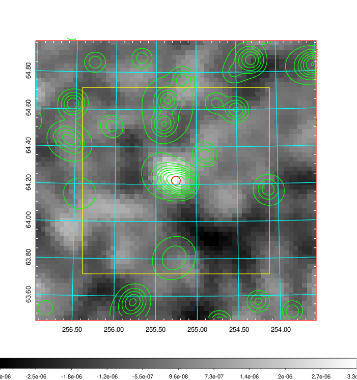 |

|[Redshift Histogram](../image/687/687_zg.pdf) | [DSS image(z1)](../image/687/687_dss_z1.pdf)      |  [DSS image(z2)](../image/687/687_dss_z2.pdf)    |
|-------------------|--------------------|-------------------|
|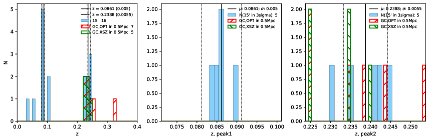 |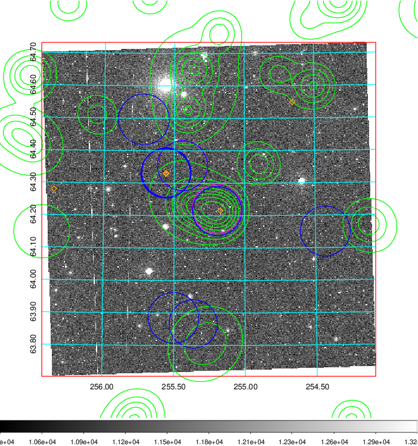  Blue circle for optical clusters;  Magenta circle for XSZ clusters;  all with r=1Mpc;  Only GC with Delta_z<0.01 are shown. | 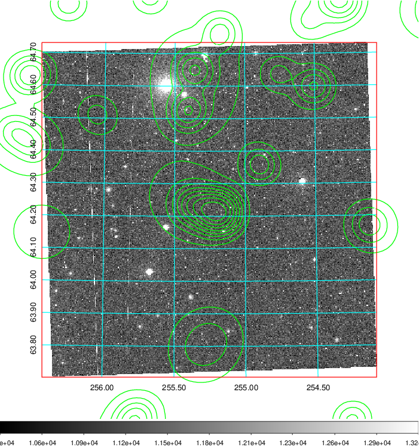 Blue circle for optical clusters;  Magenta circle for XSZ clusters;  all with r=1Mpc;  Only GC with Delta_z<0.01 are shown.  |

|[Previous-identified clusters](../image/687/687_gc.pdf) | [2MASS image](../image/687/687_2mass.pdf)      |[SDSS image](../image/687/687_sdss.pdf)   |
|-------------------|-------------------|-------------------|
|  Green, magenta, and blue circles  for optical, X-ray and SZ clusters  respectively, with redshift of clusters  labelled. The radius of circles  are 1Mpc.|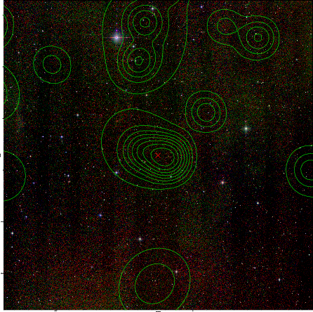  | 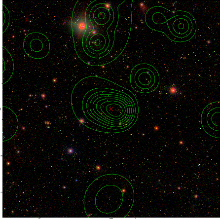  |

