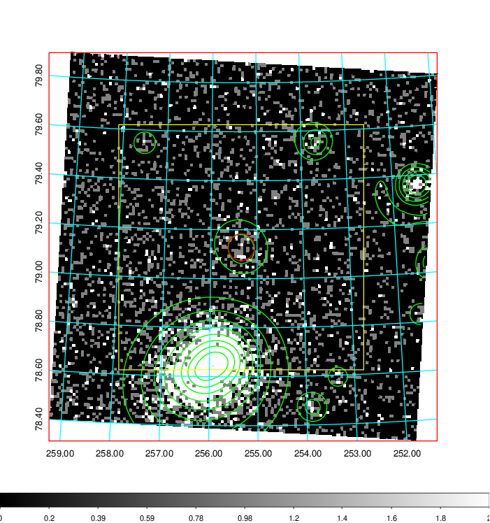
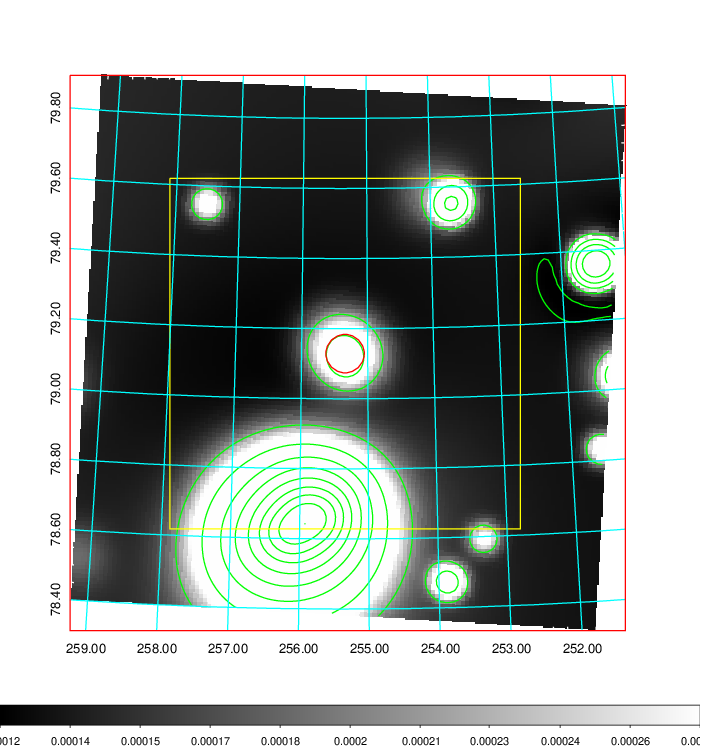
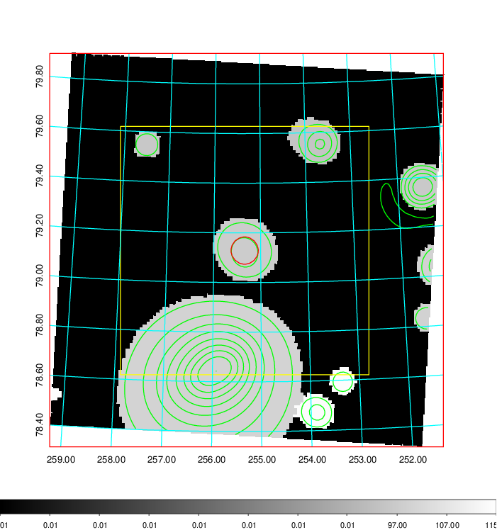
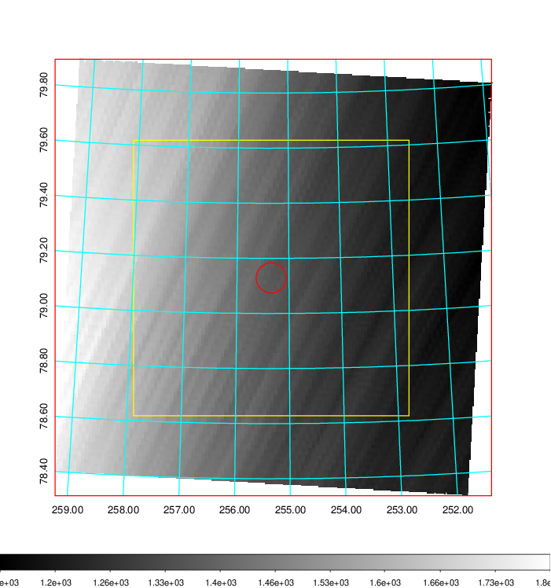
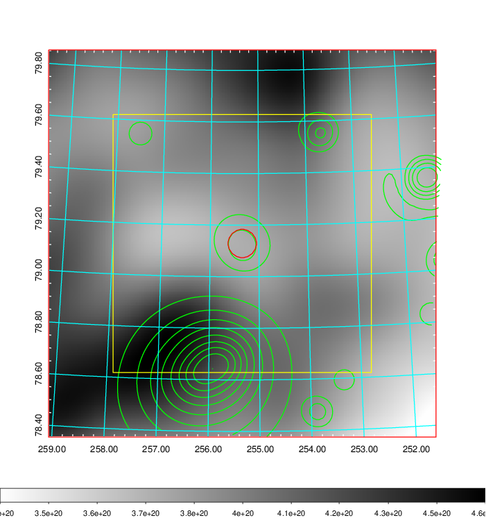
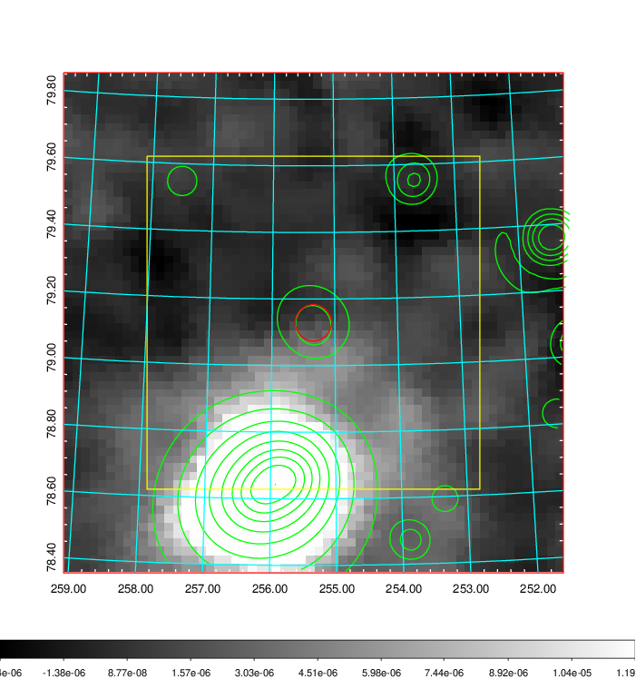
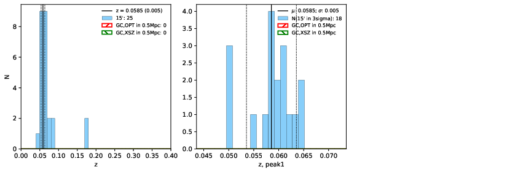
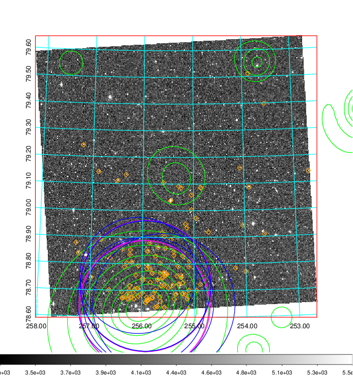
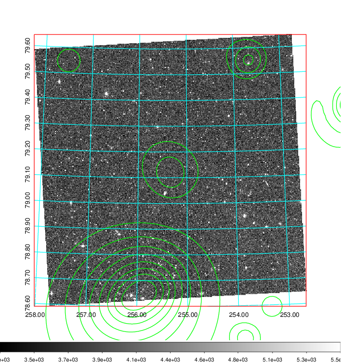
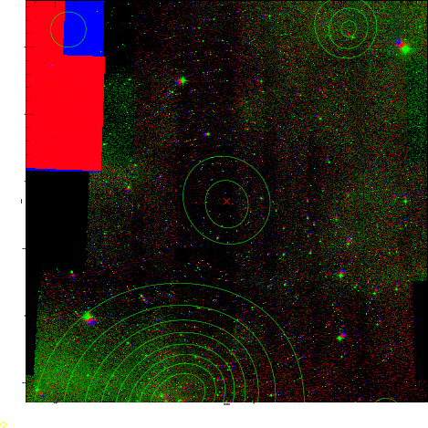

### 688

|Name|RAJ2000[deg]|DEJ2000[deg] |Ext[arcmin]| Ext,ml | z | z_src| C|GC(XSZ,Delta_z<0.01)| GC(OPT,Delta_z<0.01)|GC| R_sig[arcmin] | R500[arcmin] | R500[Mpc]| CRsig[c/s] | CR500[c/s] |L500[1E44 erg/s]|F500[1E-12 erg/s/cm^2]| M500[1E14 Msun]|Tx[keV]|Cnt_sig|Beta|Rc[arcmin]|Comment|Alias|
|---|---|---|---|---|---|------|---|--------|---------|----------|---|---|---|---|---|---|---|---|---|---|---|---|---|---|
|688| 255.342| 79.129| 3.29| 25.27| 0.0585(0.005)| z1,| G| -| -| N, W| 13.675| 7.227| 0.491| 0.035(0.017)| 0.000(0.015)| 0.039(0.009)| 0.470(0.108)| 0.36(0.04)| 1.15(0.09)| 68.3| 0.924(-0.098+0.056)| 4.857(-0.694+0.596)| An X-ray cluster with $z$ = 0.1780 and offset = 0.51 Mpc(7.47 arcmin),| t149|

|[RASS image](../image/688/688_img.pdf)|[filtered image](../image/688/688_fil.pdf)|[Segment image](../image/688/688_seg.pdf)|
|-------------------|--------------------|-------------------|
|   |    |   |

|[Exposure image](../image/688/688_mex.pdf)| [nH image](../image/688/688_nh.pdf)| [Planck image](../image/688/688_p.pdf)|
|-------------------|--------------------|-------------------|
|   |     |  |

|[Redshift Histogram](../image/688/688_zg.pdf) | [DSS image(z1)](../image/688/688_dss_z1.pdf)      |  [DSS image(z2)](../image/688/688_dss_z2.pdf)    |
|-------------------|--------------------|-------------------|
| |  Blue circle for optical clusters;  Magenta circle for XSZ clusters;  all with r=1Mpc;  Only GC with Delta_z<0.01 are shown. |  Blue circle for optical clusters;  Magenta circle for XSZ clusters;  all with r=1Mpc;  Only GC with Delta_z<0.01 are shown.  |

|[known Abell/XSZ clusters](../image/688/688_gc.pdf) | [2MASS image](../image/688/688_2mass.pdf)      |
|-------------------|-------------------|
|  Magenta, blue and green circles  for optical, X-ray and SZ clusters  respectively, with redshift of clusters  labelled. The radius of circles  are 1Mpc.|  |

|[PS1 image](../image/688/688_ps1.pdf)            |
|-------------------|
|   |
