

### 69

|Name|RAJ2000[deg]|DEJ2000[deg] |Ext[arcmin]| Ext,ml | z | z_src| C|GC(XSZ,Delta_z<0.01)| GC(OPT,Delta_z<0.01)|GC| R_sig[arcmin] | R500[arcmin] | R500[Mpc]| CRsig[c/s] | CR500[c/s] |L500[1E44 erg/s]|F500[1E-12 erg/s/cm^2]| M500[1E14 Msun]|Tx[keV]|Cnt_sig|Beta|Rc[arcmin]|Comment|Alias|
|---|---|---|---|---|---|------|---|--------|---------|----------|---|---|---|---|---|---|---|---|---|---|---|---|---|---|
|69| 20.910| 33.257| 3.15| 292.41| 0.0163(0.005)| z1, z_xsz| B| MCXC| N| C, F20, MCXC, N, SPI, Tak, W| 32.106| 31.975| 0.637| 1.294(0.087)| 1.293(0.086)| 0.123(0.005)| 20.574(0.785)| 0.75(0.01)| 1.80(0.02)| 602.1| 0.517(-0.010+0.013)| 2.435(-0.198+0.243)| -| k391|

|[RASS image](../image/69/69_img.pdf)|[filtered image](../image/69/69_fil.pdf)|[Segment image](../image/69/69_seg.pdf)|
|-------------------|--------------------|-------------------|
| 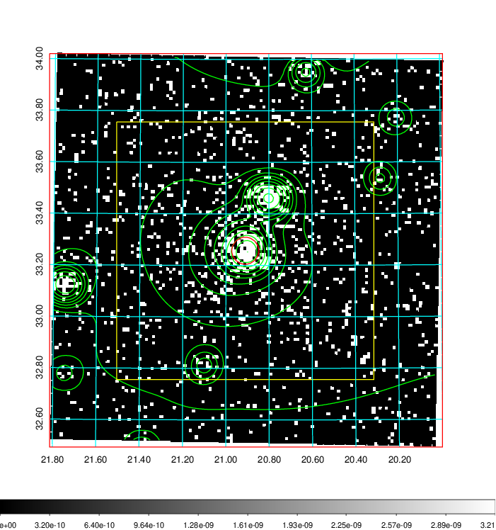  | 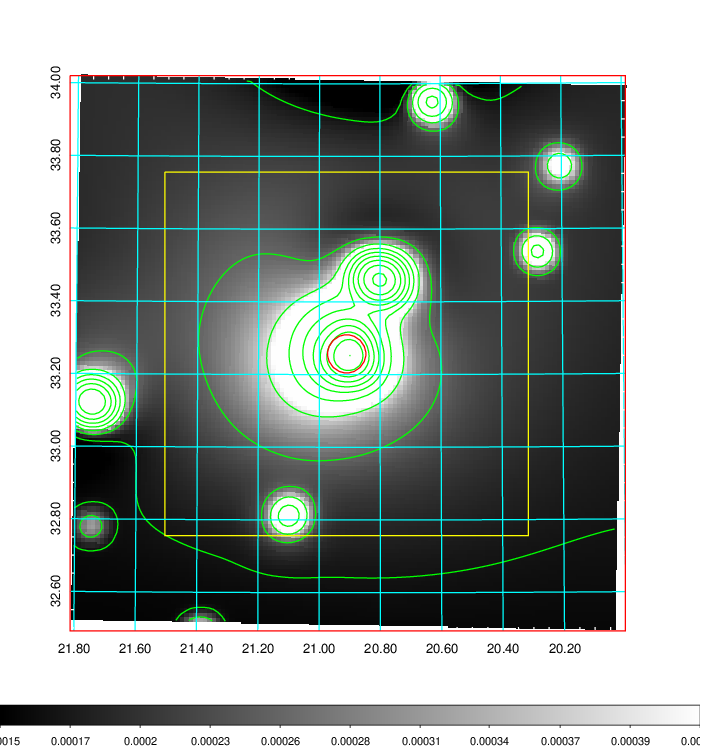   | 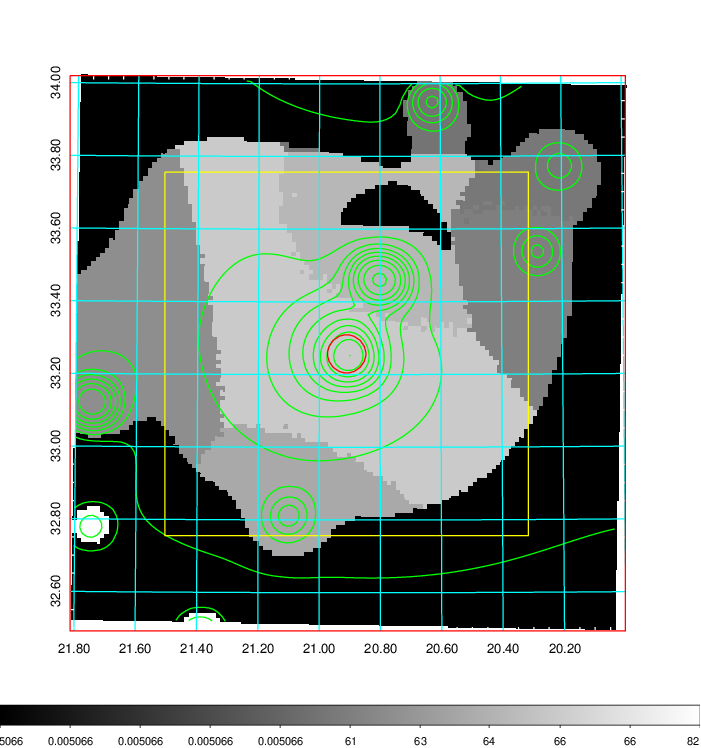  |

|[Exposure image](../image/69/69_mex.pdf)| [nH image](../image/69/69_nh.pdf)| [Planck image](../image/69/69_p.pdf)|
|-------------------|--------------------|-------------------|
|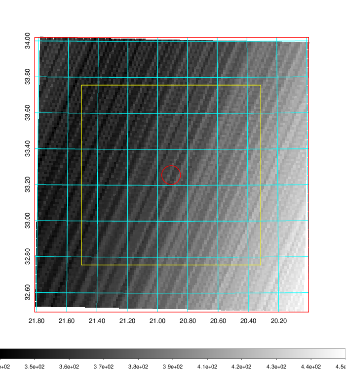   | 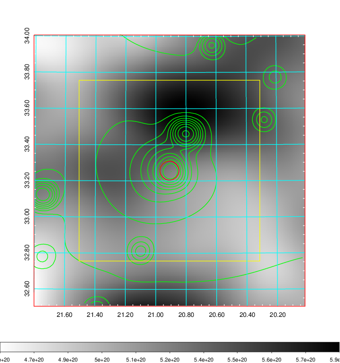    | 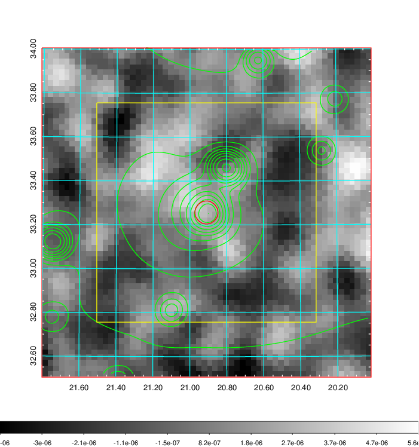 |

|[Redshift Histogram](../image/69/69_zg.pdf) | [DSS image(z1)](../image/69/69_dss_z1.pdf)      |  [DSS image(z2)](../image/69/69_dss_z2.pdf)    |
|-------------------|--------------------|-------------------|
|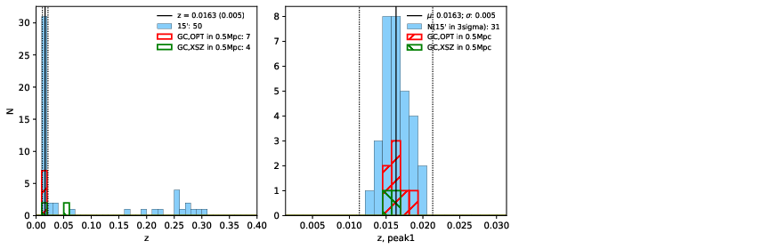 |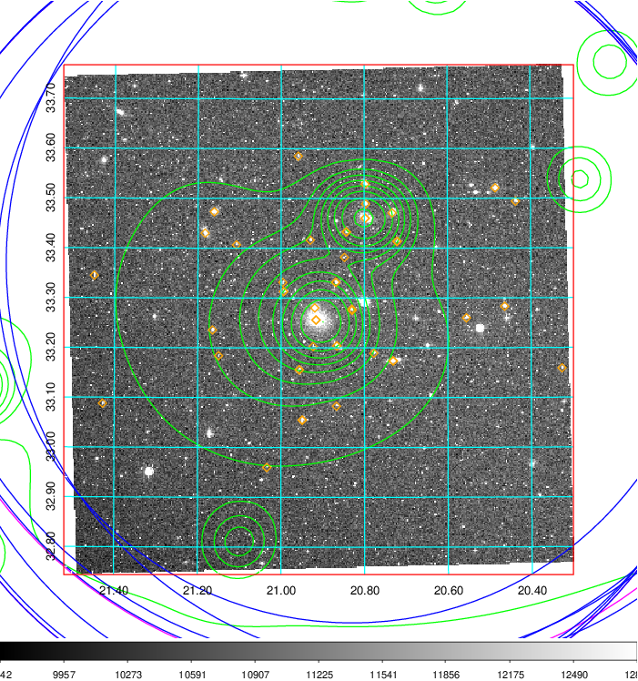  Blue circle for optical clusters;  Magenta circle for XSZ clusters;  all with r=1Mpc;  Only GC with Delta_z<0.01 are shown. | 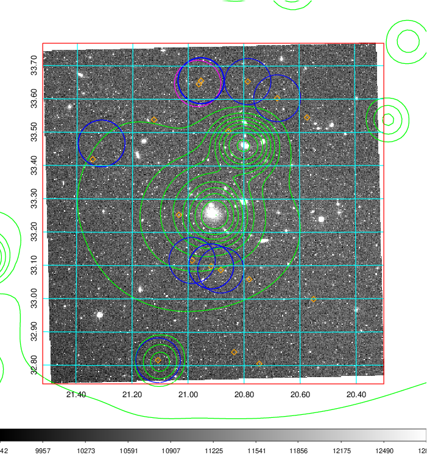 Blue circle for optical clusters;  Magenta circle for XSZ clusters;  all with r=1Mpc;  Only GC with Delta_z<0.01 are shown.  |

|[Previous-identified clusters](../image/69/69_gc.pdf) | [2MASS image](../image/69/69_2mass.pdf)      |[SDSS image](../image/69/69_sdss.pdf)   |
|-------------------|-------------------|-------------------|
|  Green, magenta, and blue circles  for optical, X-ray and SZ clusters  respectively, with redshift of clusters  labelled. The radius of circles  are 1Mpc.|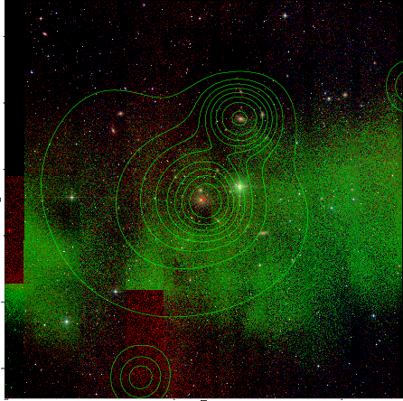  | 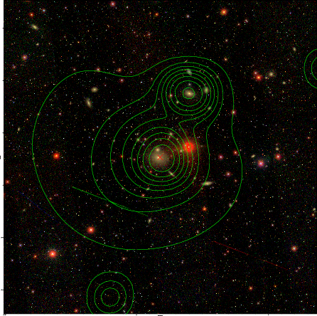  |

