

### 690

|Name|RAJ2000[deg]|DEJ2000[deg] |Ext[arcmin]| Ext,ml | z | z_src| C|GC(XSZ,Delta_z<0.01)| GC(OPT,Delta_z<0.01)|GC| R_sig[arcmin] | R500[arcmin] | R500[Mpc]| CRsig[c/s] | CR500[c/s] |L500[1E44 erg/s]|F500[1E-12 erg/s/cm^2]| M500[1E14 Msun]|Tx[keV]|Cnt_sig|Beta|Rc[arcmin]|Comment|Alias|
|---|---|---|---|---|---|------|---|--------|---------|----------|---|---|---|---|---|---|---|---|---|---|---|---|---|---|
|690| 255.453| 35.037| 1.71| 25.16| 0.1061(0.005)| z1, z_xsz| B| F20, SPI| A, C, N, RM, W| A, C, F20, N, SPI, W| 10.262| 6.369| 0.743| 0.078(0.021)| 0.074(0.020)| 0.408(0.063)| 1.417(0.219)| 1.29(0.10)| 2.59(0.13)| 73.0| 0.911(-0.103+0.064)| 3.702(-0.575+0.469)| -| t040|

|[RASS image](../image/690/690_img.pdf)|[filtered image](../image/690/690_fil.pdf)|[Segment image](../image/690/690_seg.pdf)|
|-------------------|--------------------|-------------------|
| 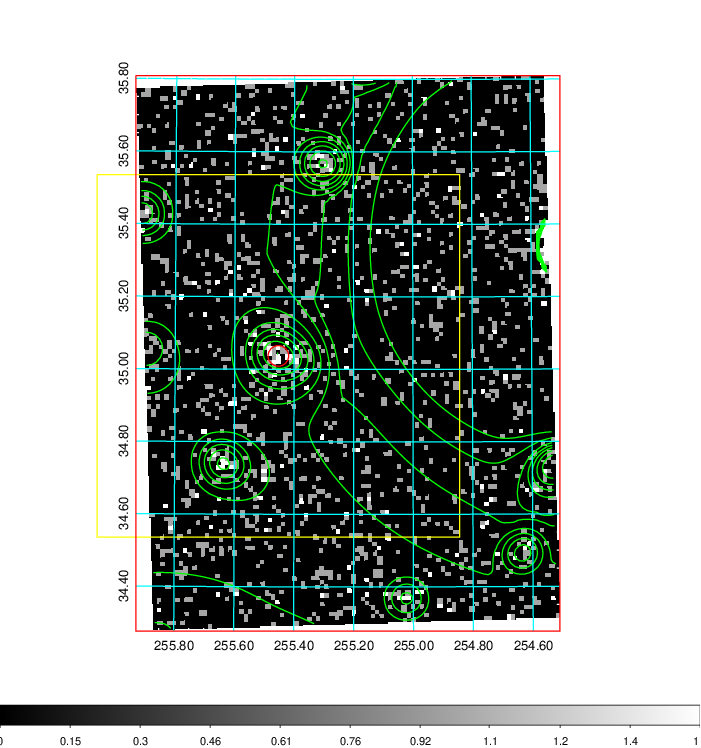  | 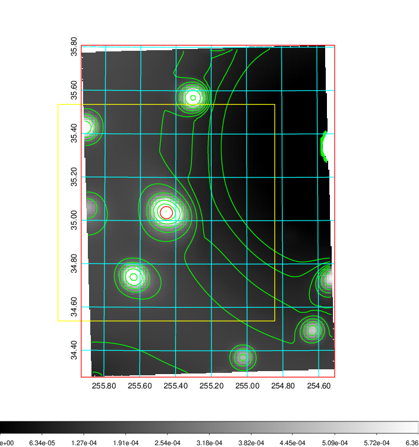   | 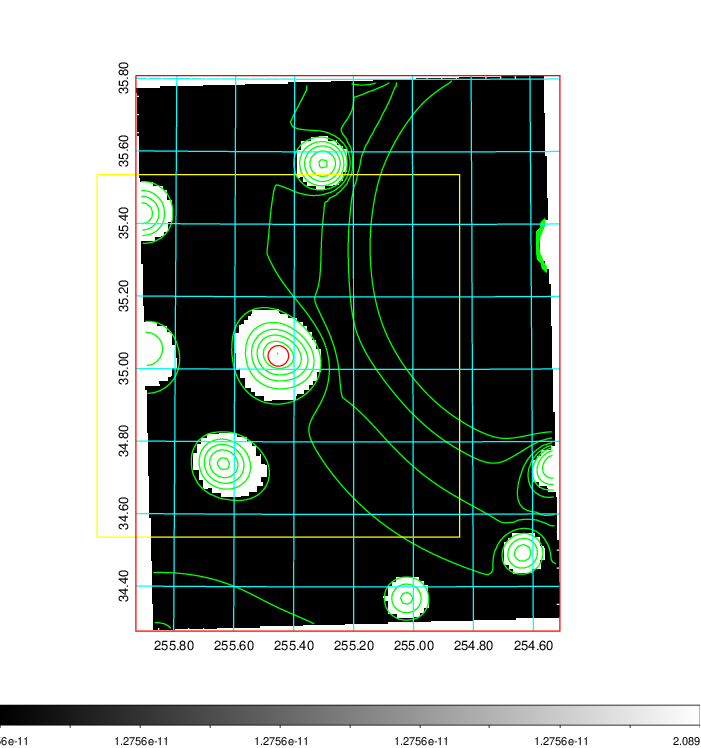  |

|[Exposure image](../image/690/690_mex.pdf)| [nH image](../image/690/690_nh.pdf)| [Planck image](../image/690/690_p.pdf)|
|-------------------|--------------------|-------------------|
|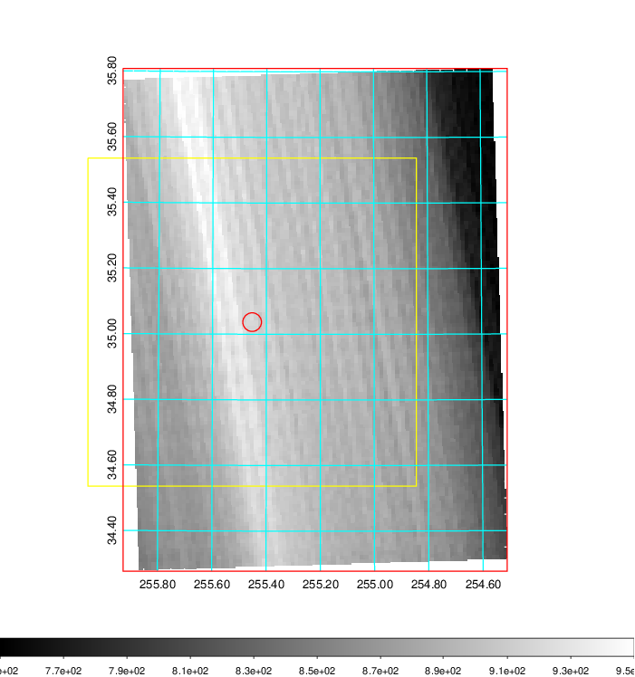   | 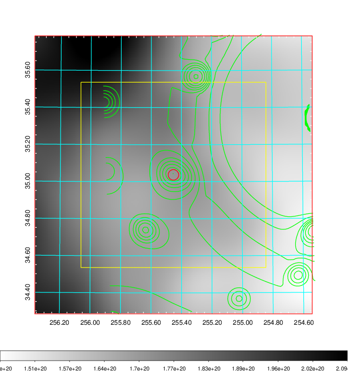    | 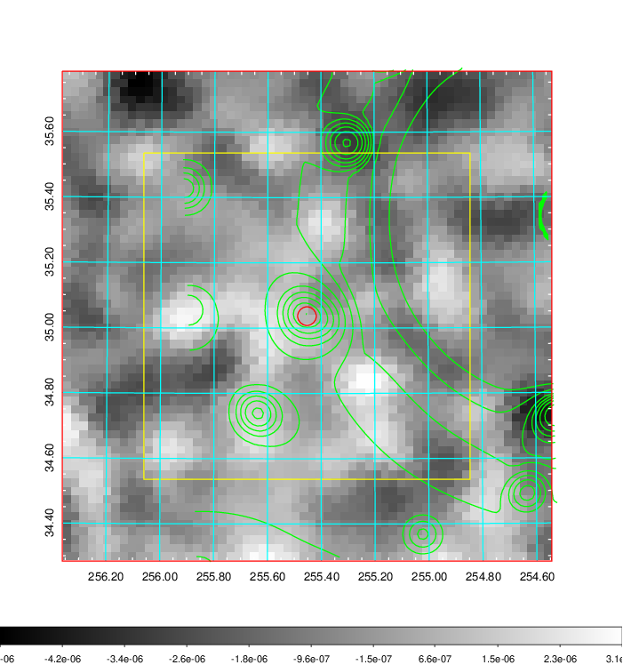 |

|[Redshift Histogram](../image/690/690_zg.pdf) | [DSS image(z1)](../image/690/690_dss_z1.pdf)      |  [DSS image(z2)](../image/690/690_dss_z2.pdf)    |
|-------------------|--------------------|-------------------|
|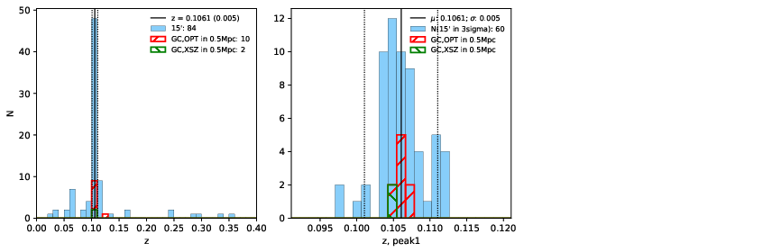 |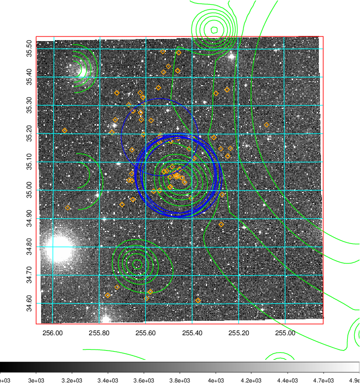  Blue circle for optical clusters;  Magenta circle for XSZ clusters;  all with r=1Mpc;  Only GC with Delta_z<0.01 are shown. | 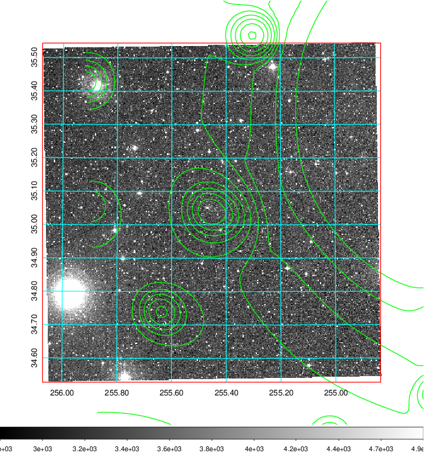 Blue circle for optical clusters;  Magenta circle for XSZ clusters;  all with r=1Mpc;  Only GC with Delta_z<0.01 are shown.  |

|[known Abell/XSZ clusters](../image/690/690_gc.pdf) | [2MASS image](../image/690/690_2mass.pdf)      |[SDSS image](../image/690/690_sdss.pdf)   |
|-------------------|-------------------|-------------------|
|  Magenta, blue and green circles  for optical, X-ray and SZ clusters  respectively, with redshift of clusters  labelled. The radius of circles  are 1Mpc.|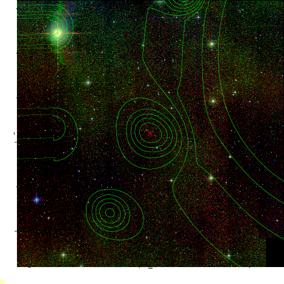  | 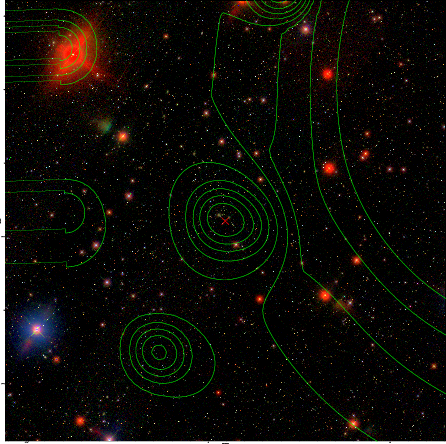  |

