

### 691

|Name|RAJ2000[deg]|DEJ2000[deg] |Ext[arcmin]| Ext,ml | z | z_src| C|GC(XSZ,Delta_z<0.01)| GC(OPT,Delta_z<0.01)|GC| R_sig[arcmin] | R500[arcmin] | R500[Mpc]| CRsig[c/s] | CR500[c/s] |L500[1E44 erg/s]|F500[1E-12 erg/s/cm^2]| M500[1E14 Msun]|Tx[keV]|Cnt_sig|Beta|Rc[arcmin]|Comment|Alias|
|---|---|---|---|---|---|------|---|--------|---------|----------|---|---|---|---|---|---|---|---|---|---|---|---|---|---|
|691| 255.563| -1.028| 2.96| 87.64| 0.0904(0.006)| z1, z_xsz| B| PSZ2, Tar| N, W| N, PSZ2, Tar, W| 12.700| 9.561| 0.967| 0.322(0.048)| 0.309(0.047)| 1.113(0.078)| 5.441(0.382)| 2.80(0.10)| 4.16(0.09)| 131.9| 0.892(-0.113+0.077)| 6.128(-0.893+0.637)| -| k373|

|[RASS image](../image/691/691_img.pdf)|[filtered image](../image/691/691_fil.pdf)|[Segment image](../image/691/691_seg.pdf)|
|-------------------|--------------------|-------------------|
| 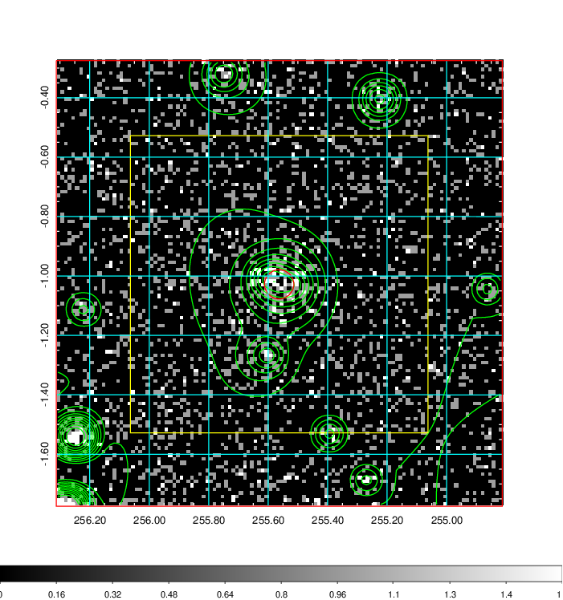  | 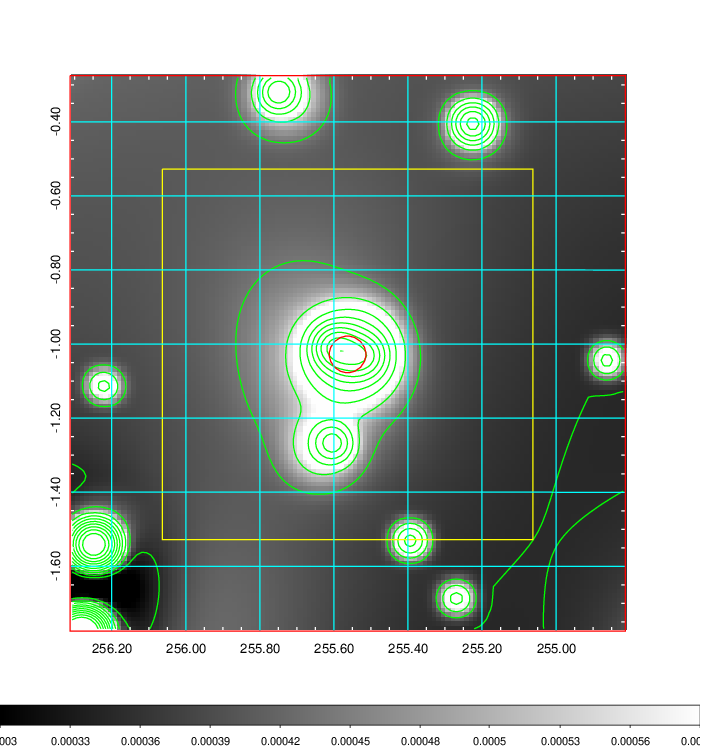   | 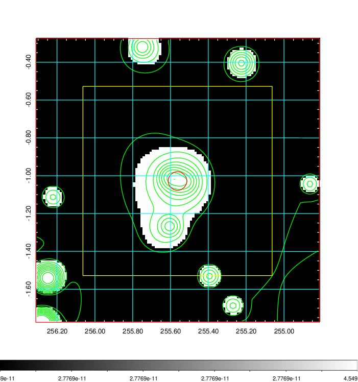  |

|[Exposure image](../image/691/691_mex.pdf)| [nH image](../image/691/691_nh.pdf)| [Planck image](../image/691/691_p.pdf)|
|-------------------|--------------------|-------------------|
|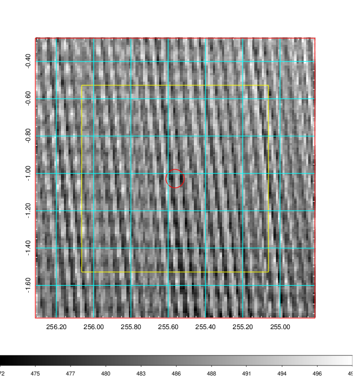   | 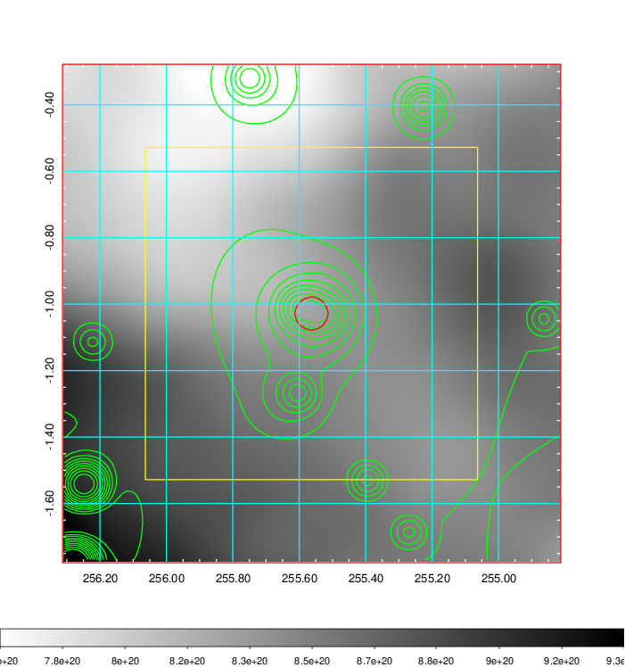    | 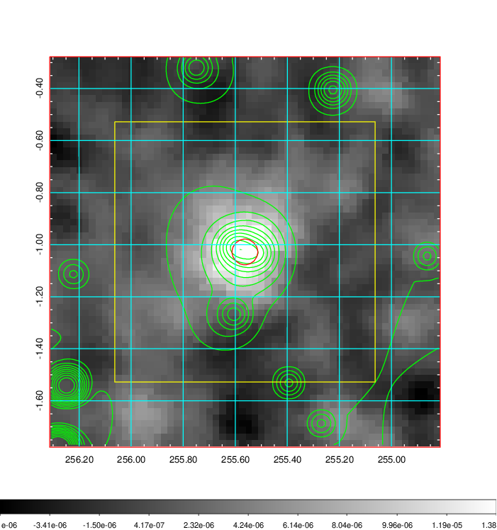 |

|[Redshift Histogram](../image/691/691_zg.pdf) | [DSS image(z1)](../image/691/691_dss_z1.pdf)      |  [DSS image(z2)](../image/691/691_dss_z2.pdf)    |
|-------------------|--------------------|-------------------|
|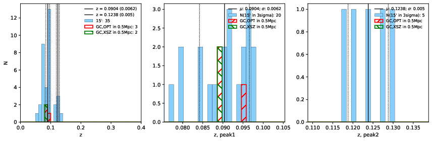 |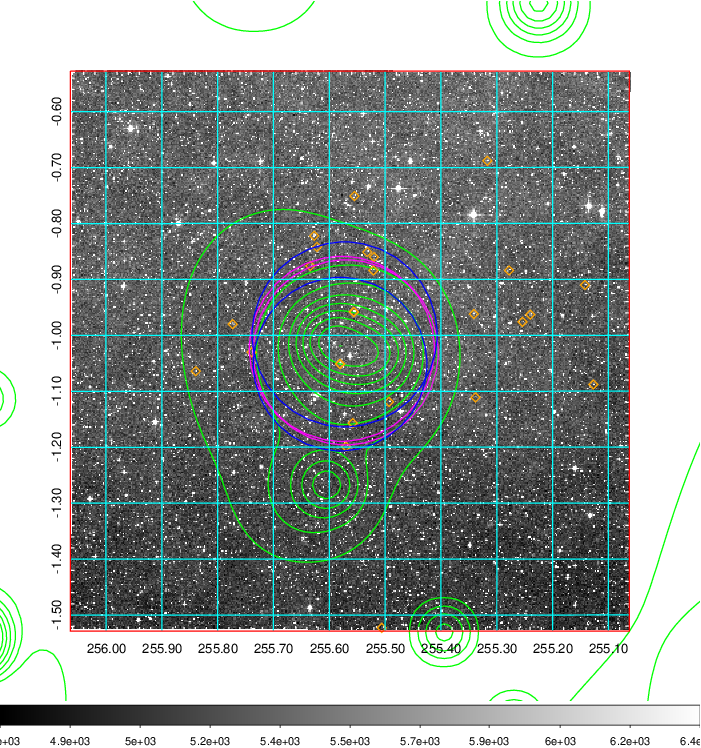  Blue circle for optical clusters;  Magenta circle for XSZ clusters;  all with r=1Mpc;  Only GC with Delta_z<0.01 are shown. | 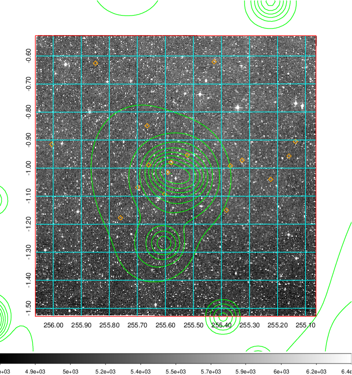 Blue circle for optical clusters;  Magenta circle for XSZ clusters;  all with r=1Mpc;  Only GC with Delta_z<0.01 are shown.  |

|[known Abell/XSZ clusters](../image/691/691_gc.pdf) | [2MASS image](../image/691/691_2mass.pdf)      |[SDSS image](../image/691/691_sdss.pdf)   |
|-------------------|-------------------|-------------------|
|  Magenta, blue and green circles  for optical, X-ray and SZ clusters  respectively, with redshift of clusters  labelled. The radius of circles  are 1Mpc.|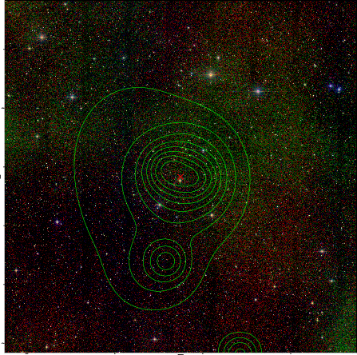  | 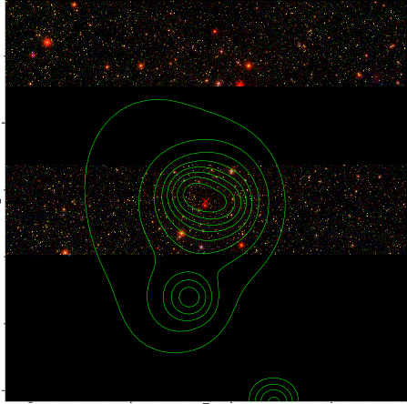  |

