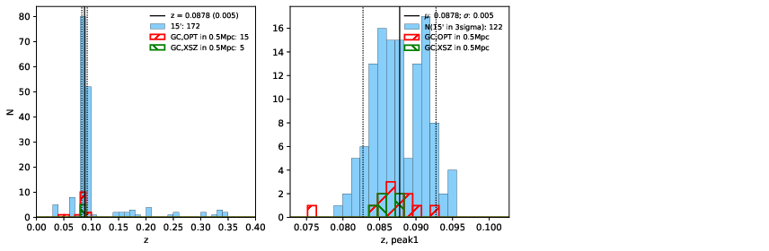

### 692

|Name|RAJ2000[deg]|DEJ2000[deg] |Ext[arcmin]| Ext,ml | z | z_src| C|GC(XSZ,Delta_z<0.01)| GC(OPT,Delta_z<0.01)|GC| R_sig[arcmin] | R500[arcmin] | R500[Mpc]| CRsig[c/s] | CR500[c/s] |L500[1E44 erg/s]|F500[1E-12 erg/s/cm^2]| M500[1E14 Msun]|Tx[keV]|Cnt_sig|Beta|Rc[arcmin]|Comment|Alias|
|---|---|---|---|---|---|------|---|--------|---------|----------|---|---|---|---|---|---|---|---|---|---|---|---|---|---|
|692| 255.627| 33.489| 2.80| 50.78| 0.0878(0.005)| z1, z_xsz| B| F20, L03, MCXC, SPI| A, N, RM, W| A, C, F20, L03, MCXC, N, SPI, W| 13.188| 7.915| 0.780| 0.144(0.026)| 0.135(0.025)| 0.488(0.072)| 2.537(0.377)| 1.47(0.11)| 2.79(0.13)| 146.5| 0.806(-0.135+0.127)| 5.647(-1.211+1.045)| -| k356|

|[RASS image](../image/692/692_img.pdf)|[filtered image](../image/692/692_fil.pdf)|[Segment image](../image/692/692_seg.pdf)|
|-------------------|--------------------|-------------------|
|   |    |   |

|[Exposure image](../image/692/692_mex.pdf)| [nH image](../image/692/692_nh.pdf)| [Planck image](../image/692/692_p.pdf)|
|-------------------|--------------------|-------------------|
|   |     |  |

|[Redshift Histogram](../image/692/692_zg.pdf) | [DSS image(z1)](../image/692/692_dss_z1.pdf)      |  [DSS image(z2)](../image/692/692_dss_z2.pdf)    |
|-------------------|--------------------|-------------------|
| |  Blue circle for optical clusters;  Magenta circle for XSZ clusters;  all with r=1Mpc;  Only GC with Delta_z<0.01 are shown. |  Blue circle for optical clusters;  Magenta circle for XSZ clusters;  all with r=1Mpc;  Only GC with Delta_z<0.01 are shown.  |

|[known Abell/XSZ clusters](../image/692/692_gc.pdf) | [2MASS image](../image/692/692_2mass.pdf)      |[SDSS image](../image/692/692_sdss.pdf)   |
|-------------------|-------------------|-------------------|
|  Magenta, blue and green circles  for optical, X-ray and SZ clusters  respectively, with redshift of clusters  labelled. The radius of circles  are 1Mpc.|  |   |

