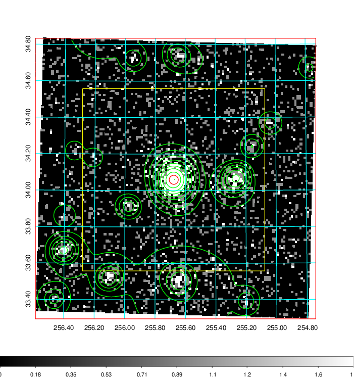
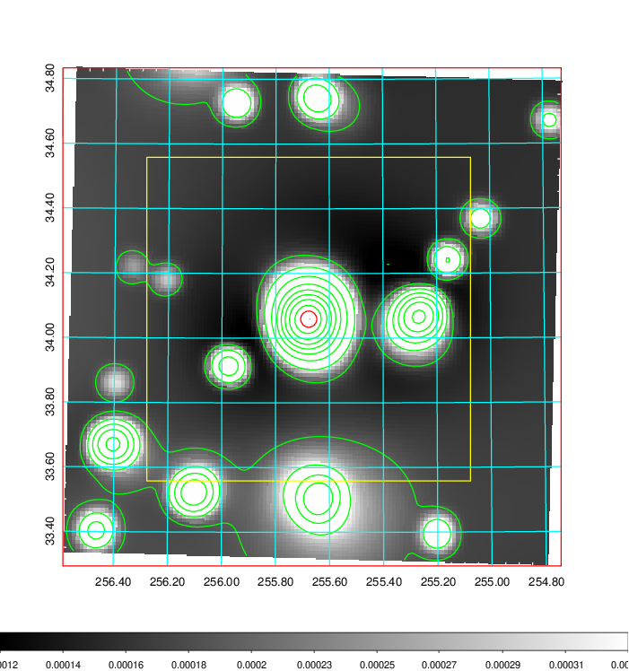
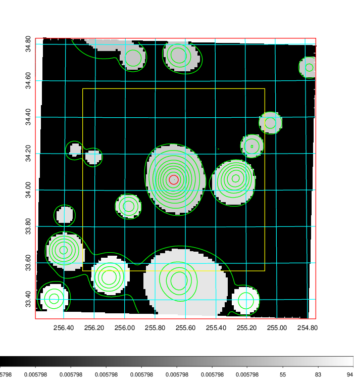
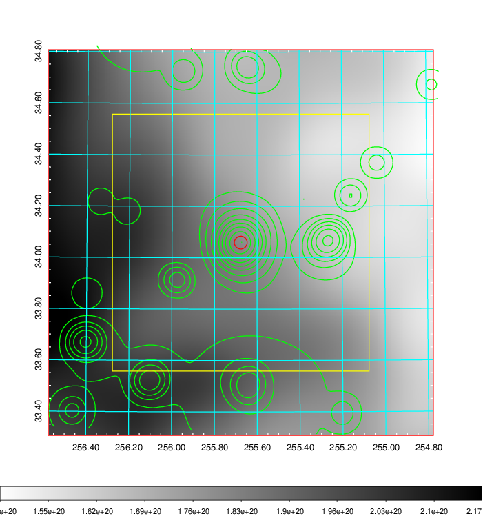
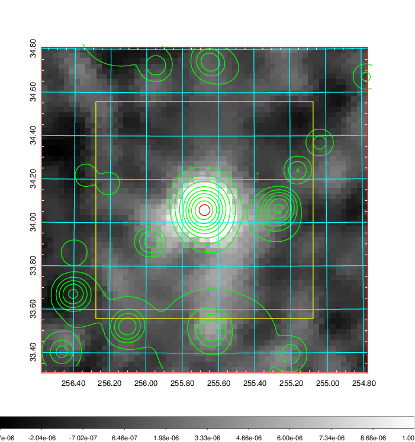
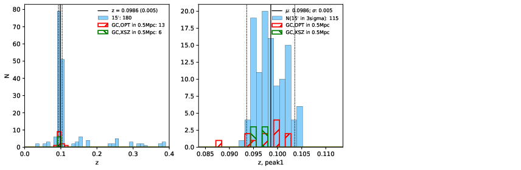
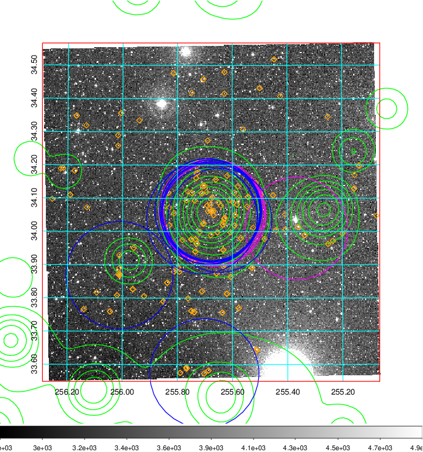
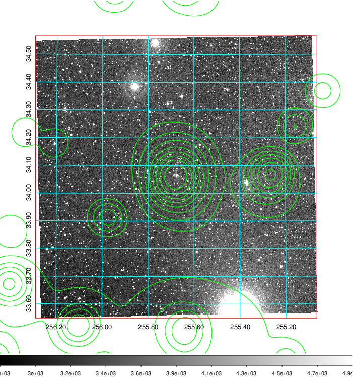
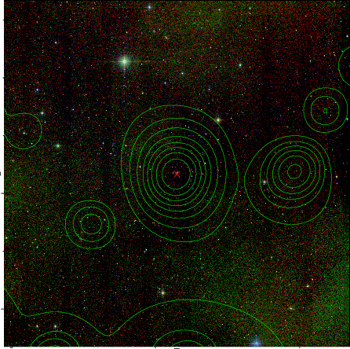
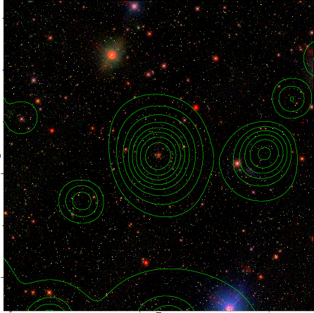

### 693

|Name|RAJ2000[deg]|DEJ2000[deg] |Ext[arcmin]| Ext,ml | z | z_src| C|GC(XSZ,Delta_z<0.01)| GC(OPT,Delta_z<0.01)|GC| R_sig[arcmin] | R500[arcmin] | R500[Mpc]| CRsig[c/s] | CR500[c/s] |L500[1E44 erg/s]|F500[1E-12 erg/s/cm^2]| M500[1E14 Msun]|Tx[keV]|Cnt_sig|Beta|Rc[arcmin]|Comment|Alias|
|---|---|---|---|---|---|------|---|--------|---------|----------|---|---|---|---|---|---|---|---|---|---|---|---|---|---|
|693| 255.677| 34.059| 1.50| 476.72| 0.0986(0.005)| z1, z_xsz| B| F20, MCXC, PSZ2, SPI, Tar, XB| A, N, RM, W| A, C, F20, MCXC, N, PSZ2, SPI, Tar, W, XB| 17.088| 11.112| 1.214| 0.950(0.040)| 0.898(0.038)| 4.364(0.076)| 17.738(0.310)| 5.60(0.05)| 6.39(0.03)| 872.1| 0.762(-0.048+0.061)| 2.683(-0.299+0.351)| -| k113|

|[RASS image](../image/693/693_img.pdf)|[filtered image](../image/693/693_fil.pdf)|[Segment image](../image/693/693_seg.pdf)|
|-------------------|--------------------|-------------------|
|   |    |   |

|[Exposure image](../image/693/693_mex.pdf)| [nH image](../image/693/693_nh.pdf)| [Planck image](../image/693/693_p.pdf)|
|-------------------|--------------------|-------------------|
|   |     |  |

|[Redshift Histogram](../image/693/693_zg.pdf) | [DSS image(z1)](../image/693/693_dss_z1.pdf)      |  [DSS image(z2)](../image/693/693_dss_z2.pdf)    |
|-------------------|--------------------|-------------------|
| |  Blue circle for optical clusters;  Magenta circle for XSZ clusters;  all with r=1Mpc;  Only GC with Delta_z<0.01 are shown. |  Blue circle for optical clusters;  Magenta circle for XSZ clusters;  all with r=1Mpc;  Only GC with Delta_z<0.01 are shown.  |

|[known Abell/XSZ clusters](../image/693/693_gc.pdf) | [2MASS image](../image/693/693_2mass.pdf)      |[SDSS image](../image/693/693_sdss.pdf)   |
|-------------------|-------------------|-------------------|
|  Magenta, blue and green circles  for optical, X-ray and SZ clusters  respectively, with redshift of clusters  labelled. The radius of circles  are 1Mpc.|  |   |

