

### 694

|Name|RAJ2000[deg]|DEJ2000[deg] |Ext[arcmin]| Ext,ml | z | z_src| C|GC(XSZ,Delta_z<0.01)| GC(OPT,Delta_z<0.01)|GC| R_sig[arcmin] | R500[arcmin] | R500[Mpc]| CRsig[c/s] | CR500[c/s] |L500[1E44 erg/s]|F500[1E-12 erg/s/cm^2]| M500[1E14 Msun]|Tx[keV]|Cnt_sig|Beta|Rc[arcmin]|Comment|Alias|
|---|---|---|---|---|---|------|---|--------|---------|----------|---|---|---|---|---|---|---|---|---|---|---|---|---|---|
|694| 255.997| 78.629| 3.74| 6491.08| 0.0574(0.005)| z1, z_xsz| B| L03, MCXC, PSZ2, Tar, XB| A, N, W| A, L03, MCXC, N, PSZ2, Tar, W, XB| 37.630| 18.260| 1.219| 2.622(0.060)| 2.418(0.056)| 3.551(0.030)| 45.098(0.381)| 5.44(0.02)| 6.20(0.02)| 3680.4| 0.917(-0.020+0.021)| 7.200(-0.205+0.212)| -| k458|

|[RASS image](../image/694/694_img.pdf)|[filtered image](../image/694/694_fil.pdf)|[Segment image](../image/694/694_seg.pdf)|
|-------------------|--------------------|-------------------|
| 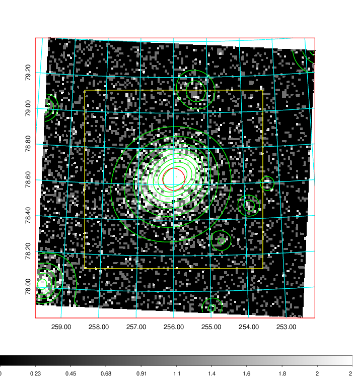  | 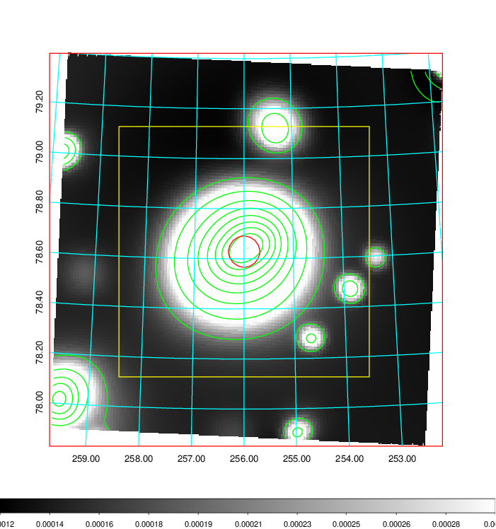   | 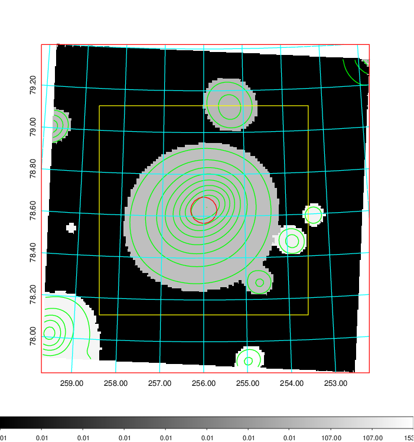  |

|[Exposure image](../image/694/694_mex.pdf)| [nH image](../image/694/694_nh.pdf)| [Planck image](../image/694/694_p.pdf)|
|-------------------|--------------------|-------------------|
|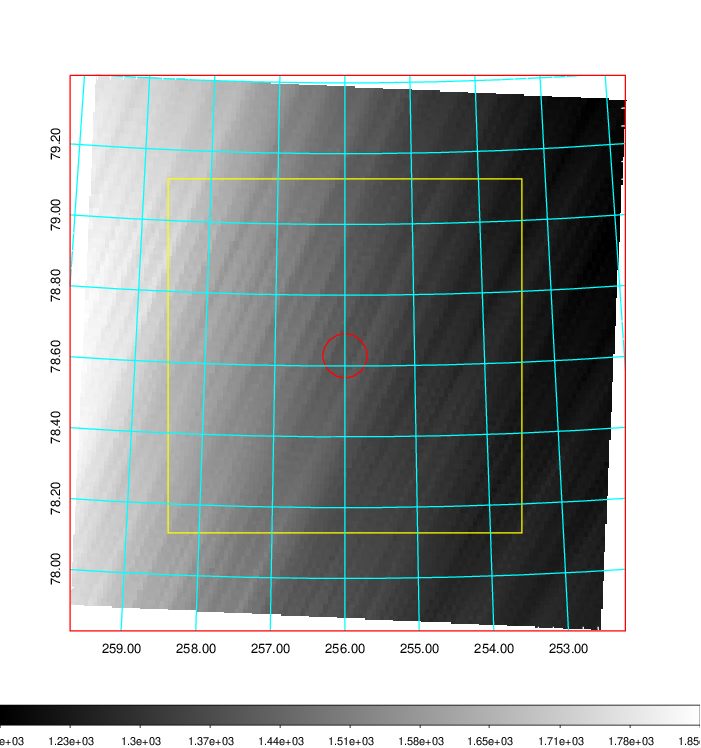   | 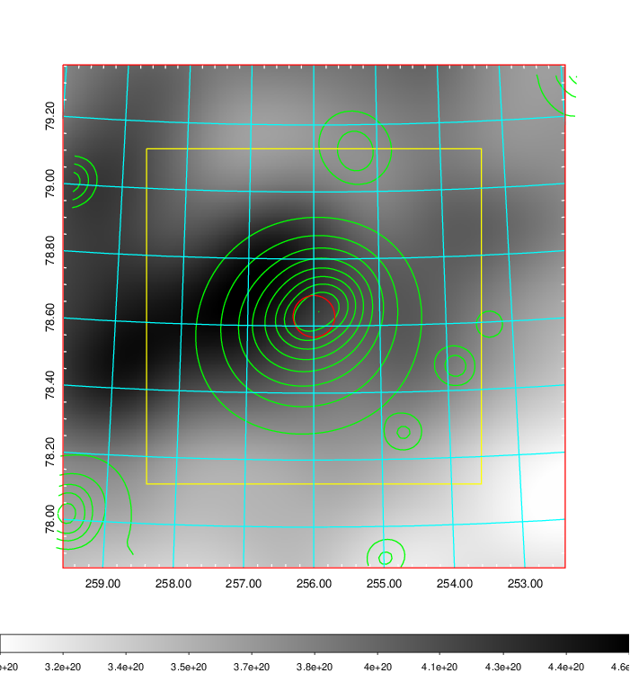    | 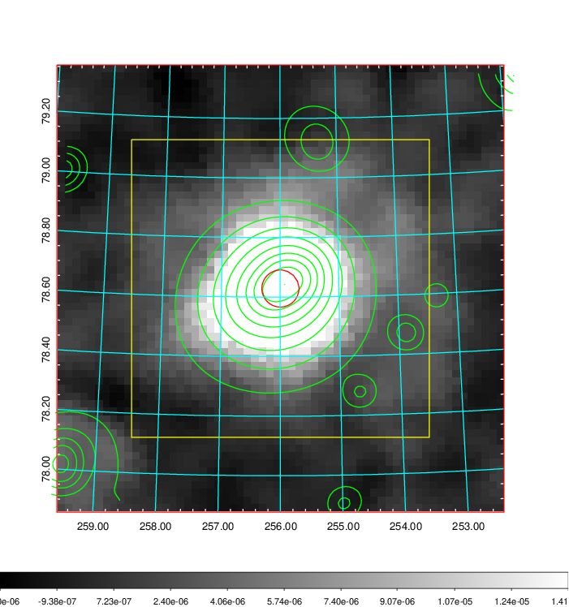 |

|[Redshift Histogram](../image/694/694_zg.pdf) | [DSS image(z1)](../image/694/694_dss_z1.pdf)      |  [DSS image(z2)](../image/694/694_dss_z2.pdf)    |
|-------------------|--------------------|-------------------|
|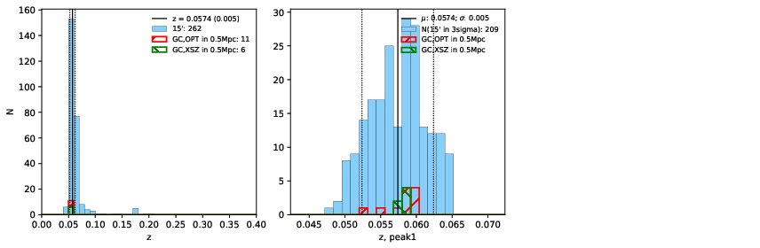 |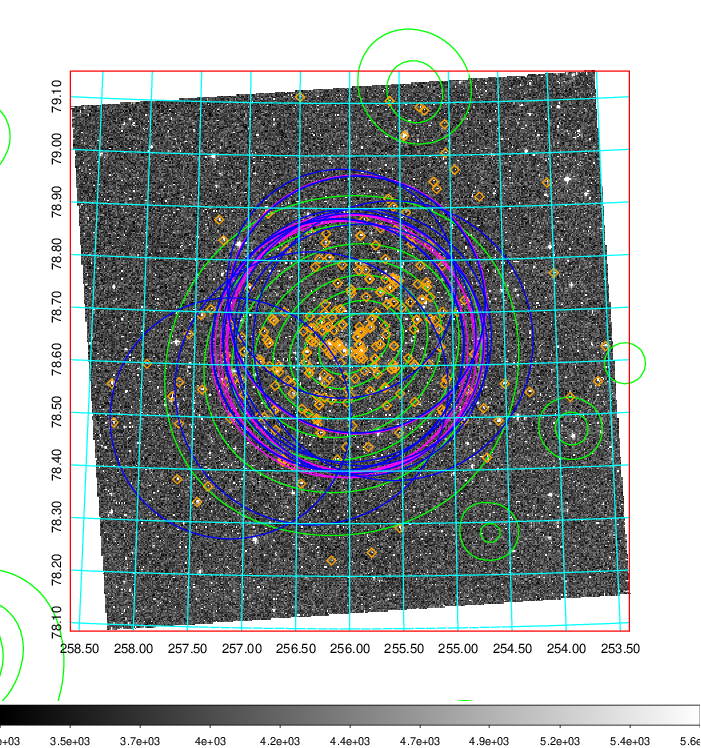  Blue circle for optical clusters;  Magenta circle for XSZ clusters;  all with r=1Mpc;  Only GC with Delta_z<0.01 are shown. | 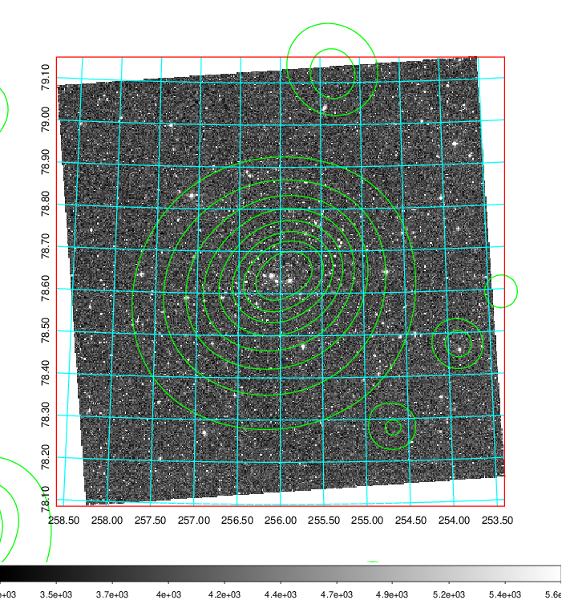 Blue circle for optical clusters;  Magenta circle for XSZ clusters;  all with r=1Mpc;  Only GC with Delta_z<0.01 are shown.  |

|[known Abell/XSZ clusters](../image/694/694_gc.pdf) | [2MASS image](../image/694/694_2mass.pdf)      |[SDSS image](../image/694/694_sdss.pdf)   |
|-------------------|-------------------|-------------------|
|  Magenta, blue and green circles  for optical, X-ray and SZ clusters  respectively, with redshift of clusters  labelled. The radius of circles  are 1Mpc.|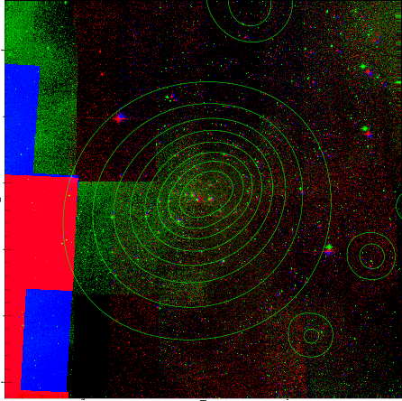  | 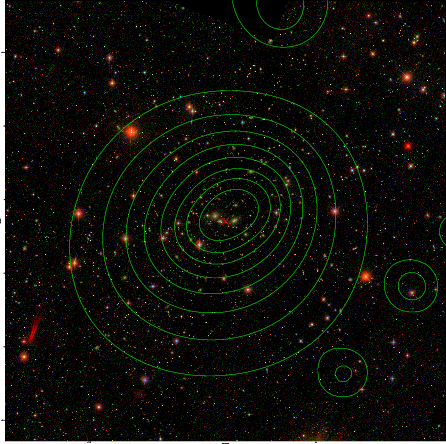  |

