

### 695

|Name|RAJ2000[deg]|DEJ2000[deg] |Ext[arcmin]| Ext,ml | z | z_src| C|GC(XSZ,Delta_z<0.01)| GC(OPT,Delta_z<0.01)|GC| R_sig[arcmin] | R500[arcmin] | R500[Mpc]| CRsig[c/s] | CR500[c/s] |L500[1E44 erg/s]|F500[1E-12 erg/s/cm^2]| M500[1E14 Msun]|Tx[keV]|Cnt_sig|Beta|Rc[arcmin]|Comment|Alias|
|---|---|---|---|---|---|------|---|--------|---------|----------|---|---|---|---|---|---|---|---|---|---|---|---|---|---|
|695| 256.054| 58.288| 5.47| 28.52| 0.0803(0.008)| z2,| G| -| -| C, N, W| 6.850| 6.164| 0.560| 0.033(0.018)| 0.033(0.018)| 0.089(0.038)| 0.557(0.237)| 0.54(0.12)| 1.50(0.21)| 57.9| 0.837(-0.161+0.114)| 4.280(-1.066+0.832)| -| t281|

|[RASS image](../image/695/695_img.pdf)|[filtered image](../image/695/695_fil.pdf)|[Segment image](../image/695/695_seg.pdf)|
|-------------------|--------------------|-------------------|
| 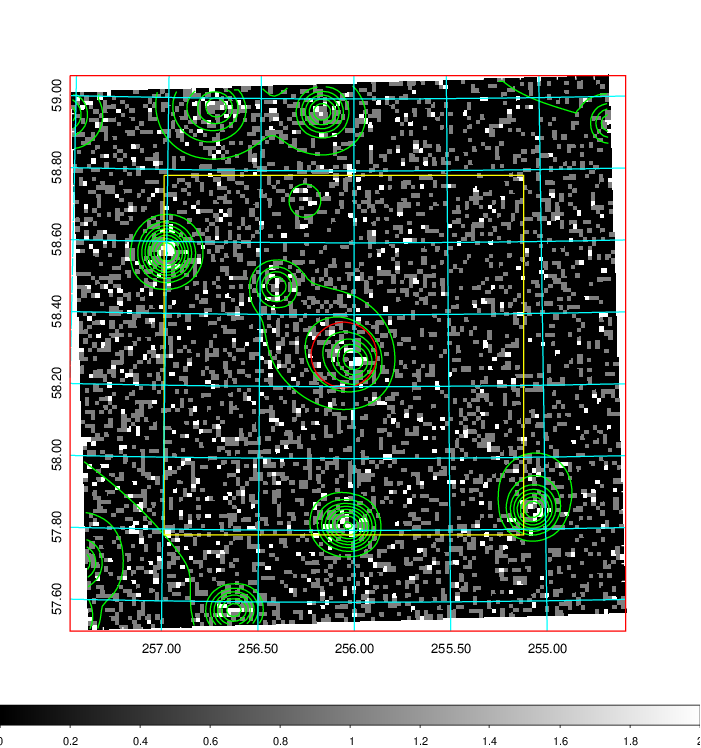  | 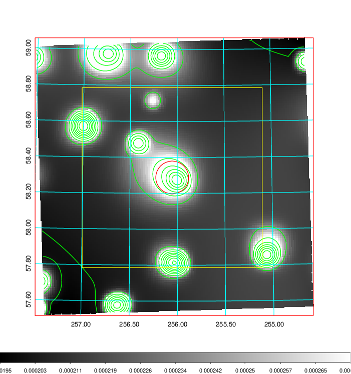   | 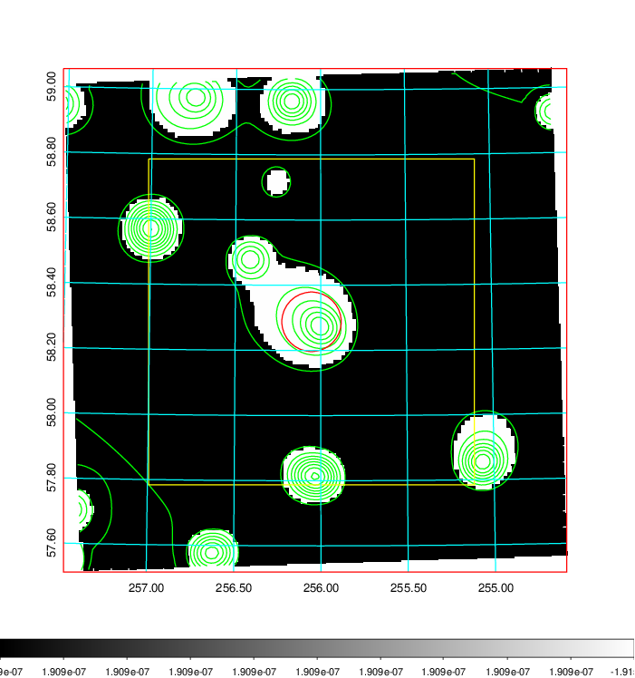  |

|[Exposure image](../image/695/695_mex.pdf)| [nH image](../image/695/695_nh.pdf)| [Planck image](../image/695/695_p.pdf)|
|-------------------|--------------------|-------------------|
|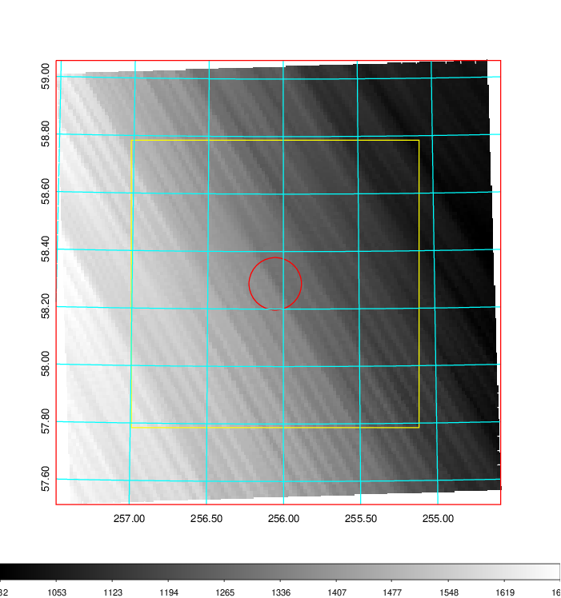   | 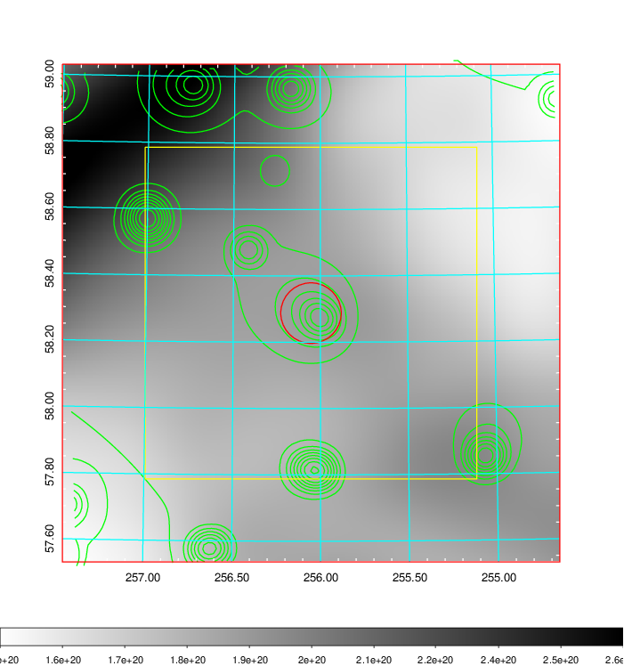    | 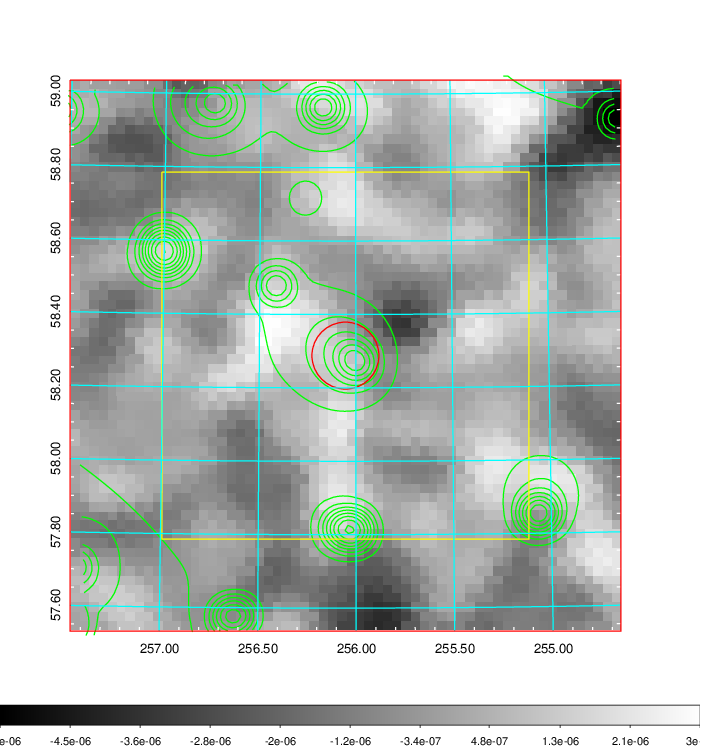 |

|[Redshift Histogram](../image/695/695_zg.pdf) | [DSS image(z1)](../image/695/695_dss_z1.pdf)      |  [DSS image(z2)](../image/695/695_dss_z2.pdf)    |
|-------------------|--------------------|-------------------|
|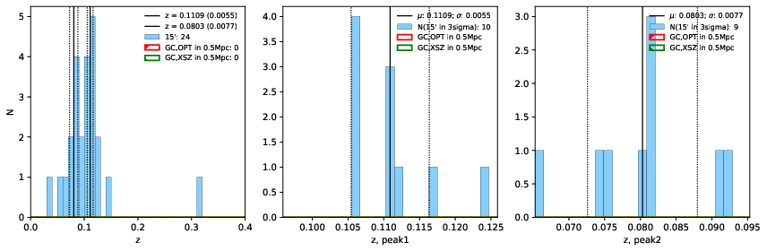 |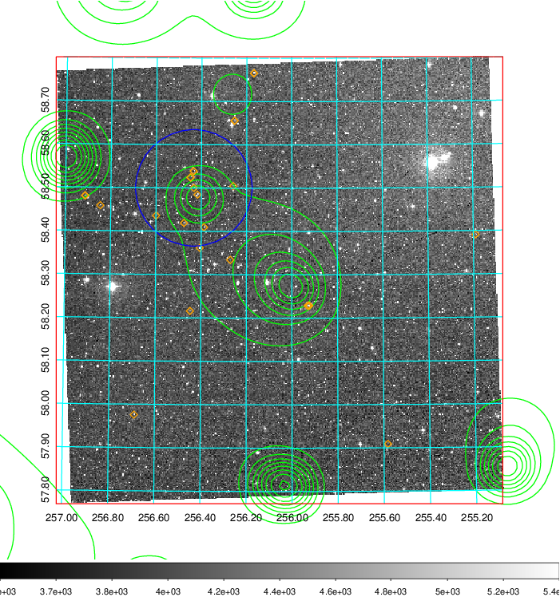  Blue circle for optical clusters;  Magenta circle for XSZ clusters;  all with r=1Mpc;  Only GC with Delta_z<0.01 are shown. | 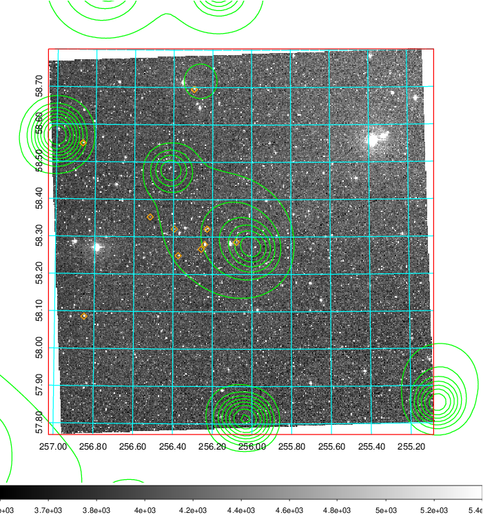 Blue circle for optical clusters;  Magenta circle for XSZ clusters;  all with r=1Mpc;  Only GC with Delta_z<0.01 are shown.  |

|[Previous-identified clusters](../image/695/695_gc.pdf) | [2MASS image](../image/695/695_2mass.pdf)      |[SDSS image](../image/695/695_sdss.pdf)   |
|-------------------|-------------------|-------------------|
|  Green, magenta, and blue circles  for optical, X-ray and SZ clusters  respectively, with redshift of clusters  labelled. The radius of circles  are 1Mpc.|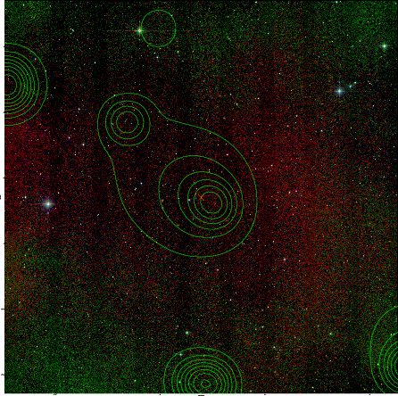  | 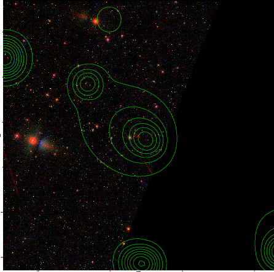  |

