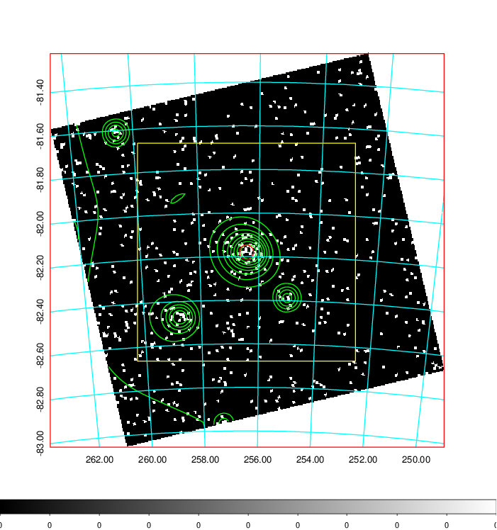
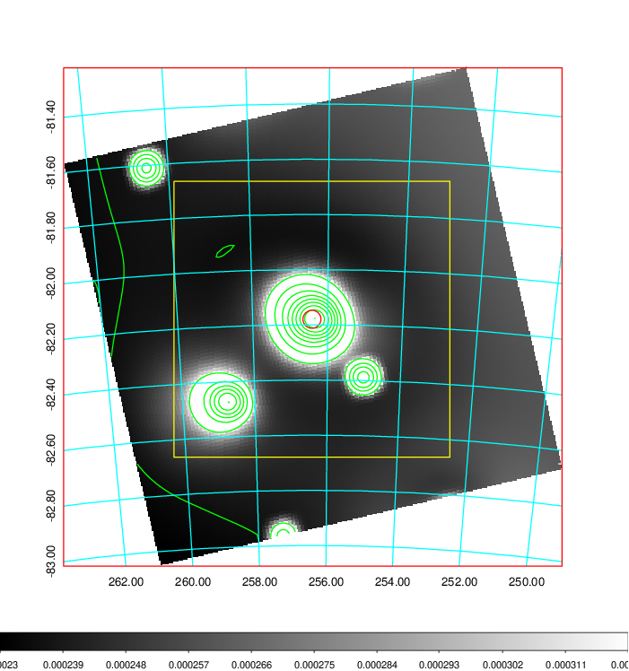
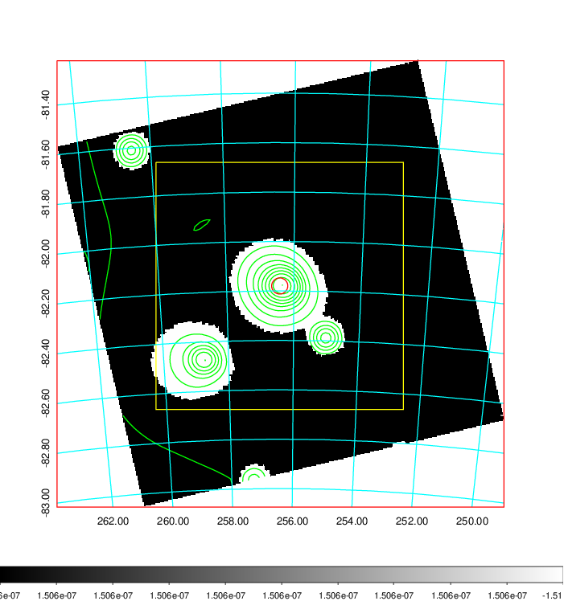
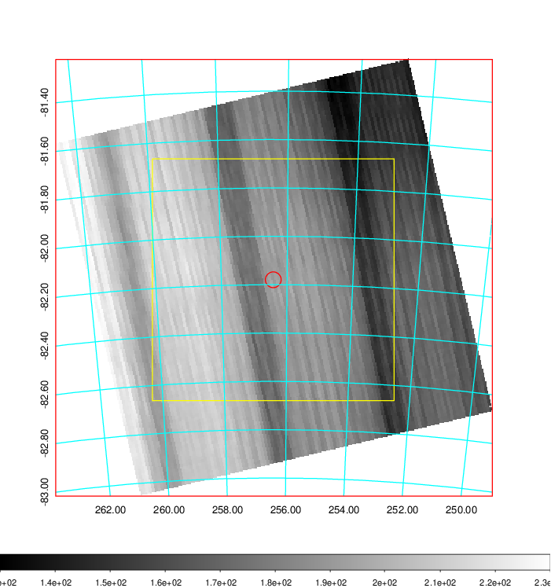
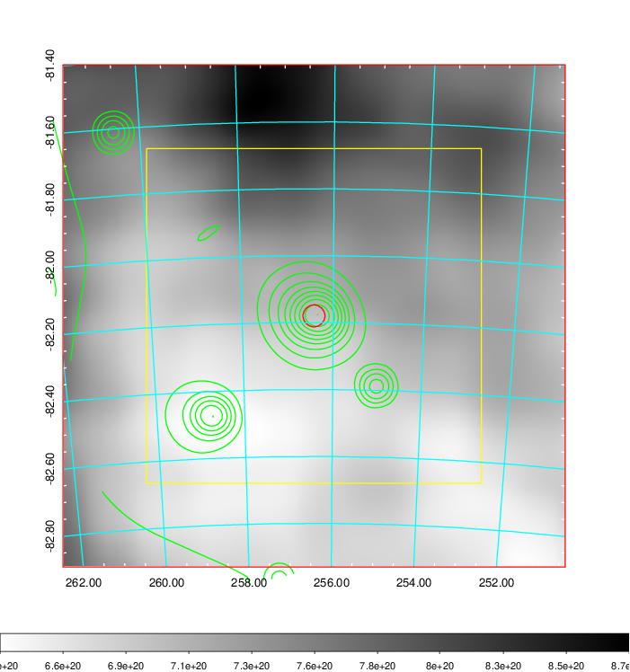
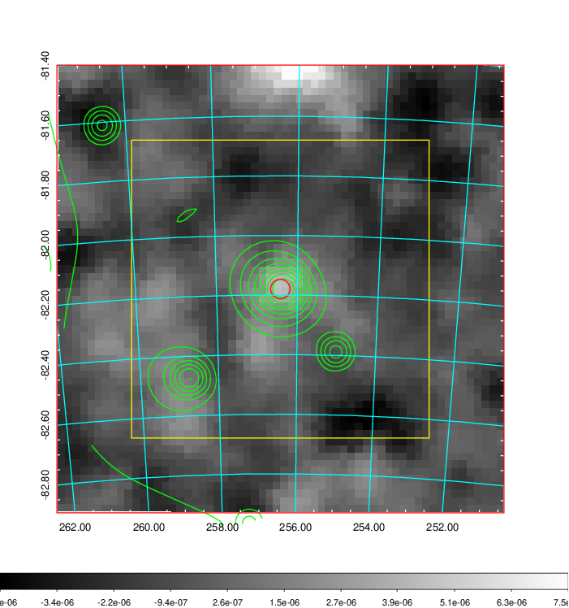
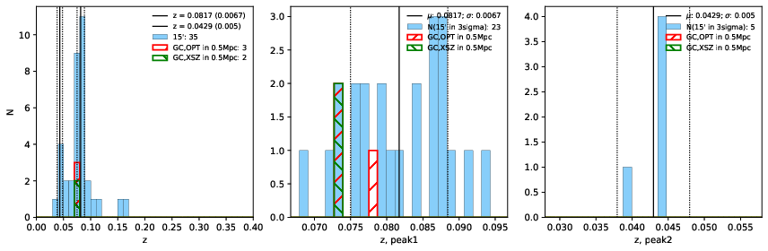
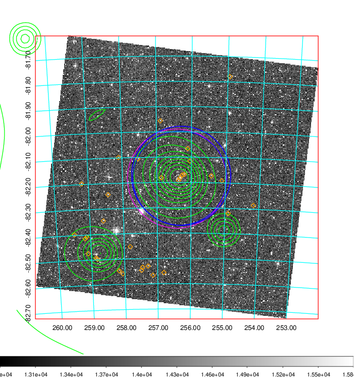
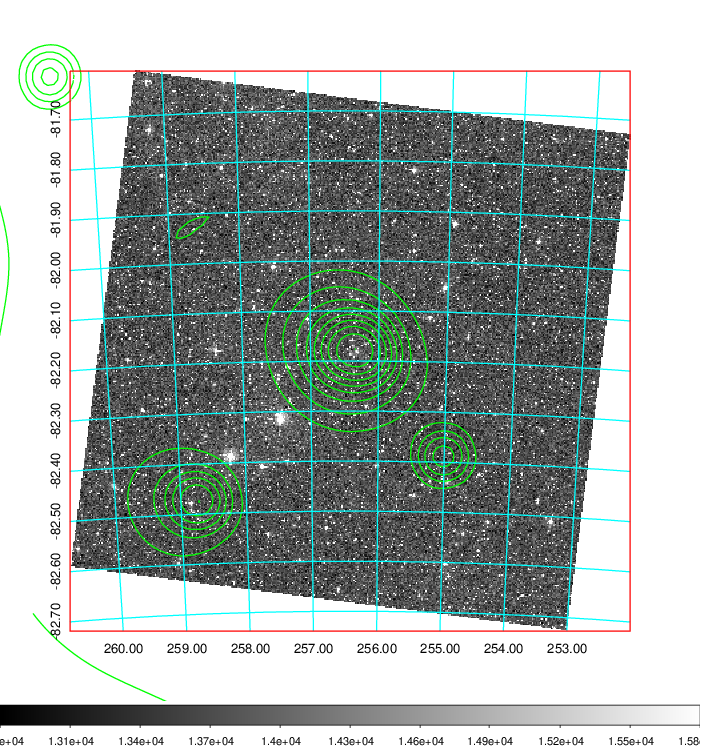
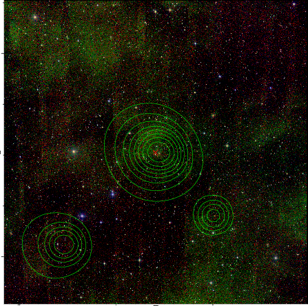

### 696

|Name|RAJ2000[deg]|DEJ2000[deg] |Ext[arcmin]| Ext,ml | z | z_src| C|GC(XSZ,Delta_z<0.01)| GC(OPT,Delta_z<0.01)|GC| R_sig[arcmin] | R500[arcmin] | R500[Mpc]| CRsig[c/s] | CR500[c/s] |L500[1E44 erg/s]|F500[1E-12 erg/s/cm^2]| M500[1E14 Msun]|Tx[keV]|Cnt_sig|Beta|Rc[arcmin]|Comment|Alias|
|---|---|---|---|---|---|------|---|--------|---------|----------|---|---|---|---|---|---|---|---|---|---|---|---|---|---|
|696| 256.421| -82.180| 1.97| 28.71| 0.0817(0.007)| z1, z_xsz| B| MCXC, Tar| A, W| A, MCXC, Tar, W| 7.338| 10.023| 0.926| 0.294(0.061)| 0.313(0.065)| 0.911(0.089)| 5.518(0.539)| 2.44(0.12)| 3.81(0.12)| 48.6| 0.877(-0.126+0.087)| 4.007(-0.777+0.606)| -| k211|

|[RASS image](../image/696/696_img.pdf)|[filtered image](../image/696/696_fil.pdf)|[Segment image](../image/696/696_seg.pdf)|
|-------------------|--------------------|-------------------|
|   |    |   |

|[Exposure image](../image/696/696_mex.pdf)| [nH image](../image/696/696_nh.pdf)| [Planck image](../image/696/696_p.pdf)|
|-------------------|--------------------|-------------------|
|   |     |  |

|[Redshift Histogram](../image/696/696_zg.pdf) | [DSS image(z1)](../image/696/696_dss_z1.pdf)      |  [DSS image(z2)](../image/696/696_dss_z2.pdf)    |
|-------------------|--------------------|-------------------|
| |  Blue circle for optical clusters;  Magenta circle for XSZ clusters;  all with r=1Mpc;  Only GC with Delta_z<0.01 are shown. |  Blue circle for optical clusters;  Magenta circle for XSZ clusters;  all with r=1Mpc;  Only GC with Delta_z<0.01 are shown.  |

|[Previous-identified clusters](../image/696/696_gc.pdf) | [2MASS image](../image/696/696_2mass.pdf)      |
|-------------------|-------------------|
|  Green, magenta, and blue circles  for optical, X-ray and SZ clusters  respectively, with redshift of clusters  labelled. The radius of circles  are 1Mpc.|  |

