

### 698

|Name|RAJ2000[deg]|DEJ2000[deg] |Ext[arcmin]| Ext,ml | z | z_src| C|GC(XSZ,Delta_z<0.01)| GC(OPT,Delta_z<0.01)|GC| R_sig[arcmin] | R500[arcmin] | R500[Mpc]| CRsig[c/s] | CR500[c/s] |L500[1E44 erg/s]|F500[1E-12 erg/s/cm^2]| M500[1E14 Msun]|Tx[keV]|Cnt_sig|Beta|Rc[arcmin]|Comment|Alias|
|---|---|---|---|---|---|------|---|--------|---------|----------|---|---|---|---|---|---|---|---|---|---|---|---|---|---|
|698| 257.455| 34.470| 3.53| 531.28| 0.0843(0.005)| z1, z_xsz| B| F20, L03, MCXC, PSZ2, SPI, Tar, XB| A, N, RM, W| A, F20, L03, MCXC, N, PSZ2, SPI, Tar, W, XB| 13.675| 11.073| 1.052| 0.621(0.037)| 0.602(0.036)| 2.063(0.058)| 11.698(0.330)| 3.59(0.05)| 4.83(0.04)| 465.8| 0.969(-0.044+0.023)| 7.103(-0.345+0.250)| -| k435|

|[RASS image](../image/698/698_img.pdf)|[filtered image](../image/698/698_fil.pdf)|[Segment image](../image/698/698_seg.pdf)|
|-------------------|--------------------|-------------------|
| 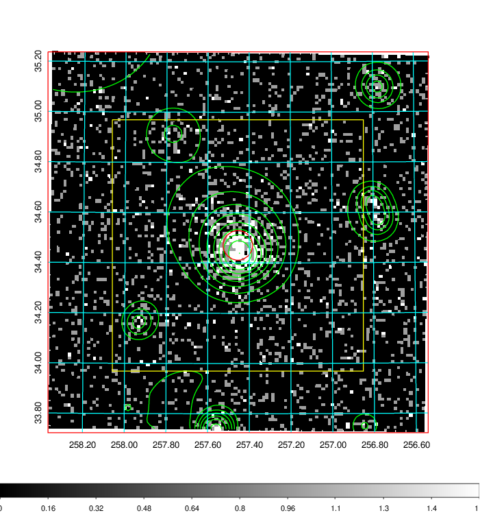  | 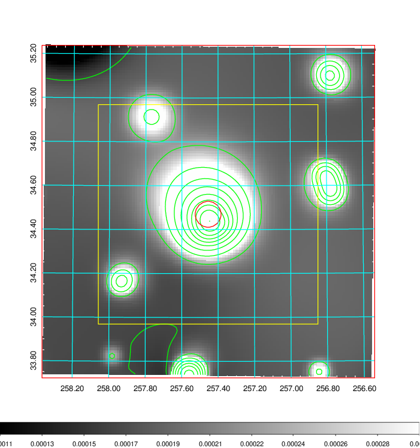   | 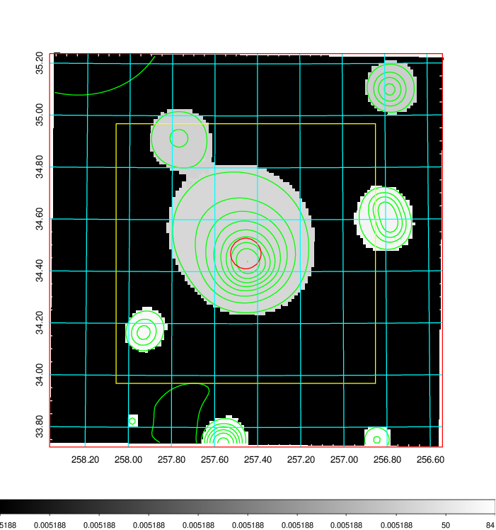  |

|[Exposure image](../image/698/698_mex.pdf)| [nH image](../image/698/698_nh.pdf)| [Planck image](../image/698/698_p.pdf)|
|-------------------|--------------------|-------------------|
|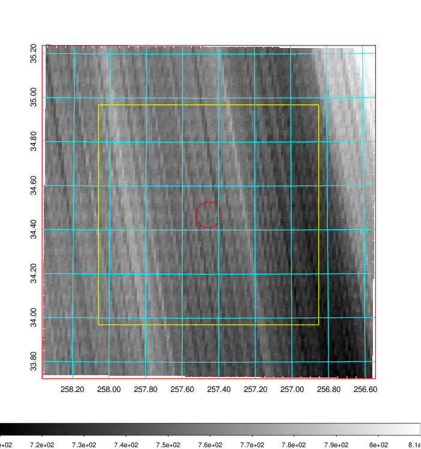   | 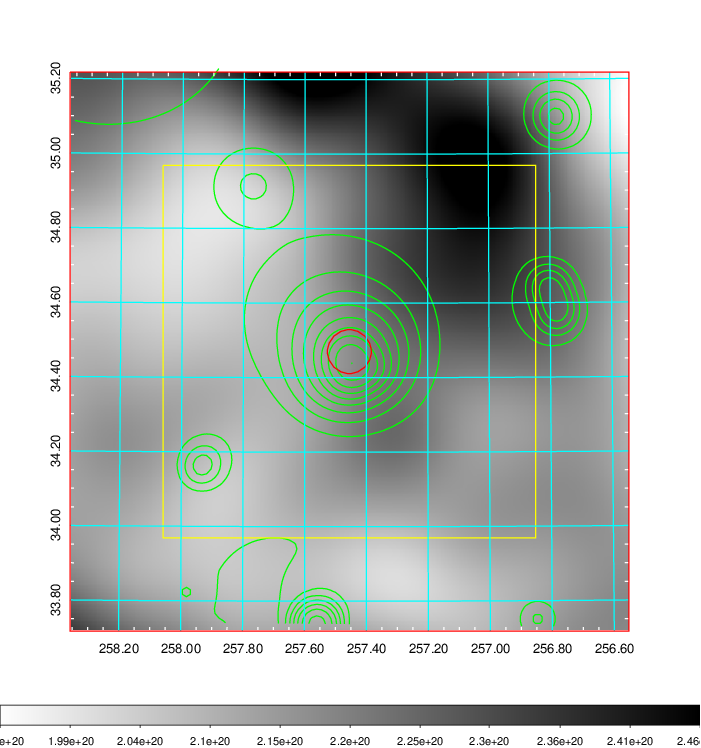    | 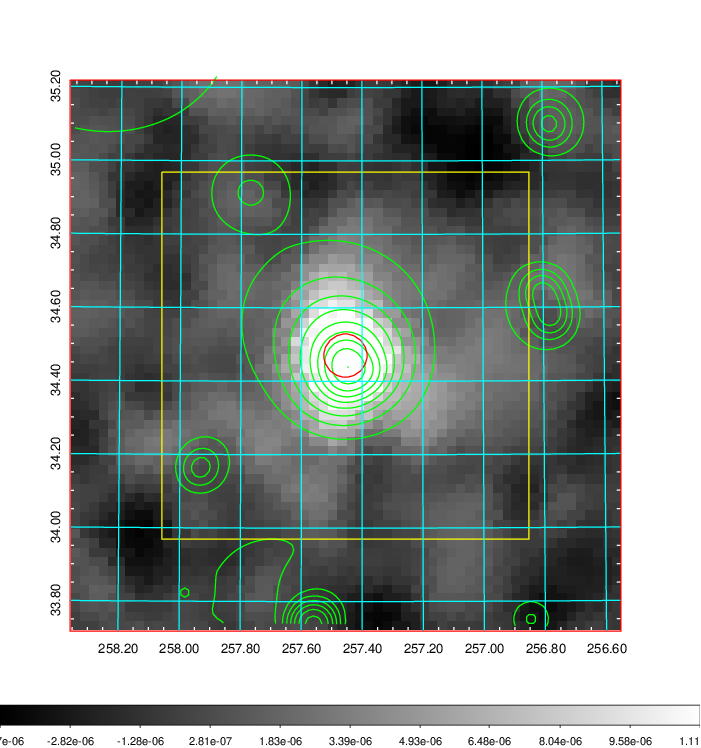 |

|[Redshift Histogram](../image/698/698_zg.pdf) | [DSS image(z1)](../image/698/698_dss_z1.pdf)      |  [DSS image(z2)](../image/698/698_dss_z2.pdf)    |
|-------------------|--------------------|-------------------|
|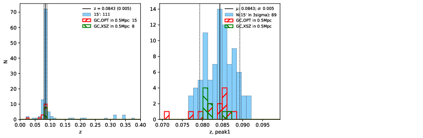 |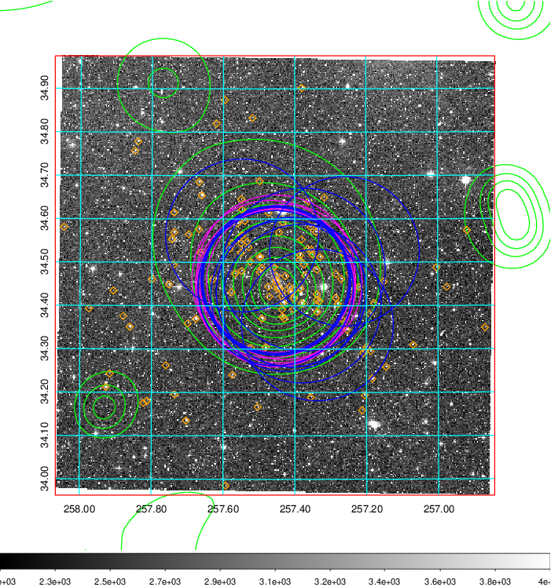  Blue circle for optical clusters;  Magenta circle for XSZ clusters;  all with r=1Mpc;  Only GC with Delta_z<0.01 are shown. | 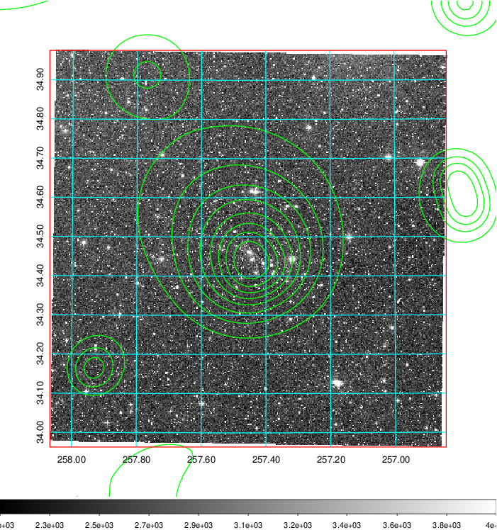 Blue circle for optical clusters;  Magenta circle for XSZ clusters;  all with r=1Mpc;  Only GC with Delta_z<0.01 are shown.  |

|[known Abell/XSZ clusters](../image/698/698_gc.pdf) | [2MASS image](../image/698/698_2mass.pdf)      |[SDSS image](../image/698/698_sdss.pdf)   |
|-------------------|-------------------|-------------------|
|  Magenta, blue and green circles  for optical, X-ray and SZ clusters  respectively, with redshift of clusters  labelled. The radius of circles  are 1Mpc.|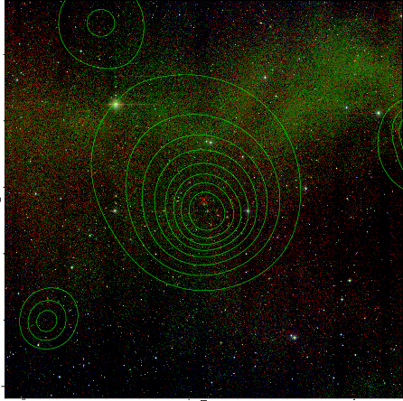  | 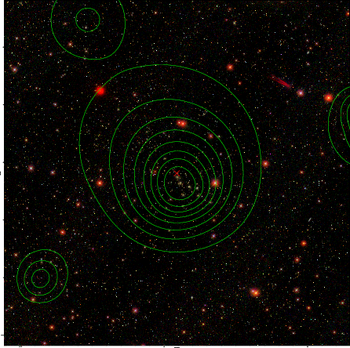  |

