

### 699

|Name|RAJ2000[deg]|DEJ2000[deg] |Ext[arcmin]| Ext,ml | z | z_src| C|GC(XSZ,Delta_z<0.01)| GC(OPT,Delta_z<0.01)|GC| R_sig[arcmin] | R500[arcmin] | R500[Mpc]| CRsig[c/s] | CR500[c/s] |L500[1E44 erg/s]|F500[1E-12 erg/s/cm^2]| M500[1E14 Msun]|Tx[keV]|Cnt_sig|Beta|Rc[arcmin]|Comment|Alias|
|---|---|---|---|---|---|------|---|--------|---------|----------|---|---|---|---|---|---|---|---|---|---|---|---|---|---|
|699| 257.569| 64.192| 4.82| 44.04| 0.0778(0.005)| z1,| G| -| -| C, N, W| 38.125| 11.302| 0.998| 0.610(0.031)| 0.547(0.028)| 1.565(0.161)| 10.512(1.079)| 3.05(0.16)| 4.36(0.14)| 3663.3| 0.995(-0.009+0.004)| 26.756(-0.232+0.135)| -| t253|

|[RASS image](../image/699/699_img.pdf)|[filtered image](../image/699/699_fil.pdf)|[Segment image](../image/699/699_seg.pdf)|
|-------------------|--------------------|-------------------|
| 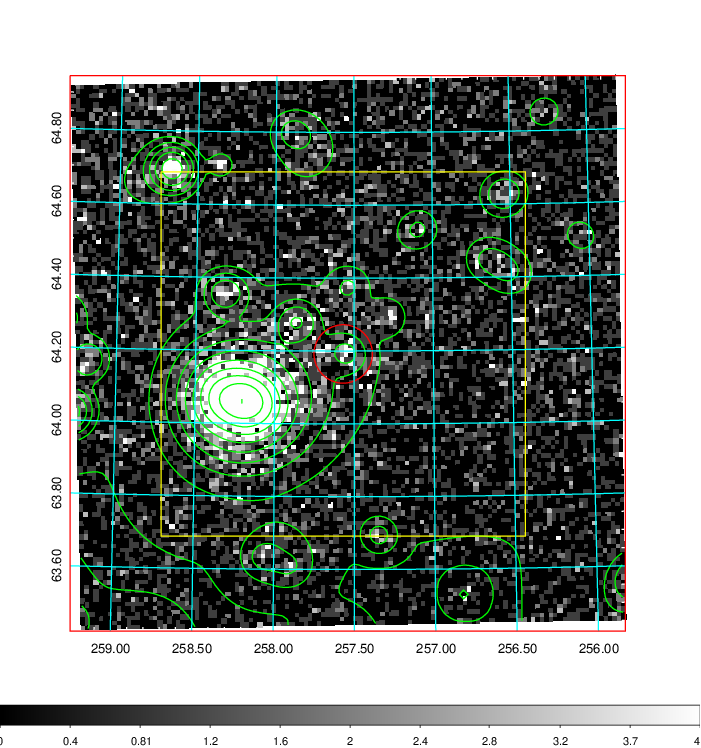  | 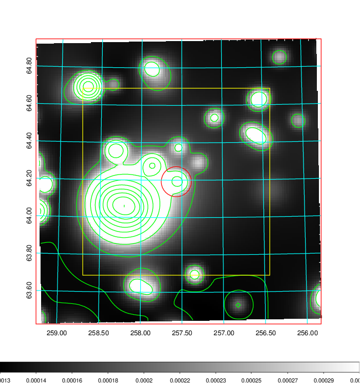   | 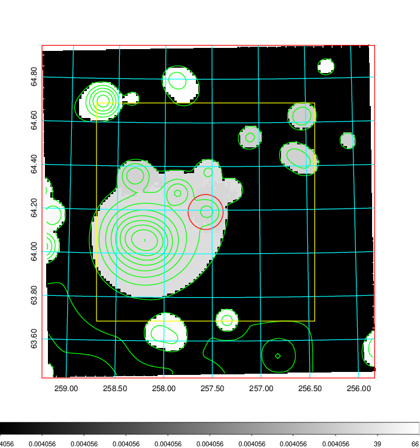  |

|[Exposure image](../image/699/699_mex.pdf)| [nH image](../image/699/699_nh.pdf)| [Planck image](../image/699/699_p.pdf)|
|-------------------|--------------------|-------------------|
|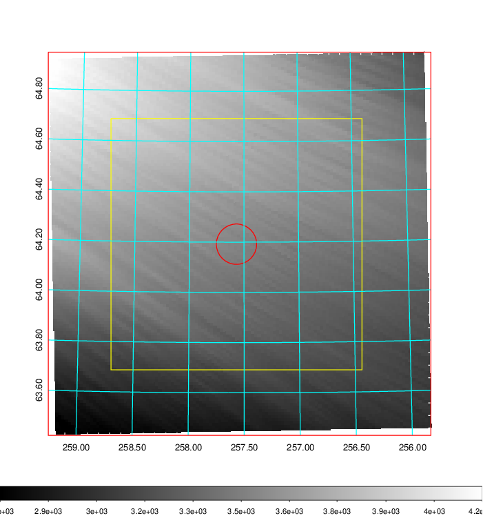   | 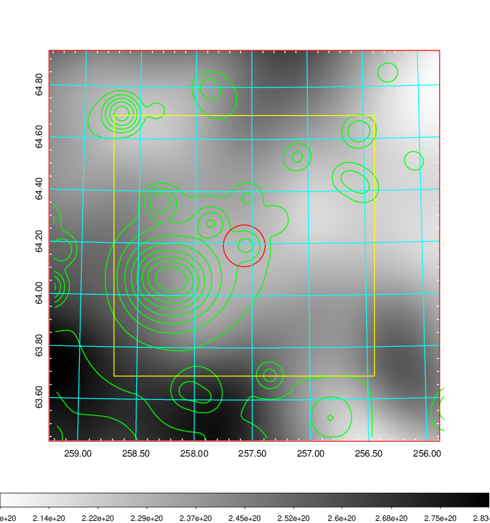    | 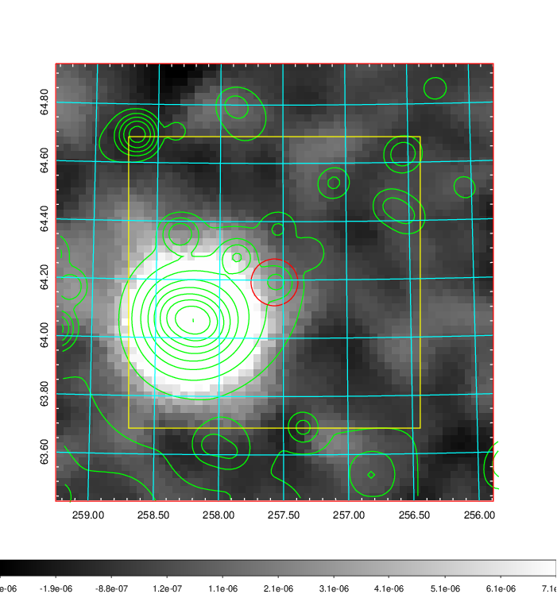 |

|[Redshift Histogram](../image/699/699_zg.pdf) | [DSS image(z1)](../image/699/699_dss_z1.pdf)      |  [DSS image(z2)](../image/699/699_dss_z2.pdf)    |
|-------------------|--------------------|-------------------|
|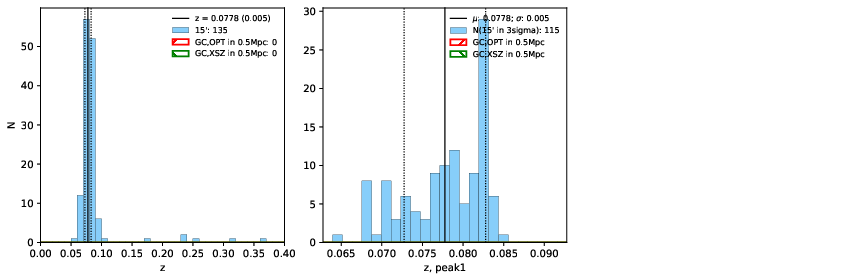 |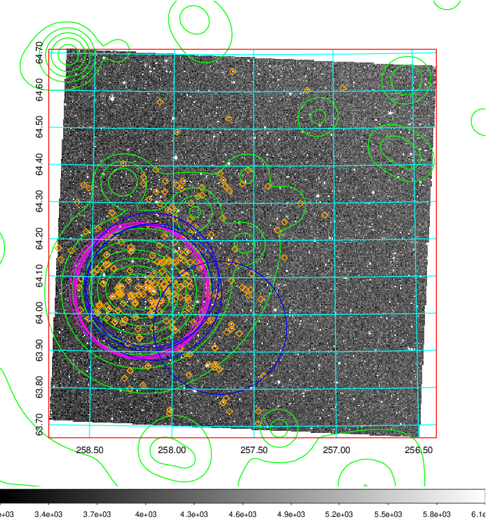  Blue circle for optical clusters;  Magenta circle for XSZ clusters;  all with r=1Mpc;  Only GC with Delta_z<0.01 are shown. | 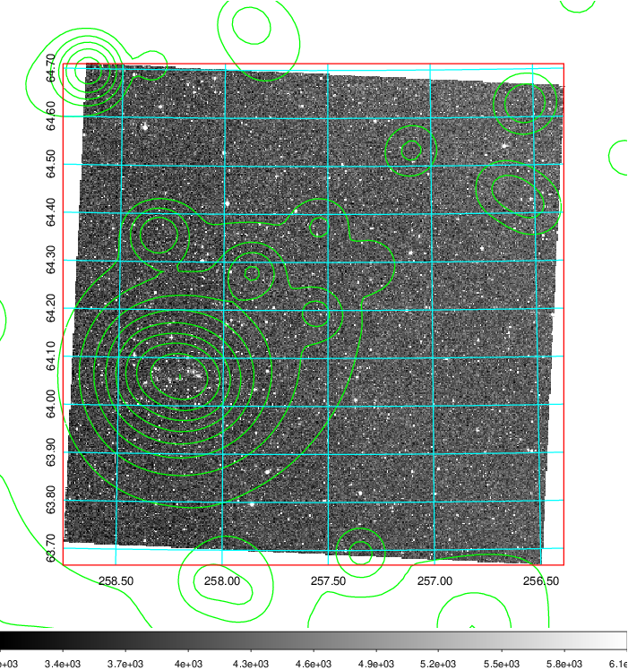 Blue circle for optical clusters;  Magenta circle for XSZ clusters;  all with r=1Mpc;  Only GC with Delta_z<0.01 are shown.  |

|[Previous-identified clusters](../image/699/699_gc.pdf) | [2MASS image](../image/699/699_2mass.pdf)      |[SDSS image](../image/699/699_sdss.pdf)   |
|-------------------|-------------------|-------------------|
|  Green, magenta, and blue circles  for optical, X-ray and SZ clusters  respectively, with redshift of clusters  labelled. The radius of circles  are 1Mpc.|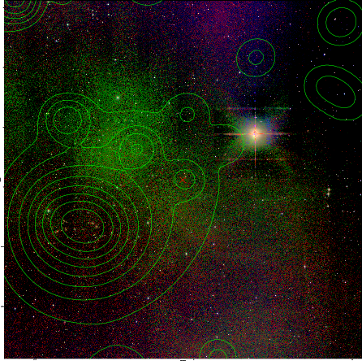  | 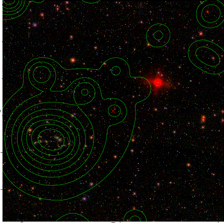  |

