

### 7

|Name|RAJ2000[deg]|DEJ2000[deg] |Ext[arcmin]| Ext,ml | z | z_src| C|GC(XSZ,Delta_z<0.01)| GC(OPT,Delta_z<0.01)|GC| R_sig[arcmin] | R500[arcmin] | R500[Mpc]| CRsig[c/s] | CR500[c/s] |L500[1E44 erg/s]|F500[1E-12 erg/s/cm^2]| M500[1E14 Msun]|Tx[keV]|Cnt_sig|Beta|Rc[arcmin]|Comment|Alias|
|---|---|---|---|---|---|------|---|--------|---------|----------|---|---|---|---|---|---|---|---|---|---|---|---|---|---|
|7| 2.556| 2.093| 8.87| 25.46| 0.1577(0.005)| z1,| G| -| -| C, N, W| 21.244| 5.677| 0.928| 0.116(0.060)| 0.103(0.053)| 1.353(1.026)| 1.993(1.511)| 2.65(0.99)| 4.11(0.97)| 67.3| 0.890(-0.120+0.078)| 10.940(-1.789+1.515)| -| t412|

|[RASS image](../image/7/7_img.pdf)|[filtered image](../image/7/7_fil.pdf)|[Segment image](../image/7/7_seg.pdf)|
|-------------------|--------------------|-------------------|
| 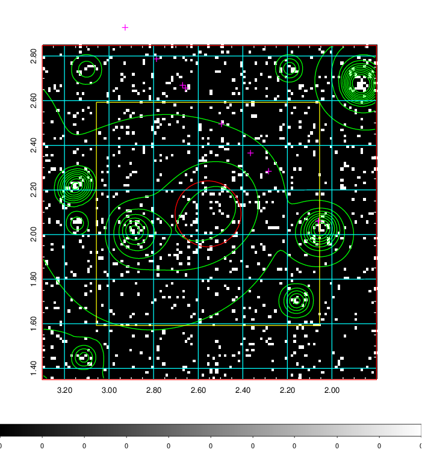  | 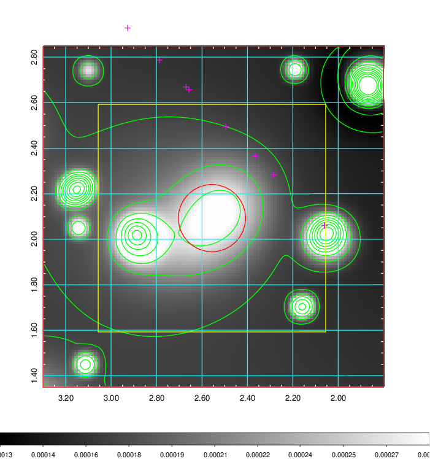   | 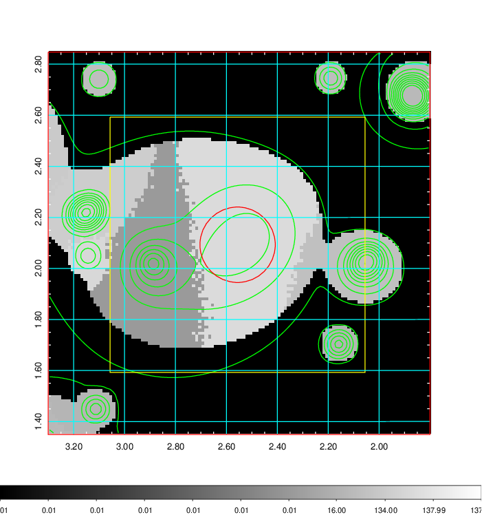  |

|[Exposure image](../image/7/7_mex.pdf)| [nH image](../image/7/7_nh.pdf)| [Planck image](../image/7/7_p.pdf)|
|-------------------|--------------------|-------------------|
|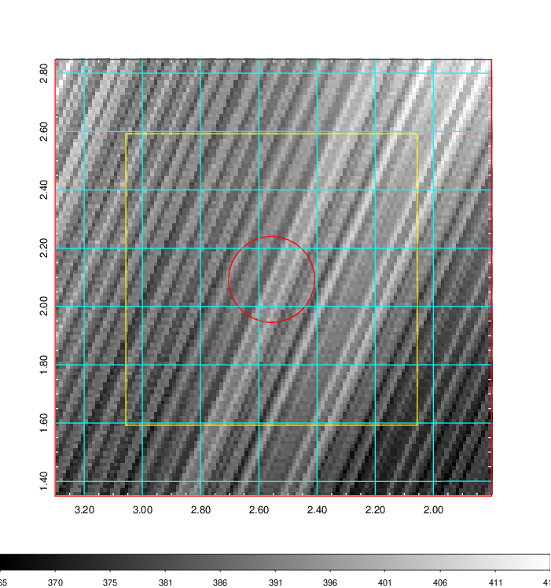   | 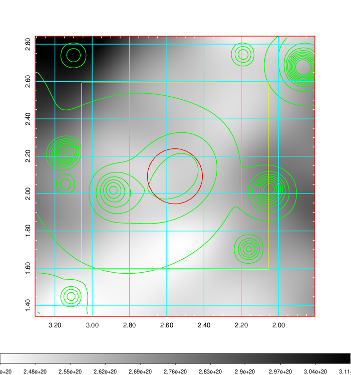    | 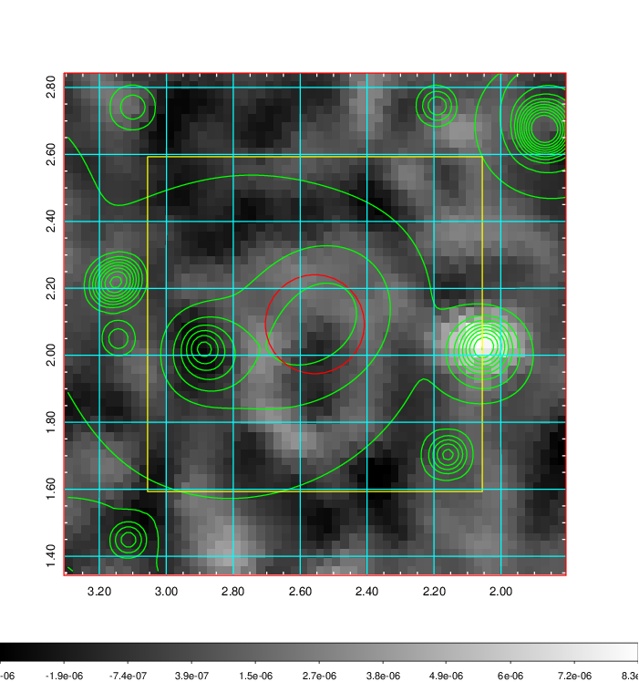 |

|[Redshift Histogram](../image/7/7_zg.pdf) | [DSS image(z1)](../image/7/7_dss_z1.pdf)      |  [DSS image(z2)](../image/7/7_dss_z2.pdf)    |
|-------------------|--------------------|-------------------|
|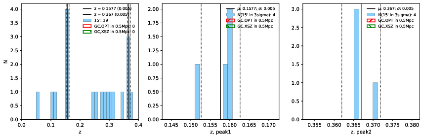 |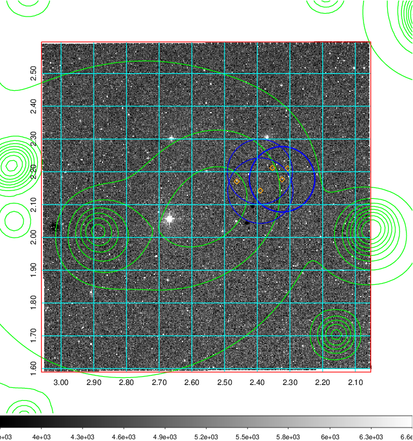  Blue circle for optical clusters;  Magenta circle for XSZ clusters;  all with r=1Mpc;  Only GC with Delta_z<0.01 are shown. | 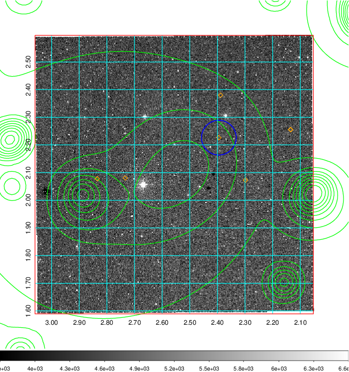 Blue circle for optical clusters;  Magenta circle for XSZ clusters;  all with r=1Mpc;  Only GC with Delta_z<0.01 are shown.  |

|[Previous-identified clusters](../image/7/7_gc.pdf) | [2MASS image](../image/7/7_2mass.pdf)      |[SDSS image](../image/7/7_sdss.pdf)   |
|-------------------|-------------------|-------------------|
|  Green, magenta, and blue circles  for optical, X-ray and SZ clusters  respectively, with redshift of clusters  labelled. The radius of circles  are 1Mpc.|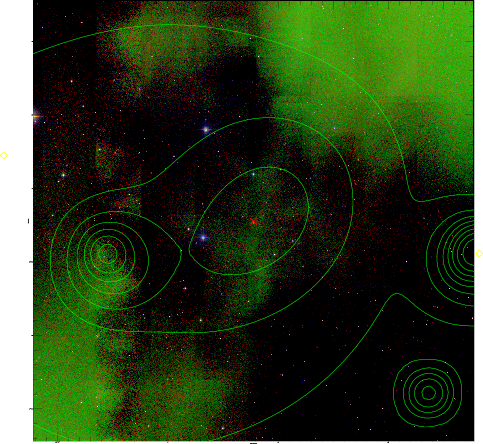  | 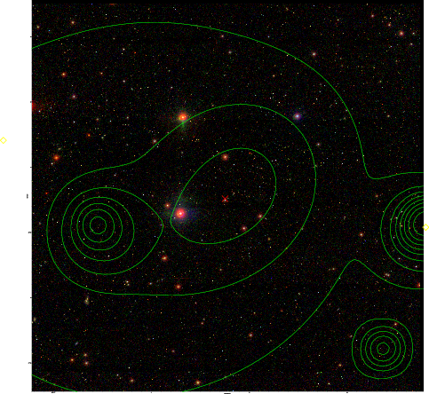  |

|[DES image](../image/7/7_des.pdf)   |
|-------------------|
| 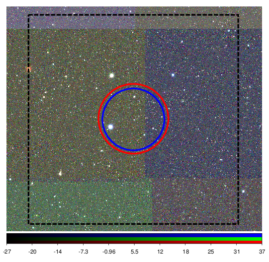  |
