

### 70

|Name|RAJ2000[deg]|DEJ2000[deg] |Ext[arcmin]| Ext,ml | z | z_src| C|GC(XSZ,Delta_z<0.01)| GC(OPT,Delta_z<0.01)|GC| R_sig[arcmin] | R500[arcmin] | R500[Mpc]| CRsig[c/s] | CR500[c/s] |L500[1E44 erg/s]|F500[1E-12 erg/s/cm^2]| M500[1E14 Msun]|Tx[keV]|Cnt_sig|Beta|Rc[arcmin]|Comment|Alias|
|---|---|---|---|---|---|------|---|--------|---------|----------|---|---|---|---|---|---|---|---|---|---|---|---|---|---|
|70| 21.056| 4.473| 1.90| 45.02| 0.1218(0.005)| z1, z_xsz| B| F20, SPI, Tar| A, N, RM, W| A, C, F20, N, SPI, Tar, W| 11.238| 6.641| 0.873| 0.130(0.029)| 0.121(0.027)| 0.879(0.125)| 2.270(0.322)| 2.13(0.15)| 3.55(0.16)| 47.8| 0.867(-0.136+0.094)| 5.300(-1.030+0.774)| -| t056|

|[RASS image](../image/70/70_img.pdf)|[filtered image](../image/70/70_fil.pdf)|[Segment image](../image/70/70_seg.pdf)|
|-------------------|--------------------|-------------------|
| 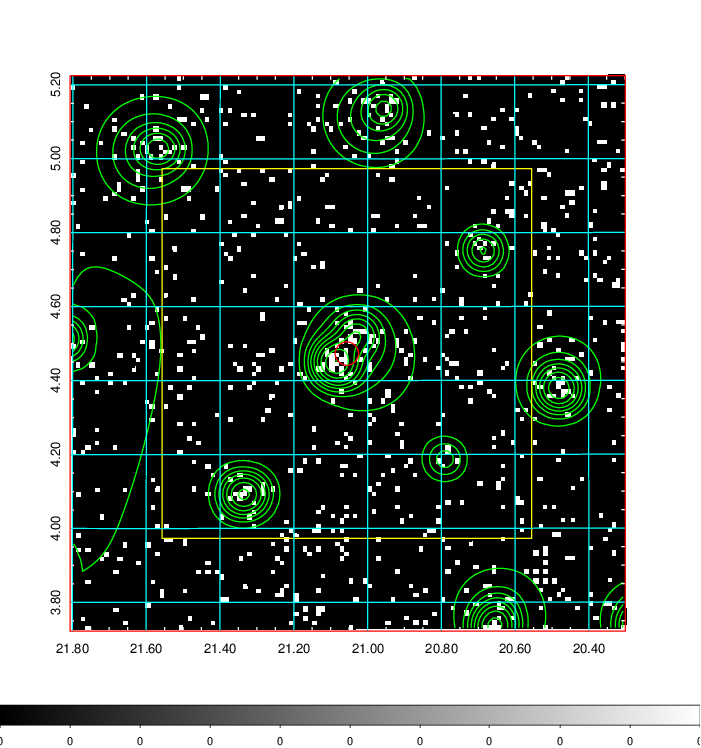  | 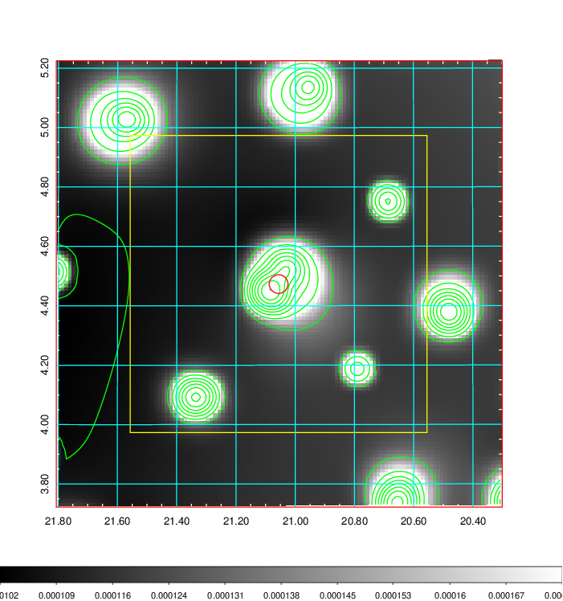   | 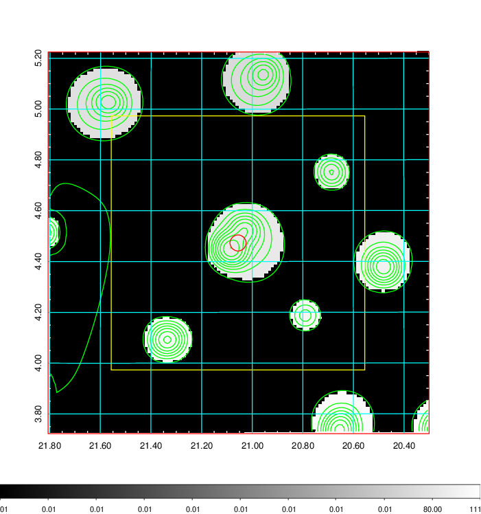  |

|[Exposure image](../image/70/70_mex.pdf)| [nH image](../image/70/70_nh.pdf)| [Planck image](../image/70/70_p.pdf)|
|-------------------|--------------------|-------------------|
|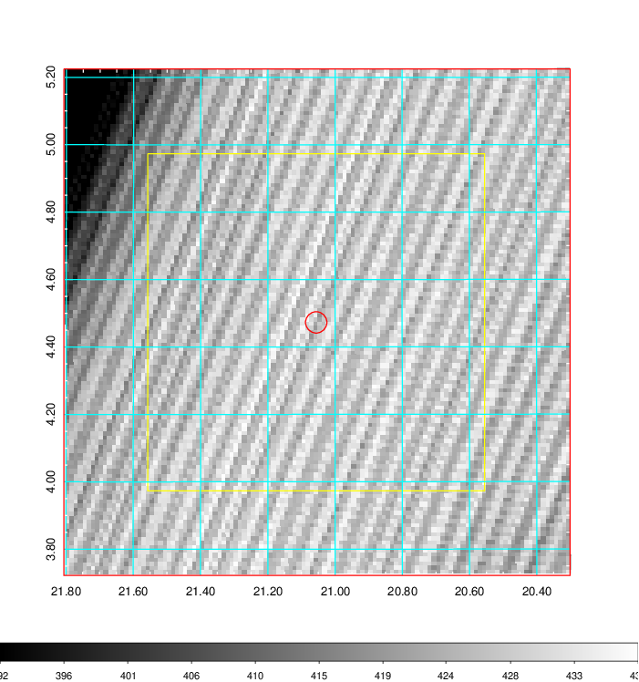   | 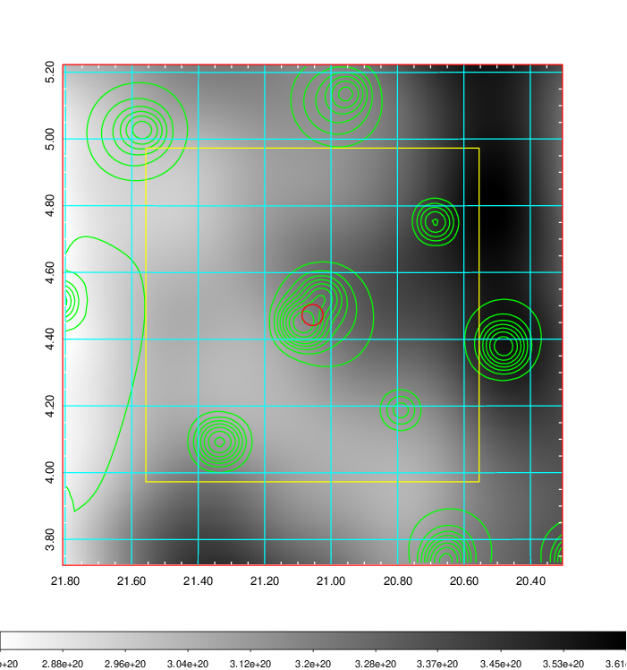    | 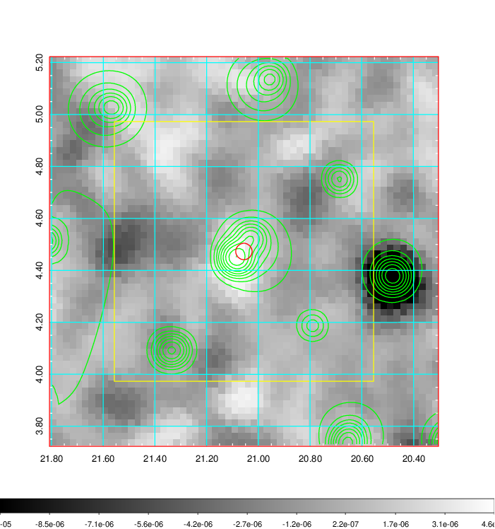 |

|[Redshift Histogram](../image/70/70_zg.pdf) | [DSS image(z1)](../image/70/70_dss_z1.pdf)      |  [DSS image(z2)](../image/70/70_dss_z2.pdf)    |
|-------------------|--------------------|-------------------|
|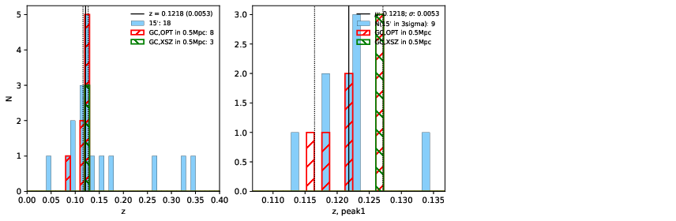 |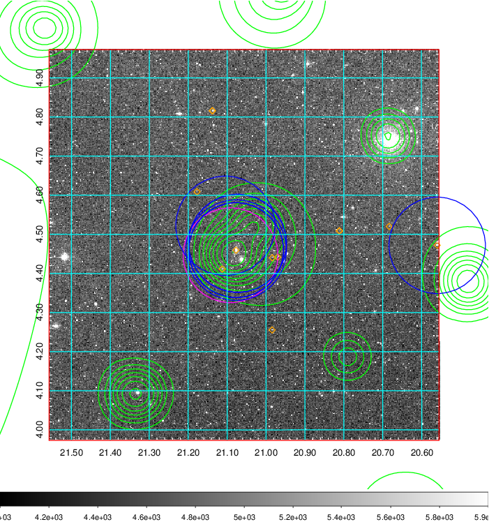  Blue circle for optical clusters;  Magenta circle for XSZ clusters;  all with r=1Mpc;  Only GC with Delta_z<0.01 are shown. | 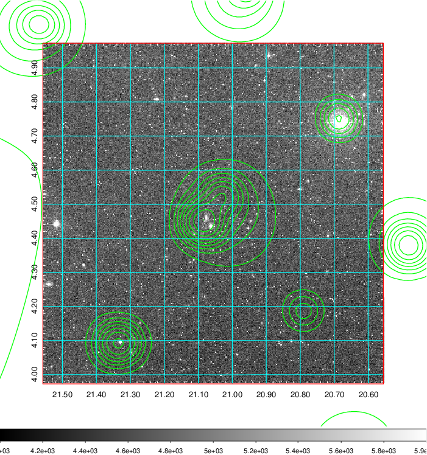 Blue circle for optical clusters;  Magenta circle for XSZ clusters;  all with r=1Mpc;  Only GC with Delta_z<0.01 are shown.  |

|[Previous-identified clusters](../image/70/70_gc.pdf) | [2MASS image](../image/70/70_2mass.pdf)      |[SDSS image](../image/70/70_sdss.pdf)   |
|-------------------|-------------------|-------------------|
|  Green, magenta, and blue circles  for optical, X-ray and SZ clusters  respectively, with redshift of clusters  labelled. The radius of circles  are 1Mpc.|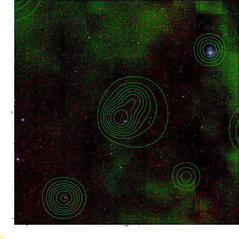  | 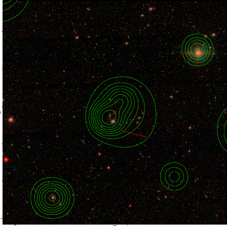  |

|[DES image](../image/70/70_des.pdf)   |
|-------------------|
| 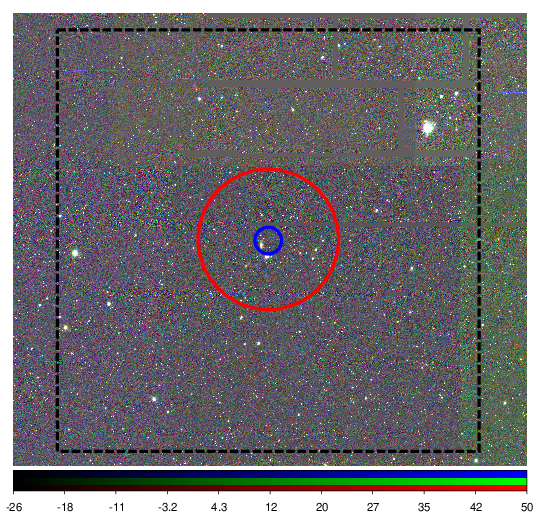  |
